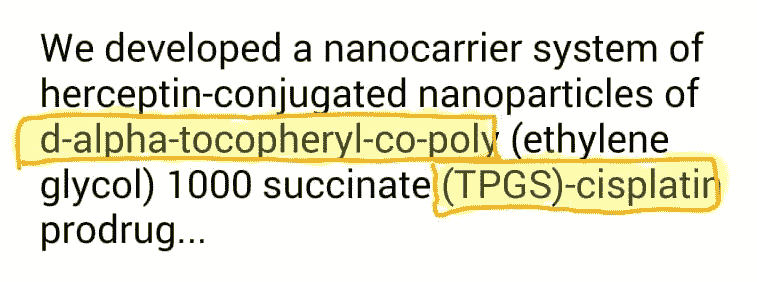
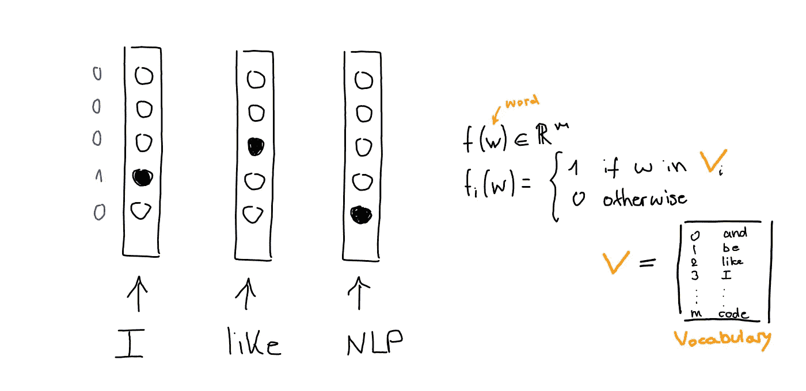
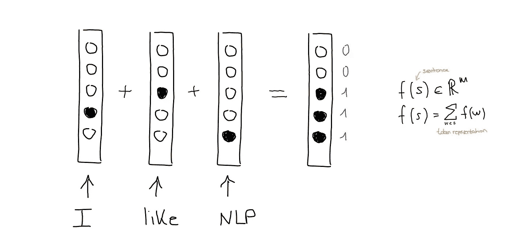
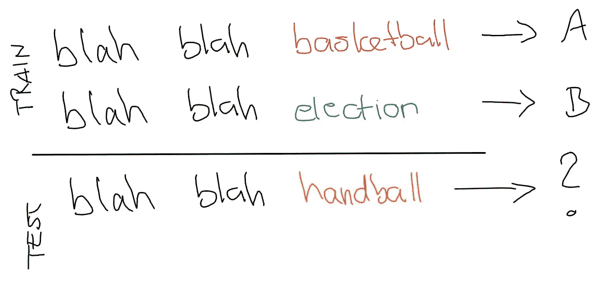
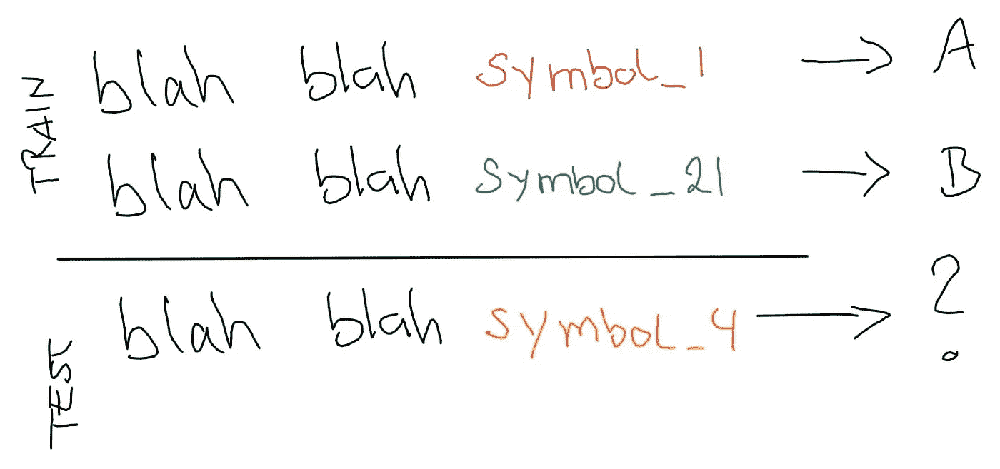
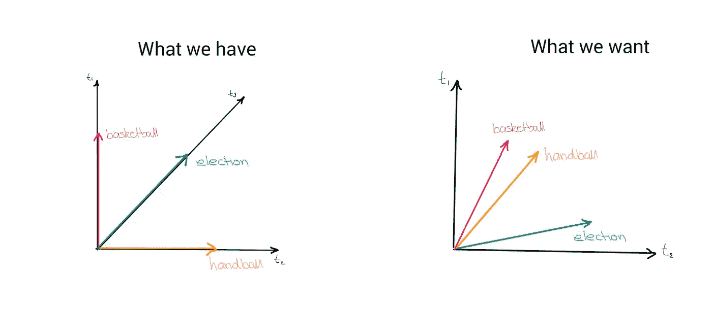
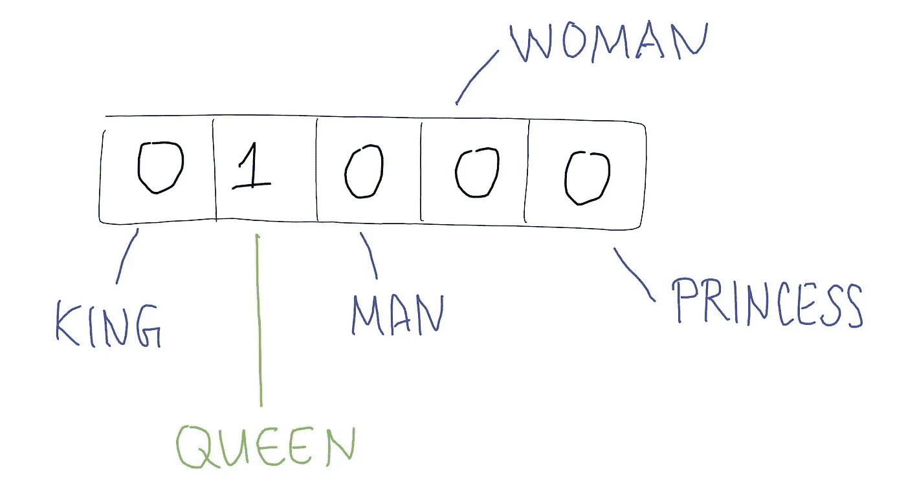
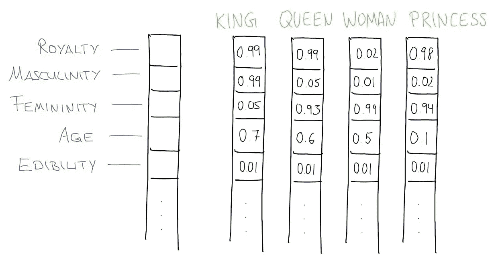
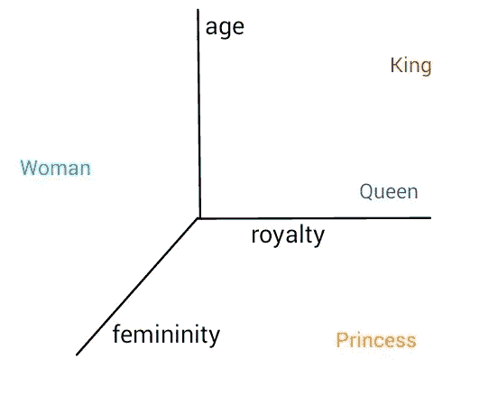

# NLP 101 ⅓ —特征工程和单词嵌入

> 原文：<https://towardsdatascience.com/nlp-101-%E2%85%93-feature-engineering-and-word-embeddings-f10dffd67bb0?source=collection_archive---------29----------------------->

## 自然语言处理中主要概念的简明介绍

在 [Unsplash](https://unsplash.com?utm_source=medium&utm_medium=referral) 上由 [Darya Tryfanava](https://unsplash.com/@darya_tryfanava?utm_source=medium&utm_medium=referral) 拍摄的照片

声明:本文是我为 [shecancode](https://shecancode.io/) 撰写的三部分系列文章的第一部分。与我的其他文章相比，它更深入于理论，并且不包含任何代码(关于这些，请查看我的其他文章)。

这篇博文是对自然语言处理(NLP)的一个温和的介绍。读完这篇文章后，你会知道一些从文本中提取特征的基本技术，这些特征可以用作机器学习模型的输入，以及什么是单词嵌入。

# 什么是 NLP？

NLP 是人工智能的一个分支，处理分析、理解和生成人类(自然)语言。您每天都在使用 NLP 应用程序，例如，当使用 Google Translate 翻译一段文本时，您的电子邮件服务使用 NLP 来检测垃圾邮件，自动完成和检查您手机上的语法，等等。

# 入门指南

给定一段文本，我们需要将其转换成计算机可读的格式——向量。在本文中，我们将介绍不同的方法，以及不同的预处理技术。

**标记化**

记号化是将文本分解成称为记号的单个单词的过程。虽然这听起来很简单，但这个问题并不简单。在像英语这样的语言中，空格是单词分隔符的一个很好的近似。然而，如果我们只按空间划分，就会遇到问题。

如果我们只按空格分开，每个句子的最后一个单词会包含一个标点符号，这是我们不想要的。但是挑出标点符号作为单独的符号并不总是正确的，例如在单词“Mr”中。

用英语来说，这个问题很简单，只要想出一套可以硬编码以达到良好效果的规则就行了。但是像日语这样不使用空格的语言呢？或者文本是非常特定于领域的，如下例所示？在这种情况下，我们需要使用机器学习来训练标记器。

除非您处理一个非常特殊的领域，它需要一个特定于领域的标记器，否则您没有必要编写一个标记器。幸运的是，所有的 NLP 库都有一套文本处理函数，包括一个用于标记化的函数。Python 的一个这样的库是自然语言工具包(NLTK ),它包含 nltk.word_tokenize 函数。

**预处理**

根据任务的不同，您可能希望对文本进行预处理，而不是使用整句。例如，垃圾邮件检测器依赖于数据中存在的某些特征。

垃圾邮件的特征

预处理文本的常用方法包括词条匹配和词干提取、停用词移除和规范化。查看这本[笔记本](https://github.com/lisanka93/UCL_F2F_NLP101/blob/main/WEEK_1/Week_1%20Notebook%20-%20Preprocessing.ipynb)中的一些例子，以及[我的这篇](/getting-started-with-text-analysis-in-python-ca13590eb4f7)前一篇文章。

**用一键向量表示单词**

好了，现在我们已经对文本进行了标记和预处理，是时候把它转换成计算机可读的向量了。这被称为特征提取。词袋(BOW)模型是一种流行且简单的特征提取技术。BOW 背后的直觉是，如果两个句子包含一组相似的单词，就说它们是相似的。BOW 在语料库(词汇表)中构建 m 个唯一单词的字典，并将每个单词转换成大小为 m 的稀疏向量，其中除了该单词在词汇表中的索引之外，所有值都被设置为 0。

一个句子可以用向量相加来表示。有不同的方法可以做到这一点:max-pooling 只计算一个单词是否出现，而不计算出现的次数。Sum pooling 计算每个单词的出现次数(使用 max-pooling 的“我喜欢，喜欢，NLP”的独热向量与“我喜欢 NLP”的相同，而 sum pooling 将在 vector [0，0，2，1，1]中产生)。

与标记化一样，没有必要从头开始编写代码——所有流行的机器学习库中都有文本矢量化功能，例如 scikit-learn 的 CountVectorizer。

# 单词嵌入

现在你知道如何将文本转换成向量了。这些向量可用于训练分类任务的模型，例如，垃圾邮件检测或情感分析。线性分类模型将在下一篇博文中讨论。BOW 对于某些任务非常有效，并且非常容易理解和实现。然而，BOW 有几个缺点。首先，它产生非常大但稀疏的特征向量。其次，它假设所有的单词都是相互独立的。

让我们用一个例子来说明这个问题。假设我们想按主题(体育、政治等)对新闻文章进行分类。).

我们很容易看出，测试句子应该被标注为 A(运动)，因为手球是一项运动。但是电脑不知道。计算机只能看到词汇中包含或不包含的符号。

一台计算机不能像我们一样根据我们对该领域的一些先验知识进行归纳。当使用 BOW 表示句子时，这是一个基本问题——一键编码的向量不能捕捉单词的相似性。

解决方案是分布式表示，它引入了一个单词对其他单词的某种依赖。这样，彼此更相似的单词将在嵌入空间中被放置得彼此更近。现在我们可以通过测量单词之间的距离来计算单词的相似程度。

这篇文章不会描述创建单词嵌入的算法是如何工作的，但是如果你有兴趣了解更多，可以看看这篇[博客文章。相反，我想给出一个关于单词嵌入的高级例子。](https://jalammar.github.io/illustrated-word2vec/)

想象一个包含 5 个单词的小词汇表:国王、王后、男人、女人和公主。queen 的一键向量看起来像左边的那个。

但是我们知道，词是丰富的实体，有许多层的内涵和意义。让我们为这 5 个单词手工制作一些语义特征。我们将每个单词表示为 5 个语义特征的 0 到 1 之间的值:皇室、男性、女性、年龄和可食用性。

鉴于“国王”这个词，它对“皇室”这一特征有很高的价值(因为国王是王室的男性成员)，但对女性气质的价值很低(因为他是男性)，对可食用性的价值甚至更低(因为我们通常不吃国王)。在上面虚构的玩具数据集中，有 5 个语义特征，我们可以一次绘制其中的三个作为 3D 散点图，每个特征是一个轴/维度。

您不必自己创建单词嵌入。预先训练的单词嵌入可以[下载](https://nlp.stanford.edu/projects/glove/)并在你的模型中使用。

我希望你觉得这篇博文很有用，并且已经了解了一些基本的 NLP 任务，一键编码是如何工作的，什么是单词嵌入。

阅读本系列的第二部分，点击[这里](/nlp-101-⅔-linear-models-for-text-classification-8ced8199c2a8)。