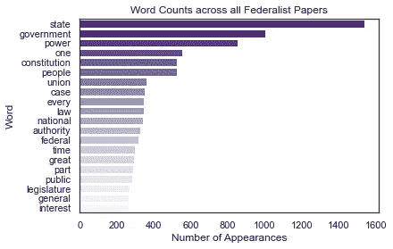
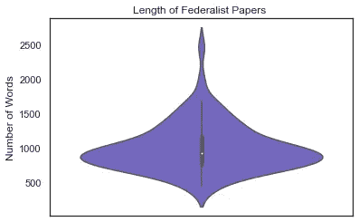
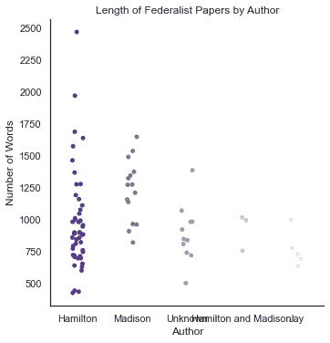
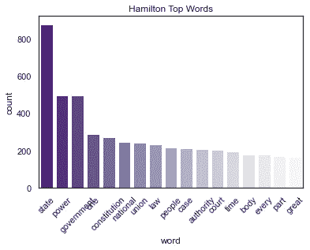
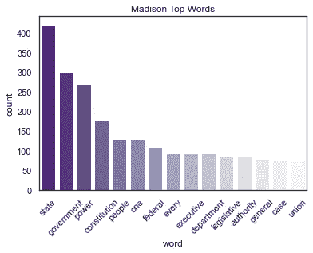
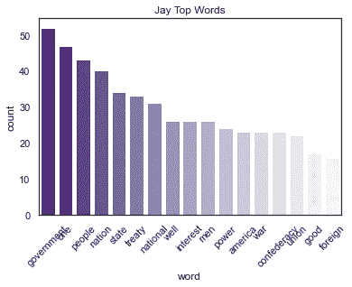
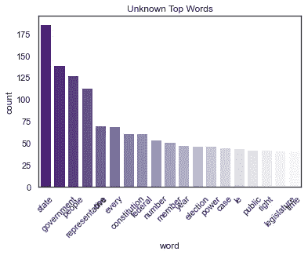
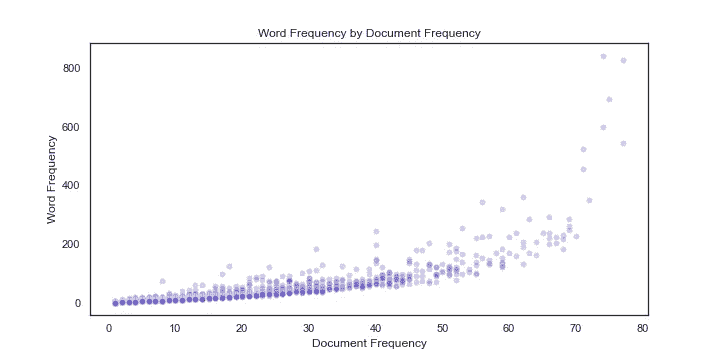
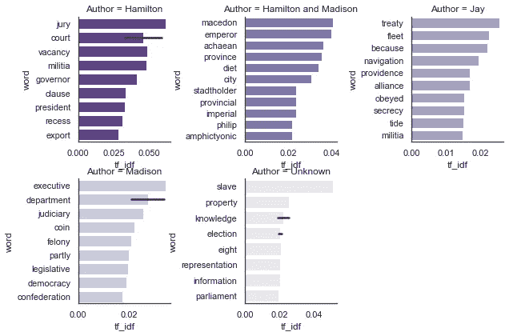

# Python 中联邦党人论文的 NLP 分析(上)

> 原文：<https://towardsdatascience.com/nlp-analysis-of-the-federalist-papers-in-python-part-1-2c44ed8c42d1?source=collection_archive---------27----------------------->

## 了解更多关于我们的创始人

> 由贾斯汀·舒尔伯格和萨布里·拉菲创作的多集连续剧


图片由[皮克斯拜](https://pixabay.com/?utm_source=link-attribution&utm_medium=referral&utm_campaign=image&utm_content=1779925)的 Gerd Altmann 提供

当亚历山大·汉密尔顿、约翰·杰伊和詹姆斯·麦迪森一起支持批准宪法时，他们创造了历史上最著名的一系列政治文本。《联邦党人文集》(The Federalist Papers)是一系列 85 篇文章，帮助推动纽约人走向批准，并为支持强大的联邦政府奠定了一些最强有力的论据。

在我们分析的第一部分，我们使用现代自然语言处理(NLP)技术进行探索性数据分析(EDA ),以更好地理解这些文章。我们将展示有见地的可视化，帮助我们了解每个作者的写作风格，字数，以及这些词在文章中出现的频率。

在未来的分析中，我们将执行文本摘要，让读者对每篇文章讨论的主题有一个初步的了解，余弦相似度，以了解哪些文章是最相关的，甚至尝试建立一个交互式应用程序，使其易于理解文章。

这是我们分析的第一部分。

```
# Load Data and import packages
import pandas as pd
import numpy as np
import nltk
import seaborn as sns
import matplotlib.pyplot as plt
import os ### NLTK Download
# Note: To download nltk products, you need to run the nltk downloader. If you 
# just want to run this quickly, uncomment the following line and run:
# nltk.download('popular') # Note that we need to go back one folder to the parent directory so that we can actually access the Data/ folder
parent_dir = os.path.realpath('..')
fed_papers = pd.read_csv(parent_dir + "/Data/full_fedpapers.csv").rename(columns = {'Lemmatized_Word': 'word'}) print(fed_papers.head())
```

首先，我们创建一些数据框，这些数据框可用于以后的分析。为了生成这些数据集，我们必须去掉一些对我们没有太大意义的不必要的单词(即停用词)。

```
# ------------------------------------------------------------------#                             Data Prep 
# ------------------------------------------------------------------stop_words = ['would', 'may', 'yet', 'must', 'shall', 'not', 'still', 'let', 'also', 'ought', 'a', 'the', 'it', 'i', 'upon', 'but', 'if', 'in', 'this', 'might', 'and', 'us', 'can', 'as', 'to', 'make', 'made','much'] fed_nonstop = fed_papers.copy() 
fed_nonstop = fed_nonstop[~fed_nonstop['word'].isin(stop_words)] # Start by creating a grouped dataframe of our word counts word_counts = fed_nonstop.groupby(['word']) \     
    .size() \     
    .reset_index(name = 'count') \     
    .sort_values('count', ascending = False) \     
    .reset_index(drop = True)
```

现在，我们的数据已经被清理和组织了一下，让我们来看看出现在《联邦党人文集》中的前 20 个词

```
# ------------------------------------------------------------------
#                          Viz 1: Top 20 Words
# ------------------------------------------------------------------ #Our first visualization counts the top 20 words across all documents.
#Set the theme sns.set_style('white')
sns.set_context('notebook') # Build the visualization
viz1 = sns.barplot(x = 'count',
            y = 'word',
            data = word_counts[:20],
            palette = "Purples_r") # Set our labels
viz1.set(xlabel='Number of Appearances', ylabel='Word', title =
'Word Counts across all Federalist Papers')
plt.show()
```



不出所料，单词 *state/states* 和 *government* 出现的次数几乎比其他任何单词都多。当时，汉密尔顿、麦迪逊和杰伊主张解散联邦条款，这是早期美国的管理文件，将巨大的权力交给了各州。宪法的大部分目的是将权力从州政府转移到联邦政府。

接下来，我们将使用小提琴图来查看每个文档的长度。Violin plots 类似于 boxplots，但是通过帮助您按长度显示文档量，可以更直观地描述文档。

```
# ------------------------------------------------------------------
#                          Viz 2: Document Lengths
# ------------------------------------------------------------------ doc_lengths = fed_papers.groupby(['Essay']) \
    .size() \
    .reset_index(name = 'length') \
    .sort_values('length', ascending = False) \
    .reset_index(drop = True) viz2 = sns.violinplot(y = doc_lengths['length'], 
               color = "Slateblue") # Set our labels
viz2.set(ylabel = 'Number of Words', title = 'Length of Federalist Papers ')
plt.show()
```



大多数文章在 500-1000 字之间，有些非常冗长。一篇作文差不多 2500 字！

不同作者的文章长度有什么不同？一个作者比其他人更啰嗦吗？让我们来看看。

```
# ------------------------------------------------------------------
#                     Viz 3: Document Lengths by Author
# ------------------------------------------------------------------ doc_lengths = fed_papers.groupby(['Essay', 'Author']) \
    .size() \
    .reset_index(name = 'length') \
    .sort_values('length', ascending = False) \
    .reset_index(drop = True) viz3 = sns.catplot(x = 'Author',
                      y = 'length',
                      data = doc_lengths,
                      hue = 'Author',
                      palette = 'Purples_r')
                      # color = "Slateblue") # Set our labels
viz3.set(xlabel = 'Author', ylabel = 'Number of Words', title = 'Length of Federalist Papers by Author')
plt.show()
```



由于汉密尔顿写了*那么*多篇文章，从这个形象化来讲有点难。我们可以看到，这篇 2500 字的长文是汉密尔顿写的。

我们接下来的几个可视化由每个作者(约翰·杰伊、亚历山大·汉密尔顿、詹姆斯·麦迪森或未知)的字数统计的前 10 个单词组成的条形图。

```
#Hamilton - Visualization 4----------------------------------------- doc_lengths = fed_nonstop.groupby(['Author','word']) \
    .Essay.count() \
    .reset_index(name = 'count') \
    .sort_values('count', ascending = False) \
    .reset_index(drop = True) Hamilton_words = doc_lengths.loc[doc_lengths.Author == 'Hamilton']
Hamilton_top_words = Hamilton_words.head(17) Hamilton_top_words = Hamilton_top_words.copy()
Hamilton_top_words = Hamilton_top_words[~Hamilton_top_words['word'].isin(stop_words)] # Set the theme
sns.set_style('white')
sns.set_context('notebook') # Build the visualization
viz4 = sns.barplot(x = 'word',
            y = 'count',
            data = Hamilton_top_words,
            palette = "Purples_r") #Rotate X tick labels
viz4.set_xticklabels(viz4.get_xticklabels(), rotation=45 ) # Set our labels
viz4.set(xlabel='word', ylabel='count', title = 'Hamilton Top Words')
plt.show()
```



汉密尔顿对强有力的中央集权政府的热情支持在这里是显而易见的。前 6 个词中有 5 个包括“权力”、“一”、“政府”、“国家”和“联盟”。

```
# Madison - Visualization 5----------------------------------------- doc_lengths = fed_nonstop.groupby(['Author','word']) \
    .Essay.count() \
    .reset_index(name = 'count') \
    .sort_values('count', ascending = False) \
    .reset_index(drop = True) Madison_top = doc_lengths.loc[doc_lengths.Author == 'Madison']
Madison_top_words = Madison_top.head(15) Madison_top_words = Madison_top_words.copy()
Madison_top_words = Madison_top_words[~Madison_top_words['word'].isin(stop_words)] # Set the theme
sns.set_style('white')
sns.set_context('notebook') # Build the visualization
viz5 = sns.barplot(x = 'word',
            y = 'count',
            data = Madison_top_words,
            palette = "Purples_r") #Rotate X tick labels
viz5.set_xticklabels(viz6.get_xticklabels(), rotation=45 ) # Set our labels
viz5.set(xlabel='word', ylabel='count', title = 'Madison Top Words')
plt.show()
```



麦迪逊的名言和汉密尔顿的有一些相似之处。两位作者都将“国家”和“政府”作为首选词汇。此外，在他们的 15 个热门词汇中，他们分享了 10 个共同的词汇，这表明作者在思考类似的波长。

```
#John Jay - Visualization 6----------------------------------------- doc_lengths = fed_nonstop.groupby(['Author','word']) \
    .Essay.count() \
    .reset_index(name = 'count') \
    .sort_values('count', ascending = False) \
    .reset_index(drop = True) Jay_top = doc_lengths.loc[doc_lengths.Author == 'Jay']
Jay_top_words = Jay_top.head(17) Jay_top_words = Jay_top_words.copy()
Jay_top_words = Jay_top_words[~Jay_top_words['word'].isin(stop_words)] # Set the theme
sns.set_style('white')
sns.set_context('notebook') # Build the visualization
viz6 = sns.barplot(x = 'word',
            y = 'count',
            data = Jay_top_words,
            palette = "Purples_r") #Rotate X tick labels
viz6.set_xticklabels(viz5.get_xticklabels(), rotation=45 ) # Set our labels
viz6.set(xlabel='word', ylabel='count', title = 'Jay Top Words')
plt.show()
```



相比之下，周杰伦的热门词汇似乎与他的热门词汇“条约”有所不同。仅仅从他的顶级词汇选择中，并没有一个强有力的连贯主题。然而，与汉密尔顿和麦迪逊相比，很明显他采取了不同的路线来表达他对中央集权政府的支持。

```
doc_lengths = fed_nonstop[['word', 'Essay']].drop_duplicates() \
    .groupby(['word']) \
    .size() \
    .reset_index(name = 'doc_count') \
    .sort_values('doc_count', ascending = False) \
    .reset_index(drop = True) merged_counts = pd.merge(word_counts, 
                         doc_lengths, 
                         left_on = 'word', 
                         right_on = 'word',
                         how = 'inner') # Resize the plot
plt.figure(figsize=(10,5))
viz7 = sns.scatterplot(data = merged_counts, 
                       x = "doc_count", 
                       y = "count",
                       alpha = .3,
                       color = "slateblue") # Set our labels
viz7.set(ylabel = 'Word Frequency', 
         xlabel = 'Document Frequency',
         title = 'Word Frequency by Document Frequency') plt.show()
```



这位不知名作者的文章似乎混合了汉密尔顿和麦迪逊的顶级词汇。

让我们更深入地探究一下《联邦党人文集》中的词汇用法。我们将制作一个散点图，列出所有可能合理出现在数据集中的单词，测量每个单词出现的次数以及它出现在文档中的数量。

这里的希望是看一看每个单词的最终 TF-IDF:这样我们可以过滤掉出现很多次但只在很少的文档中出现的单词(就像如果“宪法”总共出现 100 次，但在文章 100 中出现 95 次。)

现在让我们创建一个分组的数据帧，它计算给定单词出现在文档中的次数(文档频率)。这对于帮助我们识别可能在同一文档中多次出现的单词非常重要。如果一个单词不仅是文档中频繁出现的单词，而且是出现在许多文档中的单词，则该单词被认为更“重要”。

```
doc_lengths = fed_nonstop[['word', 'Essay']].drop_duplicates() \
    .groupby(['word']) \
    .size() \
    .reset_index(name = 'doc_count') \
    .sort_values('doc_count', ascending = False) \
    .reset_index(drop = True)merged_counts = pd.merge(word_counts, 
                         doc_lengths, 
                         left_on = 'word', 
                         right_on = 'word',
                         how = 'inner')# Resize the plot
plt.figure(figsize=(10,5))
viz8 = sns.scatterplot(data = merged_counts, 
                       x = "doc_count", 
                       y = "count",
                       alpha = .3,
                       color = "slateblue")# Set our labels
viz8.set(ylabel = 'Word Frequency', 
         xlabel = 'Document Frequency',
         title = 'Word Frequency by Document Frequency')plt.show()
```



基于我们上面的分析，我们现在将研究每个单词的 TF-IDF。让我们从计算词频开始。虽然我们主要是查看所有文档的字数，但是对于词频，我们关心的是这个词在给定文档中出现的次数比例。例如，如果一个句子有 10 个单词长，并且“宪法”出现了 3 次，那么它的词频是. 3 (30%)。

```
fed_analysis = merged_counts.copy() # Calculate the length of each essay
doc_lengths = fed_nonstop.groupby(['Essay']) \
    .size() \
    .reset_index(name = 'doc_length') \
    .reset_index(drop = True) # Now let's figure out how many times a word appears in a given essay
word_frequency = fed_nonstop.groupby(['word', 'Essay']) \
    .size() \
    .reset_index(name = 'word_freq') \
    .sort_values('word') \
    .reset_index(drop = True) # With these two dataframes, we can bring them together to calculate our tf score
merged_tf = pd.merge(word_frequency, 
                     doc_lengths, 
                     left_on = 'Essay',
                     right_on = 'Essay',
                     how = 'inner') merged_tf['tf'] = merged_tf['word_freq'] / merged_tf['doc_length'] # We can pull the inverse document frequency from our merged_counts dataframe above
fed_analysis['idf'] = np.log(85 / fed_analysis['doc_count']) # Let's merge these (again) into one big dataframe
tf_idf_df = pd.merge(merged_tf,
                     fed_analysis,
                     left_on = 'word',
                     right_on = 'word',
                     how = 'inner') tf_idf_df['tf_idf'] = tf_idf_df['tf'] * tf_idf_df['idf']
```

我们来看看哪些词的作者 TF-IDF 得分最高。这将有助于我们通过查看每个作者最独特的用词来识别他们的风格。

```
# ------------------------------------------------------------------
#                           Viz 9: Top TF-IDF
# ------------------------------------------------------------------authors = fed_nonstop[['Essay', 'Author']].drop_duplicates() merged_df = tf_idf_df.merge(authors,
                            left_on = 'Essay',
                            right_on = 'Essay') authors_tf = merged_df.groupby(['tf_idf', 'Author', 'word']) \
    .size() \
    .reset_index(name = 'tfidf') \
    .sort_values('tf_idf', ascending = False) \
    .reset_index(drop = True) # Find our top 10 words for each author
authors_top_tf = authors_tf.groupby('Author')['tf_idf'] \
    .nlargest(10, keep = 'first') \
    .reset_index(name = "tf_idf") # Unfortunately this drops the actual word, so let's merge it back on authors_top_tf = authors_top_tf.merge(authors_tf,
                                      left_on = ['Author','tf_idf'],
                                      right_on =['Author','tf_idf'])# Set the theme
sns.set_style('white')
sns.set_context('notebook') # Build the visualization viz9 = sns.FacetGrid(authors_top_tf, 
                     col = "Author",
                     hue = 'Author', 
                     col_wrap = 3,
                     palette = 'Purples_r',
                     sharex = False, 
                     sharey = False)
viz9.map(sns.barplot, "tf_idf", "word") # Set our labels
viz9.set(xlabel='tf_idf', ylabel='word')
plt.show()
```



这些 TF-IDF 分数让我们对每个作者使用的一些最尖锐的词语有了更强烈的感觉。例如，汉密尔顿似乎完全专注于政府的司法部门(*法院*、*陪审团*等)。).虽然麦迪森同样关注司法系统，但他也相当关心政府的结构，引用了像*派系*和*部门*这样的词。

# 结论

感谢阅读！我们希望你能多了解一点联邦党人文件。如果你觉得这篇文章有教育意义或有趣，请继续关注下一篇文章，我们希望在那里提供文本摘要、交互式应用程序和 Tableau 信息图。如果你有其他路线的想法，请评论你的建议——想法越多越好！

# 额外资源

有兴趣看看原创博文和我们的其他作品吗？

1.  贾斯汀的博客网站:[https://www.datacracy.us/](https://www.datacracy.us/)
2.  萨布里的博客网站:[https://www.datascienceinnovators.com/](https://www.datascienceinnovators.com/)

有兴趣看原码吗？在这里进入 GitHub 库:
[**https://github.com/jschulberg/Federalist-Papers-NLP**](https://github.com/jschulberg/Federalist-Papers-NLP)

有兴趣看散文原著吗？前往:
[**https://guides . loc . gov/federalist-papers/text-1-10 # s-LG-box-wrapper-25493264**](https://guides.loc.gov/federalist-papers/text-1-10#s-lg-box-wrapper-25493264)

*原载于 2021 年 3 月 10 日*[*https://data cracy . netlify . app*](https://datacracy.netlify.app/post/2021-03-10-federalist-papers-nlp-analysis/)*。*