# 基于自然语言处理和词性的组块分析从评论中生成亚马逊风格的关键词

> 原文：<https://towardsdatascience.com/nlp-and-pos-based-chunking-to-generate-amazon-style-key-phrases-from-reviews-239084543225?source=collection_archive---------26----------------------->

## **使用基于语法的正则表达式解析器提取关键短语**

**本文**的目标是以亚马逊评论标签为例介绍词性分块的概念。

我打算从 2017 款 Moto G5 plus 升级到新手机。在我对新手机的研究中，我最终浏览了亚马逊上列出的许多手机，并浏览了它们的评论。

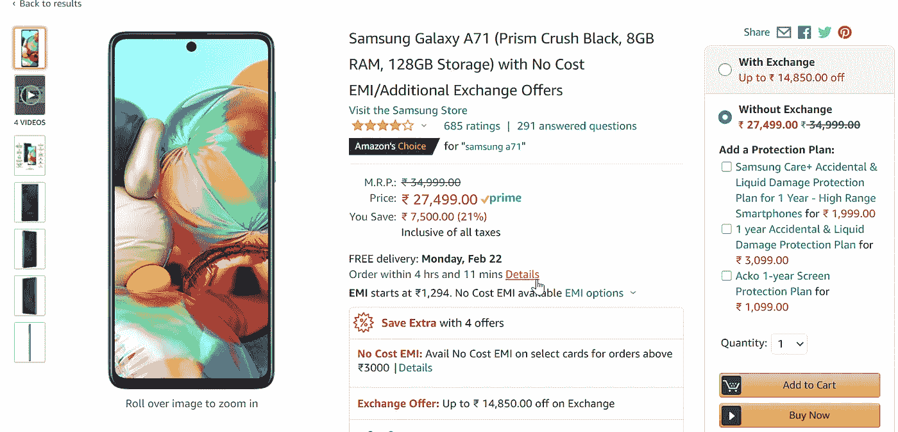

作者捕获的屏幕截图

和我一样，你会注意到冗长的评论上面有一个标签列表。这些标签突出了关于手机的最热门话题，节省了我很多时间。

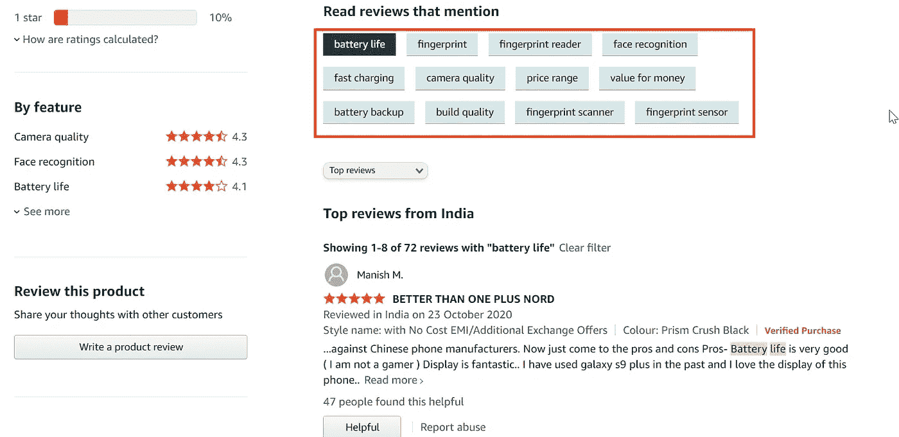

从评论中提取的关键短语。作者截图

这激起了我的兴趣…他们是怎么做到的呢？

首先，我们需要从原始文本的海洋中提取出感兴趣的短语。

我们将利用自然语言处理中被称为组块的概念来将句子分成感兴趣的更小的片段。

我使用了我的文章“使用 SQL 构建搜索引擎”中的亚马逊评论数据集。

我强烈建议您阅读这篇文章，但是您可以继续阅读文章的其余部分，而不会影响理解。

 [## 用 SQL 构建搜索引擎…

### …使用全文搜索

learnwithdivya.medium.com](https://learnwithdivya.medium.com/build-a-search-engine-with-sql-cc8baf06ddb2) 

帖子的其余部分包含以下主题:

1.词性标注

2.识别感兴趣的位置

3.定义和访问块

4.词性分块的其他使用案例

# **1。位置标记**

还不需要拿出你的雷恩和马丁语法书。识别词类不需要成为英语语法专家。基本掌握语法就足够了。谢天谢地，nltk 图书馆为我们做到了这一点。

输出如下所示:

['电池'，'续航'，'是'，'很好'，'('，'我'，' am '，'不是'，' a '，' gamer '，')'，'显示'，'是'，'太棒了..'、'我'、'有'、'用过'、'银河'、' s9 '、'在'、'过去'、'我'、'爱'、'显示'、'的'、'的'、'这个'、'电话..']

POS 标记词= [('电池'，' NNP ')，('寿命'，' NN ')，('是'，' VBZ '，('很好'，' JJ ')，('('，'('我'，' PRP ')，(' am '，' VBP ')，('不是'，' RB ')，(' a '，' DT ')，(' gamer '，' NN '，'，'，')')，('显示'，' NNP ')，('是'，' VBZ '，('妙极了..'、' JJ ')、('我'、' PRP ')、('有'、' VBP ')、('用过'、' VBN ')、('银河'、' NN ')、('加号'、' CC ')、('在'、'在')、(' the '、' DT ')、('过去'、' JJ ')、('和'、' CC ')、('爱'、' VBP ')、(' the '、' DT ')、('显示'、' NN ')、(' of '、'在'、('这个'、' DT ')、('电话..)，' NN')]

那很好，但是我对哪些感兴趣..？

# **2。识别兴趣点**

我从这个在线 POS 标签中受益匪浅，因为它对 POS 进行了颜色编码。

 [## 词类。信息-在线位置标记

### 文本的自动词性标注(突出显示词类)

词性信息](https://parts-of-speech.info/) 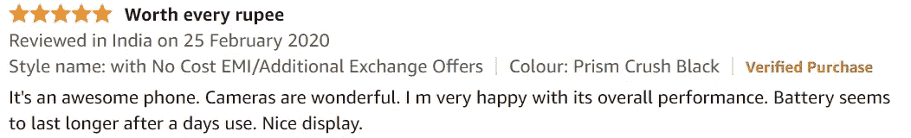

复习示例 1

从亚马逊上挑选一篇评论，并将其粘贴到在线帖子标签中

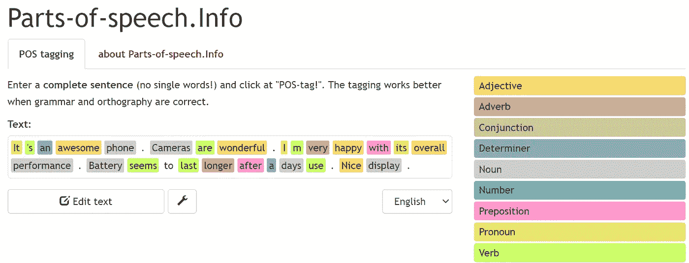

在线标签的彩色 POS 输出

对于人眼来说，识别颜色模式比识别 POS 等结构更自然。

嗯……出现了什么模式..？

灰色和橙色的单词似乎传达了一些特征。那是一个形容词和名词的组合

让我们再看几个例子..

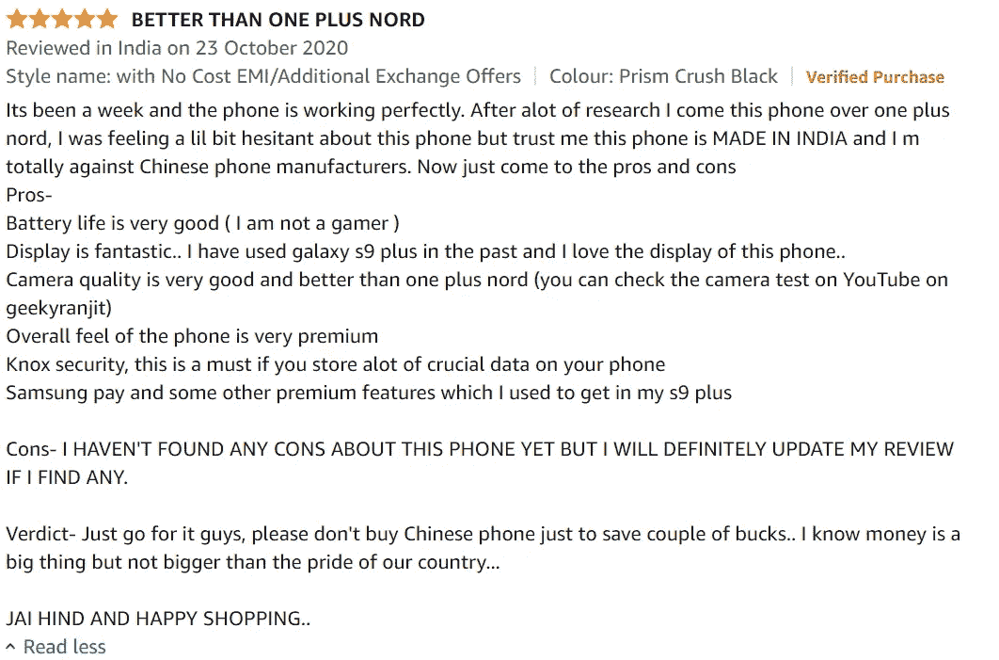

复习示例 2

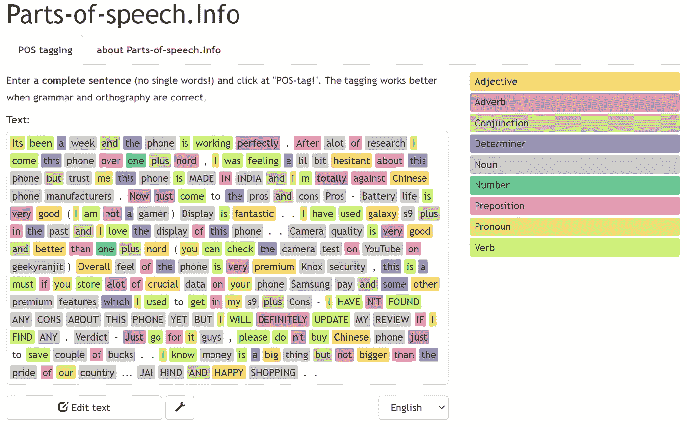

寻找更多的模式

灰色——灰色组合也很突出。表示一系列名词。

但是也…

灰色和橙色以及中间的其他颜色；意为名词和形容词，中间有其他词性。

因此，我们查看了多个示例，并从评论中找出了一些词性模式。

这让我们想到..

# 3.定义区块

最好定义多个模式，以便从评论文本中提取最多的内容。

有关创建 POS 正则表达式的完整教程，请参见以下链接:

 [## Python 编程教程

### 现在我们知道了词类，我们可以做所谓的分块，把单词分成有希望有意义的…

www.pythonprogramming.net](https://www.pythonprogramming.net/chunking-nltk-tutorial/) 

让我们通过访问块来看看输出。

对于输入句子:

这是一部很棒的手机。相机很棒。我对它的整体性能非常满意。使用一天后，电池似乎可以持续更长时间。不错的展示。

组块 1:形容词后接名词

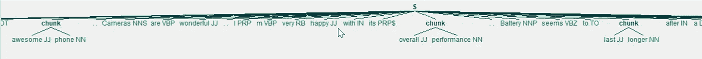

词块 2:名词和形容词之间有其他词性

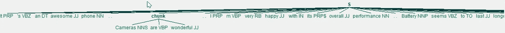

组块 3:名词序列

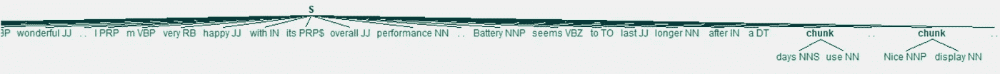

让我们在其他评论上再看几个例子:

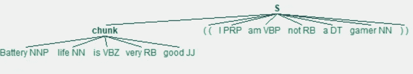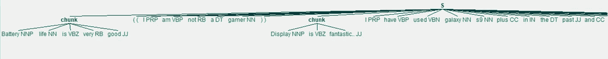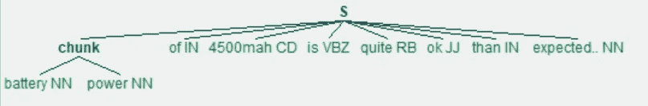

这就是了——从评论中提取的产品特性描述列表。

让我们通过查看一些有趣的用例来给分块技术以应有的赞誉。

# **4。分块的有趣用例**

基于表达某种意义的词组来解析文本的能力开辟了许多可能性。继续阅读以下几个例子:

**用例 1 :** 我想浏览一份客户服务电话记录，找出客户打电话时的常见投诉，这样我就可以自动化那些频繁的工作流程。

看来 <verb><other pos=""><noun>种模式在这里行得通。</noun></other></verb>

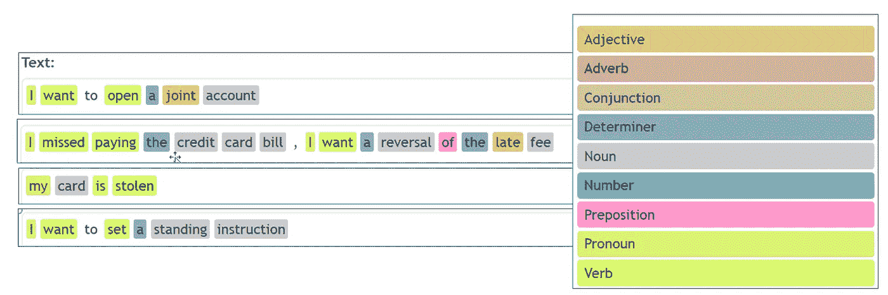

识别客户服务呼叫中心用例的模式

**用例 2 :** 从会诊记录中提取医生的建议

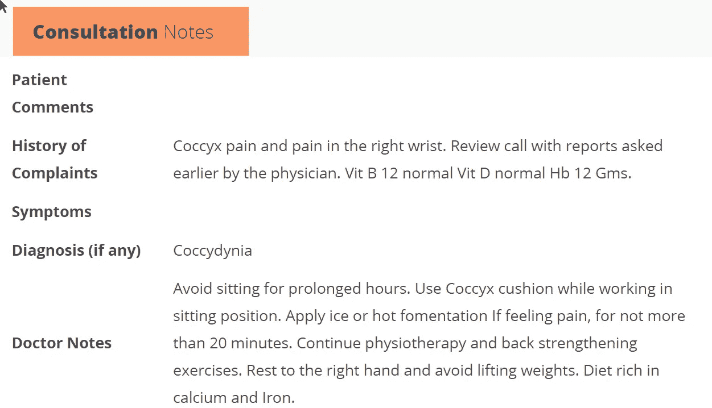

医生会诊记录

创建新模式

提取的块内容如下:

1.  使用 Cocyx cusion
2.  敷冰
3.  继续理疗
4.  强化练习

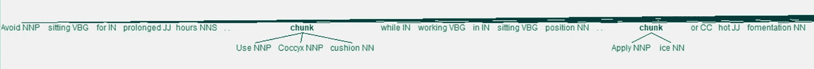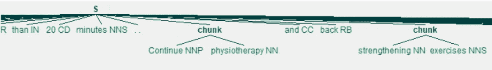

一旦我们有了关键短语，我们就可以运行聚类算法将相似的短语分组在一起(例如:分组好电池和高性能电池)。我将在以后的文章中讨论这个问题。

今天，我希望你离开时知道在你的 NLP 工具包中有一个像组块这样的工具的威力。

感谢阅读。让我知道你打算如何使用词性分块。

我可以在评论区和 LinkedIn 找到我。