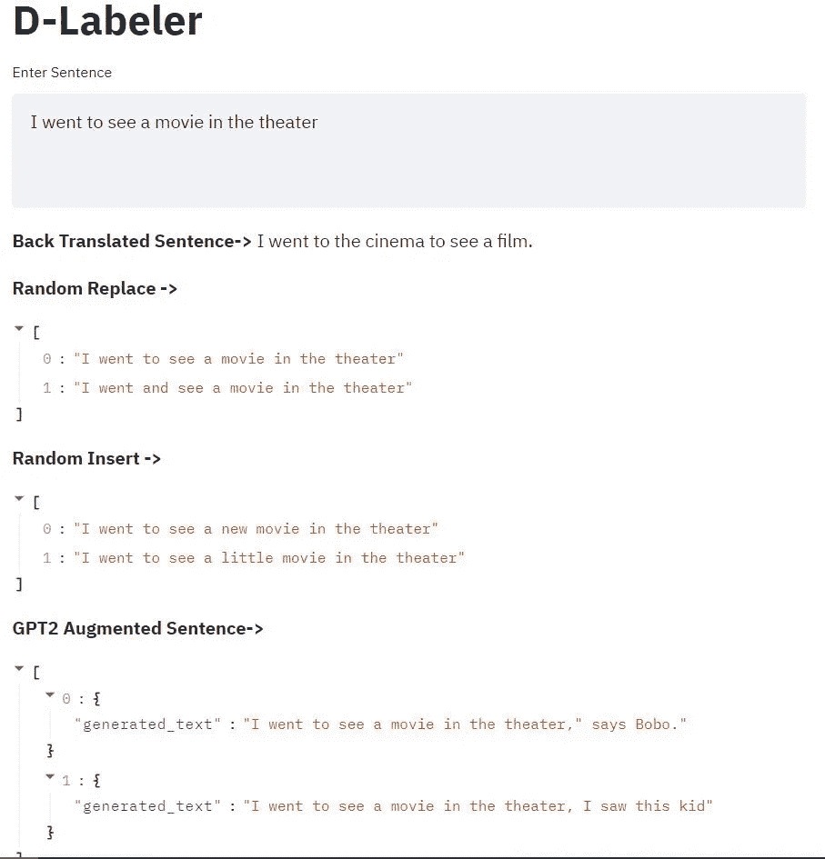

# NLP 数据扩充使用🤗变形金刚(电影名)

> 原文：<https://towardsdatascience.com/nlp-data-augmentation-using-transformers-89a44a993bab?source=collection_archive---------14----------------------->

## 减少您的数据标注工作

托拜厄斯·菲舍尔在 [Unsplash](https://unsplash.com/s/photos/data?utm_source=unsplash&utm_medium=referral&utm_content=creditCopyText) 上的照片

NLP(自然语言处理)项目面临的一个最常见的问题是缺乏标记数据。标注数据既昂贵又耗时，而且繁琐。数据扩充技术通过防止过度拟合和使模型更加稳健来帮助我们建立更好的模型。在这篇文章中，我将讲述我们如何使用[变形金刚](https://huggingface.co/transformers/)库和预训练模型，如[伯特](https://github.com/google-research/bert)、 [GPT-2](https://openai.com/blog/better-language-models/) 、 [T5](https://ai.googleblog.com/2020/02/exploring-transfer-learning-with-t5.html) 等。轻松扩充我们的文本数据。我还想提一下这篇关于 [***无监督数据增强***](https://github.com/google-research/uda)***(UDA)***的有趣论文，这篇论文来自谷歌的研究人员，他们在论文中表明，在只有 20 个标记的例子和数据增强与其他技术相结合的情况下，他们的模型在 IMDB 数据集上的表现优于最先进的模型，同样的技术在图像分类任务上也显示出良好的结果。这里是 UDA 的[博文](https://ai.googleblog.com/2019/07/advancing-semi-supervised-learning-with.html)、[论文](https://arxiv.org/abs/1904.12848)和 [github](https://github.com/google-research/uda) 代码的链接。这项工作的一部分是基于[自动增强](https://github.com/tensorflow/models/tree/master/research/autoaugment) [论文](https://arxiv.org/abs/1805.09501)。

希望我已经让你相信了数据增强的威力，请继续阅读，看看如何使用 transformer [pipelines](https://huggingface.co/transformers/main_classes/pipelines.html#) 特性，用几行代码实现 4 种强大的增强技术。

**反向翻译** —这是我发现最有趣的技术，这里我们首先使用一个模型将句子转换成不同的语言，然后再转换回目标语言。当我们对此使用 ML 模型时，它产生与原始句子等价但具有不同单词的句子。在 [Huggingface model hub](https://huggingface.co/models) 上有各种预先训练好的模型，比如[谷歌 T5](https://ai.googleblog.com/2020/02/exploring-transfer-learning-with-t5.html) ，脸书 NMT(神经机器翻译)等。在下面的代码中，我使用 T5-base 进行英语到德语的翻译，然后使用 [Bert2Bert](https://arxiv.org/abs/1907.12461) 模型进行德语到英语的翻译。我们也可以使用 Fairseq [模型](https://github.com/pytorch/fairseq/blob/master/examples/translation/README.md)，它既适用于英语到德语，也适用于德语到英语。

我们可以看到，对于输入文本“我去电影院看了一场电影”，我们得到的输出文本是“我去电影院看了一场电影”，它传达了相同的意思，但使用了不同的单词和不同的顺序！我们也可以使用不同的语言，如英语到法语等。创造更多的变化。

**随机插入** —在这种技术中，我们在给定的句子中随机插入一个单词。一种方法是随机插入任何单词，但是我们也可以使用像 [BERT](https://huggingface.co/bert-base-uncased) 这样的预训练模型来根据上下文插入单词。这里我们可以使用 transformer pipeline 中的“填充-遮罩”任务来插入一个单词。

我们可以看到，对于一个输入文本“我去电影院看电影”，BERT 模型在随机位置插入一个单词*【新】*来创建一个新句子“我去电影院看了一部 ***新*** 电影”，它实际上给出了 5 个不同的选项，如“我去电影院看了一部 ***小*** 电影”。因为我们随机选择索引，所以每次都在不同的地方插入单词。在此之后，我们可以使用相似性度量，使用[通用句子编码器](https://tfhub.dev/google/universal-sentence-encoder/4)来选择最相似的句子。

**随机替换** —在这种技术中，我们用新单词替换随机单词，我们可以使用预先构建的字典来替换同义词，或者我们可以使用预先训练的模型，如 [BERT](https://huggingface.co/bert-base-uncased) 。这里我们再次使用“填充-遮罩”管道。

在上述代码的一个例子中，我们随机选择单词*“see”*，并使用BERT 将其替换为单词*“watch”*，生成一个句子*“I go to watch a movie in the theater”*，意思相同但单词不同。我们也可以用同样的方法替换多个单词。对于随机插入和替换，我们也可以使用其他支持“填充-遮罩”任务的模型，如 [Distilbert](https://huggingface.co/distilbert-base-uncased) (小而快) [Roberta](https://huggingface.co/roberta-base) 甚至多语言模型！

**文本生成** —在这项技术中，我们使用了生成模型，如 [GPT2](https://huggingface.co/gpt2) 、 [distilgpt2](https://huggingface.co/distilgpt2) 等。让句子变长。我们输入原始文本作为开始，然后模型根据输入文本生成额外的单词，这样我们就可以在句子中添加随机噪声。如果我们只添加几个单词，并使用相似性得分来确保句子与原始句子相似，那么我们可以在不改变意思的情况下生成附加的句子！

在这里，我们使用“文本生成”管道和 GPT-2 模型向我们的原始句子添加 5 个新单词，以获得一个新句子，如*“我去电影院看电影，导演是”，*如果我们决定添加 10 个新单词，我们可以获得一个句子，如*“我去电影院看电影，当我看着另一边并思考时”。*所以我们可以看到，根据我们的用例，我们可以生成许多不同长度的句子。

**Streamlit 演示—** 下面是我创建的一个 Streamlit 应用程序的截图，在这里，人们可以以互动的方式使用不同的输入句子来玩 4 种不同的增强技术。

Streamlit 演示截图(图片由作者提供)

你可以在我的[Github](https://github.com/suryavanshi/nlp_augment_streamlit)repo 中找到上述 Streamlit 应用的完整代码。

**资源**

调查论文— [自然语言处理中的数据扩充方法:调查](https://arxiv.org/abs/2110.01852)

要了解更多关于变形金刚和自然语言处理的知识，你可以通过拥抱脸来学习这门伟大的课程——[https://huggingface.co/course/chapter1](https://huggingface.co/course/chapter1)

我想提一下另一个很棒的库 [**nlpaug**](https://github.com/makcedward/nlpaug) ，它提供了很多扩充 NLP 数据的方法。关于这个库的博文-[https://towardsdatascience . com/data-augmentation-in-NLP-2801 a 34 DFC 28](/data-augmentation-in-nlp-2801a34dfc28)

UDA 博文—[https://ai . Google Blog . com/2019/07/advancing-semi-supervised-learning-with . html](https://ai.googleblog.com/2019/07/advancing-semi-supervised-learning-with.html)

语义相似度使用 USE—[https://colab . research . Google . com/github/tensor flow/hub/blob/master/examples/colab/semantic _ Similarity _ with _ TF _ hub _ universal _ encoder . ipynb](https://colab.research.google.com/github/tensorflow/hub/blob/master/examples/colab/semantic_similarity_with_tf_hub_universal_encoder.ipynb)