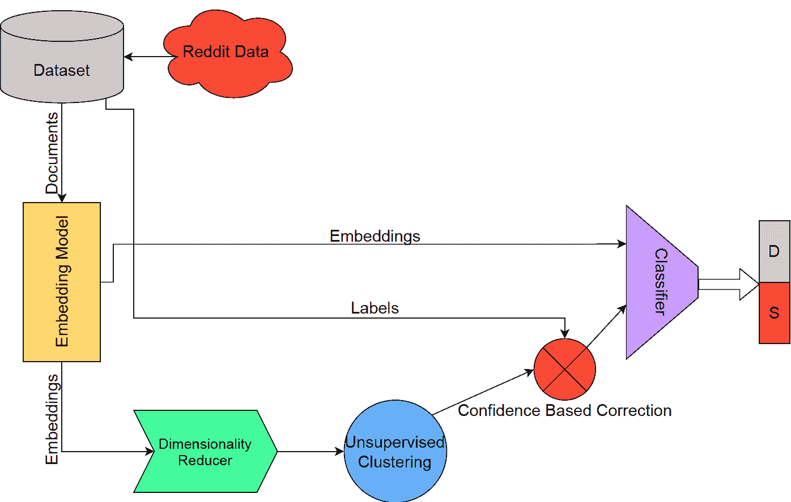
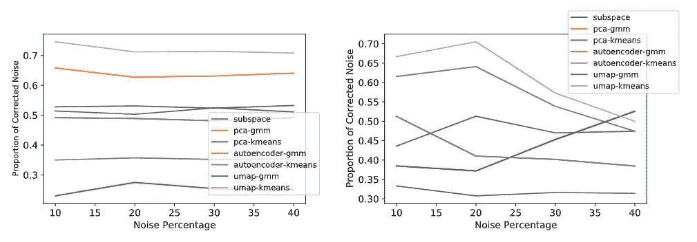
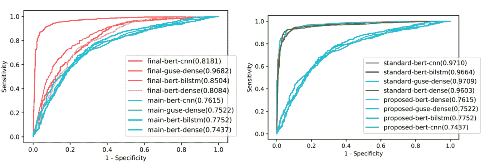

# 用噪声标签识别自杀和抑郁的自然语言处理

> 原文：<https://towardsdatascience.com/nlp-for-suicide-and-depression-identification-with-noisy-labels-98d7bb98f3e8?source=collection_archive---------19----------------------->

## *对我们最近在有噪声标签的情况下使用深度学习进行自杀和抑郁分类的工作的回顾*

作者图片

*本文作者是 Ayaan Haque 和 Viraaj Reddi*

在这篇文章中，我们将回顾我们最近由 Ayaan Haque，Viraaj Reddi 和 Tyler Giallanza 完成的题为“利用无监督标签校正进行自杀和抑郁识别的深度学习”的工作。这篇论文是一种在有噪声标签的情况下使用深度学习进行自杀与抑郁识别的方法，目前正在一个顶级会议上接受审查。我们的论文可以在 [ArXiv](https://arxiv.org/abs/2102.09427) 上获得，[代码](https://github.com/ayaanzhaque/SDCNL)可以在 Github 上获得，项目网站[在这里](https://ayaanzhaque.github.io/SDCNL/)。本文将回顾我们名为 SDCNL 的方法，以及一些结果。

# **概述**

SDCNL，代表带有噪声标签的自杀抑郁症分类，是一种使用深度学习和噪声标签校正来区分自杀和抑郁症的方法。抑郁症患者自杀意念的早期检测可以提供足够的医疗关注和支持，这在许多情况下是挽救生命的。最近的 NLP 研究集中在从一段给定的文本中，对一个人是否有自杀倾向或临床健康进行分类。然而，还没有主要的尝试来区分抑郁症和自杀意念，这是一个重要的临床挑战。此外，由于缺乏数据可用性，我们使用来自 Reddit 等在线论坛的数据来训练我们的模型。然而，与其他数据来源不同的是，来自在线论坛的数据尚未被证实是真实和准确的。因此，这引入了来自网络抓取数据的噪声标签的问题，并且需要移除它们的过程。

为了解决以下问题，我们提出了 SDCNL，我们的工作要点是:

*   基于深度学习的情绪分析在抑郁症和自杀意念分类中的应用，这是一个重要但尚未探索的临床和计算挑战
*   一种全新的、无监督的标签校正过程，用于基于文本的数据和标签，不需要先前的噪声分布信息，允许我们为深度学习产生大型和可信的数据集
*   在多个数据集上进行的强大实验证明了我们的方法在一项具有挑战性的关键任务上的能力

# **背景**

> **有哪些临床和计算挑战？**

抑郁症仍然是全世界最紧迫的问题之一，尤其是在发达国家和新兴国家。根据世界卫生组织(世卫组织)的数据，全球有 3.22 亿人患有抑郁症。如果不加以解决，抑郁症通常会发展为自杀意念和自杀未遂。

考虑到问题的严重性，诊断抑郁症，以及识别抑郁症个体何时处于试图自杀的风险，在个体和群体水平上都是一个重要的问题。人工智能和机器学习已经成为快速、高效和无偏见地识别挣扎中的用户的可能方式。

该领域最近的研究集中于区分精神不健康的个体和临床健康的个体，并取得了巨大的成功。然而，很少有研究发现抑郁转变为自杀意念的界限，这是一项更困难的临床和技术任务。

点击这里了解更多关于心理学和精神健康中抑郁与自杀问题的信息:[自杀:我们为什么要自杀](http://www.jessebering.com/suicidal)，[抑郁和自杀](https://search.proquest.com/openview/3e7aa9f359616ef79d8d738dcb6fef78/1?pq-origsite=gscholar&cbl=60945)。

寻找数据来训练这些机器学习模型也是一个巨大的问题，因为心理健康方面的数据源很少；大多数方法依赖于 EHR 的数据、自杀遗书等等。在网上论坛上，用户可以匿名、诚实地披露他们的状况和想法，这已经成为一种流行的数据来源，并且由于大量的可用数据而被频繁地用于研究中。然而，这些在线数据集也导致了较低的性能，这可归因于网络抓取标签中的固有噪声，证明了需要一个过程来纠正**噪声标签**。

> **什么是噪音标签？**

虽然网上有大量的可用数据，但由于无法验证的标签可能不准确，其中许多数据是不可用的。对于我们的具体问题，基于子编辑标记数据依赖于自我报告，因为每个用户选择他们觉得最能反映他们精神状态的子编辑；因此，他们可能会高估或低估自己的诊断。**数据集中标签损坏或不准确的概念被称为噪声标签**。估计显示，有噪声的标签可以降低数据集的 10%到 40%，这对机器学习算法提出了严峻的挑战。

噪声标签的问题在机器学习的图像处理领域非常普遍，但在 NLP 领域还没有得到解决。从数据集中去除噪声的工作很少，并且现有的方法依赖于大量的先验信息，例如噪声分布或具有少量可信数据；然而，这在现实生活中可能无法实现。例如，在我们的自杀与抑郁分类的特定任务中，我们没有关于噪声分布的先验信息，也无法访问任何已知的可信数据。这就需要一种新的解决方案，能够在不需要几个先决条件的情况下，从 NLP 领域的数据集中识别和去除噪声。

参考[这篇综述论文](https://arxiv.org/pdf/2007.08199.pdf)了解更多关于噪声标签和当前解决该问题的研究的信息。

# **我们的方法**

我们用于分类和纠正噪音标签的管道示意图(图片由作者提供)

我们的方法可以分为 4 个主要部分:数据集、单词嵌入模型、噪声标签校正和分类。

> **数据集**

我们开发了一个基于自杀或抑郁分类任务的原始数据集。这个数据集是从 Reddit 上抓取的。我们使用 Python Reddit API 从子编辑中收集数据。我们特别从两个子主题中挑选，r/自杀观察和 r/抑郁。该数据集总共包含 1，895 篇帖子。我们利用抓取的数据中的两个字段:文章的原始文本作为输入，它所属的子编辑作为标签。来自 r/SuicideWatch 的帖子被标记为自杀，来自 r/Depression 的帖子被标记为抑郁。我们在代码中提供了这个数据集和 web 抓取脚本。

我们还使用了另外两个数据集来验证我们的标签校正和分类方法。C-SSRS 数据集是一个包含来自 subreddit r/depression 的 500 个 Reddit 帖子的数据集，这些帖子带有经临床验证的标签。IMDB 数据集是一个具有极化电影评论的基准 NLP 数据集，通常用于二进制分类。此外，我们使用了从 r/CasualConversation 和 r/SuicideWatch 收集的数据集，将我们的方法与以前专注于诊断抑郁和健康个体的工作进行了比较。

> **嵌入模型**

我们首先使用单词嵌入模型将帖子中的原始文本转换成数字表示。我们用 3 种最先进的转换器进行实验:BERT、Sentence-BERT 和 Google 通用句子编码器(GUSE)。BERT 是一个最先进的双向训练转换器，在各种基准 NLP 任务中实现了高性能。句子-BERT 是原始 BERT 体系结构的扩展，并针对更长的输入和更好的聚类性能进行了重新训练和优化。GUSE 是一个转换器，也为大于单词长度的文本进行了训练和优化。

此时，我们有了文本输入的矢量化表示，我们的模型可以在标签校正和分类过程中使用它。

> **标签校正**

为了解决标签噪声的问题，我们提出了一种无监督的标签校正方法。我们的方法首先使用降维算法将嵌入模型输出的高维特征转换为低维表示。高维数据通常会导致较差的性能和较差的分类，这种现象被称为“维数灾难”，意味着我们需要减少它。在这里，我们使用聚类算法将这些低维嵌入分成两个不同的群。具体来说，我们使用高斯混合模型(GMMs)作为我们的主要聚类算法，K-Means 聚类作为基线。根据每个输入属于哪个分类，我们可以基于分类预测分配一组新的标签。我们利用聚类算法，因为它们无监督的性质；这是至关重要的，因为我们没有关于标签中噪声分布的先验知识，需要独立于网络抓取标签的聚类过程。

此时，我们有了一组特征和两组标签:一组来自原始子编辑，另一组来自聚类特征。然后，我们使用基于置信度的阈值方法来确定应该为每个帖子分配哪个标签。如果聚类算法认为一个帖子有超过 90%的机会属于某个特定的聚类，那么我们就使用聚类标签。如果没有，我们分配来自原始子编辑的地面真实标签。有了这么高的阈值，我们可以确保只校正那些标注肯定不正确的要素，从而防止任何错误的校正。

在我们的标注校正方法结束时，我们有一个包含要素的数据集和一组已校正噪声的新标注。从这里，我们可以使用新形成的数据集进行分类。

> **分类**

在确定最终的校正标签集后，我们训练我们的深度学习网络来确定帖子是否显示抑郁或自杀情绪。这最终是我们方法的最终应用，并解决了一个困难的临床和技术挑战。与嵌入过程类似，可以使用任何分类器来代替我们测试的分类器。然而，我们的目标是证明深度神经分类器对于我们提出的任务是有效的。我们实验的分类器是流行的深度学习算法，如 DNNs、CNN 和 BiLSTMs。

# **结果**

对于我们的结果，我们将回顾标签校正和分类测试的一些重要结果。

> **噪声标签校正**

为了评估我们的聚类性能，我们提出了聚类算法在纠正噪声标签的准确性以及标签纠正后的分类性能。随着训练标签变得更嘈杂，干净测试集上的分类预计会减少。因此，我们认为，如果标签校正后，我们的算法的分类精度增加，校正方法是有效的。我们在 C-SSRS 数据集和 IMDB 数据集上评估了它的性能。我们将高达 40%的人工噪声注入到标签集中，然后使用我们的标签校正过程来消除这样的噪声。

在不同的注入噪声率下，采用各种降维+聚类算法的噪声校正精度。(图片由作者提供)

我们的噪声校正方法能够持续去除超过 50%的注入噪声，同时保持低于<10% false-correction rate on both datasets, and the performance does not significantly degrade even at higher noise percentages.

**分类**

最后，我们展示了我们的最佳性能模型的分类性能。我们对分类器和转换器的不同组合进行了大量测试，在此之后，我们确定了 4 个最有效的组合，并将其用于所有测试。在本节中，我们将回顾这些方法在标签校正前后的表现，以及与传统的自杀与临床健康分类任务的比较。

左:有和没有标签校正的分类性能的 ROC 曲线。右图:我们的任务相对于传统自杀与健康任务的分类表现的 ROC 曲线。(图片由作者提供)

在左侧，我们可以看到标签校正过程非常有用，因为标签校正后的红色曲线明显好于标签校正前的蓝色曲线。这显示了我们的算法执行精确分类的最终能力以及我们的标签校正过程的重要性。在右边，当与自杀与临床健康分类的传统任务相比时，我们可以看到传统任务的分类性能比我们的特定任务(在标签校正之前)高得多。这意味着我们正在解决一个非常困难但重要的任务，由于没有其他方法解决这个特定的临床和心理问题，我们的方法填补了一个重要的空白。

**最终想法**

在这篇文章中，我们讨论了 SDCNL，这是我们通过利用深度学习和无监督的噪声标签校正对抑郁情绪和自杀意念进行分类的新方法。我们使用无监督聚类的标签校正方法有效地从基准和特定领域数据集中去除了大量噪声，从而允许使用大规模的网络搜索数据集。

我们的系统的应用设置是为专业人员提供一个用于个体患者诊断的辅助工具，而不是仅仅作为社交媒体平台上的一种筛查方法。SDCNL 可以被专业治疗师用作“第二意见”，被朋友和家人用作对亲人的初步筛选，甚至可以在社交媒体平台上识别有风险的用户。我们认为，鉴于 Reddit 对诚实用户披露的倾向，我们的方法适用于临床设置，特别是考虑到我们的标签校正方法从标签中去除大量噪声的能力。与在 EHR 或自杀笔记上训练的模型相反，这些模型通常包括有限的数据量，利用在线内容允许使用数据饥渴的深度学习模型，我们证明这可以非常有效。