# 数据科学面试问答数据集上的 NLP

> 原文：<https://towardsdatascience.com/nlp-on-data-science-interview-questions-answers-dataset-5e7b31f749cf?source=collection_archive---------27----------------------->

## 超过 300 个数据科学面试问题和答案的数据集


[TT 先生](https://unsplash.com/@mrtt?utm_source=medium&utm_medium=referral)在 [Unsplash](https://unsplash.com?utm_source=medium&utm_medium=referral) 上的照片

# 项目陈述

最近我有一个随机问题，如果有一个数据集包含数据科学面试问题和答案的集合？目前，我没有找到任何，所以我决定自己创造！🥳

我花了几天时间从许多主要的数据科学学习平台收集了 300 多个数据科学面试问题和答案，我在文章结尾列出了这些问题和答案。最后，我建立了一个足够大的数据集来探索。

我发现，在阅读了网站上的数百个数据科学问题后，比如

*   Simplilearn
*   跳板
*   走向数据科学
*   爱德华卡
*   分析 Vidhya
*   其他 Github 回购

有很多问题非常相似，甚至基本相同。所以经过仔细的选择和重新分类，我用这个数据集完成了一个 NLP 项目，希望能发现一些真知灼见。希望你会喜欢阅读它！

# NLP 第一部分:数据清理

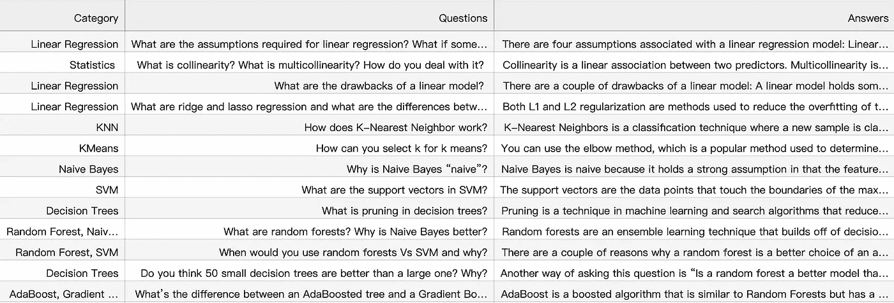

数据集看起来像什么

首先，让我们看看数据集是什么样子的。

它有三列:

*   种类
*   问题
*   答案

在类别方面，我**手动**浏览每个问题，并将其归类为 EDA、方法论、统计学或模型指定类型。然而，在项目的后期，我将进一步简化该类别，仅分为 4 个主要类型，即 **EDA** 、**方法论**、**统计**和**模型**。

为了清理问题和答案列，我使用了 NLTK。清洗步骤包括:

*   降低外壳
*   替换特殊字符
*   单词标记化
*   删除停用词
*   WordNet 词汇化

关于去掉停用词这一步，我没有用 NLTK 库提供的，因为我觉得词表不够长。所以我在下面 Github repo 的帮助下，自己创建了一个停用词列表:

<https://github.com/first20hours/google-10000-english>  

基本上，这个 repo 包含一个按频率排列的 10，000 个最常见英语单词的列表，这是通过对 Google 的万亿单词语料库进行 n-gram 频率分析确定的。我用其中的前 500 个词来建立我的停用词列表。

此外，WordNet Lemmatizer 用于将单词链接回其语义公共基础形式。

```
# WordNet Examples: 
#> kites ---> kite#> babies ---> baby#> dogs ---> dog#> flying ---> flying#> smiling ---> smiling#> feet ---> foot
```

<https://gaurav5430.medium.com/using-nltk-for-lemmatizing-sentences-c1bfff963258>  

最后，我们可以将上述所有清理步骤集成到一个名为 **nlp_process** 的清理函数中:

# NLP 第二部分:数据可视化

在数据可视化方面，我使用了 word clouds 来演示我的发现。

单词云的想法是找到面试问题和答案中最常见的 n-gram 单词。对于 EDA、方法论、统计学和模型中的每一个类别，我都制作了一对单词云图来进行比较。有趣的是，我们可以看到最常被问到和回答的单词是什么。

对于双字母词云，我首先使用**计数矢量器**为双字母词生成频率字典，并使用**generate _ from _ frequency**进行绘图。您可以按如下方式查看详细的代码和图形:

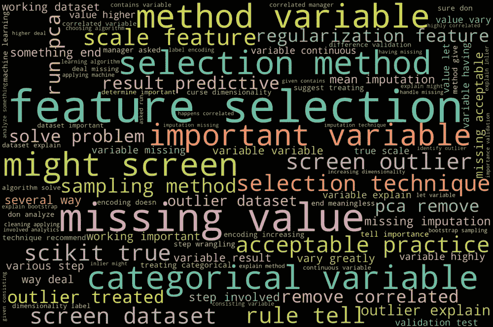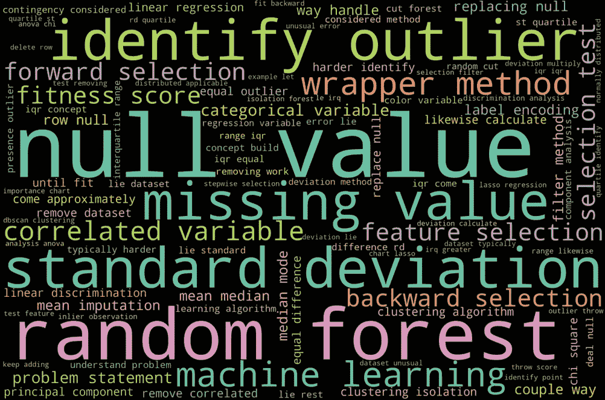

EDA-问题与答案

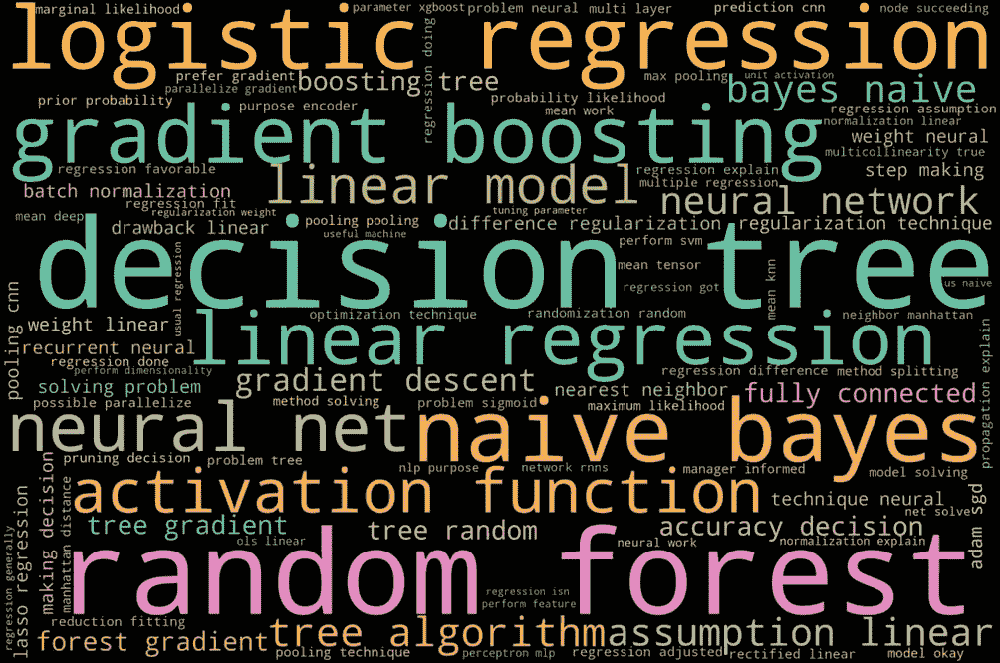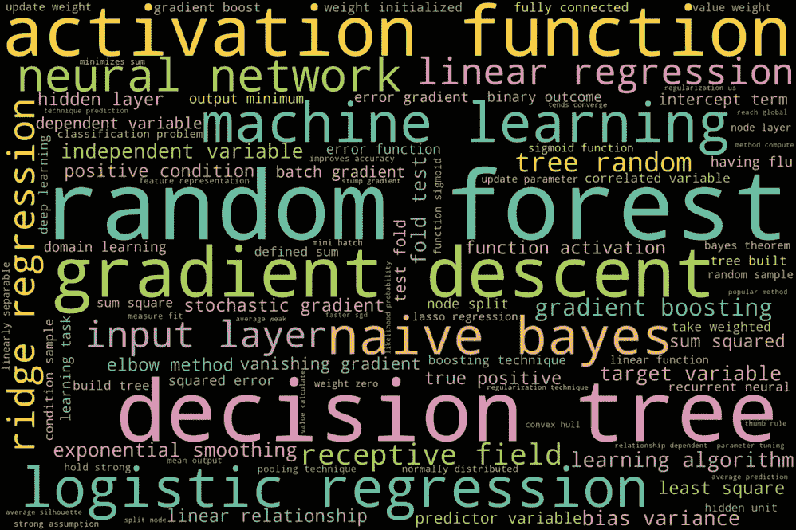

方法论-问题与答案

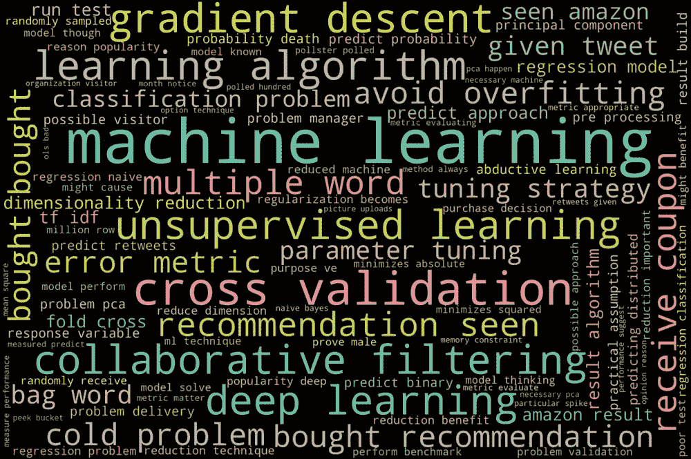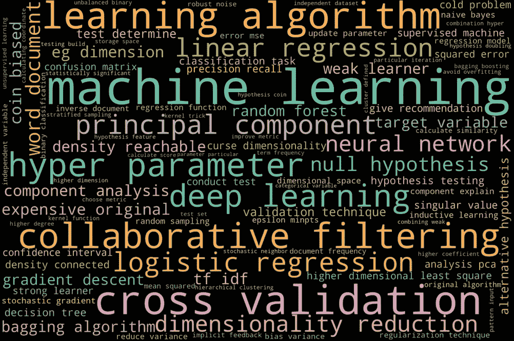

模型-问题与答案

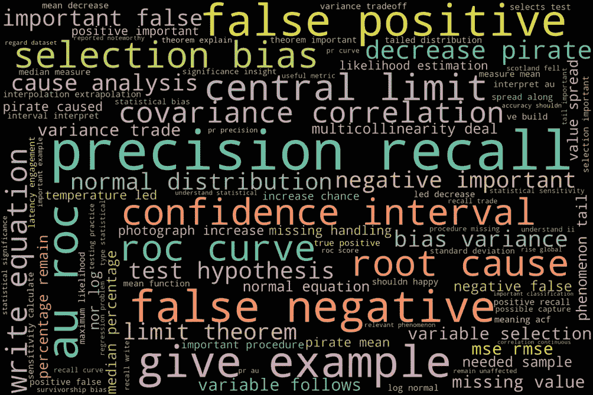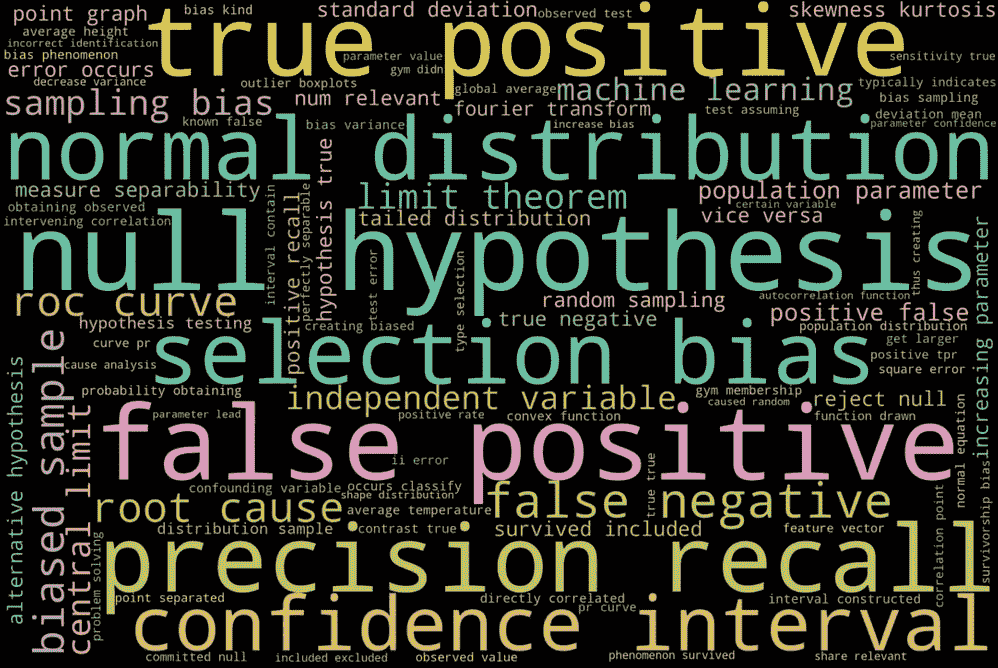

统计-问题与答案

# NLP 第三部分:数据建模

最后，由于我们已经完成了数据清理和将文本矢量化为字数，我认为我们可以继续构建数据科学面试问题分类器，作为这个 NLP 项目的结论。

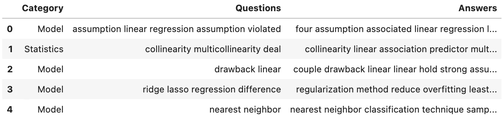

处理后的数据集现在是什么样子

目前，经过清理和重新分类的数据集看起来如上图所示。而且我们只会使用**问题**列来预测**类别**。我使用 CountVectorizer 将文本转换成数字特征。(TF-IDF 矢量器也可以！)

到目前为止，我们已经使用 **CountVectorizer** 成功地将问题列中的文本转换为字数向量。还有一个可选步骤，可以通过执行**卡方**测试来帮助我们降低单词特征的维数。

> 将每个类别视为二进制(例如，“EDA”类别对于 EDA 问题为 1，对于其他问题为 0)。
> 
> 执行[卡方测试](https://en.wikipedia.org/wiki/Chi-squared_test)以确定特征和二元目标是否独立。
> 
> 仅保留卡方检验中具有特定 p 值的要素。

我从这篇惊人的文章中学到了上面的方法:

</text-classification-with-nlp-tf-idf-vs-word2vec-vs-bert-41ff868d1794>  

通过遵循精确的卡方检验**特征选择**步骤，以下是各类面试问题的结果:

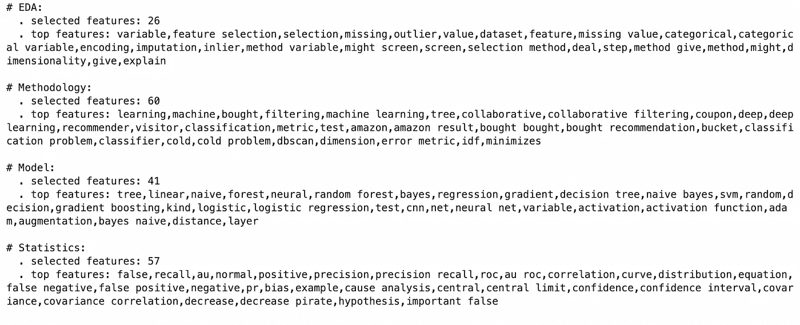

因此，现在我们可以继续使用所选的单词特征进行数据建模。

我选择的 ML 模型包括:

*   多项式朴素贝叶斯分类器
*   随机森林分类器
*   决策树分类器

我特别选择了**多项式** **朴素贝叶斯**分类器，因为它适用于具有离散特征的分类(例如文本分类的字数)。

我们可以检查结果如下:

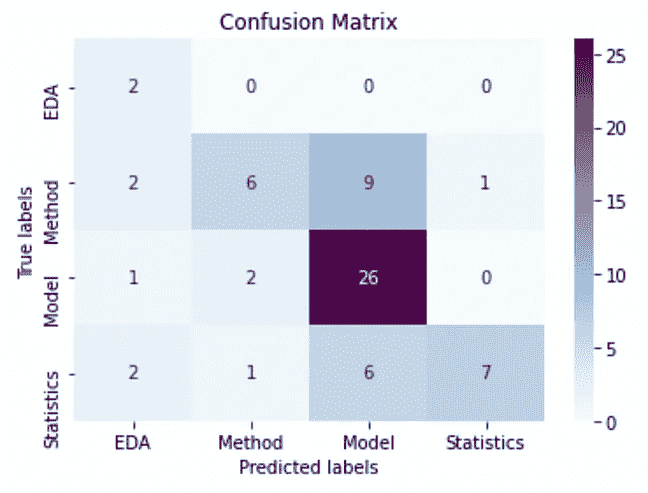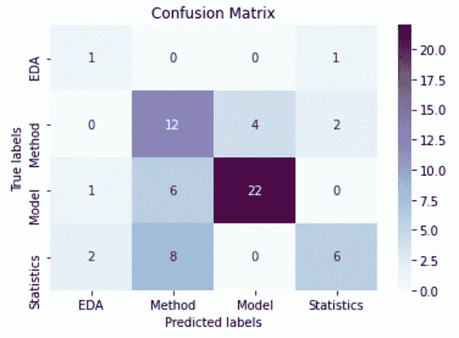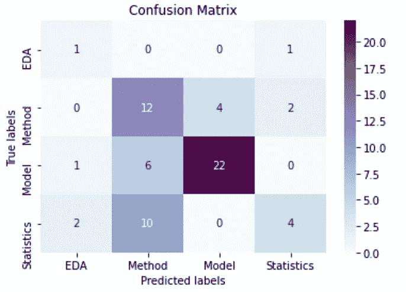

多项式树 vs 随机森林 vs 决策树

# 总结:

谢谢你的阅读。我相信将数据科学面试问题收集到一个数据集的目的是为了帮助每个人为面试做好准备，并提高学习效率！

我喜欢阅读每一个问题，并把它归入不同的类别。在准备数据集和撰写这篇文章的过程中，我也学到了很多。希望你也喜欢这篇文章！

此外，我还找到了另一篇关于用 LDA 进行 [**主题建模的文章，我认为它可能也适用于数据集。如果数据集大得多就更好了。**](/topic-modeling-and-latent-dirichlet-allocation-in-python-9bf156893c24)

无论如何，再次感谢你的时间！🥳

👉 [Github 回购](https://github.com/kyoto-cheng/NLP-on-Data-Science-Interviews-Questions)

# 阅读材料:

</topic-modeling-and-latent-dirichlet-allocation-in-python-9bf156893c24>  </text-classification-with-nlp-tf-idf-vs-word2vec-vs-bert-41ff868d1794>  

# 数据科学面试问题资源:

*   [*https://www . simpli learn . com/tutorials/data-science-tutorial/data-science-interview-questions*](https://www.simplilearn.com/tutorials/data-science-tutorial/data-science-interview-questions)
*   [*https://www . edureka . co/blog/interview-questions/data-science-interview-questions/*](https://www.edureka.co/blog/interview-questions/data-science-interview-questions/)
*   [*https://www . springboard . com/blog/data-science/data-science-interview-questions/*](https://www.springboard.com/blog/data-science/data-science-interview-questions/)
*   [*https://towards data science . com/over-100-data-scientist-interview-question-and-answers-c5a 66186769 a*](/over-100-data-scientist-interview-questions-and-answers-c5a66186769a)
*   [*https://towards data science . com/120-data-scientist-interview-question-and-answers-you-should-know-in-2021-B2 faf 7 de 8 f3e*](/120-data-scientist-interview-questions-and-answers-you-should-know-in-2021-b2faf7de8f3e)
*   【https://github.com/alexeygrigorev/data-science-interviews】T5[T6](https://github.com/alexeygrigorev/data-science-interviews)
*   [*https://github . com/koji no/120-数据-科学-面试-提问*](https://github.com/kojino/120-Data-Science-Interview-Questions)
*   [*https://github . com/khanhnamle 1994/cracking-the-data-science-interview*](https://github.com/khanhnamle1994/cracking-the-data-science-interview)