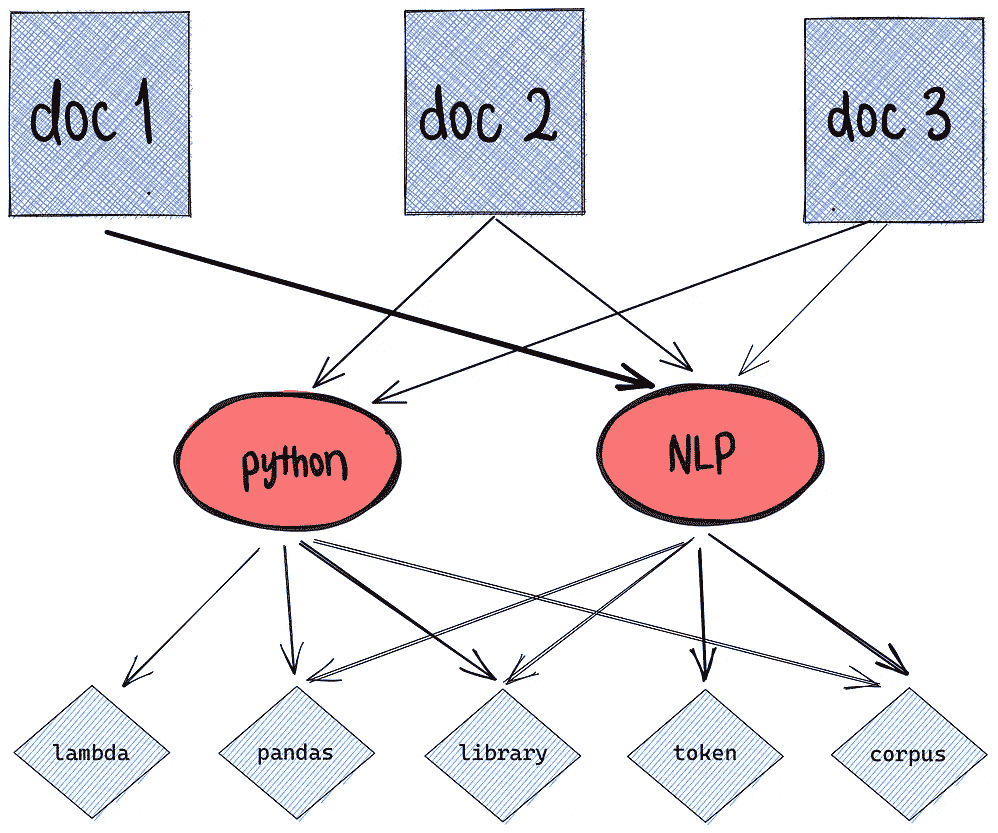
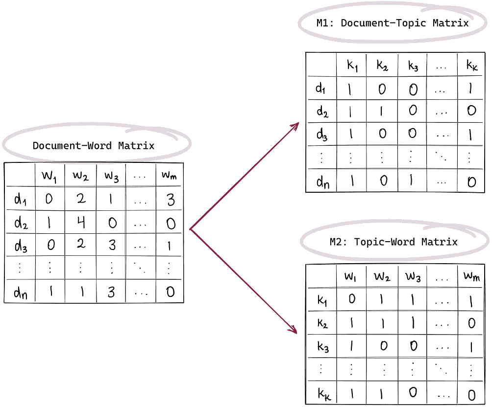
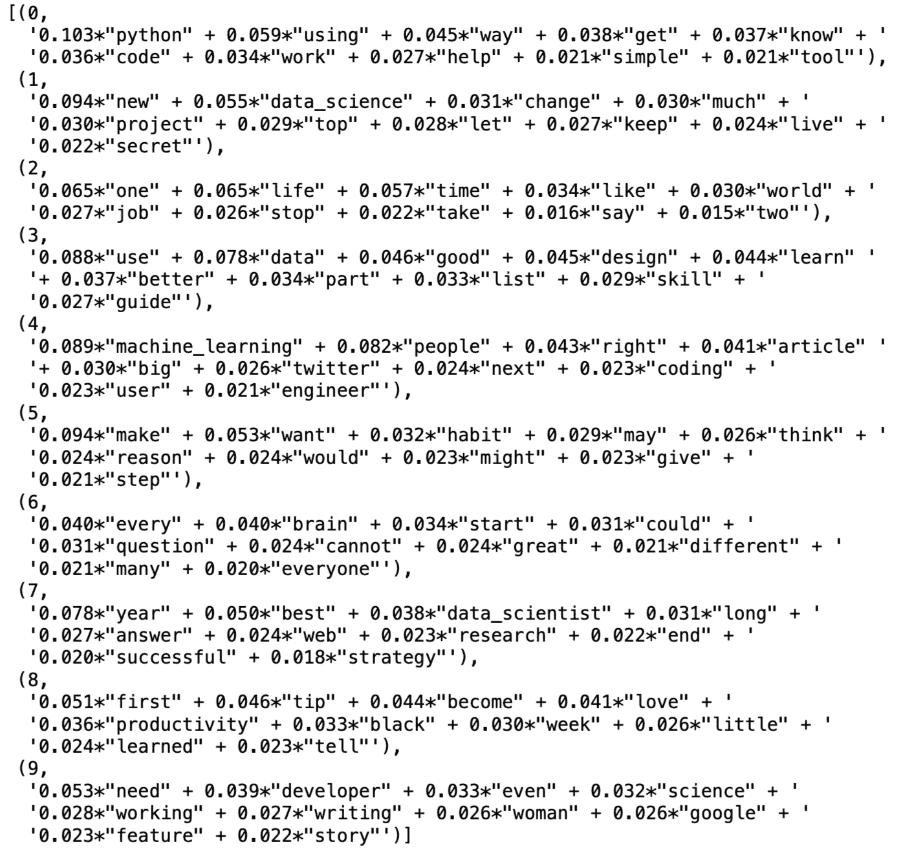
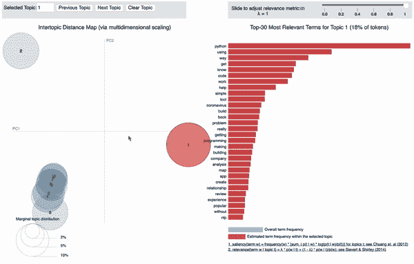
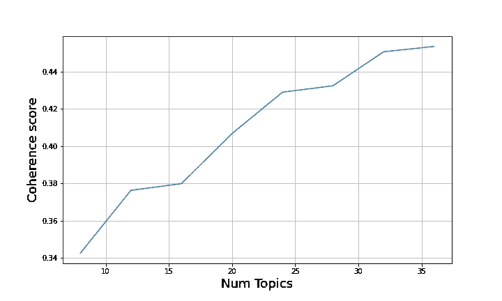
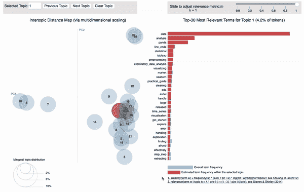
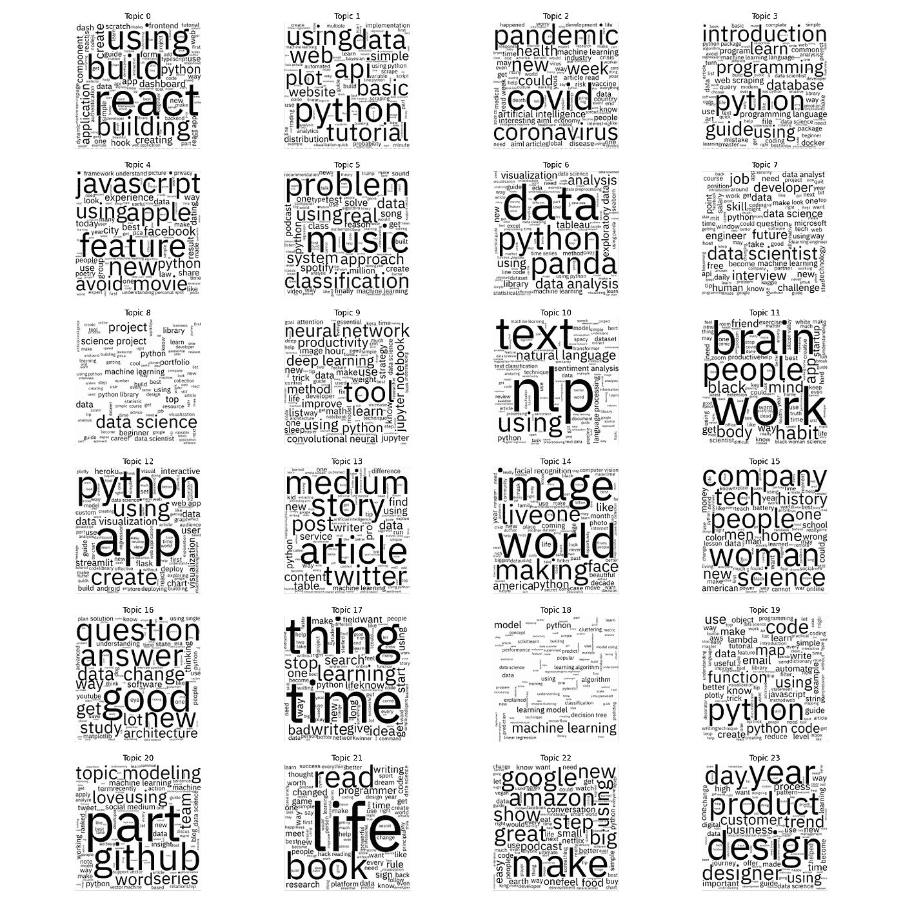

# 基于 Gensim 的自然语言处理预处理和潜在狄利克雷分配主题建模

> 原文：<https://towardsdatascience.com/nlp-preprocessing-and-latent-dirichlet-allocation-lda-topic-modeling-with-gensim-713d516c6c7d?source=collection_archive---------5----------------------->

## 消化摘要:用主题建模对我的兴趣进行逆向工程(第 2 部分)

# 激励主题建模

在我的上一篇文章中，我介绍了如何从电子邮件简讯中提取元数据。具体来说，我演示了如何使用 Gmail API 为我的 Medium Daily Digest 时事通讯中的每篇建议文章收集标题、副标题、作者、出版物和会议记录(估计阅读时间中的文章长度)。有了这些数据，我的目标是调查:Medium 的推荐引擎是如何如此了解我的阅读兴趣的，2)我的兴趣是如何随着时间的推移而演变的。

主题建模是一种无监督的 NLP 技术，用于从形成文本语料库的文档集合中识别单词的重复模式。它对于发现文档集合中的模式、组织大块文本数据、从非结构化文本中检索信息等非常有用。在其最强大的形式中，它可以用于通过更多与用户行为相关的信号来提升推荐引擎，还可以用于深入了解推荐系统的内部工作方式，这正是我们将通过本文尝试实现的目标。

那么它是如何工作的呢？通过检测词频和词与词之间的距离等模式，主题模型根据最常出现的词和表达方式对相似的文档进行聚类。有了这些信息，你可以很快推断出哪些文本与你感兴趣的主题相关。

主题可以被定义为“语料库中同现术语的重复模式”。一个好的主题模型可能会推断出“健康”、“医生”、“病人”、“医院”这些词都属于“医疗保健”的范畴。像“神经网络”、“反向传播”、“纪元”和“损失”这样的词可以被指定到“深度学习”主题箱中。然而，重要的是要注意，由于主题建模是一种无监督的方法，该模型可以学习某些单词彼此相关联，但是它没有在标记的数据上被训练来学习“健康”、“医生”、“病人”、“医院”作为已知类别与“医疗保健”相关联。相反，它取决于用户，要么从相似文档的未标记分组中获得洞察力，要么在包含分类主题标签的文本上训练主题分类模型，如果需要这些标签作为输出的话。

有许多技术方法可以用来执行主题建模。其中一些包括潜在狄利克雷分配(LDA)、文本排名、潜在语义分析(LSA)、非负矩阵分解(NMF)、弹球分配模型(PAM)等。在本文中，我们将着重于实现潜在的狄利克雷分配，这是最常见的方法。

# 潜在狄利克雷分配综述

LDA 是一种使用变分例外最大化(VEM)算法开发的矩阵分解技术。LDA 建立在这样一个前提之上，即每个文档可以用主题的概率分布来描述，每个主题可以用词的概率分布来描述。这可以让我们对主题之间的联系有一个更清晰的认识。



作者使用 [excalidraw](https://excalidraw.com) 创建的图表

在向量空间中，任何语料库或文档集合都可以表示为由 N 个文档乘 M 个单词组成的文档-单词矩阵。该矩阵中每个单元的值表示文档 ***D_i*** 中单词 ***W_j*** 的频率。LDA 算法通过将该文档-单词矩阵转换成两个低维矩阵，即分别代表文档-主题和主题-单词矩阵的 M1 和 M2，来训练主题模型。如果你对 LDA 在数学层面上的工作方式有所了解——并且认真地不要强调这一点，因为除非你是一名研究人员或对计算机科学理论感兴趣，否则我们可以导入一个方便的 Python 包，创建一个 LDA 对象，然后就此结束——试着理解 LDA 依靠贝叶斯理论和两个关键的概率计算来更新属于主题*的给定单词 ***w*** 的概率:*

*   ****p(话题 t|文档 d)****—**文档 ***d*** 中分配给话题*的单词比例***
*   ******p(word w | topic t)***—捕获有多少文档因为 word ***w*** 而在 topic*中****

# ***数据刷新程序***

***从本系列的第 1 部分，我们能够获得下面的数据集。删除重复项后，我们剩下 7.1k 行。查看下面嵌入的数据面板！***

***在我们开始任何主题建模之前，让我们确保安装并导入我们将需要的所有库。***

```
***# Essentials
import base64
import re
from tqdm import tqdm
import numpy as np
import pandas as pd
import matplotlib.pyplot as plt
import datapane as dp
dp.login(token='INSERT_TOKEN_HERE')# Gensim and LDA
import gensim
import gensim.corpora as corpora
from gensim.utils import simple_preprocess
from gensim.models import CoherenceModel
from gensim.parsing.preprocessing import STOPWORDS
import pyLDAvis
import pyLDAvis.gensim  # don't skip this# NLP stuff
import contractions
import demoji
import string
import nltk
from nltk.stem import WordNetLemmatizer, SnowballStemmer
from nltk.stem.porter import *
from nltk.corpus import stopwords
stop_words = stopwords.words('english')
nltk.download('wordnet')
import spacy# Plotting tools
from bokeh.plotting import figure, output_file, show
from bokeh.models import Label
from bokeh.io import output_notebook
import matplotlib.colors as mcolors
import matplotlib.pyplot as plt
%matplotlib inline# Miscellaneous
from sklearn.manifold import TSNE
from pprint import pprint***
```

# ***自然语言处理预处理***

***任何 NLP 相关项目中最关键的步骤之一是对所有文档进行列式预处理。虽然有一些标准的清理方法，一般来说，可以适用于任何语料库，但也有相当数量的直觉驱动的决定，我们必须做出。例如，表情符号有意义吗？停用词呢？数字应该保持原样、转换成文本还是完全删除？在所有文档中出现超过 80%的单词应该被忽略还是被调查？同一个词根的变体应该词干化还是词条化？***

***上面的函数将 pandas series 对象作为输入，并应用 lambda 函数，这些函数将文本转换为小写，删除表情符号，扩展缩写，删除标点符号，删除停用词，执行词汇化，并删除太短的单词(长度小于 3 个字符)。***

## ***停用词删除***

***当谈到停用词删除时，许多人认为这是一个实用的预处理步骤，总是利大于弊。然而，我强烈建议您实际打印出您决定使用的停用词列表(*注意:我使用 nltk . corpus . stop words . words(' English ')set*)，并根据上下文进行调整以优化您的语料库。一个常用的例子是“not ”,这个词在删除前需要仔细斟酌。当文本数据源包含来自用户的基于意见的评论或其他详细描述时，删除“not”会混淆数据中的主要信号来源。在这里，我们只是在看中型文章的标题和副标题，所以无论我们决定保留“不”还是放弃它都没有太大关系，但我将在原则上保留它。***

## **词汇化与词干化**

**对于那些不熟悉词干化和词干化的人，您可以将词干化视为将具有相同词根或词干但具有不同词形变化或词义派生词的单词组合在一起的过程——第三人称的单词变为第一人称，过去时态和将来时态的动词变为现在时态。词干提取是通过去除后缀或前缀将单词的词形变化减少到其词根形式的过程。与词干化不同，词汇化确保词根或词汇是属于英语的有效单词。例如，*跑*、*跑、*和*跑*都将映射到词条*跑*。为了说明词汇化和词干化的区别，单词 *intelligence* 和 *intelligent* 的词干是 *intellig* ，实际上并不是一个有效的英语单词。**

## **二元模型和三元模型**

**一个 **n-gram** 是来自给定文本或文档样本的 n 个项目的连续序列。**二元模型**是在文档中频繁出现的两个词(例如*数据 _ 科学*、*机器 _ 学习*、*情感 _ 分析*)。**三元组**是 3 个频繁出现的词(例如*面向数据科学*、*自然语言处理*、*探索性数据分析*)**

**Gensim 的`Phrases`模型可以构建和实现二元模型、三元模型、四元模型等等。`Phrases`的两个重要参数是`min_count`和`threshold`。这些参数的值越高，单词就越难组合成二元模型和三元模型。**

# **用 Gensim 进行主题建模**

**`gensim` Python 库使得创建 LDA 主题模型简单得可笑。我们唯一要做的准备工作是创建一个字典和语料库。**

**字典是单词 id 到单词的映射。为了创建我们的字典，我们可以创建一个内置的`gensim.corpora.Dictionary`对象。从那里开始，`filter_extremes()`方法是必不可少的，以确保我们在字典中获得期望的频率和表征。**

```
**id2word = corpora.Dictionary(data_preprocessed)
id2word.filter_extremes(no_below=15, no_above=0.4, keep_n=80000)**
```

**`filter_extremes()`方法有 3 个参数。让我们来分解一下这些是什么意思:**

*   **过滤掉出现在少于 15 个文档中的令牌**
*   **过滤掉出现在超过 40%的文档中的标记**
*   **完成上述两个步骤后，只保留前 80，000 个最常用的令牌**

**语料库本质上是词 id 到词频的映射。对于每个文档，创建一个单词包表示:**

```
**corpus = [id2word.doc2bow(text) for text in texts]**
```

**使用字典和语料库，我们可以获得一个样本文档的人类可读的词频映射:**

```
**[[('better', 1),
  ('creating', 1),
  ('data_visualization', 1),
  ('design', 1),
  ('principle', 1),
  ('towards', 1)]]**
```

**非常漂亮…还要注意我们的一个二元模型( *data_visualization* )刚刚出现了！**

## **潜在狄利克雷分配**

**信不信由你，构建 LDA 模型的代码是一行程序。**

```
**lda_model = gensim.models.ldamodel.LdaModel(corpus=corpus,
                                           id2word=id2word,
                                           num_topics=10, 
                                           random_state=100,
                                           update_every=1,
                                           chunksize=100,
                                           passes=10,
                                           alpha='auto',
                                           per_word_topics=True)**
```

**我们已经讨论了语料库和字典参数。我们最初会将`num_topics`固定为 10。`random_state`非常简单明了，不会对模型产生巨大影响；它只是用来获得不随笔记本的每次执行而改变的结果。`update_every`决定模型参数应该多久更新一次。`chunksize`是每个训练组块中要使用的文档数。`passes`是培训通过的总次数。最后一个参数`per_word_topics`，当设置为 True 时，计算主题列表，按照每个单词最可能的主题的降序排序，以及它们的 phi 值乘以特征长度(即字数)。**

**现在我们已经有了“训练过的”主题模型(*记住:这是一种无监督的方法…把它想象成更像是聚类而不是别的)*，让我们打印出 10 个主题中的前 10 个关键词。**

****

**作者图片**

**有意思，所以 python 显然是这个语料库中的一个流行关键词，这是理所当然的！看起来我们有一个关于学习好设计的话题，一个关于涉及 twitter 数据的机器学习文章(也许？)，如何在研究中取得成功，生产力技巧，开发者故事等。这是一个良好的开端，但它还没有给我们提供一个令人满意的整体图景。**

**你可能会问的下一个问题是，我们如何知道我们的模型实际上有多好，仅仅从构建它的那一行代码中？**

## **评估指标**

**在主题建模领域，通常使用两个评估指标:**困惑度**和**连贯性**。**

**[Shashank Kapadia](https://medium.com/u/cc7314ace45c?source=post_page-----713d516c6c7d--------------------------------) 在他的文章《评估主题模型:潜在的狄利克雷分配(LDA)》中比我更好地解释了这些指标。他将它们定义如下:**

> **困惑度表示一个模型对它以前没有见过的新数据有多惊讶，它是以一个被拒绝的测试集的归一化对数似然性来衡量的。**
> 
> **连贯性衡量主题中高分词汇之间的语义相似程度。如果你感兴趣的话， **c_v** 测量是基于一个滑动窗口，顶部单词的一组分割和一个间接确认测量，该测量使用标准化的逐点互信息(NPMI)和余弦相似性。**

**要计算这些值，只需执行以下代码:**

**我们的标准 LDA 模型的初始混淆度和一致性分别为-6.68 和 0.4。展望未来，我们希望将困惑最小化，将连贯性最大化。**

## **皮尔戴维斯**

**现在你可能想知道，除了打印出关键词，或者，但愿不会，另一个单词云之外，我们如何可视化我们的主题。嗯，幸运的是，我们得到了皮勒戴维斯的礼物！pyLDAvis 是一个用于交互式主题模型可视化的 Python 库。在一小段代码中，我们可以获得这些交互式子图，这些子图描述了 2D 平面上的主题之间的距离以及该主题中前 30 个最相关和最突出的术语(这两个指标都在下面可视化的右下角进行了数学定义)。**

****

**作者拍摄的交互式可视化的屏幕记录**

**从上面的 GIF 图中可以明显看出，主题 1 和主题 2 彼此之间的距离最大，与其余 8 个主题之间的距离也最大，这 8 个主题基本上彼此相似。虽然这是一个超级漂亮的可视化方法，有助于了解哪些主题关系最密切，哪些单词携带最强的信号，但当前的模型似乎不是很智能。换句话说，悬停在每个主题上并不能完全帮助我们理解这个语料库中的所有主题。这表明可能是时候回到绘图板，尝试更复杂的 LDA 模型了。**

# **LDA Mallet 模型**

**MALLET 由 Andrew McCallum 编写，是一个基于 Java 的包，用于统计自然语言处理、文档分类、聚类、主题建模、信息提取和其他对文本的机器学习应用。MALLET 主题建模工具包包含潜在的 Dirichlet 分配的高效的、基于采样的实现。主要的优化差异是 Gensim(vanilla)LDA 使用变分贝叶斯采样方法，该方法比 Mallet 的 Gibbs 采样更快，但精度较低。**

**在我们开始使用 Gensim for LDA 之前，我们必须在我们的系统上下载 mallet-2.0.8.zip 包并将其解压缩。这个包的下载和更详细的说明可以在[这里](http://mallet.cs.umass.edu/download.php)找到。安装并解压缩后，将`mallet_path`变量设置为您的下载当前驻留在本地机器上的文件路径。一旦完成，我们就准备好建立我们的 LDA Mallet 模型了！**

**Python 为潜在的狄利克雷分配(LDA)提供了 Gensim 包装器。该包装器的语法是`gensim.models.wrappers.LdaMallet`。该模块允许从训练语料库进行 LDA 模型估计，以及推断新的、看不见的文档上的主题分布。**

```
**mallet_path = '~/Downloads/mallet-2.0.8/bin/mallet' # update this path
ldamallet = gensim.models.wrappers.LdaMallet(mallet_path, 
                                             corpus=corpus, 
                                             num_topics=10,
                                             id2word=id2word,
                                             random_seed=42,
                                             workers=6)**
```

**最初，我们可以将主题的数量设置为 10，以获得 Gensim 的 LDA 与 LDA Mallet 的比较。从我们的 LdaMallet 模型中不可能得到一个困惑分数，但是可以得到一个连贯分数。下面是预览主题和计算连贯性分数的一些代码:**

**接下来，让我们以编程方式确定我们将文档划分成的主题的最佳数量。为了辨别这个数字，我们将希望用越来越多的主题来测试几个模型，然后寻找产生足够高的一致性值的最少数量的主题。**

****

**作者制作的 Matplotlib 图形**

**从上面的图表中，我们可以看到我们的一致性分数上升到大约 0.38，然后到大约 0.43，然后到大约 0.45。由用户选择一些他们认为合适的主题。我将继续选择第二个“拐点”,即 x = 24 个主题，这对应于大约 0.43 的一致性分数。**

**我们可以像以前一样预览我们的主题，但我们也可以直接切入正题，制作一个 pyLDAvis。为了实现这一点，我们实际上还需要执行一个额外的步骤:用 Mallet 模型的学习参数创建一个常规的 LDA 模型，这样我们就可以将常规的 gensim LDA 对象传递给 pyLDAvis。这可以通过一个简单的函数来完成，如果你愿意的话，这个函数包含在完整的笔记本中。**

****

**作者拍摄的交互式可视化屏幕记录**

**上面的主题间距离图比我们最初的模型更有趣！我们可以看到更多的话题分散在二维平面上。特别是，有 2-3 组主题值得分析。不考虑可视化中随机分配的主题标签，左下象限中的 3 个主题似乎主要由属于 Python 教程、指南和简介的中型文章组成。最右边的两个主题的特点是它们的关键词技术含量较低，似乎更适合商业、营销、设计趋势和技能。最右下方的主题似乎与构建可视化和以数据为中心的 web 应用程序有关。**

**从这里我们可以找到每篇文章标题和副标题的最显性主题，也可以得到文档被显性主题表现的程度。这些新属性包含在下面的数据表中:**

**我们还可以通过获取每个主题的文档数量、关键字和最具代表性的文档来更好地理解每个主题。**

**上面提供了将主题信息的数据帧与这些关键属性进行辩论的代码。请注意，不断重置索引以确保各列根据适当的主题编号对齐是很重要的。这里可以利用熊猫数据帧的`merge`方法。**

**从上面包含描述每个主题的特性的表中，我们可以了解到主题 0 包含了最多的文章。包含第二大数量文档的主题是不幸的，但也是非常直观的，这些文章谈论“疫情”、“covid”和/或“冠状病毒”“Representative_Doc”列应该有所保留，但是在给定一些主题外领域上下文的情况下，了解标题字符串如何包含相关主题关键字的子集是很有用的。**

## **可视化的视觉:局限性的讨论**

**在项目的这一点上，我们已经达到了一个足够功能的主题模型，它利用强大的信号源以一种有意义的方式聚集或分离我们的文档，我们已经通过检查关键字、主题间距离和代表性文档验证了这一点。求助于特定主题的文字云作为进一步总结每个主题的手段可能会变得非常诱人，但我想说明的是，需要更好的可视化技术。**

****

**作者制作的 Matplotlib 子图图形**

**…如果出于某种原因，你仍然倾向于单词云，也许我们至少可以达成共识，随着主题数量的增加，视觉检查单词云变得越来越难以承受。所以如果你准备好从 wordclouds 毕业，那就拉着我的手跟我走吧。让我们找到一个更好的可视化技术。**

## **降维**

**由 Laurens van der Maaten 开发的 t-分布式随机邻居嵌入(t-SNE)是一种非线性降维技术，特别适合于高维数据集的可视化。它广泛应用于图像处理、自然语言处理、基因组数据和语音处理。**

**那么它是如何工作的，我们为什么要使用它呢？简而言之，根据非常有用的 [DataCamp 介绍](https://www.datacamp.com/community/tutorials/introduction-t-sne)，t-SNE 最小化了两种分布之间的差异:一种分布测量输入对象的成对相似性，另一种分布测量嵌入中相应低维点的成对相似性。以这种方式，t-SNE 将多维数据映射到较低维度的空间，并试图通过基于具有多个特征的数据点的相似性识别观察到的聚类来发现数据中的模式。**

**使用我们的 24 主题 Mallet 模型，我们可以看到主题是如何很好地聚集在二维平面上的。此外，代表单个文章的每个圆圈的大小由主题表示百分比编码。因此，较大的圆圈与它们所属的主题关联更强——这些较大圆圈的热点或集群可以容易地被识别为可能共享内聚主题的相关文章。我们还可以将鼠标悬停在每个圆圈上，以查看文章标题、副标题和主题表示百分比。**

**这种方法的一个缺点是，在执行该过程之后，输入特征不再是可识别的。因此，它主要是一种数据探索和可视化技术。此外，如果不花大量时间在圆圈上徘徊，或者对主题编号到关键字的映射有内在的理解，很难从这个 t-SNE 散点图中获得对我们主题的一目了然的理解。**

# **结论**

**虽然我们在理解我建议的媒体文章涵盖的一般主题方面取得了进展，但我最初的研究问题是探索我的阅读兴趣是如何随着时间的推移而演变的。我将在这篇文章的结尾声明，我对实现一个产生时态洞察力的主题模型的追求仍然是不完整的！在我的下一篇文章中，我将介绍 BERTopic，并与大家分享我的阅读兴趣和阅读行为在过去一两年中如何经历了一些有趣的转变。**

**在那之前，快乐的阅读、学习和探索！我希望通过这篇全面的教程，你对 Gensim 的主题建模有所了解。所有代码都可以在下面链接的 GitHub 资源库中找到。**

**[](https://github.com/sejaldua/digesting-the-digest) [## GitHub-sejaldua/digesting-the-digest:使用 Gmail API 对我推荐的媒体进行主题建模…

### 使用 Gmail API 对我推荐的媒体进行主题建模

github.com](https://github.com/sejaldua/digesting-the-digest) 

# 参考

[](/latent-dirichlet-allocation-lda-9d1cd064ffa2) [## 潜在狄利克雷分配

### 一种用于发现抽象主题的统计模型，又称主题建模。

towardsdatascience.com](/latent-dirichlet-allocation-lda-9d1cd064ffa2) [](https://www.machinelearningplus.com/nlp/topic-modeling-gensim-python/) [## 用 Gensim 在 Python 中进行主题建模

### 主题建模是一种从大量文本中理解和提取隐藏主题的技术。潜在的狄利克雷…

www.machinelearningplus.com](https://www.machinelearningplus.com/nlp/topic-modeling-gensim-python/) [](http://mallet.cs.umass.edu) [## MALLET 主页

### MALLET 是一个基于 Java 的软件包，用于统计自然语言处理、文档分类、聚类、主题…

mallet.cs.umass.edu](http://mallet.cs.umass.edu) [](/basic-nlp-on-the-texts-of-harry-potter-topic-modeling-with-latent-dirichlet-allocation-f3c00f77b0f5) [## 《哈利·波特》文本的解读

### 基于潜在狄利克雷分配的主题建模

towardsdatascience.com](/basic-nlp-on-the-texts-of-harry-potter-topic-modeling-with-latent-dirichlet-allocation-f3c00f77b0f5) [](/mapping-the-tech-world-with-t-sne-7be8e1703137) [## 用 t-SNE 描绘科技世界

### 我们用 t-SNE 算法分析了 20 万篇科技新闻

towardsdatascience.com](/mapping-the-tech-world-with-t-sne-7be8e1703137)**