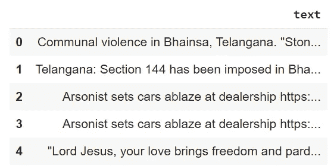
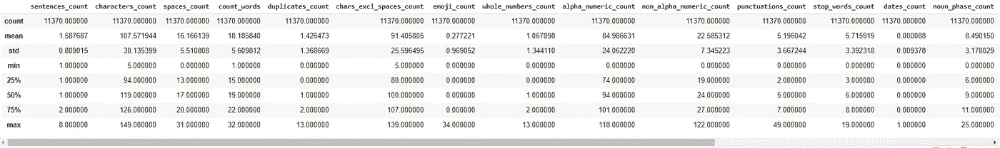
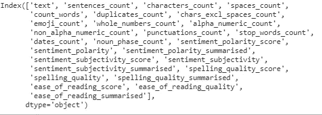
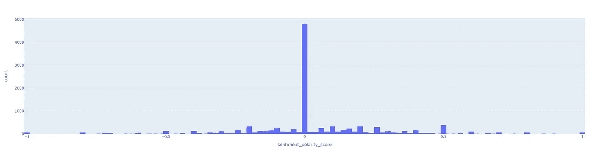
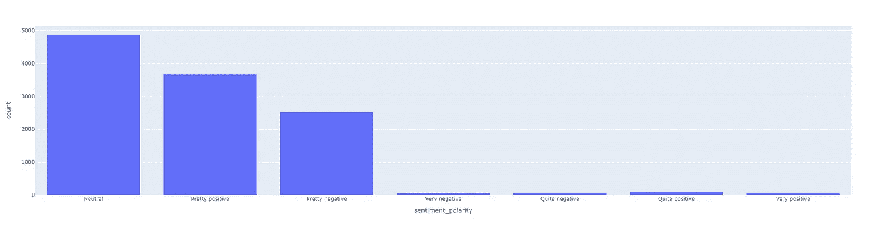
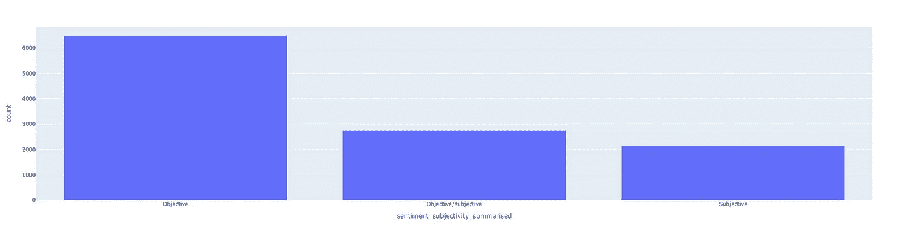
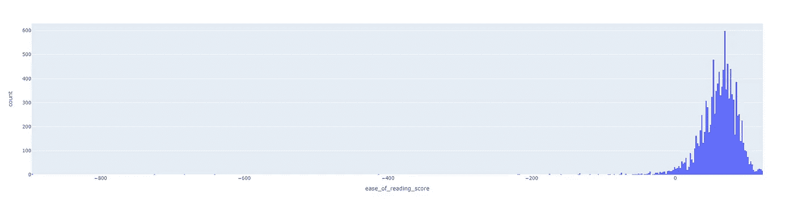
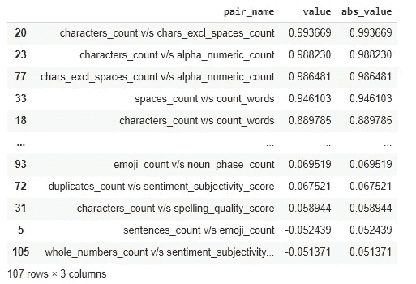
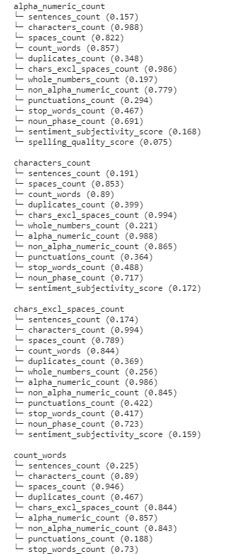

# NLP 探查器:用一个或多个文本列分析数据集

> 原文：<https://towardsdatascience.com/nlp-profiler-profiling-datasets-with-one-or-more-text-columns-9b791193db89?source=collection_archive---------28----------------------->

## 使用 NLP Profiler 从文本数据集创建高级洞察


沙哈达特·拉赫曼在 [Unsplash](https://unsplash.com?utm_source=medium&utm_medium=referral) 上拍摄的照片

您是否曾经处理过大型文本数据集，如果有，那么您一定知道分析文本数据有多困难，您需要使用自然语言处理的不同功能来了解您正在处理的数据。但是如果我告诉你，现在不需要担心为了分析文本数据而执行一些操作，那就太好了。

让我们从 NLP Profiler 开始，它是一个 python 工具/包/模块，用于创建数据摘要，类似于使用 pandas 的 describe()函数为数据帧中的数字数据创建的摘要。它允许您创建文本数据集的配置文件，并分析文本数据的不同属性。它对您正在使用的数据产生高层次的洞察力。

在本文中，我将带您了解 NLP Profiler 的不同功能，并向您展示我们如何使用它。我们将使用 Google Collab 来解决这个问题。

# 安装 NLP 探查器

我们将通过下面给出的命令开始安装 NLP Profiler。因为我们使用 Google Collab，所以你需要复制这个命令并在你的 Collab 笔记本上运行它来安装 NLP profiler。

```
!pip install nlp_profiler
```

# 将 Collab 连接到 Kaggle

为了开始探索 NLP Profiler，让我们从连接 collab 笔记本和 Kaggle 开始，这很重要，因为我们将直接从 Kaggle 加载数据集到 collab 笔记本。按照以下步骤设置 collab 笔记本。

1.  **上传 Kaggle JSON 密钥**

为了将我们的 Kaggle 帐户连接到 collab，我们需要从 accounts 部分下载 Kaggle JSON 密钥，并通过运行下面给出的命令来上传它:

```
#Run this cell and select the kaggle.json file downloaded
from the Kaggle account settings page
from google.colab import files
files.upload()
```

2.**避免任何错误**

通过运行下面的命令，我们确保没有错误，我们的 Kaggle 帐户已连接。

```
# Let's make sure the kaggle.json file is present.
!ls -lha kaggle.json
# Next, install the Kaggle API client.
!pip install -q kaggle
# The Kaggle API client expects this file to be in ~/.kaggle,
# so move it there.
!mkdir -p ~/.kaggle
!cp kaggle.json ~/.kaggle/
# This permissions change avoids a warning on Kaggle tool startup.
!chmod 600 ~/.kaggle/kaggle.json
```

3.**下载数据集**

在本文中，我们将使用名为“灾难推特”的数据集，下面给出的命令将在 Kaggle 上搜索该数据集，我们将选择使用它们。

```
!kaggle datasets download -d vstepanenko/disaster-tweets
```

# 导入所需的库

我们现在将导入一些对本文有用的必需库。运行以下命令导入所需的依赖项。

```
import pandas as pd
import pandas_profiling as pp
from nlp_profiler.core import apply_text_profiling
```

# 准备数据集

现在，我们需要解压缩数据集，并为我们将要处理的列创建一个数据框架。

```
!unzip disaster-tweets.zipdf = pd.read_csv('tweets.csv')
text_nlp = pd.DataFrame(df, columns=['text'])
text_nlp.head()
```



数据集(来源:作者)

# 应用文本分析

在这一步中，我们将对文本数据应用文本分析，以提取有用的信息，如句子计数、单词计数、空格计数、表情计数等。

```
profile_data = apply_text_profiling(text_nlp, 'text')
```

之后，让我们调用 describe 函数来分析这个数据集的一些属性。

```
profile_data.describe()
```



统计属性(来源:作者)

```
profile_data.columns
```



分析中的列(来源:作者)

因此，在这里我们可以清楚地从文本数据中提取所有属性，在上面的图像中，您可以清楚地看到所有列，它们代表对数据集的不同属性的分析。

# 可视化文本属性

接下来，我们将可视化使用文本分析创建的配置文件数据中的一些属性。

1.  **情感极性得分**

```
fig = px.histogram(profile_data, x="sentiment_polarity_score")
fig.show()
```



SPE(来源:作者)

2.**感情极性**

```
fig = px.histogram(profile_data, x="sentiment_polarity")
fig.show()
```



感悟(来源:作者)

3.**感情主观性**

```
fig = px.histogram(profile_data, x="sentiment_subjectivity_summarised")
fig.show()
```



情感主观性(来源:作者)

4.**易读性**

```
fig = px.histogram(profile_data, x="ease_of_reading_score")
fig.show()
```



易于阅读(来源:作者)

# 一些其他属性

现在让我们看看其他一些属性。

1.  **寻找相关属性**

```
# Finding the most and least correlated feature pairs
def most_correlated_pairs(dataframe, threshold=0.05):
    corr_matrix = dataframe.corr()
    indexes = corr_matrix.columns
    pair_names = []
    values = []
    abs_values = []
    for row_index in indexes:
        for col_index in indexes:
            if str(row_index) != str(col_index):
                pair_name = f'{row_index} v/s {col_index}'
                alt_pair_name = f'{col_index} v/s {row_index}'
                if (pair_name not in pair_names) and (alt_pair_name not in pair_names):
                    pair_names.append(pair_name)
                    values.append(corr_matrix[row_index][col_index])
                    abs_values.append(abs(corr_matrix[row_index][col_index]))correlation_pairs = pd.DataFrame({
        'pair_name': pair_names,
        'value': values,
        'abs_value': abs_values
    }).sort_values(by='abs_value', ascending=False)
    return correlation_pairs[correlation_pairs.abs_value >= threshold]profiled_text_correalted_pairs_dataframe = most_correlated_pairs(profile_data, threshold=0.05)
profiled_text_correalted_pairs_dataframe
```



相关性(来源:作者)

同样，我们可以创建相关特征树。

2.**关联树**

```
# Correlated feature trees (groups)
def correlated_tree(dataframe, threshold=0.05):    
    corr_matrix = dataframe.corr()
    indexes = corr_matrix.columns
    nodes = {}
    for row_index in indexes:
        for col_index in indexes:
            value = corr_matrix[row_index][col_index]
            if (str(row_index) != str(col_index)) and (value > threshold):
                value_as_str = f'{col_index} ({str(abs(round(value, 3)))})'
                if row_index not in nodes:
                    nodes[row_index] = []nodes[row_index].append(value_as_str)

    return dict(sorted(nodes.items(), key=lambda item: item[0]))profiled_text_correalted_tree = correlated_tree(profile_data, threshold=0.07)
for each_node in profiled_text_correalted_tree:
    print(each_node)
    for each in profiled_text_correalted_tree[each_node]:
        print(f'└─ {each }')
    print()
```



相关树(来源:作者)

这就是你如何使用 NLP Profiler 轻松地探索文本数据集的不同属性。

继续尝试不同的文本数据集，如果你发现任何困难，你可以在回复部分发布。

这篇文章是与[皮尤什·英加尔](https://medium.com/u/40808d551f5a?source=post_page-----9b791193db89--------------------------------)合作的

# 在你走之前

***感谢*** *的阅读！如果你想与我取得联系，请随时通过 hmix13@gmail.com 联系我或我的* [***LinkedIn 个人资料***](http://www.linkedin.com/in/himanshusharmads) *。可以查看我的*[***Github***](https://github.com/hmix13)**简介针对不同的数据科学项目和包教程。另外，请随意浏览* [***我的简介***](https://medium.com/@hmix13) *，阅读我写过的与数据科学相关的不同文章。**