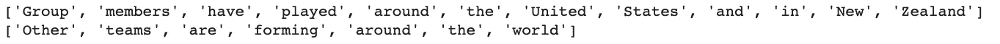
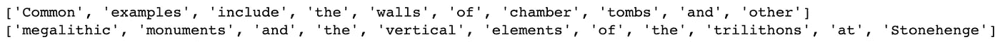
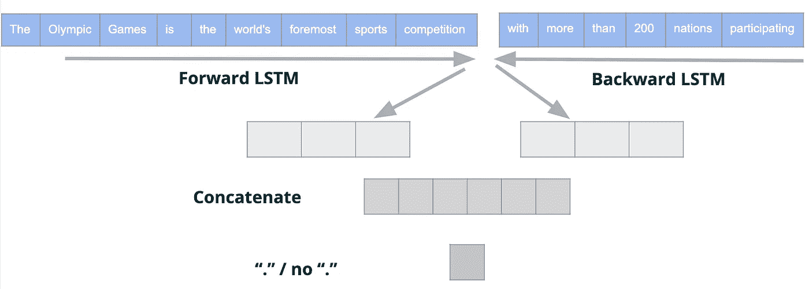
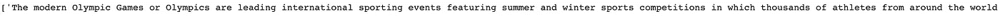
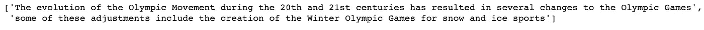

# 自然语言处理:将文本分割成句子

> 原文：<https://towardsdatascience.com/nlp-splitting-text-into-sentences-7bbce222ef17?source=collection_archive---------11----------------------->

## 将文本转换成句子的语言不可知模型

将文本数据拆分成句子可以被认为是一项简单的任务，可以用“.”将文本拆分成句子或'/n '个字符。然而，在自由文本数据中，这种模式是不一致的，作者可以在句子中间换行或使用“.”在错误的地方。例如，这种现象在医疗访问摘要文本和会话/消息文本中很常见。

为了克服这一点，为了开发一个可以在任何语言中使用的通用模型，我们将在本帖中分享一个深度学习模型，它可以决定两个句子是否需要合并。

首先，我们将按照所有常用字符来拆分文本。例如'/n '，然后给定两个句子，模型将决定它们是否必须合并。因此，这个模型将会给我们一个新的句子划分。

# 创建数据集

为了创建用于训练的数据集，考虑文章/案例/对话的列表，例如，来自维基百科的文章列表。我们将肯定对定义为一对应该分开的句子，并保留两个带有“.”的不同句子他们之间。否定对是应该合并的一对句子，认为是一个句子，没有“.”他们之间。我们将使用 *nltk.sent_tokenize* 函数创建正对，用“.”分割文本，这在大多数情况下是正确的，并且会让模型学习“.”的机制和作用性格。我们将通过在中间拆分句子来创建否定对，这意味着我们实际上不想拆分句子。我们使用*min _ sentence _ length _ for _ splitting*参数来定义我们想要为否定对拆分的最小句子长度(我们不想拆分太短的句子)。创建数据集的代码示例:

正对的例子:

负对的例子:

# 模型

我们训练了一个深度学习模型，它将这两个句子作为输入。对于第一句话，我们应用前向 LSTM 层，对于第二句话，我们应用后向 LSTM 层。我们使用一个前向层和一个后向层来预测我们是否应该有一个“.”在中间，所以我们期望第一句的向前传递嵌入第一句结尾的模式，第二句的向后传递嵌入第二句开头的模式。

然后我们连接两个嵌入来表示两个句子的结束和开始意义，以便预测它们是否应该被拆分(应该有一个'.'他们之间或者没有)。

模型架构

下面的代码准备了语料库并训练了一个标记器，该标记器用于将不同大小的句子转换成相同大小的序列。

X dataset 是一个 numpy 数组，大小为*[样本数，2，句子长度]，* y 是一个数组，其中 1-表示分裂的句子，0-表示合并的句子。

然后我们训练深度学习模型:

最后，我们想把我们的模型应用到新的看不见的文本上。我们使用*奥运会*维基百科页面，并从那里摘录句子。

下面的 transform 函数，得到一个分隔句子的列表，并返回合并后的句子作为一个新的文本分割成句子的列表。

例如，我们随机拆分句子，并期望模型将它们合并成一个句子:

输出是:

意味着模型正确地决定合并所有三个句子。

另一个例子，我们给了模型 2 分离的句子，我们希望它保持分离。

输出是:

这意味着模型正确地决定将这两个句子分开。

# 结论

上述模型可以用任何语言训练，只需要创建数据集。然后，训练该模型来决定是否需要将两个句子合并成一个句子或者保持为两个分开的句子。该模型可用于预测新句子对的拆分/合并，并可应用于任何由常用字符拆分成句子的文本，并提供句子的新划分。

我们在一个 SentenceSplitter 类中总结了上述所有代码:

尽情享受吧！