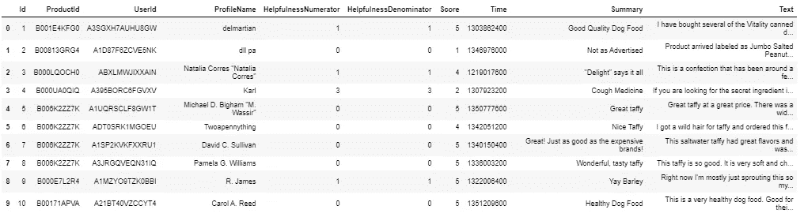
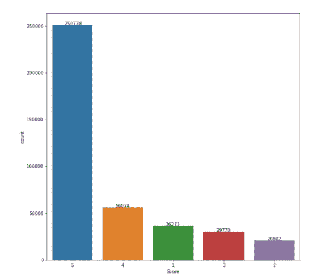
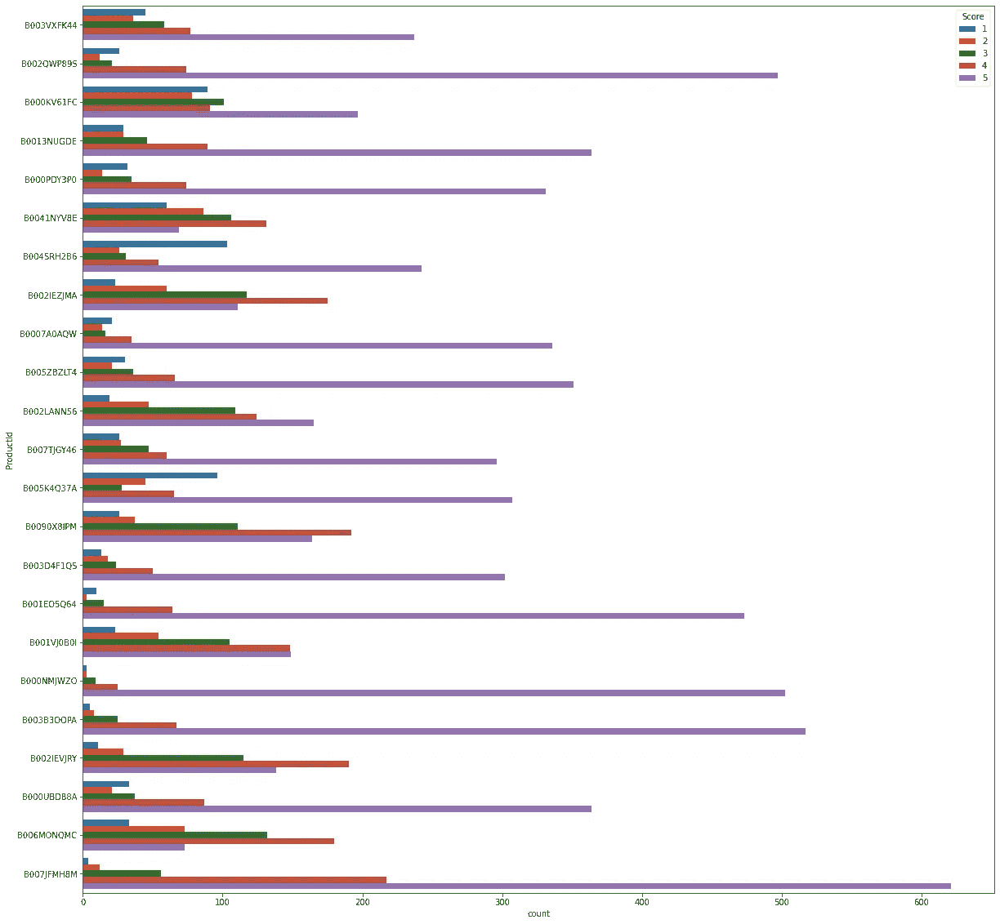
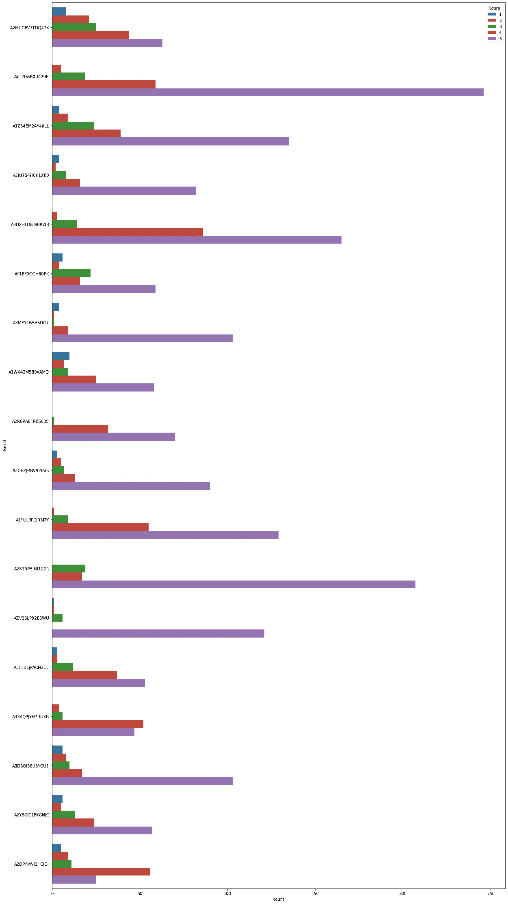
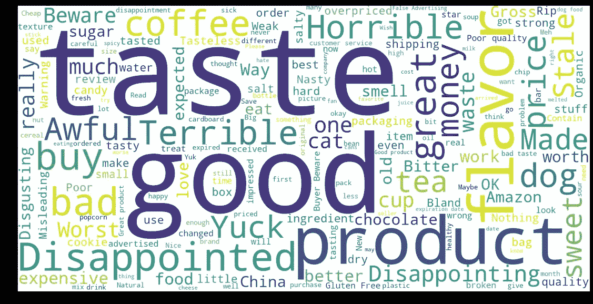
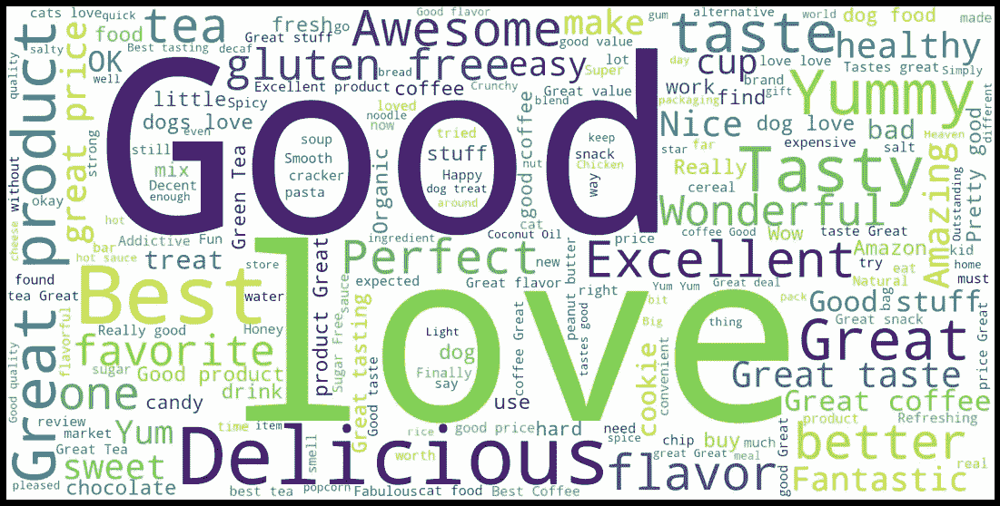
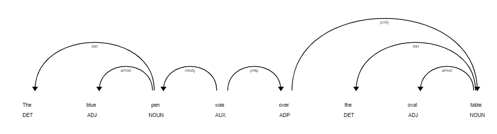
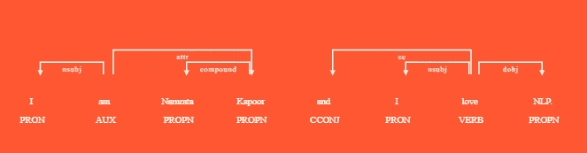

# NLP:文本数据可视化

> 原文：<https://towardsdatascience.com/nlp-text-data-visualization-5d5c64c86019?source=collection_archive---------8----------------------->


图像[来源](https://unsplash.com/photos/jrh5lAq-mIs?utm_source=unsplash&utm_medium=referral&utm_content=creditShareLink)

“如果你愿意倾听，数据会和你说话。”吉姆·柏格森

文本数据可视化有许多优势，如快速获得最常用的词以理解文本是关于什么的，所有数据的正面和负面评论的数量由图表表示，加上词性之间的用户和产品关系，等等。

现在让我们看看如何去做。亚马逊是一个大零售品牌，我们可以看到它有很多关于产品的评论。让我们从 Kaggle 获得这个数据集，然后开始。

为此任务导入几个重要的库:

```
import numpy as np
import pandas as pd
import matplotlib.pyplot as plt
import seaborn as snsimport string
from wordcloud import WordCloud
```

根据点评 CSV 制作数据框:

```
df = pd.read_csv('../input/amazon-fine-food-reviews/Reviews.csv')
```

让我们将数据可视化:

```
df.head(10)
```



作者图片

删除空值(如果有):

```
print(df.shape)
print(df.isnull().values.any())
df.dropna(axis = 0 , inplace = True)
print(df.shape)
```

删除重复项:

```
df.drop_duplicates(subset=['Score','Text'],keep='first',inplace=True)
print(df.shape)
df.head(10)
```

可视化分数总数:

```
plt.figure(figsize=(10,10))
ax = sns.countplot(x=df["Score"],  data=df, order = df["Score"].value_counts().index )
for p, label in zip(ax.patches, df["Score"].value_counts()):   
    ax.annotate(label, (p.get_x()+0.25, p.get_height()+0.5))
```



作者图片

按超过 400 种产品的产品 Id 分组:

```
df.groupby('ProductId').count()
df_products = df.groupby('ProductId').filter(lambda x: len(x) >= 400)
df_product_groups = df_products.groupby('ProductId')#Count of products and groups
print(len(df_products))
print(len(df_product_groups))
```

绘制产品方面的分数

```
plt.figure(figsize=(20,20))
sns.countplot(y="ProductId",  hue="Score", data=df_products);
```



作者图片

按给出 100 条以上评论的用户 Id 分组:

```
df.groupby('UserId').count()df_users = df.groupby('UserId').filter(lambda x: len(x) >= 100)
df_userGroup = df_users.groupby('UserId')
print("Number of Users:"+ str(len(df_userGroup)))
df_products = df_users.groupby('ProductId')
print("Number of products:"+ str(len(df_products)))
```

根据给定的分数等级绘制用户:



作者图片

现在我们来看看哪些是正面评价用得最多的词，哪些是负面评价用得最多的词。

对于此导入库进行数据清理:

```
from nltk.tokenize import word_tokenize
from nltk.tokenize import sent_tokenize
from nltk.stem import WordNetLemmatizer 
from nltk.corpus import stopwords
```

为停用词的移除、词条整理和文本清理创建函数:

```
def remove_Stopwords(text ):
    stop_words = set(stopwords.words('english')) 
    words = word_tokenize( text.lower() ) 
    sentence = [w for w in words if not w in stop_words]
    return " ".join(sentence) def lemmatize_text(text):
    wordlist=[]
    lemmatizer = WordNetLemmatizer() 
    sentences=sent_tokenize(text)
    for sentence in sentences:
        words=word_tokenize(sentence)
        for word in words:
            wordlist.append(lemmatizer.lemmatize(word))
    return ' '.join(wordlist) def clean_text(text ): 
    delete_dict = {sp_character: '' for sp_character in string.punctuation} 
    delete_dict[' '] = ' ' 
    table = str.maketrans(delete_dict)
    text1 = text.translate(table)
    textArr= text1.split()
    text2 = ' '.join([w for w in textArr]) 

    return text2.lower()
```

分离正面和负面评论:

```
mask = (df["Score"] == 1) | (df["Score"] == 2)
df_rating1 = df[mask]
mask = (df["Score"]==4) | (df["Score"]==5) | (df["Score"]==3)
df_rating2 = df[mask]
print(len(df_rating1))
print(len(df_rating2))
```

清理[停用词](/nlp-easy-explanation-of-common-terms-with-python-dc7c323a4691)、[的文本，对](/nlp-easy-explanation-of-common-terms-with-python-dc7c323a4691)进行词条化，并清理标点符号:

```
df_rating1['Text'] = df_rating1['Text'].apply(clean_text)
df_rating1['Text'] = df_rating1['Text'].apply(remove_Stopwords)
df_rating1['Text'] = df_rating1['Text'].apply(lemmatize_text) df_rating2['Text'] = df_rating2['Text'].apply(clean_text)
df_rating2['Text'] = df_rating2['Text'].apply(remove_Stopwords)
df_rating2['Text'] = df_rating2['Text'].apply(lemmatize_text)df_rating1['Num_words_text'] = df_rating1['Text'].apply(lambda x:len(str(x).split())) 
df_rating2['Num_words_text'] = df_rating2['Text'].apply(lambda x:len(str(x).split()))
```

WordCloud 对负面评论的看法:

```
wordcloud = WordCloud(background_color="white",width=1600, height=800).generate(' '.join(df_rating1['Summary'].tolist()))
plt.figure( figsize=(20,10), facecolor='k')
plt.imshow(wordcloud)
```



作者图片

WordCloud 对正面评论的看法:

```
wordcloud = WordCloud(background_color="white",width=1600, height=800).generate(' '.join(df_rating2['Summary'].tolist()))
plt.figure( figsize=(20,10), facecolor='k')
plt.imshow(wordcloud)
plt.axis("off")
```



作者图片

让我们看看如何把词类之间的关系形象化。

对于这个进口空间

```
import spacy
nlp=spacy.load('en_core_web_sm')
from spacy import displacy
doc=nlp(u'The blue pen was over the oval table.')
```

如下图所示:

```
displacy.render(doc, style='dep')
```



作者图片

现在让我们用一些选项为这个表示填充一些颜色:

```
doc1=nlp(u'I am Namrata Kapoor and I love NLP.')
options={'distance':110,'compact':'True', 'color':'white','bg':'#FF5733','font':'Times'}
displacy.render(doc1, style='dep',options=options)
```



作者图片

**结论**

我们在这里已经看到了一些使用 WordCloud、SNS 和 matplotlib 的文本可视化技术。一旦情感分析被用于它，有更多的事情可以被探索，我们用一些规则更深入地挖掘，这些规则清楚地定义了评论是为产品还是交付而给出的。

此外，像“not”这样的停用词会改变单词的意思，在应用停用词和在词云中可视化之前，必须用反义词替换它们。

这些是可以优化我所做的一些事情。

感谢阅读！

*原载于 2021 年 3 月 27 日 https://www.numpyninja.com**的* [*。*](https://www.numpyninja.com/post/nlp-text-data-visualization)