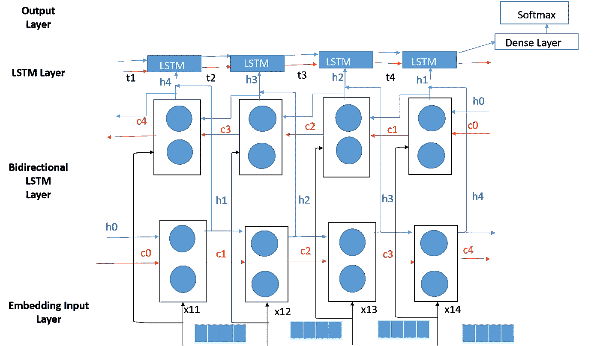
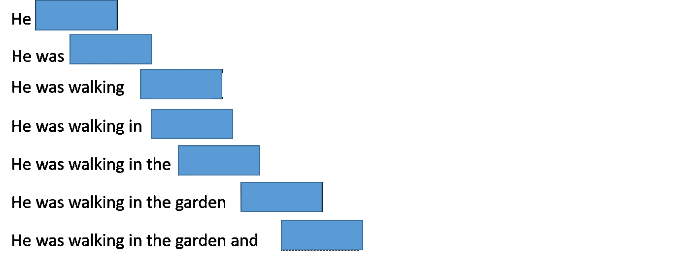
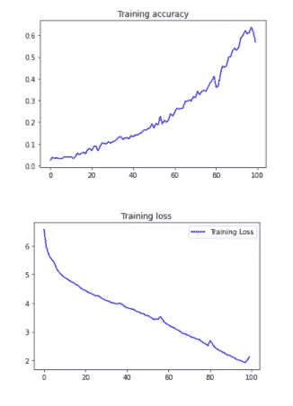

# NLP:基于双向 LSTM 模型的文本生成

> 原文：<https://towardsdatascience.com/nlp-text-generation-through-bidirectional-lstm-model-9af29da4e520?source=collection_archive---------12----------------------->

## “理解是双向的。”埃莉诺·罗斯福。


图像[来源](https://unsplash.com/photos/l4zEa49QKVk?utm_source=unsplash&utm_medium=referral&utm_content=creditShareLink)

在我最近的一篇博客中，我试图通过一个简单的最大似然模型来解释[文本生成](https://medium.com/ai-in-plain-english/n-gram-and-its-use-in-text-generation-a3fbe96b2097)。

在这篇博客中，我将试图解释我们如何通过双向 LSTM 模型做到这一点。

在我的一篇关于 [RNN](/recurrent-neural-network-4129195bcb24) 的博客中，我们谈到了所有类型的 RNN，但是它们都有一个缺点，即只依赖于过去的上下文。

双向 LSTMs 可用于训练输入序列的两侧，而不是一侧。第一个按输入序列从左到右，第二个按输入序列的相反顺序。它为单词提供了一个额外的上下文，以适应前后单词的正确上下文，这导致更快和更充分地学习和解决问题。



双向 LSTM 模型[图片由作者提供]

现在让我们看看如何在文本生成中实现这个模型。

导入以下库:

```
from tensorflow.keras.preprocessing.sequence import pad_sequences
from tensorflow.keras.layers import Embedding, LSTM, Dense, Dropout, Bidirectional
from tensorflow.keras.preprocessing.text import Tokenizer
from tensorflow.keras.models import Sequential
from tensorflow.keras.optimizers import Adam
from tensorflow.keras import regularizers
import tensorflow.keras.utils as ku 
import numpy as np
```

**文本预处理**

在这种情况下，整个文本被清理并转换为小写，整个句子集被连接。然后对单词进行标记，并确定单词的总数。要了解更多关于标记化的知识，你可以参考我之前的[博客](/nlp-easy-explanation-of-common-terms-with-python-dc7c323a4691)。

我在这里引用了唐纳德·特朗普(Donald Trump)的几句话。整个演讲我并没有把这种模式当成训练，需要大量的训练时间。

```
tokenizer = Tokenizer()
data = open('../input/dtspeech/DTSpeech.txt').read()
corpus = data.lower().split("\n")
tokenizer.fit_on_texts(corpus)
total_words = len(tokenizer.word_index) + 1
```

**创建序列**

对于每个单词，生成一个 [n-gram](https://medium.com/ai-in-plain-english/n-gram-and-its-use-in-text-generation-a3fbe96b2097) 序列，并更新输入序列。它发生在下一个单词的迭代中，依此类推。



作者图片

例如，在上面的句子中，首先提取了“he ”,然后提取了“He was ”,然后提取了“He was walking ”,等等。

```
# create input sequences using list of tokens
input_sequences = []
for line in corpus:
    token_list = tokenizer.texts_to_sequences([line])[0]
    for i in range(1, len(token_list)):
        n_gram_sequence = token_list[:i+1]
        input_sequences.append(n_gram_sequence)
```

**填充序列**

提取句子的最大长度，然后剩余的句子按照最长的句子进行预填充。

```
# pad sequences 
max_sequence_len = max([len(x) for x in input_sequences])
input_sequences = np.array(pad_sequences(input_sequences, maxlen=max_sequence_len, padding='pre'))
```

提取序列的最后一个字，并将其从数字转换为分类。

```
# create predictors and label
predictors, label = input_sequences[:,:-1],input_sequences[:,-1]

label = ku.to_categorical(label, num_classes=total_words)
```

我们现在做一个顺序模型，第一层作为单词嵌入层。

然后应用双向 LSTM，其中参数 *return_sequence* 被标记为真，以便单词生成考虑序列中前面的甚至前面的单词。

添加一个脱落层以避免过度拟合，然后再添加一个 LSTM 层、一个激活为 [Relu](/neural-network-its-internal-functioning-and-uses-7adc4d37f3d8) 的密集层和一个正则化层以避免再次过度拟合。

输出层有 softmax，以便得到接下来要预测的单词的概率。

```
model = Sequential()
model.add(Embedding(total_words, 100, input_length=max_sequence_len-1))
model.add(Bidirectional(LSTM(150, return_sequences = True)))
model.add(Dropout(0.2))
model.add(LSTM(100))
model.add(Dense(total_words/2, activation='relu', kernel_regularizer=regularizers.l2(0.01)))
model.add(Dense(total_words, activation='softmax'))
model.compile(loss='categorical_crossentropy', optimizer='adam', metrics=['accuracy'])
print(model.summary())
```

用 100 个历元拟合模型进行训练。

```
history = model.fit(predictors, label, epochs=100, verbose=1)
```

绘制精度和损耗图。

```
import matplotlib.pyplot as plt
acc = history.history['accuracy']
loss = history.history['loss']
epochs = range(len(acc))
plt.plot(epochs, acc, 'b', label='Training accuracy')
plt.title('Training accuracy')
plt.figure()
plt.plot(epochs, loss, 'b', label='Training Loss')
plt.title('Training loss')
plt.legend()
plt.show()
```



作者图片

现在让我们为下一代播下种子。这样就产生了 100 个下一个单词。

```
seed_text = " We will make America safe again, and we will make America great again."
next_words = 100
```

种子将首先被获取，并被标记化和填充到标记列表中。然后，使用令牌列表作为输入，使用模型进行预测。

然后，将最可能的单词添加到种子文本中，这将在接下来的 100 个单词中发生。

```
for _ in range(next_words):
    token_list = tokenizer.texts_to_sequences([seed_text])[0]
    token_list = pad_sequences([token_list], maxlen=max_sequence_len-1, padding='pre')
    predicted = model.predict_classes(token_list, verbose=0)
    output_word = ""
    for word, index in tokenizer.word_index.items():
        if index == predicted:
            output_word = word
            break
    seed_text += " " + output_word
print(seed_text)
```

输出

```
We will make America safe again, and we will make America great again. big hello wisconsin they have and the worst they be here a lot some when and we're was this is the violent important reelection that it strongly this is the violent important election in the family ever wisconsin and they have to have in the violent big hello wisconsin the worst they should has is the year wisconsin to have to have your country you the violent left wing mob you biden very family had i nafta them and that's in a want we want to surrender when what the important reelection and a have to have your country to
```

输出并不完美，因为训练我们只采取了几行文字。因此，我们可以很好地微调它。

这是双向 LSTM，我们试图通过它来生成文本，我们可以用更多的纪元、更多的文本或 gru 来改进模型，甚至通过添加注意力层。

感谢阅读！