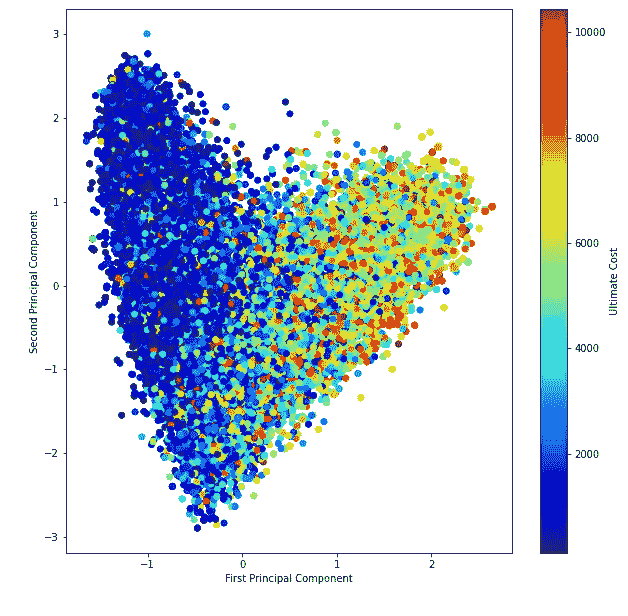
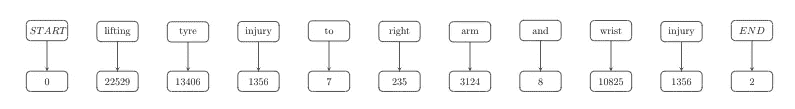
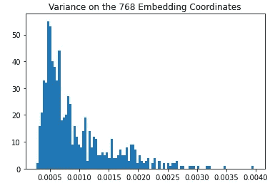
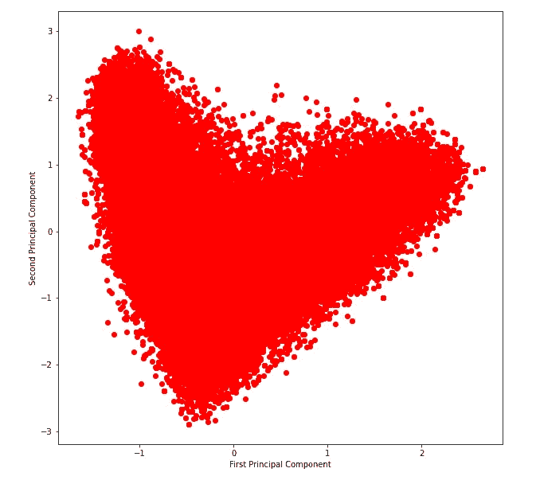

# 有急流的 NLP，是的，这是可能的！

> 原文：<https://towardsdatascience.com/nlp-with-rapids-yes-its-possible-1830287210ed?source=collection_archive---------18----------------------->

## 句子嵌入的主成分分析

图片由作者提供。[源代码](https://www.kaggle.com/louise2001/rapids-pca-for-sentenceembeddings?scriptVersionId=59318051)

*在这篇博文中，我将展示如何对复杂数据进行常规的数据分析，比如变形金刚中的句子嵌入。完整的笔记本可以在* [*这里找到*](https://www.kaggle.com/louise2001/rapids-pca-for-sentenceembeddings) *。*

在 Kaggle 的 [**精算损失竞赛**](https://www.kaggle.com/c/actuarial-loss-estimation) 中，我们要**预测工伤保险索赔成本**。我们被赋予一些非常经典的特征，比如年龄、薪水、需要抚养的孩子数量等等。，但也有一个简短的文字描述的性质和情况的事故，我们必须预测最终的费用索赔。

这项工作的特殊性在于，首先，我在 GPU 上与 [**RAPIDS**](https://rapids.ai/) 进行了端到端的执行，它们的库 cuPY、cuDF 和 cuML 使你能够在 GPU 上重现每一个 Numpy、Pandas 或 Scikit-Learn 操作；第二，我试图**仅基于文本数据(伤害描述)**提取关于数字目标(最终索赔成本)的信息。

# 环境设置

句子嵌入将通过 PyTorch 转换器生成，然后在 RAPIDS 上通过主成分分析进行处理。

首先，你必须确保你已经安装了 [RAPIDS 环境](https://rapids.ai/start.html)(我推荐 0.18 版本)。我使用的是 ZBook Studio 和 NVIDIA RTX5000，后者是 Z by HP [Data Science 软件堆栈](https://www8.hp.com/us/en/workstations/industries/data-science.html#section=software-stack)附带的，所以我已经安装并正确设置了所有东西(我知道创建和管理环境可能会很痛苦)。如果您运行的是 Kaggle 内核，请务必添加 [RAPIDS 存储库](https://www.kaggle.com/cdeotte/rapids)并安装 RAPIDS，如下所示:

然后，安装句子-transformers 存储库和其他需求:

你都准备好了！

# 读取和处理数据

读取数据并提取索赔描述非常简单。此外，文本数据已经被清理了，我们只需要将它转换成小写(大多数 Bert 衍生物是为未转换的文本数据而构建的)。

# Torch 语句转换器的原始嵌入

对于句子嵌入，我们希望将一个**可变长度的输入文本**映射到一个**固定大小的密集向量**。这可以通过句子转换器来实现:正如你所知，[转换器是编码器-解码器架构](https://arxiv.org/pdf/1706.03762.pdf)，其中编码器将输入映射到内部表示，然后由解码器映射到输出。在通过解码器以适应我们正在训练的任务之前，嵌入将是由编码器输出的输入的内部矢量化表示。

[句子变形金刚](https://www.sbert.net/)只是参与 NLP 的每个人都听说过的常见变形金刚，也就是说，Bert originally 和它的所有派生版本:其他语言(CamemBert 等)、robust (RoBerta)和 light(distill Bert，DistilRoberta)版本。唯一的区别是他们接受训练的任务，包括在句子层面处理文本，而不是原来的单词层面。它们的用途非常广泛:

*   [计算句子嵌入](https://www.sbert.net/examples/applications/computing-embeddings/README.html)
*   [语义文本相似度](https://www.sbert.net/docs/usage/semantic_textual_similarity.html)
*   [聚类](https://www.sbert.net/examples/applications/clustering/README.html)
*   [释义挖掘](https://www.sbert.net/examples/applications/paraphrase-mining/README.html)
*   [翻译句子挖掘](https://www.sbert.net/examples/applications/parallel-sentence-mining/README.html)
*   [语义搜索](https://www.sbert.net/examples/applications/semantic-search/README.html)
*   等等。

我选择的计算嵌入的模型是[distilloberta，用于释义评分](https://huggingface.co/sentence-transformers/paraphrase-distilroberta-base-v1)。

我为什么选择释义模式？嗯，这是一个纯粹的个人选择，请随意使用另一种模式。我觉得这个模型能更好地体现句子的整体意义，而不是过多地选择一个词或一个同义词(释义基本上就是这个意思)，这也是我的目的，因为这个描述非常简洁实用。

这实际上是一个相当大的模型，尽管是原来的罗伯塔更轻的版本:它仍然有超过 8200 万可训练的参数…

获得句子嵌入的整个过程实际上非常简单。

首先，对于每个输入的句子，您必须将单词映射到它们在模型使用的词汇中的 id，添加<start>和<end>代币。</end></start>

最终，我们必须在末尾添加<pad>代币，以便我们的输入符合模型最大输入序列长度。</pad>

在我的例子中，原始模型的最大序列长度是 128，但我的输入(包括<start>和<end>代币)的最大长度是 21，因此为了安全概括的目的，我将这个最大序列长度设置为 25。这将为我们节省大量无用的计算和计算时间。</end></start>

然后，我们的模型将输入 id 映射到它们相应的令牌嵌入，它们是单词嵌入、位置嵌入(我们是第一个、第二个还是第三个单词？)和令牌类型嵌入(我们是一个普通的词吗？a <start>？).最后，我们只对特征进行归一化。</start>

现在，对于每个代币，我们有一个初始的张量表示，我们把它馈送给编码器(我在这里将不详细讨论，关于这方面的更多信息，请参考介绍编码器-解码器体系结构的论文 [*【注意是你所需要的全部】*](https://arxiv.org/pdf/1706.03762.pdf) )。

该编码器输出任何输入序列的 768 维张量表示。现在，我们该怎么处理它呢？首先，我们必须确保这些嵌入在回归模型中预测最终索偿金额时有用。这就意味着，理想情况下，要有正交的轴，轴上的坐标要有很强的解释力，还要能够将事故类型或受伤严重程度进行聚类。

不幸的是，情况远非如此:事实上，最初的罗伯塔释义模型是在一个庞大的折衷数据集上训练出来的，而我们的输入数据有很大的语义相似性，都是围绕健康展开的。

对于规范化句子嵌入的所有 768 个 dim，我计算了 90_000 个文本样本之间的坐标方差。从这个柱状图中可以看出，大多数方差都非常低:作为参考，U([0，1])的方差是 1/12=0.0833。

因此，我的陈述很可能非常相似。

# 使用 RAPIDS 处理来自 PCA 的嵌入

此时，我们面临两个问题:第一，嵌入太大(768 个组件，当我们只有 12 个额外的培训功能时)，我们更希望它们相对于我们的目标(最终产生的索赔成本)带来更多的可解释性和可分离性。

[PCA](https://en.wikipedia.org/wiki/Principal_component_analysis) 用于[勘探数据分析](https://en.wikipedia.org/wiki/Exploratory_data_analysis)和制作[预测模型](https://en.wikipedia.org/wiki/Predictive_modeling)。它通过将每个数据点仅投影到前几个主成分上来执行[降维](https://en.wikipedia.org/wiki/Dimensionality_reduction)，以获得较低维的数据，同时保留尽可能多的数据变化。第一主成分可以等效地定义为使投影数据的方差最大化的方向。然后，第二分量是与使数据方差最大化的第一分量正交的方向，等等。

该过程以数据方差的可解释能力的递减顺序迭代地给出正交向量。在第一 n 个分量上投影数据通过在 R^n 投影它来执行降维，尽管保留尽可能多的数据方差。

这里要注意的是，我已经对来自 train 和 test 数据集的所有声明描述嵌入执行了主成分分析，以获得更好的适合这两个数据集的拟合。第一主成分占总数据方差的 7.6%，第二主成分占 3.9%。它们总共解释了 11.5%的原始嵌入可变性。

现在，当我试图在这个 2-d 空间中可视化数据点投影时，我有了一个惊人的惊喜:

很有意思吧。现在，有几种解释可以从中得出。首先，我们非常清楚地看到正交可变性方向。其次，似乎有 2 个集群的数据点，合并部分较低的价值在 2 轴。

# 目标可解释性

基于这一观察，我想知道这两个集群是否能给目标公司带来预测能力，也就是最终产生的索偿成本。因此，我决定绘制所有的训练数据点投影(我们显然没有测试数据点的目标值…)，同时根据目标值对它们进行染色。

在这一点上，我遇到了一个可行性问题:目标值显然是下界的(索赔成本必然是正的)，但不是上界的，其中一些非常极端，以至于它使我的颜色图爆炸，大多数值被压到底部，少数值飙升到顶部颜色。因此，我决定砍掉我最上面的五分之一的数据，以便得到一个更有规律的分布。

图片由作者提供。[源代码](https://www.kaggle.com/louise2001/rapids-pca-for-sentenceembeddings?scriptVersionId=59318051)

这真是一个令人印象深刻的结果，因为它说明了在没有任何附加特征的情况下，主成分分析对文本嵌入所提供的目标的聚类能力。在这里，我们非常清楚地看到，心脏的右半部分占较高的成本，而左半部分占较低的索赔。

*感谢你阅读我！你可以在这里* *找到完整源码 Kaggle 笔记本* [*。*](https://www.kaggle.com/louise2001/rapids-pca-for-sentenceembeddings)