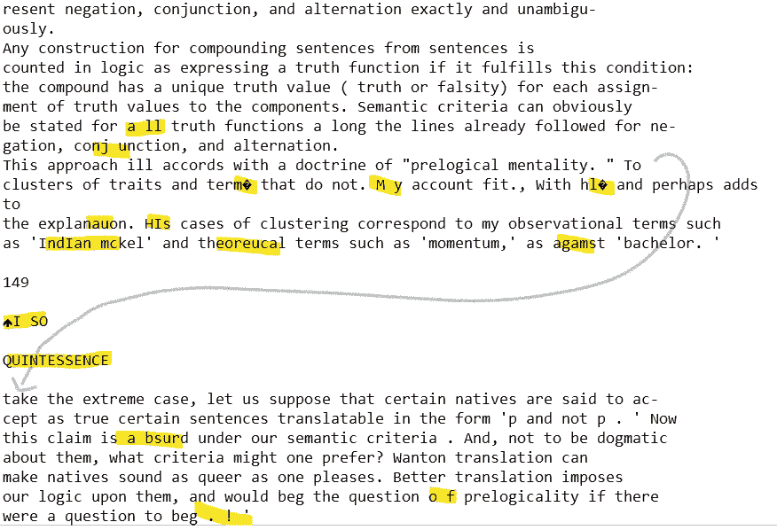

# NLP —使用书籍

> 原文：<https://towardsdatascience.com/nlp-working-with-books-fc82d8e9b0dc?source=collection_archive---------48----------------------->

## [实践教程](https://towardsdatascience.com/tagged/hands-on-tutorials)

## 清理那些肮脏下流的文字的指南


照片由[弗雷迪婚姻](https://unsplash.com/@fredmarriage?utm_source=medium&utm_medium=referral)在 [Unsplash](https://unsplash.com?utm_source=medium&utm_medium=referral)

处理文本数据总是给我们带来新的挑战。今天我将讨论一种特别具有挑战性的文本数据:书籍。

书籍给作为数据科学家的我们带来了许多问题，尤其是如果它们是从 pdf 中提取的。如果文本存储为图像而不是实际的文本，像 PyPDF 这样的普通 PDF 阅读器可能无法处理 pdf。即使它被正确地存储，在产生的文本数据中也很可能有许多随机问题。



奎恩，我爱你，但你需要一些帮助。—作者图片

在这里，我将介绍一些我在处理书籍时使用的步骤。代码取自最近的一个项目，目标是将 50 多本哲学著作分成 10 个思想流派。

## 1.以正确的格式获取文本

首先，您需要文本格式正确。. txt 文件是理想的。正如我提到的，PyPDF 可以读取实际存储文本的 PDF，但许多 pdf 实际上是扫描的，其中的“文本”只是页面的图片。为了改变这些，我推荐名副其实的[pdftotext.com](https://pdftotext.com/)。许多这些在线服务的内存限制很低，或者结果质量很差，但是这个对我来说是最好的，甚至对大型书籍也有效。

## 2.夹住前端和末端

现在你已经得到了你的文本数据，打开文件看一看。您可能会注意到，文本的开头是许多版权材料，结尾可能是一个很长的索引或其他不相关的文本(这更适用于学术文本，而不是小说)。

根据你的目标，你可能会想要删除它。现在，您可以计算字符数并在那里剪切文本，但更容易的是在文本中找到(或插入)一个独特的标记并使用 pythons。split()在那里剪切文本。

这里有一个例子:

```
russell_problems_of_phil = russell_problems_of_phil.split('n the following pages')[1].split('BIBLIOGRAPHICAL NOTE')[0]
```

首先你将在前面的标记上分开，然后拿单子上的第二个项目。然后在结束标记处分开，取第一项。如果你觉得有必要，你可以在任何一点上去掉几个字符。

## 3.略读课文，找出奇怪的地方

在这一点上，如果你还没有，这是一个好主意，浏览你的文本，感受任何奇怪的模式。这可能是一直插在句子中间的标题。可能是因为存在像“~”或“；”这样的奇怪字符在有意义的字母的地方。当扫描你的 pdf 图像的程序将它们转换成文本时，它会尽最大努力，但“ri”看起来确实很像“n”，一个脏污的“I”很可能是一个“；”或者大写的 M 可能是 lll。随着你使用这些方法越来越多，你会开始发现一些常见的错误，知道在你的具体文本中倾向于出现什么是很好的，因为它们每个都有一点不同。

## 4.在角色级别开始清理

准备好让 re.sub()成为你新的最好的朋友吧！我们从删除所有对我们毫无意义的奇怪字符开始。

```
result = re.sub(r'[\x00-\x08\x0b\x0c\x0e-\x1f\x7f-\xff\xad\x0c6§\\\£\Â*_<>""⎫•{}Γ~]', ' ', to_correct)
```

其中很多是 utf-8 编码字符，其他的只是奇怪的('⎫'到底是什么意思？).

同样有用的是，让所有的空白都是同一个——我们并不关心这里的换行符。

```
result = re.sub(r'\s', ' ', to_correct)
```

另一个常见但大多没有意义的文本元素是罗马数字。这个正则表达式旨在删除它们。

```
# first capitalized ones
result = re.sub(r'\s((I{2,}V*X*\.*)|(IV\.*)|(IX\.*)|(V\.*)|(V+I*\.*)|(X+L*V*I*]\.*))\s', ' ', to_correct)# then lowercase
result = re.sub(r'\s((i{2,}v*x*\.*)|(iv\.*)|(ix\.*)|(v\.*)|(v+i*\.*)|(x+l*v*i*\.*))\s', ' ', to_correct)
```

在我的项目中，我删除了所有的数字，不仅仅是罗马数字。这对你来说可能有用，也可能没用，但它确实很好地去除了页码。如果你不这样做，你会想找到另一种方法来阻止页码打破正常的句子。

另一个很好的方法是整合不同的缩写方式，这样它们在你的语料库中就能保持一致。例如，把你所有的‘和’变成实际的‘和’。

```
result = re.sub(r'&', 'and', to_correct)
```

很多这种工作将取决于你的具体情况和你觉得你需要保留什么；很可能会有你的研究领域特有的缩写，你想用一种特殊的方式来处理。

但是，需要注意的是，在删除字符时，一定要用空格(“”)来替换它们。这将防止您意外地将之前由一些奇怪字符分隔的单词融合在一起。在清理结束时，您可以使用另一个正则表达式轻松删除多余的空格。

```
result = re.sub(r'\s+', ' ', to_correct)
```

## 5.在单词级别清理文本

经常发生的情况是，在你的文本文件中有一些单词或短语实际上对你的模型没有什么意义。例如，许多书在每页的顶部都有标题或章节标题。当你把它转换成一个 txt 文件时，这个文件头会被插入到页面的任何地方，这意味着经常是在一个句子的中间。页码和脚注也是如此。

有时你很幸运，标题全是大写字母，这很容易去掉:

```
# this removes all strings of capital letters that are more than 2 characters long
result = re.sub(r'[A-Z]{2,}', ' ', to_correct)
```

还可能有一些 pdf 到 txt 转换的奇怪工件，您必须以一种特别的方式来处理。我处理这些问题的过程如下:

*   将文本标记成句子，并将其输入数据帧。
*   在数据帧中搜索可疑的问题单词。
*   如果我判断问题是常见的并且容易隔离，我会将它添加到一个通用字典中，其中的键是问题正则表达式，值是要插入到它们的位置的正确字符串。
*   下次构建 dataframe 时，在句子标记化之前，使用 I a for 循环来应用清理字典中的 ever 元素。

## 6.构建一个数据框架并检查它

在此之前，你不能真正建立一个句子的数据框架，因为你的工作会影响你正在使用的任何句子标记器(希望是积极的)。虽然您可能会在查看更多数据时回过头来做更多的清理工作，但此时使用句子分词器来构建句子的数据框架是一个很好的步骤。

有了这个构建，您可以开始以不同的方式清理数据。

首先，看一下所有的短句。这些往往是奇怪的全标点符号字符串，否则通常没有意义。我发现 20 个字符是一个很好的分界点，并从我的数据中删除了所有较短的字符串。

```
df = df.drop(df[df['sentence_length'] < 20].index)
```

另一个好的方法是查看可能表示脚注的单词(“同上”或“注释”)，或者可能表示会打乱你的模型的外语的单词。如果你在处理学术文本，寻找作者提到自己的地方——这些几乎是编辑添加的脚注(不管你信不信，亚里士多德并不怎么谈论亚里士多德)。当然，检查重复的，因为这些很可能是你错过的标题或其他一些奇怪的东西。

## 7.享受你干净的数据！

如果你做了以上所有的事情，你的新书文本应该是相对干净的，尤其是与你开始之前的混乱相比。恭喜你！

当然，整个事情是一个迭代的过程，当你探索它的时候，你可能会发现一些新的奇怪的东西，但这都是乐趣的一部分。我发现 word2vec 建模特别擅长显示我的清理缺陷，因为罕见的奇怪单词往往与它们旁边显示的正常单词高度“相似”。

希望这篇文章有所帮助；我知道我希望有人能帮我处理这些破损的书。如果你想看我用来清理短信的完整代码，你可以访问这里的 repo。