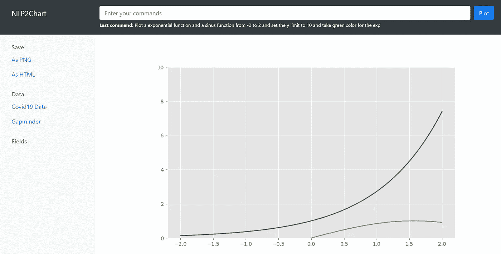

# NLP2Chart —自然语言中的信息可视化

> 原文：<https://towardsdatascience.com/nlp2chart-9bc732719ba0?source=collection_archive---------6----------------------->

## 用自然语言命令创建图表的原型

www.pexels.com

在本文中，我将展示一种方法的原型，这种方法允许使用自然语言的指令创建信息图和信息图。下图显示了该应用程序的原型，并举例说明了每个国家的电晕病例数和死亡数之间的相关性，包括回归线。这个信息图完全是由自然语言中的命令生成的。

在本例中，这是:

> "将 covid-data.csv 加载到数据集中，并按位置对 total_cases 和 total_deaths 进行分组，制作它们的散点图和回归线"

COVID19“总病例数”和“总死亡数”散点图/作者提供的图片

基于一些典型的数据集和问题，我将展示该方法的可能性和局限性。实现基于 OpenAI 的 GPT3 语言模型，通过 API([https://openai.com/blog/openai-api/](https://openai.com/blog/openai-api/))调用。

## 语言模型和图像处理

最近，越来越多的研究论文发表在自然语言处理和图像处理之间的联系上。例如，图像的内容和风格与自然语言相关联。这方面的例子有 OpenAI 的“CLIP”(【https://openai.com/blog/clip/】)和 NVIDIA 的“GauGAN”()。

CLIP 是一个在大量(4 亿)图像和文本对上训练的神经网络。模型学习整个句子和它描述的图像之间的关系；在某种意义上，给定一个输入句子，模型在被训练时，能够找到对应于该句子的最相关的图像。这里重要的是，它是针对整个句子进行训练的，而不是针对汽车、狗等单个类别。

一个简化的实现在

</simple-implementation-of-openai-clip-model-a-tutorial-ace6ff01d9f2>  

在 GauGAN 中，图像的内容也可以用一句话来描述，但是除此之外，图像的附加属性，例如图像的风格可以由另一个图像来定义，或者可以使用绘图和分割来影响图像。

有关 GauGAN 2 的更多信息，请访问:

</have-you-ever-heard-of-nvidias-ai-gaugan2-e08a12c8c6b9>  

截图来自 GauGAN2 /图片作者

## 信息可视化软件的用户界面

在我的原型中，我使用自然语言指令来创建图形，类似于 CLIP 或 GauGAN 2 中的图像创建，在输入描述任务的文本后，会生成并显示可视化效果。

“NLP 2 chart”/图片作者的界面

这个原型可以看作是对信息可视化软件接口的替代方法的研究。信息图形目前要么通过脚本来创建，例如使用 Matplotlib([https://matplotlib.org/](https://matplotlib.org/))或 Plotly([https://plotly.com/python/](https://plotly.com/python/))等库，要么通过 Tableau([www.tableau.com](http://www.tableau.com))或微软 Power BI([https://powerbi.microsoft.com/](https://powerbi.microsoft.com/))等软件来创建，其界面由大量菜单、按钮和下拉选项组成。脚本和“点击”界面及其众多选项都非常复杂，需要大量培训。

由于我们人类很容易用自然语言来表达一个问题或一项任务，因此很明显，对于创建信息图形的用例来说，尝试作为人机界面来做同样的事情。最大的障碍是语言缺乏精确性和模糊性，下面的评估将会显示这一点。在其他领域，这种方法被证明是非常有用的。甚至我们的日常生活也已经被 Alexa 和 Siri 这样的系统所塑造。

# 图形语法

正如每种语言都有定义其结构的语法一样，这也可以应用于其他领域。图形语法应用于可视化，是一种用于描述和创建大量统计图形的语法。

这些将在[https://cfss.uchicago.edu/notes/grammar-of-graphics/](https://cfss.uchicago.edu/notes/grammar-of-graphics/)进行描述。它们最初是为“GGpot2”库中的“R”语言实现的，我也将它们用作指南。由于这些任务可以形成一个清晰的结构，因此也有希望找到一种从自然语言到这种图形创作“语言”的“翻译”。

## 原型的实现

原型被实现为一个 web 应用程序，后端框架“Flask”([https://flask.palletsprojects.com/](https://flask.palletsprojects.com/))用于 Python，Bootstrap([https://getbootstrap.com/](https://getbootstrap.com/))用于前端。对于信息图的计算，使用了库“Matplotlib ”,对于语言模型，使用了 OpenAI 针对 GPT3 系列模型的 API。在语言模型的帮助下，自然语言的输入被翻译成 Matplotlib 的指令，然后这些指令导致图形的计算。

原型提供了导入 CSV 文件和将结果导出为 PNG 文件或 HTML 的可能性。

## 用例及数据集

为了测试该方法的适用性，尝试解决以下领域的任务:
-绘制一些典型的数学函数
-生成随机数和直方图、散点图等。
-对受感染、患病、接种疫苗等人群的 Covid19 数据进行评估和可视化。
-评估 Gapminder.com 的人口、收入和预期寿命数据

**数据集**

Gapminder 是由汉斯·罗斯林建立的一个基金会，提供数据和软件工具，以促进基于证据的世界观。来自 Gapminder([https://www.gapminder.org/](https://www.gapminder.org/))的数据被集成到 Python 包([https://pypi.org/project/gapminder/](https://pypi.org/project/gapminder/))中，用于人口、工资和预期寿命的评估。

对于 Covid19 评估和图表，使用了来自 Covid19 上[https://ourworldindata.org/coronavirus-source-data](https://ourworldindata.org/coronavirus-source-data)的数据。

# 用例的结果

**绘图功能**

作者绘制的一些函数/图像

说明:

> “从-2 到 2 绘制一个指数函数和一个正弦函数，将 y 限制设置为 10，并为指数取绿色”

创建功能图(同时创建几个功能)非常有效。也可以制定规格，例如轴的限制或颜色定义。

**随机数字信息图**

covid 停止和死亡的线图/作者的图像

说明:

> 为 2020 年 5 月的每一天创建一个包含随机数的数据集，将列命名为“病例”创建一个包含随机数的列，将其命名为“死亡”，并为病例和死亡绘制一个折线图

随机数的创建可以与用于绘图的指令相结合，甚至提供数据的部分。然而，在所有的例子中，数据部分的选择并不稳定。这是系统达到当前极限的地方。

作者提供的正态随机数直方图/图片

说明:

> "制作一个由 200 个随机正常数字组成的数组，并绘制直方图."

如上图所示的简单直方图在水平和垂直方向上都能很好地工作。它甚至可以识别它们是否是正态分布的数字，但是进一步的规范(如轴命名)不再可靠地工作。

**使用 COVID19 数据的评估**

开头已经展示了一个带有回归线的散点图示例。让我们看另一个数据集的例子。

每个洲的新 covid 病例饼图/作者提供的图片

说明:

> "将 covid-data.csv 加载到数据集中，按洲分组，并绘制成饼图"

数据加载和进一步的处理(如对数据分组)都与饼图结合在一起。然而，此外，格式化工作不可靠。

**Gapminder 数据**

按洲和年份分列的人口堆积条形图/作者提供的图片

说明:

> "打开 gapminder-data.csv 按洲和年份排列的 pop 组，并制作堆积条形图"

该示例显示了条形图及其选项的处理。这里，数据也是预先装载和聚合的。

下面的视频展示了更多的例子:

## 总结和进一步发展

对用例的处理表明，如果足够精确，基本的可视化类型可以通过指令成功地创建。对于具有诸如线宽、颜色或轴命名等属性的图形的“微调”,这种方法是不够的。在这种情况下，可以开发一个混合界面，允许在第二步中通过附加信息、选择框或输入字段添加这些属性。正如在使用 GauGAN 生成图像时一样，除了文本之外，绘图和分段等附加信息会更精确地指定图像生成。

有关“NLP2Chart”的更详细信息将在不久的将来发表在一篇论文中。