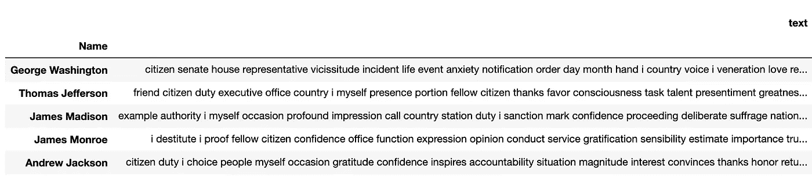

# NMF——一个可视化解释器和 Python 实现

> 原文：<https://towardsdatascience.com/nmf-a-visual-explainer-and-python-implementation-7ecdd73491f8?source=collection_archive---------6----------------------->

## [实践教程](https://towardsdatascience.com/tagged/hands-on-tutorials)

获得对无监督学习算法的直觉，该算法允许数据科学家从文本、照片等中提取主题，并构建那些方便的推荐系统。NMF 解释之后是一个 Python 实现，它是总统就职演说主题建模的一个玩具例子。

# **NMF 的起源**

> "对整体的感知是基于对部分的感知吗？"

研究人员 [Lee 和 Seung](https://www.nature.com/articles/44565) 继续在他们 1999 年发表在《自然》杂志上的论文中阐述了 NMF 的数学基础——“这里我们展示了一种非负矩阵分解的算法，它能够学习人脸的部分和文本的语义特征。”

数据科学的美妙之处在于它能够将哲学理论转化为数学算法，以检验这种理论的有效性。NMF 回答了这个问题——整体在多大程度上是其组成部分的总和？我们如何使用这些部件？公司通常使用这些部分来寻找更复杂的整体对象之间的模式和关联。

在业务环境中，主题可以用于将客户划分为不同的类型，并以不同的方式针对他们。此外，文档-主题矩阵可用于绘制空间中的每个文档，并提供一个基于相似性和差异给出建议的系统。

让我们从自然语言处理的角度来看 NMF，它经常被用于主题建模。

# 主题建模:我们如何从大量的文档中提取主题？

我们将文档集转换成数字来回答如下问题:

*   这个语料库中的热门话题是什么？
*   每个文档中的每个主题有多重要？
*   这些提取的主题在多大程度上描述了原始文档？
*   一个文档与另一个文档有多相似？

还有许多问题可以用 NMF 和自然语言处理来回答，但这些是核心问题。首先，让我们理解数据科学家和我们的许多文献喜欢使用的术语。

# 术语

我们用**语料库**指代一组相似的媒体。对于 NMF 来说，这可能是一组像文章一样的文本，像航拍照片或肖像一样的图像，像歌曲一样的音频，或者 youtube 视频——任何可以被概念化为部分的加法(而不是部分的加法和减法)的东西。我们使用**文档**来指代一个文本、照片、歌曲或视频。一个**术语**是一个单词。


语料库、文档、术语—图片由 Anupama Garla 提供

**NMF** 是**主题建模的一种形式——**从大量文档中提取有意义主题的艺术。语料库由嵌入在文档中的一组主题组成。一个**文档**由一个层次的**主题组成。**一个**主题**由一系列**术语组成。**


术语、主题、文档—图片由 Anupama Garla 提供

NMF 使用了“分布假说”的逻辑，瑞典语言学家马格努斯·萨尔格伦的论文[详细讨论了“分布假说”](http://This hypothesis is often stated in terms like “words which are similar in meaning occur in similar contexts” (Rubenstein & Goodenough, 1965))。

Sahlgren 提供了一个经常被引用的解释，

> 这个假设经常被表述为“意义相似的词出现在相似的语境中”(Rubenstein & Goodenough，1965)

并继续说，“分布假设背后的一般思想似乎足够清楚:分布相似性和意义相似性之间存在相关性，这允许我们利用前者来估计后者。”

对我们来说，这意味着文档可以被视为一袋单词。相似的文档有相似的词频分布和相似的主题。两个同时出现的单词很可能是相似的，属于同一个主题。该算法忽略了*句法信息*即词序，以及*语义信息*即多重含义。

让我们开始吧！

# **NMF**

NMF 代表潜在语义分析，使用“非负矩阵分解”方法将文档术语矩阵分解为两个更小的矩阵——文档主题矩阵(U)和主题术语矩阵(W)——每个矩阵都填充有非标准化的概率。


阿努帕玛·加拉的 NMF 图矩阵分解

V 中的值可以通过 W 和 H 的矩阵乘法来近似。例如，V 中的灰色框可以通过 W 的第一行乘以 H 的第一列的矩阵乘法来找到，H 也是灰色的。V 的第一行可以通过 W 的第一行与 h 的整个矩阵相乘来近似。

**V 表示可见**

在 *V 矩阵*中，每一行代表一个*文档*，该文档由一个*术语*的频率构成，也就是每个单词出现的次数。每一列代表*可见变量*。对于图像处理，*可见变量*将是特定的像素。下面是总统就职演说文本的一个 *V 矩阵*的摘录:


Anupama Garla 的 V 矩阵摘录(使用 TF-IDF 矢量器)

**W 代表重量**

在 *W 矩阵*中，每一行代表一个由*主题的非规范化概率组成的*文档*。*每一列代表一个*语义* *特征*，它在整个语料库中反复出现。对于图像处理，*特征*将是特定的原型特征，如“胡子”。以下是总统就职演说文本的节选:


W 矩阵节选(1)作者阿努帕玛·加拉


W 矩阵节选(2)


摘自阿努帕玛·加拉的《W 矩阵》( 3)

**H 代表隐藏**

在 *H 矩阵中，每行代表一个由*词频组成的主题*或*语义特征*。每列代表一个可见变量。两个频繁出现的术语共同构成一个主题，每个术语都赋予与其组合在一起的术语更多的上下文含义。如果一个术语在两个主题中频繁出现，那么这些主题很可能是相关的。以下是总统就职演说文本的一个 H *Matrix* 节选:*


阿努帕玛·加拉的《H 矩阵》摘录


摘自阿努帕玛·加拉的《H 矩阵》( 2)

**重构 V**

W 和 H 矩阵可用于通过矩阵乘法近似重构 V。

# **话题建模的艺术**

每次运行 NMF 时，它的输出都会发生变化，并且主题不会被解析，数据科学家必须使用 H 矩阵从每个主题的最高词频中推断出主题。这就是选择正确主题数量的艺术发挥作用的地方。太多的话，你会有主题重复或者由稀疏相关的词组成的主题。太少了，而且你没有很有意义的话题。


NMF 图中的矩阵分解

在上面的例子中，主题(p)被设置为 6。W 矩阵的每一列代表主题在文档中的概率。W 矩阵的每一行代表每个文档中主题频率的分布。H 矩阵的每一行代表了每个主题中的词频分布，可以看作是每个主题中每个词被激活的程度。


阿努帕玛·加拉对语料库的 NMF 变换的概念意象

**NMF 数学**

像大多数机器学习算法一样，NMF 的操作是从猜测 W 和 H 的值开始，并迭代地最小化损失函数。通常，它是通过为每次迭代更新一个矩阵(W 或 H ),并继续最小化误差函数||V — WH || = 0，同时 W 和 H 值保持非负，直到 W 和 H 稳定。基于您使用的特定编程包，有不同的损失函数用于更新矩阵，但在 Lee 和 Seung 的原始论文中提出的是*乘法更新规则*。老实说，数学是相当复杂的，我需要花一些时间来理解它，并以一种不大惊小怪的方式解释它。我将称之为超出了本文的范围。:-).

**NMF 警告**

NMF 要求所有的文件都相当相似——例如，如果你在比较人脸，你会从相似的角度看人脸。如果你在比较文本，你会看到相似长度的文本。对于更复杂的文档/图像，你需要更多层的隐藏变量，这个项目将进入神经网络领域。

**NMF 和 TF-IDF**

与 TF-IDF 相比，NMF 的优势在于，NMF 将 V 矩阵分解为两个更小的矩阵 、W 和 h。数据科学家可以设置主题的数量(p)来确定这些矩阵有多小。数据科学家经常使用 TF-IDF 导出的文档术语矩阵作为输入矩阵 V，因为它产生更好的结果。

**NMF 与其他矩阵分解方法**

NMF 不同于其他矩阵分解方法，如主成分分析和 VQ，因为它只使用非负数。这允许每个*主题*或*特征*是 ***可解释的*** *。*此外，W 和 H 可以由稀疏矩阵表示，其中只有值> 0 被编码，使得 ***成为更小的数据集*** 。

# Python 实现

这通常是操作的顺序:

1.  将相关库导入 Jupyter 笔记本/在您的环境中安装库
2.  选择数据并导入
3.  将数据隔离到主题模型
4.  干净的数据
5.  创建预处理数据的函数*
6.  创建文档术语矩阵' V '
7.  创建显示主题的函数*
8.  对文档术语矩阵“V”运行 NMF
9.  迭代，直到找到有用的主题

*星号表示可选步骤

# 1.导入您将需要的 Python 库。

对于**数据帧操作**和导出，您需要:

*   熊猫

```
import pandas as pd
```

从 scikit 学习**建模**您将需要:

*   tfidf 矢量器
*   NMF
*   文本

```
from sklearn.feature_extraction.text import TfidfVectorizer
from sklearn.decomposition import NMF
from sklearn.feature_extraction import text
```

从 nltk 进行**文本处理**您可能需要:

*   停用词
*   word_tokenize
*   位置标签

```
from nltk.corpus import stopwords
from nltk import word_tokenize, pos_tag
from nltk.stem import WordNetLemmatizer
```

对于**文本清理**，您可能需要:

*   正则表达式
*   线

```
import re
import string
```

# **2。选择数据并导入**

接下来，选择您的文档集。我正在使用美国总统的就职演说，可以作为 [Kaggle 数据集](https://www.kaggle.com/adhok93/presidentialaddress)获得。当我试图导入没有引擎条款的演讲时，我确实犯了一个错误，但我只是谷歌了一下我的错误，并采纳了这个对我有效的“引擎”建议。

```
# expand pandas df column display width to enable easy inspection
pd.set_option('max_colwidth', 150)# read in csv to dataframe
df = pd.read_csv('inaug_speeches.csv', engine='python')# visually inspect dataframe
df.head()
```


Anupama Garla 拍摄的原始数据帧图像

# 3.将数据隔离到主题模型

我要做一个总统名字和演讲的数据框架，并分离出第一个任期的就职演讲，因为有些总统没有第二个任期。这构成了具有相似长度的文档集。

```
# Select Rows that are first term inaugural addresses
df = df.drop_duplicates(subset=['Name'], keep='first')# Clean Up Index
df = df.reset_index()# Select only President's Names and their Speeches
df = df[['Name', 'text']]# Set Index to President's Names
df = df.set_index('Name')# Visually Inspect
df.head()
```


Anupama Garla 的孤立文本数据帧图像

# **4。**清理数据

我想使演讲中的所有文本尽可能具有可比性，所以我将创建一个清除功能，删除标点符号、大写字母、数字和奇怪的字符。为此，我使用正则表达式，它提供了很多“替换”文本的方法。有大量的正则表达式备忘单，比如这个 [one](https://medium.com/factory-mind/regex-tutorial-a-simple-cheatsheet-by-examples-649dc1c3f285) 。我把这个功能应用到我的演讲专栏。

```
def clean_text_round1(text):
    '''Make text lowercase, remove text in square brackets, 
    remove punctuation, remove read errors,
    and remove words containing numbers.''' text = text.lower()
    text = re.sub('\[.*?\]', ' ', text)
    text = re.sub('[%s]' % re.escape(string.punctuation), ' ', text)
    text = re.sub('\w*\d\w*', ' ', text)
    text = re.sub('�', ' ', text) return textround1 = lambda x: clean_text_round1(x)# Clean Speech Text
df["text"] = df["text"].apply(round1)# Visually Inspect
df.head()
```


Anupama Garla 清理的文本数据帧图像

# 5.创建预处理数据的函数*

这里我们将*对演讲中的所有单词进行词条整理，以便将特定单词的不同形式简化为基本形式，例如名词复数变为单数，所有动词时态变为现在时。这简化了文本，使得一个单词的微小变化的重复实例被解释为一个单词。你可以选择词干或词尾，更多信息[在这里](https://nlp.stanford.edu/IR-book/html/htmledition/stemming-and-lemmatization-1.html)。我们在这里做的另一件事是将语音文本隔离到特定的词类——名词。你可以尝试不同的词性分离，但是我发现在这个特定的数据集中名词是最成功的。更多关于如何使用 ***【词性】(词性)标签*** [选择词性的信息，请点击](https://pythonprogramming.net/natural-language-toolkit-nltk-part-speech-tagging/)。如果您想先设置一个基本管道，然后在迭代时添加管道以找到最适合您的数据集，则可以跳过这一步。*

```
*# Noun extract and lemmatize functiondef nouns(text):
    '''Given a string of text, tokenize the text 
    and pull out only the nouns.''' # create mask to isolate words that are nouns
    is_noun = lambda pos: pos[:2] == 'NN' # store function to split string of words 
    # into a list of words (tokens)
    tokenized = word_tokenize(text) # store function to lemmatize each word
    wordnet_lemmatizer = WordNetLemmatizer() # use list comprehension to lemmatize all words 
    # and create a list of all nouns
    all_nouns = [wordnet_lemmatizer.lemmatize(word) \
    for (word, pos) in pos_tag(tokenized) if is_noun(pos)] 

    #return string of joined list of nouns
    return ' '.join(all_nouns)# Create dataframe of only nouns from speeches
data_nouns = pd.DataFrame(df.text.apply(nouns))# Visually Inspect
data_nouns.head()*
```

**

*名词数据帧图像*

# *6.创建文档术语矩阵' V '*

*在这里，我在停用词列表中添加了一些停用词，这样我们就不会在主题中看到像“America”这样的词，因为在这种情况下，这些词没有太大的意义。我还使用 TF-IDF 矢量器，而不是简单的计数矢量器，以便为更独特的术语提供更大的价值。你可以在这里了解更多关于 TF-IDF [的信息。](/tf-idf-a-visual-explainer-and-python-implementation-on-presidential-inauguration-speeches-2a7671168550)*

```
*# Add additional stop words since we are recreating the document-term matrix
stop_noun = ["america", 'today', 'thing']
stop_words_noun_agg = text.ENGLISH_STOP_WORDS.union(stop_noun)# Create a document-term matrix with only nouns# Store TF-IDF Vectorizer
tv_noun = TfidfVectorizer(stop_words=stop_words_noun_agg, ngram_range = (1,1), max_df = .8, min_df = .01)# Fit and Transform speech noun text to a TF-IDF Doc-Term Matrix
data_tv_noun = tv_noun.fit_transform(data_nouns.text)# Create data-frame of Doc-Term Matrix with nouns as column names
data_dtm_noun = pd.DataFrame(data_tv_noun.toarray(), columns=tv_noun.get_feature_names())# Set President's Names as Index
data_dtm_noun.index = df.index# Visually inspect Document Term Matrix
data_dtm_noun.head()*
```

**

*TF-IDF 文档术语矩阵数据框架图片由 Anupama Garla 提供*

# *7.创建显示主题的函数**

*要评估 NMF 创造的主题有多有用，我们需要知道它们是什么。这里我创建了一个函数来显示每个主题激活的热门词汇。*

```
*def display_topics(model, feature_names, num_top_words,\ topic_names=None):
'''Given an NMF model, feature_names, and number of top words, print topic number and its top feature names, up to specified number of top words.''' # iterate through topics in topic-term matrix, 'H' aka
    # model.components_
    for ix, topic in enumerate(model.components_): #print topic, topic number, and top words
        if not topic_names or not topic_names[ix]:
            print("\nTopic ", ix)
        else:
            print("\nTopic: '",topic_names[ix],"'")
        print(", ".join([feature_names[i] \
             for i in topic.argsort()[:-num_top_words - 1:-1]]))*
```

# ***8。对文档术语矩阵“V”运行 NMF***

*也许最简单的步骤是，一旦有了文档术语矩阵，就在其上运行 NMF。*

```
*nmf_model = NMF(2)# Learn an NMF model for given Document Term Matrix 'V' 
# Extract the document-topic matrix 'W'
doc_topic = nmf_model.fit_transform(data_dtm_noun)# Extract top words from the topic-term matrix 'H' display_topics(nmf_model, tv_noun.get_feature_names(), 5)*
```

**

*以最强术语显示的 2 个主题—图片由 Anupama Garla 提供*

# *9.迭代，直到找到有用的主题*

*这就是艺术的用武之地。作为一个基本的虚拟模型，我通常通过计数矢量器运行文本，然后通过 NMF 来了解我们在看什么。我们可以遍历主题号、词性、TF-IDF 设置、添加停用词等等。获取有用的话题可以通过眼睛来完成，绝对是一个挑战。*

```
*nmf_model = NMF(8)
doc_topic = nmf_model.fit_transform(data_dtm_noun)display_topics(nmf_model, tv_noun.get_feature_names(), 5)*
```

**

*以最强术语显示的 8 个主题—图片由 Anupama Garla 提供*

# *结论*

*创造有用的话题是具有挑战性的，即使有算法的帮助。*

*然而，在这里我们可以看到 8 个就职主题，可以描述为——法律、和平、领导力、支出、正义、收入、理想、决策。这只是一个调查就职演说的项目的开始。对于这些结果，我们可以问一些问题:*

*   *哪位总统关注哪些话题？*
*   *哪位总统的演讲最相似？*
*   *近几任民主党和共和党总统在话题焦点上是否有明显的分野？随着时间的推移，主题是否有清晰的进展？*

*机会很多，这个过程是反复的，这取决于你想回答什么问题。到目前为止，这一分析的令人惊讶的结果是，无论哪个政党，最近的总统都讨论与过去所有总统相关的相同的一般主题。这既令人惊讶又在意料之中，因为此时此刻我们都在经历类似的挑战。我想知道形容词的主题建模会产生什么…*

# *进一步阅读*

***在 TF-IDF 上***

*</tf-idf-a-visual-explainer-and-python-implementation-on-presidential-inauguration-speeches-2a7671168550>  

**关于从 NMF 生成话题创建推荐系统**

</building-a-content-based-childrens-book-recommender-for-parents-680e20013e90>  

**NMF 与其他主题建模方法**

将文本语料库转换成主题有几种流行的方法——LDA、SVD 和 NMF。你可以阅读这篇文章[解释和比较主题建模算法](https://www.aclweb.org/anthology/D12-1087.pdf)来了解更多关于不同的主题建模算法和评估它们的性能。我试验了所有这三种方法，发现在 TF-IDF 矩阵上的 NMF 运行在最少的运行时间内产生了最可解释的结果，这就是我在本文中深入研究 NMF 的原因。

*   LDA:潜在的 Dirichlet 算法——基于概率并将语料库分解成两个矩阵。这是一个生成模型，您可以使用这些较小的矩阵来重建原始文本。根据我的经验，这需要一个非常 ***大的数据集*** 和更多的运行时间才能得到有用的结果。
*   SVD:具有奇异值分解的潜在语义分析——一种将文档术语矩阵分解为三个更小矩阵的方法，这三个矩阵可以重新格式化为两个矩阵，这两个矩阵包含 ***负概率和正概率*** 未标准化概率，这阻止了对分解矩阵的直接解释。
*   NMF:使用非负矩阵分解的潜在语义分析——一种将文档术语矩阵分解为两个更小的矩阵的方法，这两个矩阵仅包含正值，允许 ***将每个矩阵的*** 直接解释为非标准化概率。

**NMF 原创论文**

尽管网上有很多学习 NMF 的资源，但我认为最好还是去寻找更深层次的理解，所以下面是李承晚关于 NMF 的论文的链接:

用非负矩阵分解学习物体的部件。*性质* 401，788–791(1999)。https://doi.org/10.1038/44565

[**NMF scikit 学文档**](https://scikit-learn.org/stable/modules/generated/sklearn.decomposition.NMF.html)

最好在 scikit learn 中熟悉 NMF 算法的切换。一旦开始迭代，就在这里深入研究。

[**话题监督 NMF**](https://www.researchgate.net/publication/317650130_Topic_supervised_non-negative_matrix_factorization)

这种方法是在 NMF 上的监督旋转，允许用户对主题有更多的控制。我还没有深入研究过，但很想知道是否有人研究过！

[](http://eepurl.com/htzDMr)*