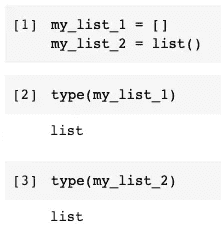
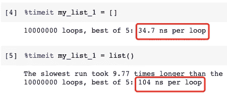

# 不，[]和 list()在 Python 中是不同的

> 原文：<https://towardsdatascience.com/no-and-list-are-different-in-python-8940530168b0?source=collection_archive---------3----------------------->


图片来自 [Pixabay](https://pixabay.com/?utm_source=link-attribution&utm_medium=referral&utm_campaign=image&utm_content=4636996) 的 [Vagelis Dimas](https://pixabay.com/users/vagelisdimas-6518988/?utm_source=link-attribution&utm_medium=referral&utm_campaign=image&utm_content=4636996)

## 特殊的 Python 文字常量使你的程序更快更 Python 化

只要你是 Python 开发者，就一定用过这个列表。它是 Python 中最常用的容器类型。另外，我猜你一定知道我们可以使用成对的方括号`[]`来初始化一个空列表。

这篇文章实际上是从与某人的讨论开始的。他认为使用`list()`来初始化 Python 列表更具可读性。显然，这个人很可能来自其他编程语言。好吧，我说如果有人坚持写像`my_list = list()`这样的东西，这确实不是世界末日。但坦率地说，`my_list = []`不仅更“蟒”，而且速度更快。

在本文中，我将演示性能的比较。更重要的是，我会告诉你为什么`my_list = []`更快。

# 性能的比较


图片来自 [Pixabay](https://pixabay.com/?utm_source=link-attribution&utm_medium=referral&utm_campaign=image&utm_content=6518594)

在深入细节之前，最好先验证一下性能。总是建议先证明想法，再去保护它，甚至争论:)

让我们从初始化 Python 列表的两种方式开始。

```
my_list_1 = []
my_list_2 = list()
```



就结果而言，他们是一样的。这两条语句都给了我们一个 Python 列表。现在，我们需要测量**性能**。

对于像 Jupyter 这样的 Python 笔记本，使用神奇的命令`%timeit`来测量性能是非常容易的。

```
%timeit my_list_1 = []%timeit my_list_1 = list()
```

请注意，上面两行代码需要在不同的单元格中运行。



如结果所示，使用`[]`大约比`list()`快 3 倍。它非常有信心，因为结果是基于 10，000，000 次运行。

你可能也会对其他类似的场景感兴趣，比如`{}`和`dict()`。事实上，在这些情况下也存在性能差距。


# 字节码故障调查


图片来自 [Pixabay](https://pixabay.com/?utm_source=link-attribution&utm_medium=referral&utm_campaign=image&utm_content=6517488) 的 [János Bencs](https://pixabay.com/users/bejan-3893186/?utm_source=link-attribution&utm_medium=referral&utm_campaign=image&utm_content=6517488)

要了解幕后发生了什么，我们可以去 Python 的底层寻找答案，也就是字节码。

字节码可以被认为是 Python 解释器的一系列指令或低级程序。对于大多数开发人员来说，没有必要学习它，但是知道这样的东西存在是很好的。这一次，我们将使用字节码来调查在两个列表初始化语句运行期间发生了什么。

Python 中有一个内置模块叫做`dis`(代表“反汇编器”)，可以将一段 Python 代码反汇编成字节码。

```
from dis import disdis("[]")dis("list()")
```


我们可以看到两种方法的字节码完全不同。那一定是性能不同的原因。

当我们使用`[]`时，字节码显示只有两个步骤。

1.  `BUILD_LIST` —相当自圆其说，只是建立一个 Python 列表
2.  `RETURN_VALUE` —返回值

很简单吧？当 Python 解释器看到表达式`[]`时，它就知道需要建立一个列表。所以，这很简单。

`list()`怎么样？

1.  `LOAD_NAME` —试着找到对象“列表”
2.  `CALL_FUNCTION` —调用“list”函数构建 Python 列表
3.  `RETURN_VALUE` —返回值

每次我们使用有名字的东西时，Python 解释器都会在现有变量中搜索名字。顺序是局部作用域->封闭作用域->全局作用域->内置作用域(本文我就不展开这个话题了。请让我知道你是否对此感兴趣。我会再写一篇关于它的文章)。

这一搜索肯定需要一些时间。有没有尝试过使用一些没有定义的变量或者函数？例如，如果我们有一个变量名或函数名的输入错误，就会抛出如下的`NameError`。


这是 Python 解释器试图在所有作用域中查找名称，但没有找到任何匹配的情况。

`list`在内置范围内，以便解释器可以明确地找到它。然后，解释器意识到我们在它后面放了一对括号`()`，所以它是一个应该被调用的函数。

最后，列表将被构建并返回。

# 关于文字常数的讨论


来自 [Pixabay](https://pixabay.com/?utm_source=link-attribution&utm_medium=referral&utm_campaign=image&utm_content=971774) 的[Steen ml ler laur sen](https://pixabay.com/users/steenml-856823/?utm_source=link-attribution&utm_medium=referral&utm_campaign=image&utm_content=971774)的图片

好吧，我们知道`list()`需要额外的步骤来搜索和调用函数名，但是为什么解释器知道`[]`应该做什么呢？

键被称为“文字常量”或“文字值”。

最常见的文字常量是数字和字符串，比如`23`和`'hello'`。当我们写这样的表达式时，解释器知道它们是文字值。因此，它们不需要匹配任何变量范围内的任何内容。


表达式`[]`和`{}`在 Python 中也是文字值。

# 摘要


图片来自 [Pixabay](https://pixabay.com/?utm_source=link-attribution&utm_medium=referral&utm_campaign=image&utm_content=586185) 的 [Ryan McGuire](https://pixabay.com/users/ryanmcguire-123690/?utm_source=link-attribution&utm_medium=referral&utm_campaign=image&utm_content=586185)

在本文中，我展示了使用`[]`和`list()`初始化 Python 列表是完全不同的，无论是在性能方面还是在幕后的实际步骤方面。

研究这样一个无关紧要的问题，这大概是在白费力气。然而，吹毛求疵有时能使我们发现更多的知识，这些知识可能在其他方面有所帮助。

[](https://medium.com/@qiuyujx/membership) [## 阅读克里斯托弗·陶的每一个故事(以及媒体上成千上万的其他作家)

### 作为一个媒体会员，你的会员费的一部分会给你阅读的作家，你可以完全接触到每一个故事…

medium.com](https://medium.com/@qiuyujx/membership) 

如果你觉得我的文章有帮助，请考虑加入 Medium 会员来支持我和成千上万的其他作者！(点击以上链接)