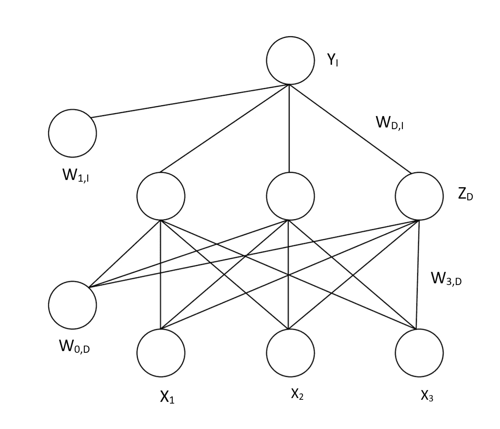
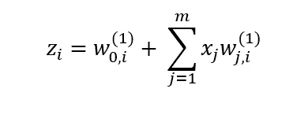
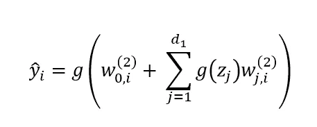
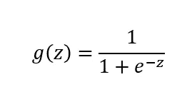
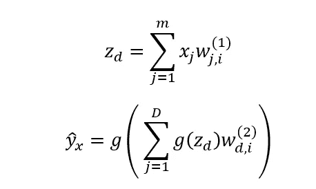
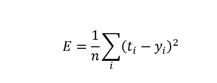
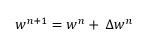
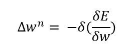

# 神经网络无代码介绍

> 原文：<https://towardsdatascience.com/no-code-introduction-to-neural-networks-7b4187a8d100?source=collection_archive---------50----------------------->

## 简单的架构解释

美国宇航局在 [Unsplash](https://unsplash.com?utm_source=medium&utm_medium=referral) 拍摄的照片

神经网络已经存在了很长一段时间，是在 20 世纪 60 年代作为一种模拟神经活动的方法为人工智能系统的开发而开发的。然而，自那时以来，它们已发展成为一种有用的分析工具，经常用来取代或结合标准的统计模型，如回归或分类，因为它们可以用来预测或更具体的产出。这方面的主要区别和优势在于，神经网络对数据背后的关系或分布形式不做任何初始假设，这意味着它们可以更加灵活，并捕捉输入和输出变量之间的非标准和非线性关系，使它们在当今数据丰富的环境中具有难以置信的价值。

在这个意义上，它们的使用已经持续了十年左右，随着成本的下降和一般计算能力的提高，大型数据集的兴起允许这些模型被训练，以及 TensforFlow 和 Keras 等框架的发展，这些框架允许人们拥有足够的硬件(在某些情况下，这甚至不再是云计算的要求)，正确的数据和对给定编码语言的理解来实现它们。因此，这篇文章试图提供一个没有代码的介绍，介绍它们的架构和工作原理，以便更好地理解它们的实现和好处。

首先，这些模型的工作方式是，有一个输入层，一个或多个隐藏层和一个输出层，每个层通过突触权重层连接。输入层(X)用于接收输入的缩放值，通常在 0-1 的标准化范围内。然后，隐藏层(Z)用于使用权重和激活函数来定义输入和输出之间的关系。然后，输出层(Y)将隐藏层的结果转换为预测值，预测值通常也在 0–1 范围内。连接这些层的突触权重(W)用于模型训练，以确定分配给每个输入和预测的权重，从而获得最佳模型拟合。视觉上，这表现为:

X =输入节点，Z =隐藏层节点，Y =输出层节点

该结构意味着，到隐藏节点 z𝒹的每个输入 xᵢ乘以权重 wⱼᵢ，然后与引入权重矩阵 w₀ᵢ的附加偏差相加，该附加偏差形成进入隐藏节点的值。在上图中，这由从每个 xᵢ和 W₀𝒹到每个 z𝒹.的价值流来表示

然后，节点处的值通过非线性传递函数 g 进行变换，传递函数 g 通常采用 sigmoid 函数的形式，但也可以采用其他性能良好的形式(有界、单调递增和可微)，包括 tanh 和 relu 函数。这样做的目的是将非线性引入网络，这允许我们对数据中的非线性关系进行建模。

然后，根据输出节点的数量，并假设一个单独的隐藏层，来自隐藏节点的值乘以一个权重并求和，再加上应用于所有值的附加隐藏偏差，并通过输出传递函数将其转换为最终的输出估计值。该单层神经网络可以采取如下形式:

其中非线性激活函数由 sigmoid 函数给出:

在这种情况下，g 是用作隐藏层传递函数(内部 g)和输出单元传递函数(外部 g)的相同函数，但是在某些情况下，它们可能不同，并且可能取决于模型的类型和期望的输出。此外，虽然我们已经通过额外的权重 W₀将偏差添加到模型中，但是这些可以被吸收到权重矩阵中，使得这些额外的权重可以被丢弃，从而使得上面的等式更简单:

事实上，我们称之为单层神经网络是指单个隐藏层，但这通常也可以称为输入、隐藏和输出层的三层神经网络或单个隐藏层神经网络。惯例是将层数称为隐藏层数，因为输入和输出层始终是网络的一部分。

训练它们的方式是通过反向传播，由此调整隐藏层中的权重以反映由输出和目标 value⁴.之间的关系确定的模型中的误差因此，这被称为反向传播，因为误差在每个时期(模型运行的周期数)之后通过网络反向传播。这种误差关系可以采取多种形式，包括二元交叉熵损失和均方误差(MSE)损失，并且由您正在使用的模型类型决定。例如，回归通常与均方误差损失相关，而分类通常与二元交叉 Entropy⁵.相关后者可以表示为:

其中 e 是模型的误差，tᵢ是目标，yᵢ是输出值。这通过模型中的权重矩阵转换回来，因为权重由以下各项更新:

其中:

权重的变化由学习率δ确定，δ是预先设置的常数，用于确定权重变化对模型内的误差有多敏感。进行这种调整，直到观察不到进一步的收敛，因此最小值是 reached⁴.因此，设置学习率是模型的一个重要参数，如果调整太大，那么结果会不稳定地反弹，达不到最小值，而如果调整太小，那么模型会陷入局部最小值而不是全局最小值。在现实中，即使有正确的学习率，找到全局最小值也是很难的，这就是为什么经常用不同的起始值进行多次试运行。

开发这些模型通常遵循三个主要阶段:选择合适的网络架构、网络学习和确定网络参数，以及测试 model⁶.的推广虽然该过程的第一和第三部分由所使用的确切数据和该领域内的惯例来确定，但是第二部分通常由反复试验来确定，以选择正确的节点数量、要运行的时期数量和学习 rate⁴.这包括关注在预期的参数范围内，哪组参数在测试或验证集上表现最好。例如，每个隐藏层中隐藏单元的数量通常通过找到产生最佳拟合的数量来设置。

这些模型的优势在于，它们可以应用于各种问题，以确定传统统计测试无法应用的关系，并且它们可以检查否则不会被发现的非线性关系。然而，这些是数据饥渴模型，通常需要数千甚至数百万个数据点来精确训练，并且通常被描述为黑盒模型，因为我们无法知道它们是如何得到最终结果的。因此，在决定选择哪种模式时，个人应该问 questions⁷:几个关键问题

1.  准确性和可解释性的要求是什么
2.  这个问题有什么先验知识
3.  传统的统计模型可以足够精确地使用吗
4.  神经网络的设计和评估要求是什么

**参考文献**

[1]布莱克，w .，1995 年。基于人工神经网络的空间交互建模。*《运输地理杂志》，* 3 卷 3 期，第 159–166 页。

[2]费希尔和戈帕尔，s .，1994 年。人工神经网络:区域间电信流建模的新方法。*《区域科学杂志》，*第 34 卷第 4 期，第 503–527 页。

[3]麻省理工深度学习入门:[https://www.youtube.com/watch?v=5tvmMX8r_OM&list = PLT bw 6 njqru-rwp 5 _ _ 7c 0 oivt 26 zgjg 9 ni&index = 2](https://www.youtube.com/watch?v=5tvmMX8r_OM&list=PLtBw6njQRU-rwp5__7C0oIVt26ZgjG9NI&index=2)

[4]h .切利克，2004 年。用人工神经网络模拟货运分配。*《运输地理杂志》，* 12 卷 2 期，第 141–148 页。

[5][https://machine learning mastery . com/loss-and-loss-functions-for-training-deep-learning-neural-networks/](https://machinelearningmastery.com/loss-and-loss-functions-for-training-deep-learning-neural-networks/)

[6]菲舍尔，硕士，2013 年。*神经空间相互作用模型:网络训练、模型复杂性和泛化性能。*何池敏市，ICCSA。

[7]m . Karlaftis 和 e . Vlahogianni，2011 年。交通研究中的统计方法与神经网络:差异、相似性和一些见解。*运输研究 C 部分:新兴技术，* 19(3)，第 387-399 页。

</introduction-to-hierarchical-clustering-part-1-theory-linkage-and-affinity-e3b6a4817702>  </introduction-to-random-forest-classifiers-9a3b8d8d3fa7>  </introduction-to-decision-tree-classifiers-from-scikit-learn-32cd5d23f4d> [## scikit-learn 决策树分类器简介

towardsdatascience.com](/introduction-to-decision-tree-classifiers-from-scikit-learn-32cd5d23f4d)