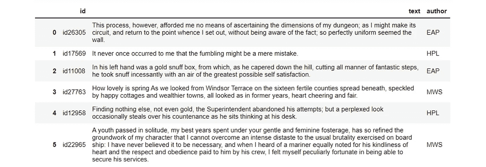
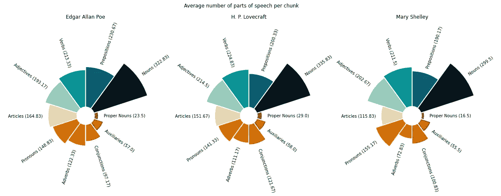
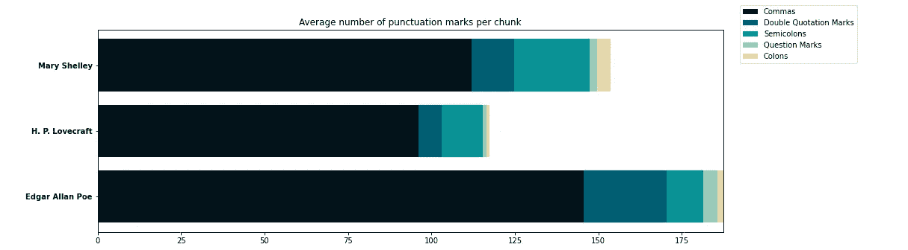
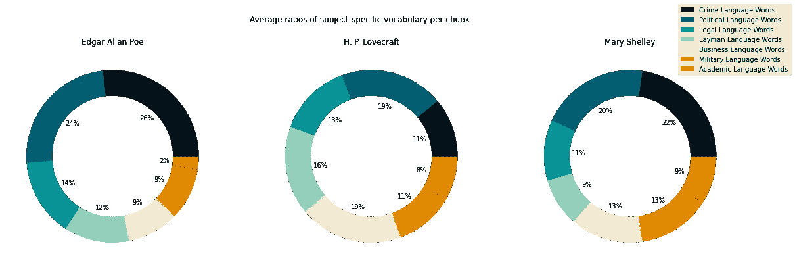
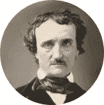

# 使用 expert.ai 进行无所畏惧的风格测量

> 原文：<https://towardsdatascience.com/no-fear-stylometry-with-expert-ai-163892fd234?source=collection_archive---------19----------------------->

## [实践教程](https://towardsdatascience.com/tagged/hands-on-tutorials)

## 有效的可视化，以发现是什么使一个作家的风格独特

来源:[迈阿密大学图书馆，数字馆藏](https://www.flickr.com/photos/muohio_digital_collections/3093617372/)

[风格测量](https://programminghistorian.org/en/lessons/introduction-to-stylometry-with-python)领域可能会被视为一种学科怪物——硬科学和模糊人文科学的怪异结合，被认为会给人文学家和数据科学家带来恐惧。甚至它的名字也可能让人毛骨悚然。很难发音，它唤起了一个自命不凡的词源和数学精确的可怕光环。

尽管如此，计算语言学的这一分支已经存在了一段时间。一个多世纪以来，笔形学家一直使用统计方法来区分人们独特的书写方式。自从 20 世纪 60 年代以来，他们依靠计算机来产生他们的分析，量化[单词](http://sappingattention.blogspot.com/2011/10/comparing-corpuses-by-word-use.html)、[搭配](https://www.youtube.com/watch?v=ChMCYw8Cyf8)、[句子的结构](https://litlab.stanford.edu/LiteraryLabPamphlet5.pdf)等等。

在这篇文章中，我将通过向你展示如何没有太多麻烦地执行一个基本的笔式分析来试图驱散笔式测量的怪异。为此，我将使用 [Writeprint](https://docs.expert.ai/nlapi/latest/guide/detection/writeprint/) ，这是 [expert.ai 自然语言 API](https://docs.expert.ai/nlapi/latest/) 的功能之一。通过遵循这一指南——并参考补充的 [Jupyter 笔记本](https://github.com/coprinus-comatus/writeprint_stylometry/blob/main/writeprint_stylometry_notebook.ipynb)——你很快就能洞察到构成你最喜欢的作家的独特声音的文体特征。

# 1.程序

## 1.1.数据集

为了测试 Writeprint 的功能，我们将在[幽灵作者识别](https://www.kaggle.com/c/spooky-author-identification)数据集上工作，该数据集是由 Kaggle 团队为其[竞赛之一](https://www.kaggle.com/competitions)制作的。这个数据集包含了几千个句子，摘自三位所谓的“幽灵”作者的作品:[埃德加·爱伦·坡](https://en.wikipedia.org/wiki/Edgar_Allan_Poe)、 [H. P .洛夫克拉夫特](https://en.wikipedia.org/wiki/H._P._Lovecraft)和[玛丽·雪莱](https://en.wikipedia.org/wiki/Mary_Shelley)。

作者图片

在竞赛中，Kaggle 要求参赛者“从他们的作品中识别恐怖作家”在这里，我们将做一些稍微不同的事情:我们将试图发现*哪些具体特征*使他们的写作风格独一无二。

## 1.2.预处理

我们首先收集与每个作者相关的所有行。

由于 expert.ai NL API 只能处理小于 10 kB 的文本块[，我们应该将这些长字符串拆分成较短字符串的列表。通过使用](https://github.com/therealexpertai/nlapi-python#apis-capabilites)[分词器](https://www.nltk.org/api/nltk.tokenize.html)，我们可以确保这些较短的字符串将只包含完整的句子。

## 1.3.正在检索 Writeprint 索引

现在我们准备好检索我们的 Writeprint 索引。要从您的系统访问 expert.ai NL API，您可以遵循 Laura Gorrieri 关于主题建模的优秀文章[中的说明。一旦我们访问了 API，我们就可以一次向它发送一个文本块，将所有的 Writeprint 响应存储在一个列表中。](/visualizing-what-docs-are-really-about-with-expert-ai-cd537e7a2798)

对于每个文本块，API 返回一个 [JSON 对象](https://docs.expert.ai/nlapi/latest/reference/output/detection/writeprint/)，列出 Writeprint 的 [60 个索引和相应的值。可以通过访问 Writeprint 对象中包含的“extra_data”属性来提取这些值。](https://docs.expert.ai/nlapi/latest/guide/detection/writeprint/#readability-indexes)

## 1.4.组织索引

一开始，浏览 Writeprint 返回的 60 个索引可能会让人感到十分畏惧。当你准备你的分析时，我建议你遵循官方 API 文档中提出的分类。例如，您可以创建特定的索引列表，一次分析一个类别:语法、标点符号、词汇等等。

选择一个类别后，我们可以访问已经创建的 Writeprint 对象的列表，然后处理相关的值。这些可以存储在字典中:它们的关键字是字体索引的名称，它们的值是总数或平均值。

# 2.形象化文体特征

以下是一些如何有效地可视化测式数据的示例；你会在 Jupyter 笔记本中找到更多关于这个项目的内容。

## 2.1.语法特征的圆形条形图

[圆形柱状图](https://www.python-graph-gallery.com/circular-barplot/)可以用来比较作家组织句子的方式。在下面的例子中，每个条形告诉你作者在一段文本中使用某一词类的平均次数。那么，哪位作家倾向于使用更多的介词呢？哪个看起来更反感副词？

作者图片

## 2.2.标点符号的堆积条形图

你可以使用[堆积条形图](https://www.python-graph-gallery.com/12-stacked-barplot-with-matplotlib)来比较标点符号的不同习惯。你在这里看到的显示了每个作者在一段文字中使用的标点符号的平均数量。哪个作家似乎更喜欢分号？而哪个更不太会用问号？

作者图片

## 2.3.特定主题词汇的圆环图

最后，我们可以使用[环形图](https://www.python-graph-gallery.com/donut-plot/)来展示不同作者如何使用特定主题的词汇。这些图表显示了在一段文本中发现的术语平均属于某个领域。我们在哪里可以找到更多与犯罪相关的词汇？而我们从哪里找到更高比例的外行术语呢？

作者图片

# 3.解释结果

但是这些图表真正告诉我们这些作者的风格特点是什么呢？为了评估他们的洞察力，我们可能想回到一些怪异的页面，这些样本就是从这些页面中提取的。

作为一个实验，让我们考虑一下埃德加·爱伦·坡的 [*【被窃的信】*](http://poestories.com/text.php?file=purloined) 、H. P .洛夫克拉夫特的 [*【邓威奇的恐怖*](http://www.hplovecraft.com/writings/texts/fiction/dh.aspx) 和玛丽·雪莱的 [*弗兰肯斯坦*](https://standardebooks.org/ebooks/mary-shelley/frankenstein/text/single-page#letter-1) 的开头句子。

## 3.1.埃德加·爱伦·坡

埃德加·爱伦·坡的肖像——来源:[维基共享资源](https://en.wikipedia.org/wiki/Edgar_Allan_Poe#/media/File:Edgar_Allan_Poe,_circa_1849,_restored,_squared_off.jpg)

> 在巴黎，18 年秋天的一个刮大风的夜晚，天黑后，我和我的朋友西·奥古斯特·杜宾一起，在他的小图书馆，或图书室，au troisième，Rue Dunô，圣日耳曼郊区 33 号，享受冥想和海泡石的双重奢侈。至少一个小时，我们保持了深刻的沉默；而在任何不经意的旁观者看来，每个人似乎都全神贯注地全神贯注于压抑着房间气氛的袅袅青烟。

在这一节选中，我们可以看到坡如何使用许多逗号和介词(“At”、“In”、“of”等)。)，与我们在图表中看到的一致。这些为句子提供了一个脉动的节奏，推动读者向内:从巴黎的大城市到幽闭恐怖的密室，这一场景就是在这里发生的。

## 3.2.洛夫克拉夫特

H. P .洛夫克拉夫特的肖像——来源:[维基共享资源](https://en.wikipedia.org/wiki/H._P._Lovecraft#/media/File:H._P._Lovecraft,_June_1934.jpg)

> 当一个在马萨诸塞州中北部的旅行者在迪安角外的艾尔斯伯里派克路口走错了岔路时，他来到了一个孤独而好奇的国家。地面越来越高，荆棘镶边的石墙越来越贴紧尘土飞扬的弯曲道路的车辙。

与坡不同，洛夫克拉夫特使用较少的逗号，他更喜欢简单的连词(“and”在这里出现了三次)。正如我们的分析所预期的那样，他主要依靠形容词来传达他的诡异景观的诡异气氛(“孤独”、“好奇”、“尘土飞扬”等)。).

## 3.3.玛丽·雪莱

玛丽·雪莱的肖像——来源:[维基共享资源](https://commons.wikimedia.org/wiki/Mary_Shelley#/media/File:Mary_Wollstonecraft_Shelley_Rothwell.tif)

> 你会高兴地听到，你曾如此不祥地预感到的一项事业的开始并没有伴随着灾难。我昨天到达这里，我的第一个任务是向我亲爱的妹妹保证我的幸福和增加我事业成功的信心。

在这里，雪莱将读者带入了两个无名角色之间的激烈交锋，他们的关系以代词“你”和“我”为前景。为了进一步突出这种亲密的视角，大多数名词前面都没有冠词，而是用人称形容词(“我的福利”、“我的事业”等)。).我们的图表表明，代词的丰富和文章的匮乏通常是她散文的特色。

大多数风格学研究把他们的工具当作一架飞机，在飞机上人们可以调查大量未知的文本，发现通常躲避人眼的模式。然而，文体学工具也可以用作一套放大镜，通过它我们可以近距离检查文本，并发现我们可能会忽略的小特征的重要性。

无论你的目标是什么，风格学都可以为你提供宝贵的洞察力，让你知道是什么让某人的作品独一无二。所以，不要害怕继续尝试文本、索引和可视化——你很可能会发现一些关于你喜欢的作家的新东西。