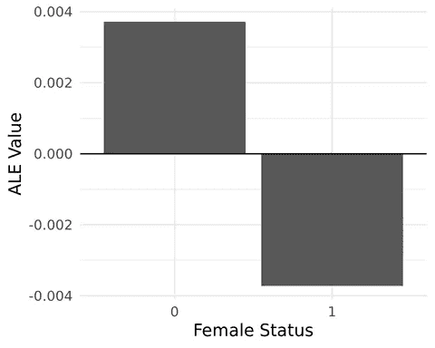
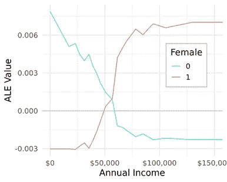
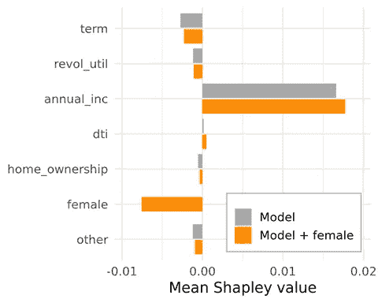

# 没有特征偏见的免费午餐

> 原文：<https://towardsdatascience.com/no-free-lunch-with-feature-bias-561c9cd3dd18?source=collection_archive---------16----------------------->

## [实践教程](https://towardsdatascience.com/tagged/hands-on-tutorials)

## 非线性模型可能不会自动包含成对的相互作用

照片由[阿拉·赫特曼](https://unsplash.com/@allahetman?utm_source=medium&utm_medium=referral)在 [Unsplash](https://unsplash.com?utm_source=medium&utm_medium=referral) 上拍摄

非线性模型捕捉相互作用的潜力导致了一些建议，如性别或种族等敏感特征应包括在模型中，以减轻特征偏差[1]。这一观点挑战了传统的观点，即敏感特征应该从模型中排除，因为使用这些特征作为决策基础存在伦理问题。在这里，我将论证基于树的集合模型自发地包含相互作用的能力是不完善的。交互可能只被部分捕获，或者敏感特征可以以“类似主效果”的方式被合并到模型中。我们不一定要纠正特征偏差，只是以一种非特定的方式对其进行补偿。

当机器学习模型中预测变量的含义在不同组之间变化时，就会出现特征偏差。对于自我报告的信息或依赖于人类判断的特征，这尤其可能发生。一些例子可能是自我报告的健康信息中的性别差异[2，3]，反映评估者隐含偏见的表现分数，或当人类在追究和忽略哪些罪行时的轻微犯罪逮捕率中的种族偏见[1]。当反映这种偏见的特征被包括在模型中时，它们有可能不公正地惩罚某些群体。

出于对自己项目的担忧，我开始阅读关于公平主题的论文。我想了解并遵循最佳实践。一篇我认为总体上非常有帮助的论文提出了一些针对特征偏差的缓解策略[1]:

> 幸运的是，在没有标签偏差(即 y 方向的测量误差)的情况下，这种特征偏差在统计学上是很容易解决的。具体而言，可以在预测模型本身中包括群体成员资格(例如，种族和性别)，或者可以为每个群体拟合单独的风险模型。以这种方式——并且在 y 被精确测量的假设下——统计模型将自动学习根据组成员适当地加权预测值。例如，在预测暴力惯犯时，一个模型可能会学习降低黑人被告过去因毒品被捕的权重。

当我第一次读到这个的时候，我并没有觉得它有多好。起初，非线性模型将相关的相互作用纳入其解决方案是有道理的。然而，我最近被迫挑战这些假设。

我的错误想法是这样的，“如果在特征 x 和 y 之间有交互作用，在训练期间，树将被建立，首先在 x 上分裂，然后在 y 上分裂，从而捕获依赖性。”当我更努力地思考时，我意识到这可能是一个拥有交互预知的人如何构建一棵树，但机器学习模型的功能不同。

我的想法可能不正确的第一个线索是 Scott Lundberg 在《走向数据科学》[4]中的文章。他模拟了 XGBoost 模型中的特征偏差，并显示了模型中包含和不包含敏感特征时聚合 Shapley 图的变化。对我来说，这些图看起来好像有偏见的特征与敏感的特征没有相互作用，我想知道为什么没有(我将在后面讨论基于 Shapley 的技术的细节)。

在看了 Lundberg 的图之后，我阅读了一些关于基于树的模型中成对相互作用的现有文献。尽管没有具体到公平性或特征偏差的问题，但现有文献提供了在假设基于树的模型将包含成对交互时保持谨慎的理由。一些作者已经表明，尽管基于树的模型可以包含交互作用[5]，但不能保证它们会这样做[6，7]。

在公平的背景下，我们需要理解的不仅仅是交互作用是否被纳入，而是在多大程度上被纳入，以及敏感特征是否以“类似主效应”的方式在某种程度上起作用。如果交互被微弱地捕获，我们可能不能完全减轻偏见。或者，如果一个模型包含任何来自敏感特征的“类似主要效果”的贡献，我们就冒着刻板化的风险，潜在地增加而不是减少了偏见。我们可能是在补偿特征偏差，而不是纠正它，这可能会改善群体指标，但会对个体结果产生负面影响。

在下面的小节中，我将模拟一个特性偏差场景，创建一个对实际结果没有影响的敏感特性，但是它会影响一个有影响的特性的值。在这种情况下，敏感特征仅通过与偏向特征的相互作用来起作用。然而，我将表明，该模型纳入预期的相互作用弱，敏感的特点有一个实质性的边际影响。因此，我低估了特征偏见，同时冒着刻板印象的风险。

# 示例数据集

我使用我在以前的博客文章[9]中使用的相同的公共贷款数据集[8]；该文件包含关于贷款金额和借款人特征的信息，以及贷款违约状态，这是我将建模的结果。和以前一样，我创建了一个人工的、简化的“性别”类别，只有两个层次。然而，对于这篇文章，我随机分配性别，将 40%的案例分配给“女性”类别。这个项目的源代码可以在 GitHub [10]上找到。

我使用我虚构的性别类别将特征偏差引入年收入特征，这是一个强有力的整体预测指标[9]。我使用二元女性指标。仅对于女性，我将收入特征的值平均降低 40%，并在抑制量上做了一些随机化处理。结果是一个夸大的特征偏差场景，男性的平均收入是 62000 美元，而女性是 35000 美元。

在这个例子中，性别(这是虚构的)对某人是否真的拖欠贷款没有任何影响，但它会影响其收入报告的可靠性。我将探索在模型中引入性别特征如何捕捉交互并补偿特征偏差。我关注两种模式:

1.使用数据集中的所有预测值构建的模型，但修改了收入特征以模拟特征偏差

2.与模型 1 相同，但也包括女性身份特征。

所有结果都是在保留的验证数据集上测量的。我展示了对随机森林模型的分析，因为结果很容易解释。我用 XGBoost 模型重复了所有的分析，看到了更少的不足修正，但是女性特征的实质性主要影响；我计划在未来关于特性偏差缓解策略的博客文章中讨论 XGBoost 模型。

# 人口均等

因为分配是随机的，所以两个群体的实际结果非常相似。但是，特征偏差会导致各组预测的差异，如下所示:

按“性别”划分的实际和预测违约率

包含敏感特性似乎在很小程度上修正了比率，这使我认为包含敏感特性并不能完全补偿特性偏差。是否有任何影响是由于模型中相互作用的结合，还是由于概率的“类似主要影响”的调整，还有待观察。

# 累积局部效应图

累积局部效应(ALE)图是一种用于说明特征值对模型预测的平均效应的方法。ALE 图类似于部分相关图，除了它们被设计用于调整相关性，当特征值的不太可能的组合被包括在计算中时，相关性可能使平均值有偏差[11]。

就我的目的而言，ALE 图是非常可取的，因为它们可以揭示女性特征的主要影响，在考虑了交互作用之后，包括收入-女性交互作用。因此，女性特征的单特征 ALE 图仅反映了类似主效应的贡献。如果我严格校正特征偏差，不引入定型，我希望女性特征的单向 ALE 值接近于零。

我为 50%男性和 50%女性组成的样本验证数据创建 ALE 图。对于包含收入和女性身份的模型，以下是女性特征的 ale 图:

女性指标的单向 ALE 图。图片作者。

我们看到了一些主要影响的证据，女性地位倾向于全面补偿特征偏见。

双向 ALE 图仅显示了二阶效应[11]，从而能够隔离收入-女性相互作用:

收入和女性地位的双向 ALE 图。图片作者。

在双向图中，交互效应因收入而异。在收入较低的情况下，互动项会推高男性违约率，而在收入较高的情况下，这一趋势正好相反。

将双向图中的值与单特征结果进行比较，可以提供关于主效应和交互作用项的相对强度的信息。注意，对于许多收入水平，ALE 相互作用值的大小(来自双向图)与主要效应 ALE 值(来自单向图)相当。因此，我们可以得出结论，我们的模型包括交互作用和女性特征的主要影响。我们在一定程度上纠正了我们的特征偏见，但在类似的程度上，我们只根据性别(刻板印象)做决定。

# 检查树木

虽然不是定量的，但我们可以通过调查树形结构来评估女性地位是如何被纳入模型的。如果女性地位仅作为与收入的相互作用而被纳入模型，我们预计女性特征将仅出现在也涉及收入的决策路径上。

这个随机森林模型包含 150 棵树，每棵树平均有 1，360 个节点。因此，直接检查树木是不切实际的。但是通过追踪每棵树中的决策路径，我们可以获得关于交互的信息。下表总结了所有树(平均列)和 3 个随机选择的独立树的决策路径信息。

随机森林中的树的决策路径计数，包括所有树和三个示例树的平均值

平均每棵树包含大约 16 条涉及女性特征但不涉及收入的路径——这些反映了敏感特征的意外贡献。如果这些路径没有不成比例地包含特定的其他特征，这些可能是“主效应类似”,或者它们可能代表虚假的交互。有趣的是，其中一个样本树(#1)只包含与收入相关的女性特征，这正是我们在解决方案中所希望的。然而，许多其他树木显示出雌性特征的额外影响。

# 聚合 Shapley 值

Scott Lundberg 建议对 Shapley 值进行汇总，以确定导致模型结果中人群差异的特征[4]。因为可以对个体概率进行平均以获得组概率，并且可以使用 Shapley 将个体概率分布到各个要素，所以总体差异也可以分布到各个要素。Lundberg 的文章展示了在同时包含要素和标注偏差的数据集中包含敏感要素的影响；在他的例子中，增加一个敏感特征并不能完全补偿特征偏差[4]

我将伦德伯格的技术应用到我的模型中。我修改了他的技术，用一个“箔”，或参考集，只包括男性，来检查女性样本(也见[9])。结果图显示了与男性相比，女性对超额概率的贡献。我查看了前 5 项功能，将其余功能归入“其他”类别，并绘制了包含和不包含敏感功能的 Shapley 聚合值:

女性病例与男性参考病例相比的综合 Shapley 值。颜色表示有和没有女性特征的特征偏差模型。图片作者。

对于随机森林，当女性特征被引入模型时，收入特征的影响适度增加，并且我们看到女性特征的负面贡献。我们也看到了其他特性的贡献的微小变化。

包含女性特征会如何影响沙普利图？在特征偏差的情况下，我们期望交互项的方向与收入的原始效应的方向相反。来自收入特征的 Shapley 值将包括来自主效应的贡献和一些来自交互的贡献。根据如何将相互作用纳入模型，以及是否通过纳入敏感特征来改变主要影响，收入特征的 Shapley 贡献可能会增加、减少或大致保持不变。

Shapley 图清楚地显示了特征偏差没有通过包含敏感特征而被完全校正。由于我完全随机地分配了女性地位，而聚集的 Shapley 图显示了女性与男性的概率差异，我预计收入加上女性地位的总贡献大约为零。这两种效应应该是相似且相反的，但很明显，女性效应明显弱于收入效应。

# 随机森林模型摘要

在这个示例场景中，在模型中包含女性身份不足以纠正特征偏差，同时包含女性身份的一些主要影响，从而引入定型风险。这与现有文献关于基于树的模型整合成对交互的能力的限制是一致的[6，7]。

即使添加一个敏感的特性不是完美的解决方案，也比什么都不做要好吗？我想答案会因情况而异。在某些情况下，通过包含这样的特征可以提高公平性。对于这个例子，我个人认为包含女性身份是不合理的。它在改变最终预测方面的好处非常有限，而且会带来风险。更不用说包含这样一个特性可能会让合规部门难以接受！

此外，我对特征偏差的模拟在某些方面非常不现实。在这里，特征偏差以相似的程度影响一个群体的所有成员。在真实的场景中，特征偏见更有可能影响所有群体的一些成员，但影响的程度不同。当特征偏见只影响每个群体中的一些成员时，个体将能够合理地争辩说“如果我是不同的性别(或种族，等等。)，我早就批准了”。

此外，在我的例子中，女性地位只与收入挂钩。女性地位既不与任何其他特征相关，也没有任何独立的影响。组成员资格可能与其他特征(包括或不包括在数据中)相关，在这种情况下，它可能作为这些特征的代理或替代被纳入模型。这将使通过这种方法的特征偏差校正变得复杂。

# 最后的想法

关于特征偏差的现有文献表明，引入敏感特征会自动减轻特征偏差。然而，Shapley 和 ALE 图，以及现有的关于公平环境之外的相互作用的研究，建议在假设基于树的模型将可靠地纳入重要的成对相互作用时要谨慎。这里显示的一个简单的例子说明了不足修正，以及可能引入刻板印象风险的主效应样贡献。

事实上，敏感特性不一定能纠正偏见，这并不意味着我们不应该使用包容作为缓解策略。在某些情况下，向模型添加敏感特征可能是最佳选择。但是考虑其他方法可能是个好主意。无论选择哪种策略，彻底测试您的模型以确保方法的行为符合预期是至关重要的！我计划在以后的博文中讨论一些其他可能的特性偏差缓解策略。

# **参考文献**

[1] S. Corbett-Davies 和 S. Goel，[《公平的度量和误度量:对公平机器学习的批判性评论》](https://5harad.com/papers/fair-ml.pdf) (2018)，工作文件，arXiv.org。

[2] N.E. Betz，L. Mintz 和 G. Speakmon，[自我报告体重准确性的性别差异](https://link.springer.com/article/10.1007/BF01420801) (1994)，性别角色 30:543–552。

[3] M. Sieverding、A.L .阿波加斯特、S. Zintel 和 C. von Wagner，[自我报告的癌症家族史中的性别差异:综述和二级数据分析](https://onlinelibrary.wiley.com/doi/full/10.1002/cam4.3405) (2020)，癌症医学，9:7772–7780。

[4]斯科特·伦德伯格(Scott Lundberg)，[解释公平的衡量标准](/explaining-measures-of-fairness-f0e419d4e0d7) (2020)，面向数据科学。

[5] M.N. Wright，A. Ziegler 和 I . r . knig，[在黑暗的随机森林中，微小的相互作用会不会丢失？](https://bmcbioinformatics.biomedcentral.com/articles/10.1186/s12859-016-0995-8) (2016)，BMC 生物信息学 17，145。

[6] S. Th。格里斯。[关于语料库语言学中的分类树和随机森林:一些警告和改进建议](https://www.degruyter.com/view/journals/cllt/ahead-of-print/article-10.1515-cllt-2018-0078/article-10.1515-cllt-2018-0078.xml) (2019)，《语料库语言学和语言学理论》16，3:617–647。

[7] A-L Boulesteix，S. Janitza，A. Hapfelmeier，K. Van Steen 和 c .施特罗布尔，[致编辑的信:关于随机森林文献中的术语“相互作用”和相关短语](https://www.ncbi.nlm.nih.gov/pmc/articles/PMC4364067/) (2015)，《生物信息简报》16，2:338–345。

[8] [4] h2o.ai. Lending Club 数据集，[https://raw . githubusercontent . com/h2oai/app-consumer-loan/master/Data/loan . CSV .](https://raw.githubusercontent.com/h2oai/app-consumer-loan/master/data/loan.csv.)

[9] V. Carey，[公平指标不会把你从刻板印象中拯救出来](/fairness-metrics-wont-save-you-from-stereotyping-27127e220cac,) (2020)，走向数据科学。

[10]诉凯里。GitHub 库，[https://github.com/vla6/Stereotyping_ROCDS.](https://github.com/vla6/Stereotyping_ROCDS.)

[11] C. Molnar， [5.3 累积局部效应(ALE)图](https://christophm.github.io/interpretable-ml-book/ale.html)，可解释的机器学习:使黑盒模型可解释的指南(2018)。