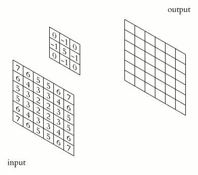
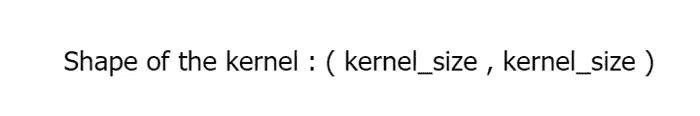
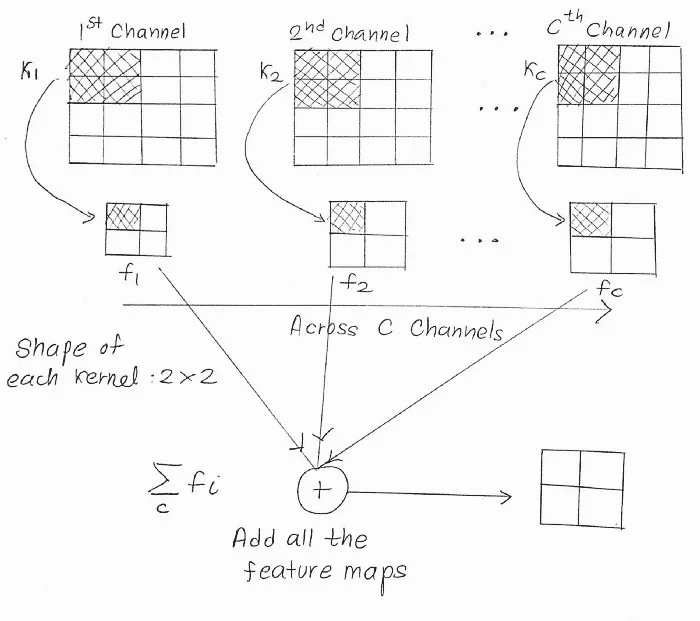
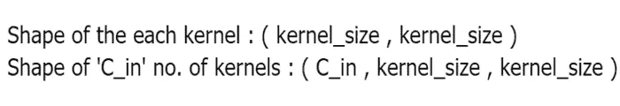
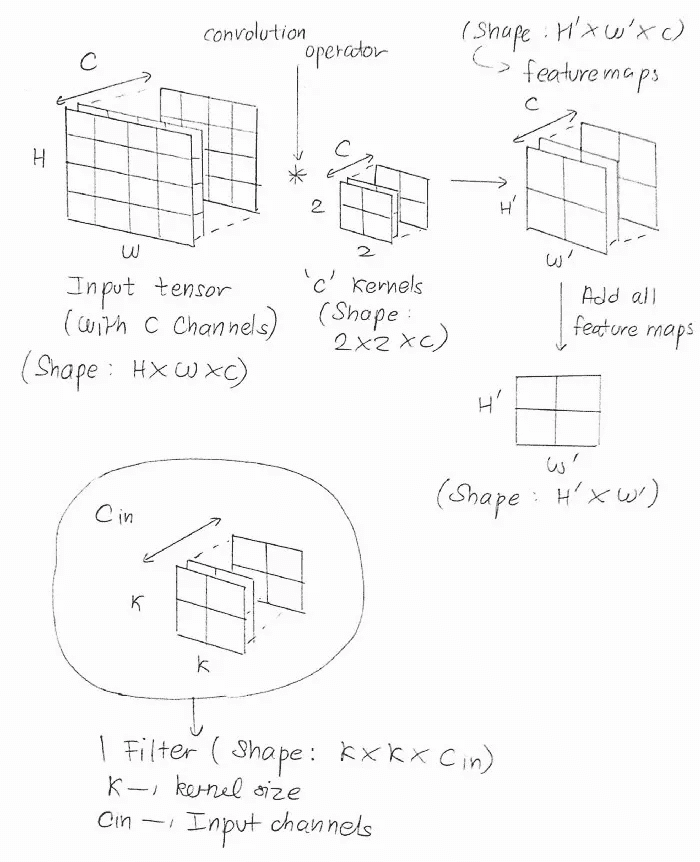
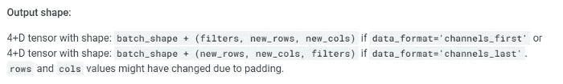

# 不，内核和过滤器是不同的

> 原文：<https://towardsdatascience.com/no-kernels-filters-are-not-the-same-b230ec192ac9?source=collection_archive---------5----------------------->

## 解决通常的困惑。


照片由 [Afif Kusuma](https://unsplash.com/@javaistan?utm_source=medium&utm_medium=referral) 在 [Unsplash](https://unsplash.com?utm_source=medium&utm_medium=referral) 上拍摄

对于我们大多数曾经是深度学习新手的人来说，尝试 MNIST 分类很有趣。卷积是计算机视觉中大多数算法的构建模块，除了一些较新的变体，如[视觉变形器](https://arxiv.org/abs/2010.11929v2)、[混合器](https://arxiv.org/abs/2105.01601)等。该专利声称不使用卷积就能解决图像相关的问题。DL 的核心是[梯度下降](https://builtin.com/data-science/gradient-descent)(及其变体)，它帮助我们优化神经网络的参数，从而减少我们在训练模型时遭受的损失。

[卷积或卷积层](/a-comprehensive-guide-to-convolutional-neural-networks-the-eli5-way-3bd2b1164a53)也拥有自己的参数，俗称 ***滤波器*** 。不，不是滤镜，但它们是 ***内核*** ，对吗？还是很困惑🙄，嗯，这就是故事的目的！

# 👉🏽卷积复习

正如大多数深度学习文献中所述，一个 ***2D 卷积层**接受一个形状为`( h , w , in_dims )`的张量，并产生一个形状为`( h' , w' , out_dims )`的特征图。如果没有[***填充**](https://www.geeksforgeeks.org/cnn-introduction-to-padding) ，`h'`和`w'`分别小于`h`和`w`。你可能见过这个流行的动画，它描述了单通道(`in_dims=1`)正方形(`h=w`)图像上的典型卷积运算。



单通道输入的卷积。来源:[维基共享资源](https://commons.wikimedia.org/wiki/File:2D_Convolution_Animation.gif)

在 2D 卷积的情况下，包含一些数字的矩阵，称为 ***内核*** ，在图像上移动。我们通常在这里设置`kernel_size`和`strides`。`kernel_size`决定内核的大小，而`strides`是内核在一个特定方向上移动的像素(值)的数量，以执行乘法。来自输入张量的值然后以*元素方式*与内核中的相应值相乘，最后求和以产生标量。然后内核向前移动(根据`strides`)并执行一个类似的问题。

然后，这些标量按照它们获得时的方式排列在 2D 网格中。然后我们会在它上面应用一些激活函数，比如 [ReLU](https://machinelearningmastery.com/rectified-linear-activation-function-for-deep-learning-neural-networks) 。

> ***2D 卷积层:**我们也有 1D 和 3D 卷积，其中内核分别在 1 维或 3 维移动。看到这个[直观的故事](/understanding-1d-and-3d-convolution-neural-network-keras-9d8f76e29610)。由于 2D 卷积应用广泛，而且容易形象化，我们将只考虑研究 2D 卷积的情况。
> 
> ***填充**:由于卷积运算降低了输入张量的维数，我们希望通过用零作为边界来恢复原始维数。用零执行的填充在 ML 域中被称为零填充。

# 👉🏽内核

> 核是在输入张量的单个通道上扫过的矩阵，或者更准确地说是卷积的矩阵。

使用同样的图表，就像我们之前使用的一样，


单通道输入的卷积。来源:[维基共享资源](https://commons.wikimedia.org/wiki/File:2D_Convolution_Animation.gif)

在上面的表示中，可以清楚地观察到 3 * 3 核在单通道输入张量上被卷积。在大多数实现中，内核是一个列(和行)数等于`kernel_size`的正方形矩阵，但也可以是矩形。这正是 [TensorFlow 文档](https://www.tensorflow.org/api_docs/python/tf/keras/layers/Conv2D)对其`tf.keras.layers.Conv2D`层的说法，

> `***kernel***` *:一个整数或 2 个整数的元组/列表，指定 2D 卷积窗口的高度和宽度。可以是单个整数，以便为所有空间维度指定相同的值。*



内核的形状(其中高度=宽度)。来源:作者图片

执行卷积操作后，我们留下了一个单一的通道特征图，如前所述。但是，有一个问题。大多数输入张量不会只有一个通道。即使我们对 RGB 图像执行卷积运算，我们也需要处理 3 个通道(即 R、G 和 B 通道)。但是，我们不需要担心，因为我们可以简单地为 3 个通道使用 3 个内核，对吗？

这是针对 3 个通道的，但如果我们有多个输入通道，比如 256 个通道张量呢？使用相同的类比，我们将有 256 个内核卷积 256 个通道中的每一个，从而产生 256 个特征图(如前所述，具有较小的尺寸)。所有这 256 个特征地图被加在一起，



在多个通道上卷积内核。来源:图片由作者提供。

如果 ***C_in*** 是输入通道数，那么，



来源:作者图片

这都是关于内核的！我们现在将前往 ***过滤器*** 。

# 👉🏽该过滤器

> 在输入张量的通道上卷积的所有核的集合。

一个 ***滤波器*** 是在输入张量的通道的卷积中使用的所有*号内核的集合。例如，在 RGB 图像中，我们对 R、G 和 b 三个通道使用了三种不同的内核，这三种内核统称为滤镜。因此，单个过滤器的形状是，*

**

*作者图片*

*让我们回到`tf.keras.layers.Conv2D`层的 TensorFlow 文档。它们包括该层的以下示例，*

```
*input_shape = (4, 28, 28, 3)
conv = tf.keras.layers.Conv2D( 2, 3, activation='relu', input_shape=input_shape[1:])(x)*
```

*对于实例化`Conv2D`时的第一个参数，给出的描述是，*

> *`***filters***`:整数，输出空间的维数(即卷积中输出滤波器的个数)。*

**

*来源:作者图片*

*每个过滤器将产生形状的特征图`H' * w'`。同样，`filters`个过滤器会产生`filters`过滤器。因此`Conv2D`层的输出形状是`( H' , W' , filters )`。这与`tf.keras.layers.Conv2D`的[张量流文档](https://www.tensorflow.org/api_docs/python/tf/keras/layers/Conv2D)中提到的输出形状相同，*

**

*来源:截图来自 [TensorFlow 文档](https://www.tensorflow.org/api_docs/python/tf/keras/layers/Conv2D)。*

*这就把我们带到了这个故事的结尾。希望你已经理解了这两个术语的区别。*

# *结束了*

*希望你喜欢这个小故事！欢迎在***equipintelligence@gmail.com***或在下面的评论中发表你的想法。祝你有美好的一天！*