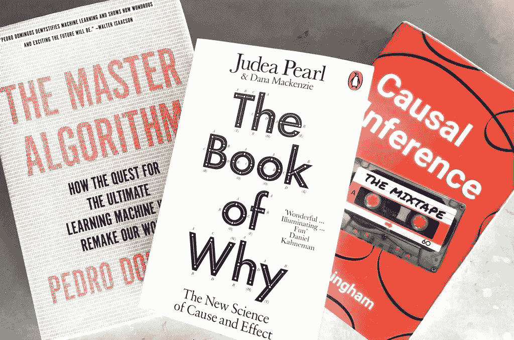

# 没有“为什么”就没有“什么”

> 原文：<https://towardsdatascience.com/no-more-what-without-the-why-d9da4b6f88b5?source=collection_archive---------27----------------------->

作者图片

## **是时候让组织联合机器学习和因果推理了**

在过去的几个月里，我有机会让各种组织和领导者利用他们的大型数据库进行机器学习。我特别与努力应对不断上升的辍学率的成员组织进行了接触——当个人收入不断下降，对失业的担忧日益加剧时，这个问题在整个疫情变得更加严重。

通过机器学习，我们使用了包含个人信息(如年龄、性别、职业、婚姻状况、邮政编码等)的大型会员数据库。)来识别具有高退出风险的学生，以他们为目标*事前*。一个非常好的分类问题。

**机器学习告诉我们“什么”，因果推理告诉我们“为什么”**

尽管机器学习模型的整体表现良好，但我们的客户总是对一个显而易见的问题感兴趣:为什么个别成员会离开？不幸的是，机器学习模型并不适合识别事情的*原因*，而是它们被建立来预测*事情*。

然而，了解离职原因具有巨大的商业价值，因为它决定了领导者必须采取的战略决策。例如，如果有人因为要出国而终止会员资格，那么降低会员费对保持会员资格几乎没有任何作用。

这些经历让我意识到，将机器学习的预测能力结合起来，以了解*【什么】*(例如，离职概率高的个人)，并将因果推理的方法结合起来，以了解*【为什么】*(例如，离职原因)，这对于充分利用组织内的海量数据集至关重要。

**衡量相关性容易，衡量因果关系不容易**

坚持我们的流失例子，一个组织可能会对其会员费的增加(一个潜在的解释变量)是否会导致会员离开(结果变量)感兴趣。估计这种因果关系绝非易事。从统计学 101 我们都知道，相关性不是因果关系——事实上，没有相关性也不是没有因果关系。因此，衡量因果关系的根本问题无法用更多甚至更好的数据来解决；这也不是一个(预测性的)建模问题本身，而机器学习在最近几年已经证明是如此成功。

[ [图片来源](https://unsplash.com/photos/KUeJcc4YUug)

相反，因果关系难以衡量的原因是[内生性](https://mixtape.scunning.com/)。其中一个最重要的来源是遗漏变量偏差，当一个未知的遗漏因素同时影响了感兴趣的自变量和结果变量时，就会出现遗漏变量偏差。

例如，让我们想象一个组织提出了一个新的解释因素——除了会员费——并且想要调查个人的年龄是否增加了离开组织的可能性。普通最小二乘(OLS)回归等常用方法不会产生有意义的结果，因为年龄和离职概率都可能受到个人收入等未知混杂因素的影响。这是因为较年轻的人通常收入较低，我们往往不了解这方面的信息。

不幸的是，在处理观察数据时，几乎所有的实证分析中都存在遗漏变量偏差。对于机器学习应用来说，这本身并不是什么大问题，因为我们想要的只是对结果变量“是什么”的良好预测。然而，由于我们经常需要知道“什么”的原因，理解“为什么”对于组织采取有利于他们的战略行动是至关重要的。因此，除了测量关联的传统方法之外，非常需要其他方法来可靠地量化因果关系。

**许多组织甚至在不知情的情况下进行最好的因果推断实验**

为了回答这个问题，让我们深入研究一下可信地测量因果关系的各种方法。如今，大多数实证科学家会认为随机对照试验(RCT)在某种程度上是因果推理的黄金标准。RCT 背后的逻辑相当简单:研究人员将个体样本随机分为两组，然后给一组人提供感兴趣的治疗——称为“治疗组”——但不给另一组人提供治疗——称为“对照组”。治疗组和对照组之间的结果差异被认为是治疗的因果效应。如果你密切关注有关新冠肺炎疫苗功效的新闻，你会注意到这些研究通常使用相同的研究设计:临床随机对照试验。

[ [图片来源](https://unsplash.com/photos/AuR4z-edGAU)

尽管它们在测量因果关系方面有巨大的优势和可信度，但进行这样的受控实验通常非常昂贵，有时在伦理上有问题，大多数时候甚至是不可能的。例如，如果我们想了解年龄是否对使用 RCT 终止会员资格的可能性有因果影响，我们将需要改变治疗组中随机选择的个体的年龄。显然，我们不能改变一个人的年龄。因此，我们需要不同的方法。

大多数时候，这种方法被广泛地称为[准实验研究设计](https://mixtape.scunning.com/)，这通常是用观察数据衡量因果关系的唯一方法。这些方法最早和最令人惊讶的应用之一可以追溯到天才的伦敦医生[约翰·斯诺](https://pubmed.ncbi.nlm.nih.gov/33791189/)，他利用供水数据发现霍乱是通过水而不是空气传播的(这是 1854 年的主流观点)——不需要通过显微镜看一眼病毒。他的发现很可能拯救了数百万人的生命。

虽然如今的研究人员都在拼命努力不辜负斯诺博士的独创性，但应用这种准实验方法绝非易事。然而，好消息是:许多组织事实上正在进行非常大规模的准实验——通常甚至不知道。在过去的 25 年里，对这些数据集的分析在商业、经济和政治科学领域带来了惊人的发现。

例如，哈特曼和克拉珀( [2018](https://pubsonline.informs.org/doi/10.1287/mksc.2017.1055) )和斯蒂芬斯-达维多维茨等人( [2017](https://link.springer.com/article/10.1007%2Fs11129-016-9179-0) )使用超级碗作为自然实验，量化了电视广告的回报。安德森和马格鲁德( [2012](https://onlinelibrary.wiley.com/doi/abs/10.1111/j.1468-0297.2012.02512.x) )通过采用一种巧妙的回归-不连续设计，能够发现“Yelp 上]额外的半星评级导致餐馆售罄的频率增加了 19 个百分点(49%)。在最近的一项研究中，Garz 和 Martin ( [2020](https://onlinelibrary.wiley.com/doi/abs/10.1111/ajps.12539) )测量了媒体报道对现政府投票选择的因果影响，这与世界各地民主国家政党的政治竞选高度相关。

[ [照片来源](https://unsplash.com/photos/h7rOzTmGxWE)

**组织需要确保我们利用两者的优势**

所有这些例子都突出表明，理解因果关系对于一个组织采取何种策略才能在未来成功竞争具有重要意义。虽然基于人工智能的解决方案已经受到了学术界以外的许多关注，但因果推理尚未广泛用于数据驱动的决策制定。

然而，在我看来，预测*【什么】*并理解*【为什么】*是利用我们组织如今所拥有的信息财富的最全面、最有价值的方式。未来的挑战是巨大的。但是数据集也是如此。我们有计算资源。和(准)实验装置。

领导者需要问自己:我们如何将机器学习的预测能力与因果推理的优势结合起来，以便在大流行后的世界中利用我们的数据集？为了保持领先，我们不应再不问“为什么”就问“是什么”。

**阅读建议**
——朱迪亚·珀尔的《为什么》一书
——因果推理——斯科特·坎宁安的《混音带》
——基本无害的计量经济学:经验主义者的伴侣，约书亚·d·安格里斯特和约恩-斯蒂芬·皮施克