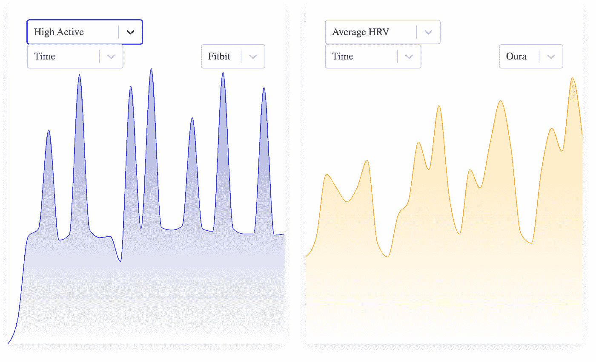
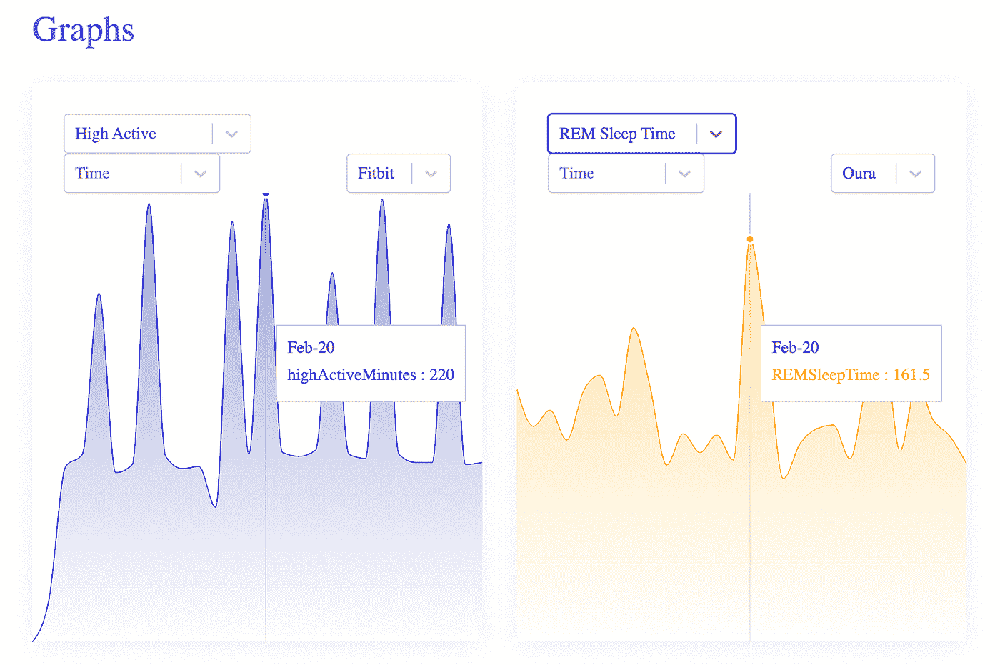

# 没人知道你喜欢你的可穿戴设备——它们在你身边吗？

> 原文：<https://towardsdatascience.com/no-one-knows-you-like-your-wearables-are-they-on-your-side-5422296f2f02?source=collection_archive---------35----------------------->

## 通过结合多种可穿戴设备的数据，我们可以了解自己什么

谁最了解你的个人模式？如果你想到了你的朋友和家人——考虑一个从未离开你身边的人，你的可穿戴设备。他们能告诉你什么？

通过将包括手机在内的所有可穿戴设备的信息整合到同一个地方，你可以查看整体数据点，并回答有趣的问题。好吧，至少开始有趣的争论，提出更多的问题。使用 Prifina，那个“一个地方”实际上是你的个人数据云。有了数据，你就可以真正利用它，并在它的基础上进行构建。

在之前的疫情年期间，可穿戴设备已经表明，它们不仅仅是一种娱乐工具，还可以在早期发现症状方面发挥作用。即使没有进入改变生活的情况，也有几个有趣的问题要提出。

*   根据你的数据，睡个好觉的最佳养生方法是什么？
*   你家外面的哪个地方最让你放松？
*   短期内，你需要多少分钟的剧烈运动才能达到最低的静息心率？长期影响如何？
*   你的不活动如何影响你的睡眠，你的压力如何？

在这篇短文中，我们根据常见可穿戴设备中的数据，探索和讨论了运动和睡眠、运动和压力(作为 HRV 的一个函数)以及不活动之间的关系。

我们还讨论了我们可以在用户层面结合哪些其他数据点，以便更好地理解和建立我们在自己的数据支持下做出的选择。为此，我们使用了一个构建在 Prifina 平台上的示例应用程序，它允许您导航和比较来自不同可穿戴设备和个人设备的数据点。

图片由[拉库尔工作室](https://medium.com/prifina/variance-in-data-from-oura-ring-and-fitbit-whos-right-4e4b8861c78a)提供

高强度运动会导致深度睡眠吗？能够在 Prifina 平台上组合不同的可穿戴数据源，我们可以在同一个地方探索这些。我们可以绘制一张图表来探究剧烈运动时间和深度睡眠。

整体健康应用的图片，由 [Prifina](http://www.prifina.com) 提供

[研究表明](https://www.hopkinsmedicine.org/health/wellness-and-prevention/exercising-for-better-sleep)锻炼时间可以改善深度睡眠，但他们也清楚其他锻炼参数，如强度、一天中的时间(相对于就寝时间)也是特别重要的因素。在我们的个人数据集中，很难在活动和深度睡眠之间找到直接联系。

从一些图表中进行推断和解释当然是徒劳的，浏览一下数据就会发现，它不仅仅是两个数据点，你可以看出的最大峰值与周末的关联超过了锻炼和睡眠。为了观察运动与睡眠的相关性，我们必须查看静息心率和心率变异性(HRV)等数据点，以了解运动恢复和相关压力，以及何时达到平稳状态。

人们可以假设锻炼，特别是高强度的锻炼，可以帮助解决压力，因此可以提高一个人的 HRV 值(在压力下，心跳之间的[可变性](https://www.health.harvard.edu/blog/heart-rate-variability-new-way-track-well-2017112212789)更少，HRV 更少)。正如前面提到的哈佛大学的文章所述，较低的 HRV“甚至与死亡和心血管疾病的风险增加有关”。

我们可以根据平均 HRV 读数绘制高强度运动分钟，以探索所有的汗水锻炼是否真的降低了我们的压力。让我们来看看。

整体健康应用的图片，由 [Prifina](http://www.prifina.com) 提供

嗯。这并没有告诉我们什么。我们探索的其他无数的情节也一样微不足道。结论是，我们遗漏了其他数据，当然压力与其他因素的联系比锻炼时间本身更多。这里也有一个巨大的因果关系问题，我们不能忽视(在压力下疯狂奔跑)。

睡眠怎么样？好还是坏，高强度运动会在几分钟内导致更多的快速眼动睡眠吗？我们可以画出这个来找出答案。

整体健康应用的图片，由 [Prifina](http://www.prifina.com) 提供

从绘制活跃分钟(高，中，只是总活跃锻炼)，我们可以看到一些积极的相关性。不强烈，但似乎存在。

体温呢？欧拉环也能追踪你的体温与基线的偏差。

整体健康应用程序图片，由 [Prifina](http://www.prifina.com) 提供

老实说，温度偏差似乎告诉我们的唯一事情是与肌肉和心血管恢复正相关。参见下表，了解活动卡路里和温度之间的关系。我们测试的无数其他指标也是如此，比如与正温度偏差负相关的不活动性。

遗传、环境和所有其他因素

很明显，我们只能在涉及个别数据点时开始讨论。为了实际上能够得出任何真正的结论，我们需要更多的受试者数据来探索，并且了解更多关于个体受试者的背景、他们的环境、习惯甚至基因也是有趣的。这肯定是在无数其他讨论中已经严格探讨过的东西。

利用像遗传学这样隐私的东西也需要一个真正保护隐私的数据处理模型，比如在你的数据云中保留你的所有数据，并且在不共享的情况下使用它。

能够看到我自己的行为模式，我的恢复趋势在周末达到顶峰(周五/周六和周日是最有效的睡眠时间，肯定是晨跑的一天，有足够的精力与之匹配)，我可以为自己提出许多有趣的问题。说到底，这也是我更关心的，我自己的活动和个人数据，而不仅仅是统计数据。

整体健康应用的图片，由 Prifina 提供

无数研究表明，可穿戴设备市场的增长令人难以置信，到 2030 年将售出近 10 亿台设备。

作为个人，我们可以访问越来越多的数据，但同样重要的是，数据实际上正在推动我们前进，通过微小的推动来帮助我们导航我们的生活并做出明智的决定。