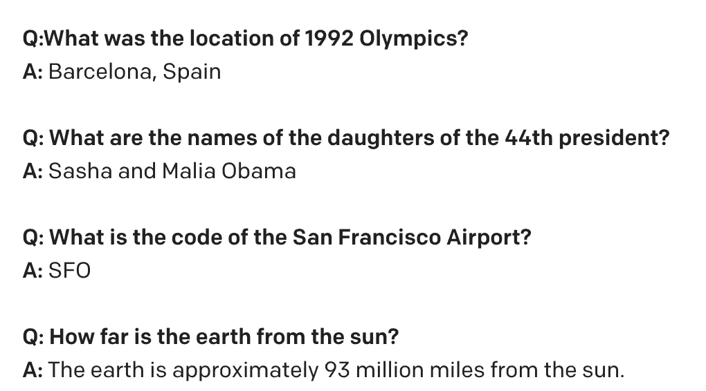
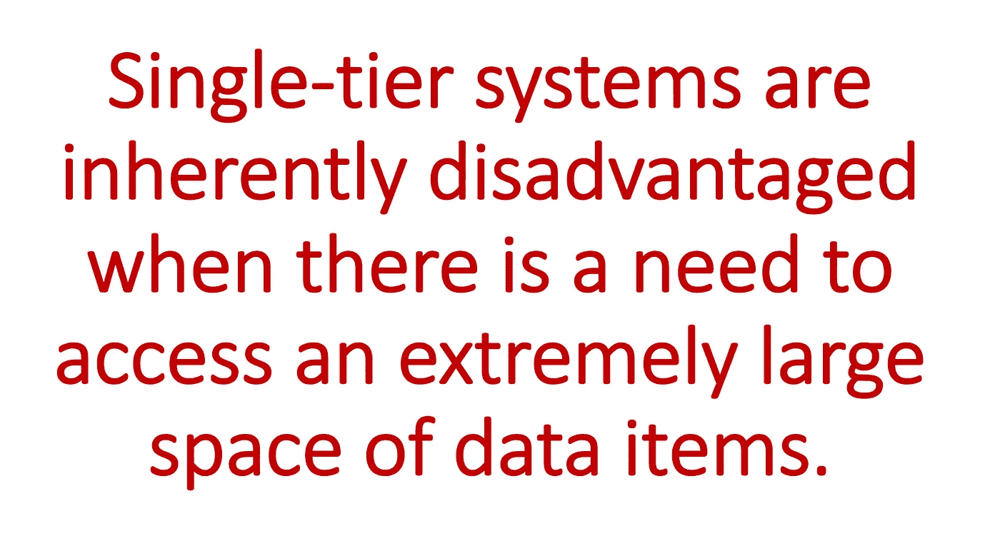
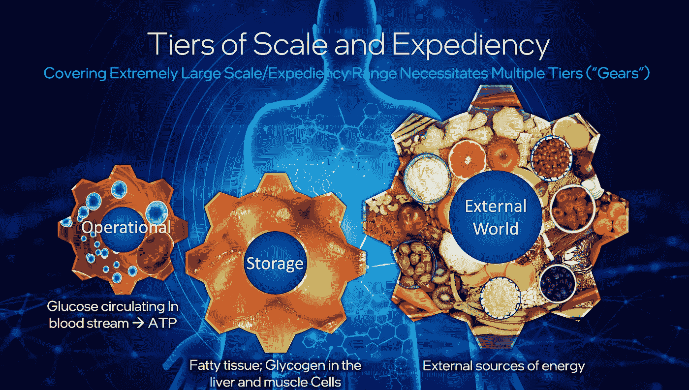
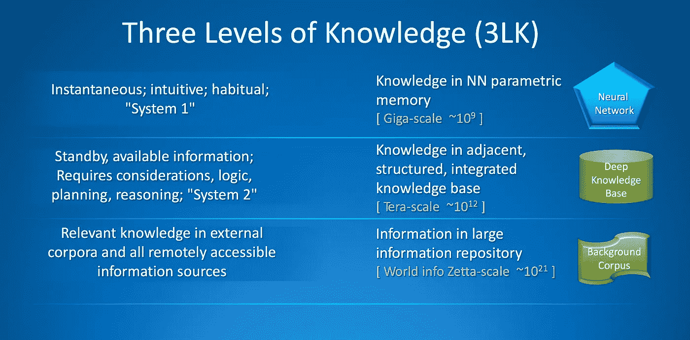

# 没有人来统治他们:解决基于知识的人工智能的规模和权宜之计

> 原文：<https://towardsdatascience.com/no-one-rung-to-rule-them-all-208a178df594?source=collection_archive---------30----------------------->

## *认知人工智能、知识的层次结构以及全方位深度学习模式不可持续增长的答案*

图片改编自 Shutterstock.com[elen taris Photo](https://www.shutterstock.com/zh-Hant/g/Elentaris+Photo)

**我们能同时推动人工智能的有效性和效率吗？**

如果我们希望我们的系统更加智能，它们一定会变得更加昂贵吗？我们的目标应该是显著提高能力，改善人工智能技术的成果，同时最大限度地降低功耗和系统成本，而不是增加成本。

**如果我们遵循在自然控制系统中反复观察到的建筑设计，也就是说，一个专业化水平的层次结构，实现这一点是可能的。本文对单一神经网络当前的大型语言模型(LLM)方法提出了挑战，该方法试图包含所有世界知识。我认为，异构环境中多数量级的运营效率需要分层架构。**

生成式预训练变形金刚 3 (GPT-3)可以正确回答许多事实问题。例如，它知道 1992 年奥运会的地点；它还能说出第 44 任总统女儿的名字，旧金山机场的代码或者地球和太阳之间的距离。然而，尽管这听起来令人兴奋，但作为一种长期趋势，这种对无尽仿真陈述的记忆既是一种“特征”，也是一种“缺陷”

*图 1: GPT-3 非常擅长回答琐碎的问题。(图片来源:英特尔实验室)*

基于神经网络的模型的指数增长在过去几年中一直是一个热门的讨论话题，许多研究人员就其计算的不可持续性发出警告。现在，图 2 的变体在媒体中屡见不鲜，而且越来越明显的是，人工智能行业被迫寻求不同的方法来扩展其解决方案的能力，这只是时间问题。多模态应用的出现将进一步推动这一增长趋势，在多模态应用中，模型必须捕获语言和视觉信息。

*图 2:神经网络模型的指数增长无法持续。*

计算成本呈指数增长的一个关键原因是，通过大量的过度参数化和大量的训练数据集，可以获得更多的功能。根据麻省理工学院最近的研究，这种方法需要 k 倍的数据和 k⁴更多的计算成本来实现 k 倍的提高。

一个大型的现代神经网络有一个统一的信息存储方式——参数记忆。虽然这种类型的存储可能非常庞大，其编码算法也非常复杂，但保持对数量激增的参数的统一访问速度正在推高计算成本。这种整体存储风格在非常大的规模下是非常低效的方法，并且在计算机硬件、搜索算法甚至自然界的架构中并不常见。

**关键的见解是，单层系统由于其固有的规模和权宜之间的权衡，将从根本上处于不利地位。**假设计算能力是昂贵的或受限的，那么系统必须处理的项目(例如信息块)的规模越大，在推理时对这些项目的访问就越慢。另一方面，如果系统架构师选择优先考虑访问速度，检索的成本可能会非常高。例如，GPT-3 对每 1000 个令牌(大约 750 个单词)的查询收费 [6 美分。除了推理时间之外，将大量信息编码到参数内存中也非常耗费资源。据报道，GPT-3 的训练成本至少为 460 万美元。当考虑到语言、视觉和其他知识来源的组合时，与 AI 系统相关的世界信息的规模是巨大的。如果所有这些信息都可以被人工智能处理和检索，那么即使是最令人印象深刻的 SOTA 模型也会相形见绌。](https://beta.openai.com/pricing)

解决成本效益和确保访问所有需要的信息之间的冲突的方法是建立一个分层的访问结构。重要的和经常需要的信息应该是最容易访问的，而不经常使用的信息需要存储在逐渐变慢的存储库中。

现代计算机的架构也是类似的。CPU 寄存器和高速缓存在一纳秒或更短的时间内利用信息，但具有最少的存储空间(以兆字节为单位)。与此同时，共享平台存储等更大的结构检索信息的速度要慢几个数量级(约 100 毫秒)，但容量也相应更大(Pb 级)，每比特成本也更低。

*图 3:在计算机系统中，高速模块也是最贵的，容量最低。*

类似地，大自然也展示了大量分层架构的例子。一个例子是人体如何获取能量。血液循环中有现成的葡萄糖供应，可以立即转化为 ATP。储存在肝脏中的糖原，以及脂肪和肌肉组织，提供了稍慢的访问。如果内部储备耗尽，身体可以使用外部能源(食物)来补充它们。人体不会储存所有的能量以供即时使用，因为这样做在生物学上是极其昂贵的。

*图 4:自然界的高效系统是分层的。*

如果从这些例子中可以学到什么的话，那就是**没有一个人能统治所有人**——在多种规模和范围下运行的系统需要进行分层才能可行。当这一原则应用于人工智能中的信息时，权宜之计和规模之间的权衡可以通过为我们的知识系统创建分层架构来解决。这种信息访问的优先化是设计约束，像大型语言模型这样的系统通过声称统一地交付范围和便利性而违反了这种约束。

正如之前在 [Thrill-K 帖子](/thrill-k-a-blueprint-for-the-next-generation-of-machine-intelligence-7ddacddfa0fe)中所描述的，解决优先级限制的一种方法是将系统使用的信息(或者最终，它的知识)分成三层:**即时**、**备用**和**检索的外部知识**。这些信息层的数量级大致相当于千兆级、万亿级和 zetta 级，如图 5 所示。

*图 5。人工智能系统使用的信息可以分为三层。*

上述分层中幅度的选择不是任意的。[据思科](https://www.cisco.com/c/dam/m/en_us/solutions/service-provider/vni-forecast-highlights/pdf/Global_2021_Forecast_Highlights.pdf)预测，2021 年 IP 流量将达到 3.3 zettabytes 的年运行速率。2021 年，硬盘驱动器的平均容量将达到 [5.4 万亿字节，这也是](https://www.statista.com/statistics/795748/worldwide-seagate-average-hard-disk-drive-capacity/)[在一个可以被认为是非常大的数据库(VLDB)中存储的数据量。完整的 T5 模型有](https://en.wikipedia.org/wiki/Very_large_database)[110 亿个参数](https://ai.googleblog.com/2020/02/exploring-transfer-learning-with-t5.html#:~:text=T5%20is%20surprisingly%20good%20at,%2C%20and%20Natural%20Questions%2C%20respectively.)。

在未来的人工智能系统中，瞬时知识层可以直接存储在神经网络的参数存储器中。相比之下，备用知识可以重构并存储在相邻的集成结构化知识库中。当这两个来源不足时，系统应该检索外部知识，例如，通过搜索背景语料库或使用传感器和致动器从其物理环境中收集数据。

使用基于知识的分层系统，可以实现可持续的扩展成本。进化的压力迫使人类大脑在增长能力的同时保持效率和能量消耗。类似地，需要将设计约束应用于人工智能系统架构，以将计算资源的分布与*不同的*信息检索的便利性结合起来。只有到那时，人工智能系统才能在不侵犯其资源的情况下，达到人类工业和文明所要求的全部认知能力。

# 参考

汤普森，北卡罗来纳州，格林沃尔德，k .，李，k .，，曼索，G. F. (2021，10 月 1 日)。*深度学习的收益递减*。IEEE 频谱。[https://spectrum.ieee.org/deep-learning-computational-cost](https://spectrum.ieee.org/deep-learning-computational-cost)

k . wiggers(2020 年 7 月 16 日)。*麻省理工学院研究人员警告称，深度学习正在接近计算极限*。风险投资。[https://venturebeat . com/2020/07/15/MIT-researchers-warn-the-deep-learning-is-approxing-computational-limits/](https://venturebeat.com/2020/07/15/mit-researchers-warn-that-deep-learning-is-approaching-computational-limits/)

北卡罗来纳州汤普森(2020 年 7 月 10 日)。*深度学习的计算极限*。ArXiv.Org。【https://arxiv.org/abs/2007.05558 号

*OpenAI API* 。(2021).[https://beta.openai.com/pricing](https://beta.openai.com/pricing/)

李(2020 年 9 月 11 日)。 *OpenAI 的 GPT-3 语言模型:技术概述*。Lambda 博客。[https://lambda labs . com/blog/demystifying-GPT-3/#:% 7E:text = 1。%20We%20use，M](https://lambdalabs.com/blog/demystifying-gpt-3/#:%7E:text=1.%20We%20use,M)

歌手 g(2021 年 7 月 29 日)。 *Thrill-K:下一代机器智能蓝图*。中等。[https://towards data science . com/thrill-k-a-blue print-for-the-next-generation-of-machine-intelligence-7 ddacddfa 0 Fe](/thrill-k-a-blueprint-for-the-next-generation-of-machine-intelligence-7ddacddfa0fe)

思科。(2016).*全球— 2021 年预测亮点*。[https://www . Cisco . com/c/dam/m/en _ us/solutions/service-provider/vni-Forecast-highlights/pdf/Global _ 2021 _ Forecast _ highlights . pdf](https://www.cisco.com/c/dam/m/en_us/solutions/service-provider/vni-forecast-highlights/pdf/Global_2021_Forecast_Highlights.pdf)

Statista。(2021 年 8 月 12 日)。*希捷 2015–2021 财年全球平均硬盘容量*。[https://www . statista . com/statistics/795748/world wide-Seagate-average-hard-disk-drive-capacity/](https://www.statista.com/statistics/795748/worldwide-seagate-average-hard-disk-drive-capacity/)

维基百科贡献者。(2021 年 10 月 16 日)。*超大型数据库*。维基百科。[https://en.wikipedia.org/wiki/Very_large_database](https://en.wikipedia.org/wiki/Very_large_database)

*用 T5 探索迁移学习:文本到文本的迁移转换器*。(2020 年 2 月 24 日)。谷歌人工智能博客。[https://ai . Google blog . com/2020/02/exploring-transfer-learning-with-T5 . html #:% 7E:text = T5 % 20 is % 20 惊奇% 20 好%20at，% 2C % 20 和% 20 自然% 20 问题% 2C % 20。](https://ai.googleblog.com/2020/02/exploring-transfer-learning-with-t5.html#:%7E:text=T5%20is%20surprisingly%20good%20at,%2C%20and%20Natural%20Questions%2C%20respectively.)

*Gadi Singer 是英特尔实验室副总裁，认知计算研究总监。*