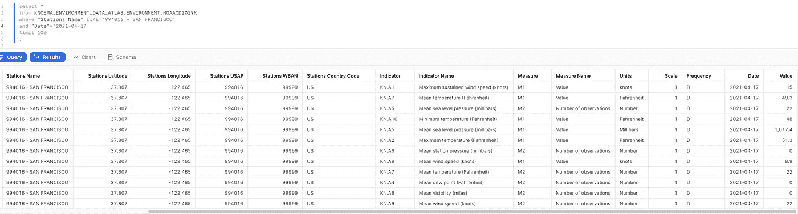
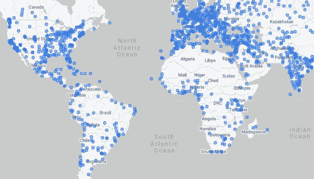

# 雪花中的 NOAA 天气数据(免费)

> 原文：<https://towardsdatascience.com/noaa-weather-data-in-snowflake-free-20e90ee916ed?source=collection_archive---------16----------------------->

## NOAA GSOD 的全球天气数据每天都会在雪花中更新，在本帖中，我们会让它变得更加有用。通过 MATCH_RECOGNIZE()在内部检查枢轴、地理连接、查找离每个城市最近的车站和模式匹配。

[Youtube 上的视频](https://www.youtube.com/watch?v=BJhY-CL6zjA)

# 源头

要访问 NOAA GSOD 的每日天气数据，只需去市场[在你的账户中用](https://docs.snowflake.com/en/user-guide/data-marketplace-intro.html#label-standard-listing) [Knoema 的环境数据图集](https://www.snowflake.com/datasets/knoema-environment-data-atlas/)创建一个数据库。


[雪花中的 Knoema 环境数据图集](https://www.snowflake.com/datasets/knoema-environment-data-atlas/)

通过几个探索性的查询，您会注意到:

*   让这些数据在你的账户中自动刷新是很酷的！
*   让这张表变得有用并不容易，因为:
*   车站有一个纬度，经度——但是没有办法告诉他们属于哪个城市或邮政编码。
*   每天的原始 NOAA 行已被拆分为多行，每行仅包含一个站点可以产生的每个不同测量值的一个值。



由 Knoema 转换的 NOAA GSOD:每个测量一行

因此，让我们在这里转换这些数据，使其更容易纳入您的数据管道。

# 将多行旋转成一行

这对于雪花来说很容易。以下查询将获取每个工作站每天的多行数据，并将它们转换为一行数据:

```
--create or replace table noaa_gsod
--cluster by (station_id, date)
--as (
    select *
    from (
        select "Stations", "Date", "Stations Name", "Country", "Indicator Name", "Value"
        from KNOEMA_ENVIRONMENT_DATA_ATLAS.ENVIRONMENT.NOAACD2019R
        where "Date">='2020-01-01'
        and "Measure"='M1'
        -- and "Country"='US'
    )
    pivot(max("Value") for "Indicator Name" in ('Mean visibility (miles)','Maximum temperature (Fahrenheit)','Mean dew point (Fahrenheit)','Maximum wind gust (Number)','Minimum temperature (Fahrenheit)','Maximum sustained wind speed (knots)','Mean wind speed (knots)','Mean station pressure (millibars)','Precipitation amount (inches)','Mean temperature (Fahrenheit)','Mean sea level pressure (millibars)','Snow depth (inches)'))
    as p(station_id, date, name, country_fips, visibility, max, dew, wind_max, min, wind_sustained_max, wind_mean, pressure, rain, temp, pressure_sea, snow_depth)
--)
;
```

由于雪花支持本地透视，我们能够将多行合并为一行，创建新列并重命名它们以便于使用:


把 NOAA GSOD 转回到一个有用的宽桌子上

# 查找城市

现在，我们如何找到离每个车站最近的城市？还是邮编？

让我们从查找全球城市列表开始。在这种情况下，我使用了来自 Wikidata 的数据(我们可以在未来的帖子中更多地讨论关于雪花的 Wikidata)。

# 地理定位站



拥有 NOAA 气象站的大城市

有了城市列表和雪花的 GIS 支持，我们可以找到离每个车站最近的城市:

```
create or replace table stations_city
as (
    select label city, station, st_distance(st_makepoint(a.lon, a.lat), st_makepoint(b.lon, b.lat)) distance, country_fips, b.country
        , station_id
    from weather_stations a
    join wikimedia.public.cities b
    on a.country=b.country_fips
    and st_distance(st_makepoint(a.lon, a.lat), st_makepoint(b.lon, b.lat)) < 50000
    qualify row_number() over(partition by station order by distance) = 1
    order by views desc
)
;
```

在那个 SQL 查询中，我们限制了半径为 50 公里的`st_distance`的搜索。这种地理连接执行得非常快:一个小仓库只需 3 秒钟。

请注意，`qualify row_number() over(partition by station order by distance) = 1`为我们带来了离每个车站最近的城市。为了得到离每个城市最近的车站，我们需要把它改成`over(partition by city order by distance)`。


离每个车站最近的城市。

# 模式匹配:雨水最多的城市


照片由[埃文·罗伯茨](https://www.flickr.com/photos/donabelandewen/3908987446)拍摄

现在让我们享受一下模式匹配的乐趣，感谢我们的[新的 MATCH_RECOGNIZE 功能](https://hoffa.medium.com/funnel-analytics-with-sql-match-recognize-on-snowflake-8bd576d9b7b1)。

例如，让我们找出美国连续下雨天数最多的城市:

```
 select *
    from (select * from noaa_gsod where country_fips='US')
    match_recognize(
        partition by station_id, name
        order by date
        measures avg(temp) avg_temp, sum(rain) total_rain, min(rain) min_rain, count(*) rainy_days, min(date) date
        one row per match
        pattern(rain{5,})
        define
            rain as rain > 0.1
    )
```

我喜欢用 [MATCH_RECOGNIZE](https://hoffa.medium.com/funnel-analytics-with-sql-match-recognize-on-snowflake-8bd576d9b7b1) 定义行之间的模式是如此简单:

*   首先，我们将`rain`(对于模式)定义为任何有`rain > 0.1`英寸的行。如果那天的雨没有打到那个最小值，我们就不算雨天了。
*   然后，我们让雪花寻找任何一系列行，这些行至少连续 5 天使用`pattern(rain{5,})`看到雨的定义。
*   在查询中检查`one row per match`、 `partition by station_id, name order by date`和`measures min(date) date`的组合将如何帮助我们获得期望的结果。

如果我们将气象站按连续最多的雨天排序，结果如下:


美国连续下雨天数最多的站点

正如你所看到的，Quillayute 机场在 2020 年 1 月连续下雨 25 天，然后在 2020 年 12 月连续下雨 16 天。那是一场不停的雨。

但是机场在哪里？最近的城市是哪里？我们可以结合之前的结果来解决这个问题:

```
select *
from (
    select *
    from (select * from noaa_gsod where country_fips='US')
    match_recognize(
        partition by station_id, name
        order by date
        measures avg(temp) avg_temp, sum(rain) total_rain, min(rain) min_rain, count(*) rainy_days, min(date) date
        one row per match
        pattern(rain{5,})
        define
            rain as rain > 0.1
    )
) a
join (
    select *
    from stations_city
) b
using (station_id)
order by rainy_days desc, total_rain desc
;
```

原来这些是美国降雨量最多的城市。看之前能猜到吗？


美国雨量最多的城市

在看之前，我的猜测是西雅图。这是正确的。西雅图紧随其后，是它的姐妹城市塔科马。他们真的配得上“美国连续下雨天数最多的城市”的称号。

但是 Quillayute 机场去哪了？原来它不在我上面的查询中的一个主要城市的 50 公里半径内。如果我们将半径增加到 200 公里，结果如下:


美国雨量最多的城市(200 公里半径内的气象站)

又来了，西雅图和塔科马。华盛顿州周围确实经常下雨。

# dbt 中的所有内容


此项目中的数据沿袭，按 dbt

查看我的 [GitHub 项目和完整的 dbt 项目](https://github.com/Snowflake-Labs/fhoffa/tree/main/knoema_noaa_dbt)。

(感谢 Noel Gomez 和 Mike Weinberg 对 dbt Slack 的评论)

# 后续步骤

*   探索雪花数据市场中的优质气象提供商。
*   用一个[雪花免费试用账户](http://bit.ly/sf-free-trial)试试吧——你只需要一个电子邮件地址就可以开始了。
*   在[雪花数据市场](https://www.snowflake.com/data-marketplace/)找到更多数据集。

# 想要更多吗？

我是 Felipe Hoffa，雪花的数据云倡导者。谢谢你和我一起冒险。你可以在 Twitter 和 LinkedIn 上[关注我，查看](https://twitter.com/felipehoffa)[reddit.com/r/snowflake](https://www.reddit.com/r/snowflake/)最有趣的雪花新闻。