# 用于惊艳网络的节点定制

> 原文：<https://towardsdatascience.com/node-customization-for-stunning-networks-d1f74cf2e46d?source=collection_archive---------23----------------------->

## [实践教程](https://towardsdatascience.com/tagged/hands-on-tutorials)

## 将 igraph 与 visNetwork 合并

正如我们之前看到的，在 R 中使用 **visNetwork** 软件包，网络可视化变得轻而易举。这些图表非常漂亮，具有交互性，玩起来很有趣。在本文中，我们将了解如何定制网络节点来传递更多信息。首先，我们将学习如何用一个变量给一个网络着色。然后，我们将利用的功能来查找并突出显示具有高中心性得分的节点。最后，我们将再次使用 **igraph** 来识别和着色社区。要继续编码，点击[这里](https://github.com/thatdarndata/BlogPosts/blob/main/igraph2visNetwork/NodeCustomization.Rmd)进入 R 笔记本。


[Avel Chuklanov](https://unsplash.com/@chuklanov?utm_source=unsplash&utm_medium=referral&utm_content=creditCopyText) 在 [Unsplash](https://unsplash.com/@brooke_tdd/likes?utm_source=unsplash&utm_medium=referral&utm_content=creditCopyText) 上拍摄的照片。

# 视觉网络基础

在我们开始之前，让我们花点时间来讨论一下 **visNetwork** 的基础知识。在之前的[教程](https://thatdarndata.com/from-igraph-to-visnetwork-makeover/)中，我们使用 **visIgraph()** 来绘制我们的网络。这一次，我们将使用 **visNetwork()** 函数。为什么？很简单，通过使用 **visNetwork()** 函数，我们可以更好地控制节点的外观。 **visNetwork()** 函数有两个参数:1)描述网络中**节点**的数据帧，2)描述网络中**边**的数据帧。

# 节点

**节点**数据帧至少需要一个 **id** 列来标识每个节点。每个节点必须有一个唯一的***id**。现在，这个 **id** 不一定是您希望您的节点命名的名称。它*可以*是，默认情况下它*会*是，但实际上是**标签**控制你的节点名。与 **id** 不同，节点**标签**不需要唯一。这样，如果两个节点有相同的名字， **visNetwork** 将能够通过它们的 **id** 来区分它们。*

*例如，如果您的网络由学生组成，那么 **id** 将是学生的 id 号，而**标签**将是学生的姓名。可能有多个名为 Ashley Brown 的学生，但是每个 Ashley 都有自己唯一的学号来区分他们。*

# *优势*

*另一方面，**边缘**数据帧需要至少两列:*从*和*到*。这些列将告诉 **visNetwork** 绘制一条线*从*一个特定的节点，如其 **id** 、*到*另一个节点，也由其 **id** 指定。*

# *向节点和边数据框添加列*

*要自定义网络中的结点或边，只需向相应的数据框中添加额外的列，并指定要修改的属性。例如，如果您想为每个节点指定一个标签，那么在**节点**数据框中创建一个**标签**列，为网络中的每个节点指定一个标签。您可以修改的其他节点属性包括形状、大小、颜色和阴影。要查看所有可用选项，请使用**查看文档。视觉节点**和**？粘边**。*

# *将 igraph 网络转换为 visNetwork 格式*

*将一个 **igraph** 对象转换成一个**节点**和**边缘**数据帧非常简单(*通常是* …🤞)使用 **toVisNetworkData()** 函数。向 **toVisNetworkData()** 提供一个 **igraph** 网络将返回一个*列表*，其中包含**节点**和**边**数据帧。很简单！*

# *扎卡里网络*

*对于本教程，我们将使用著名的扎卡里网络(1977)。扎卡里网络是一个追踪空手道俱乐部中的友谊的社交网络🥋。总的来说，这个俱乐部有 34 个成员和 78 个朋友。换句话说，我们的网络有 34 个节点，每个节点代表一个成员，还有 78 条边，每条边代表一段友谊。让我们从加载 **igraph** 和 **visNetwork** 包开始。然后，我们将使用 **graph.famous()** 加载 Zachary 图，并使用 **visIgraph()** 快速绘制它，让我们了解我们的网络是什么样子。*

```
*# Load packages. 
library(igraph) 
library(visNetwork) # Load famous Zachary graph. 
zach <- graph.famous("Zachary") # Plot quickly. 
visIgraph(zach)*
```

*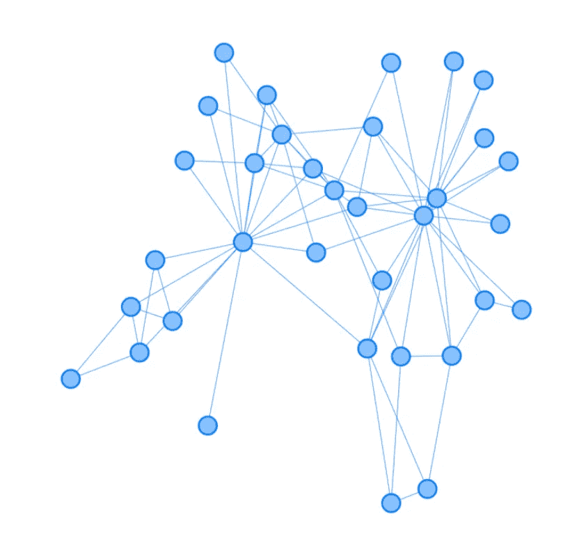*

*使用 visIgraph()的默认 Zachary 网络。图片作者。*

# *用带状颜色给节点着色*

*在空手道中，佩戴腰带代表学生的等级。如果我们知道每个学生的腰带颜色，我们可以给我们的网络着色，这样每个成员的节点都会反映他们的腰带颜色。不幸的是，我们不知道每个成员的腰带颜色。但是，我们可以假装知道，并创建自己的代表皮带颜色的变量。*

*我们将首先创建一个调色板来匹配空手道腰带的颜色。空手道有 9 种不同的腰带颜色:白色、黄色、橙色、绿色、蓝色、紫色、红色、棕色和黑色。为了创建我们的腰带颜色变量，我们将使用 **sample()** 从调色板中为每个成员随机选择一种腰带颜色。但是，我们不会给每条腰带相同的入选概率。相反，我们将假设，由于每条腰带越来越难挣，我们将看到与排名较低的腰带相比，排名较高的腰带人数较少。*

```
*set.seed(4) 
# HTML color codes for white, yellow, orange, 
# green, blue, purple, red, brown, black 
colPal <- c("#ECECEC", "#F9D597", "#EE9C77", "#46887C", "#4270A4", "#786696", "#A8534C", "#624E4D", "#232323") # Probability of selecting each belt color. 
probs <- c(0.5, 0.25, 0.1, 0.05, 0.03, 0.03, 0.03, 0.005, 0.005) # Get a belt color for each member. 
beltColors <- sample(colPal, size = 34, replace = TRUE, prob = probs)*
```

*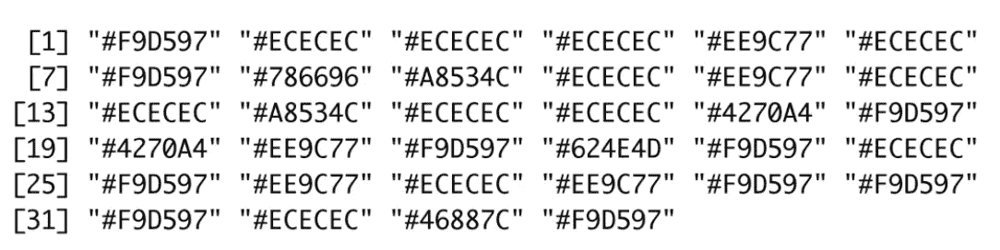*

*腰带颜色向量。图片作者。*

*现在我们有了每个成员的腰带颜色向量，我们想把它作为一列添加到我们的**节点**数据框中。但是等等！我们还没有一个**节点**数据框！让我们使用 **toVisNetworkData()** 函数生成我们的**节点**和**边**数据帧。回想一下， **toVisNetworkData()** 返回一个由**节点**和**边**数据帧组成的列表。我们将把列表分开，以便于阅读。然而，这真的没有必要。如果您习惯使用列表，那么在向**节点**数据框添加列时，您可以跳过这一部分并使用列表符号。*

```
*# Convert igraph network into visNetwork format 
visZach <- toVisNetworkData(zach) # Grab nodes data frame. 
nodes <- visZach$nodes # Grab edges data frame. 
edges <- visZach$edges*
```

*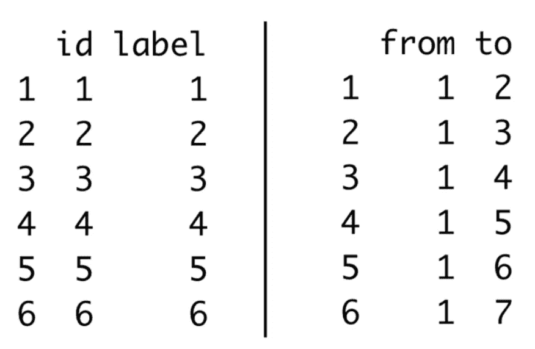*

*前六行节点数据框(左)和边数据框(右)。图片作者。*

*我们现在有了我们的**节点**和**边**数据帧！注意，**节点**数据帧有一个与 **id** 列匹配的**标签**列。除非另有说明， **visNetwork** 将使用 **id** 作为节点**标签**。如果我们碰巧知道我们成员的名字，我们可以更新我们的标签来反映每个成员的名字。不幸的是，我们没有。😔但是如果你愿意，你可以随时创建一些！*

*现在，让我们将 beltColors 向量添加到节点数据框中。因为我们指定了节点的颜色，所以我们将新列命名为 **color** 。我们可以看出 **color** 是一个有效的列名，它将被 **visNetwork** 识别，因为它是 **visNodes()** 中列出的参数之一。*

```
*# Add color column to nodes data frame. 
nodes$color <- beltColors*
```

*为了绘制网络，我们将为 **visNetwork()** 提供我们的**节点**和**边**数据帧。*

```
*# Plot. 
visNetwork(nodes, edges)*
```

*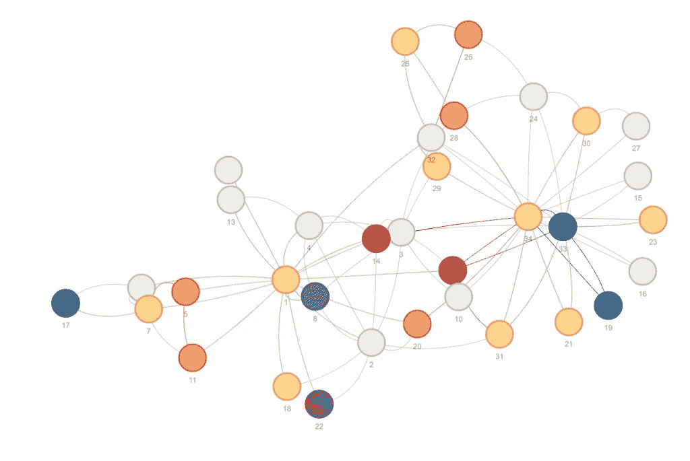*

*Zachary 网络，节点按成员带颜色着色。图片作者。*

*我们走吧！我们现在可以看到我们的 Zachary 网络被每个成员的腰带颜色所着色。注意大多数成员都有白色或黄色的腰带。*

# *突出显示具有高中心性分数的节点*

*让我们交换一下，看看如何给具有高中心性分数的节点着色。为此，我们将使用 **igraph** 来计算我们的中心性得分。为了在这个练习中获得一点变化，我们将用两种不同的方式给我们的节点着色。首先，我们将查看度中心性，并突出显示具有 9 个或更多友谊的节点。其次，我们将查看特征向量的中心性，并根据其中心性得分为每个节点着色。*

## *程度中心性*

*度中心性通过计算连接到每个节点的边的数量来测量节点的连通性。为了找到每个节点的度数，或者与每个节点相关联的友谊数量，我们将使用来自 **igraph** 的 **degree()** 函数。 **degree()** 函数将返回一个向量，列出与每个节点关联的度数。*

```
*# Calculate degree for each node. 
degree(zach)*
```

*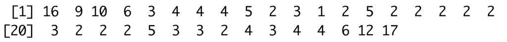*

*度中心性向量。图片作者。*

*我们可以从 degree 中看到，第一个节点或成员有 16 条友谊或边连接到该节点。因为我们只想突出显示具有 9 个或更多友谊的节点，所以让我们看看哪些节点的度大于或等于 9。*

```
*# Is the degree for each node greater than or equal to 9? degree(zach) >= 9*
```

*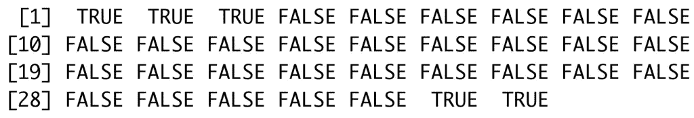*

*图片作者。*

*现在，让我们使用这个矢量作为调色板的基础。我们想把我们的**真**变成一种颜色，突出显示有 9 个或更多朋友的成员，把我们的**假**变成另一种颜色。为此，我们将把这个向量强制转换成一个因子，并用我们的调色板标签覆盖**真/假**标签。这一次，我们将使用浅灰色来表示我们的**假**和深绿色来表示我们的**真**。*

```
*# Create degree centrality color palette. 
degreePal <- factor(degree(zach) >= 9, labels = c("#D3D3D3", "#225560"))*
```

*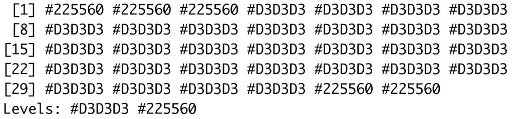*

*度中心调色板。图片作者。*

*现在我们有了度中心性的调色板，我们可以在**节点**数据框中覆盖当前的颜色规范。*

```
*# Overwrite color column in nodes data frame 
# with degree centrality color palette. 
nodes$color <- degreePal # Plot. 
visNetwork(nodes, edges)*
```

*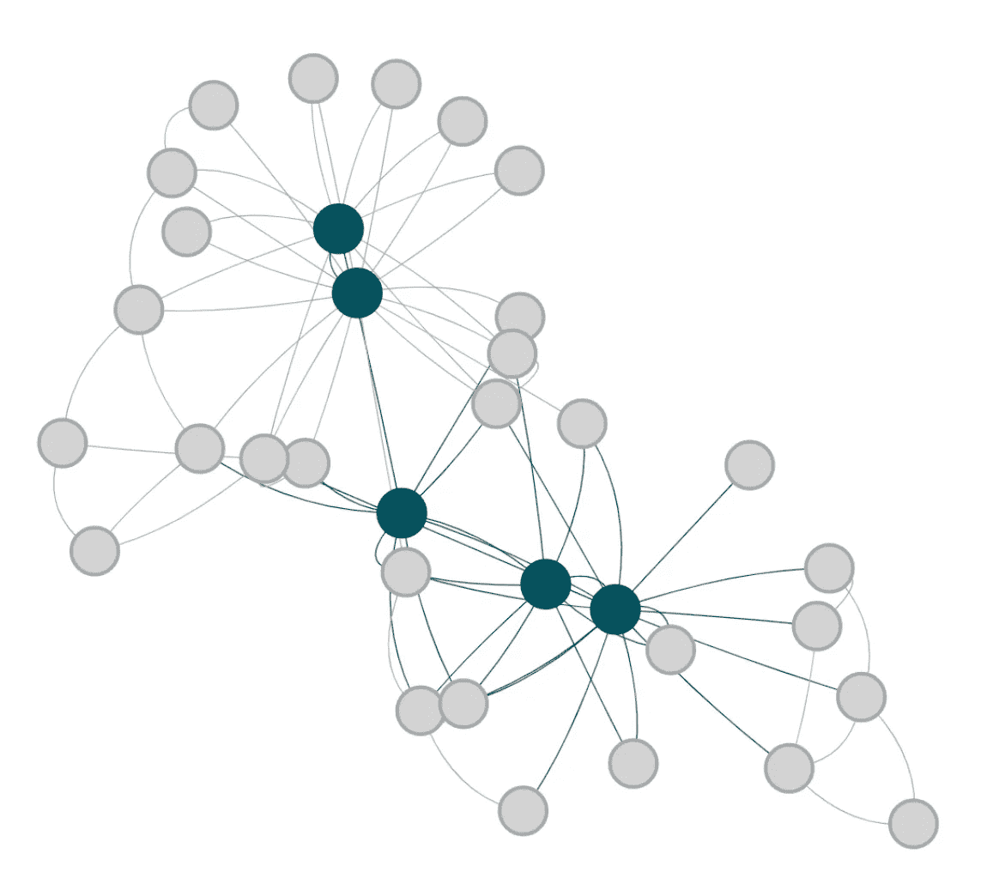*

*Zachary 网络，其中拥有 9 个以上友谊的成员以深绿色突出显示。图片作者。*

*不错！我们可以很容易地看到五个成员有 9 个或更多的友谊。作为一个练习，您可以尝试将深绿色节点更改为每个突出显示的成员的适当颜色。*

## *特征向量中心性*

*特征向量中心性类似于度中心性，但是有一些重新加权。不是给每个连接相等的权重，而是给到另一个高度连接的节点的连接比到具有非常少连接的节点的连接更重的权重。换句话说，*一个节点与谁*连接关系重大。因此，节点的最终中心性分数受到它所连接的节点的中心性分数的影响。*

*为了计算我们网络中每个成员的特征向量中心性，我们将使用 **eigen_centrality()** 。 **eigen_centrality()** 函数返回第一个元素为 **vector** 的列表，其中包含每个节点的中心性得分。*

```
*# Calculate eigenvector centrality. 
eigen_centrality(zach)[1]*
```

*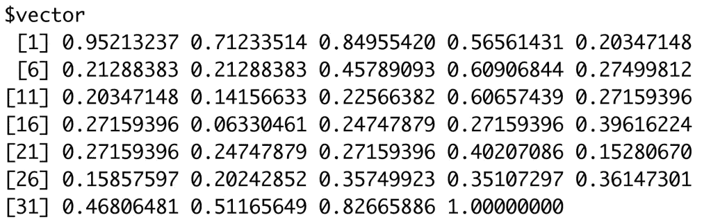*

*特征向量中心性向量。图片作者。*

*为了根据特征向量中心性分数给每个节点着色，我们需要创建一个连续的调色板。(查看这个[堆栈溢出帖子](https://stackoverflow.com/questions/9946630/colour-points-in-a-plot-differently-depending-on-a-vector-of-values)了解如何做到这一点。)本质上，我们将使用 **colorRampPalette()** 创建一个调色板函数。 **colorRampPalette()** 函数返回另一个函数，该函数能够从指定的第一种颜色开始创建调色板，并逐渐增加到指定的第二种颜色。我们将把我们的颜色渐变函数命名为 **eigScalePal()** 。我们使用 **colorRampPalette()** 创建的 **eigScalePal()** 函数将一个整数作为其参数，表示我们希望调色板包含的独特颜色的数量。在这个例子中，我们将选择 7 种独特的颜色。*

*为了将调色板中的 7 种颜色匹配到特征向量中心性向量，我们将利用 **cut()** 函数。 **cut()** 将我们的矢量分解成指定数量的区间。因为我们有 7 种颜色，我们将把矢量分成 7 块。最后，我们将把这个新向量分配给我们的**节点**数据帧的**颜色**列，该向量将我们的调色板与我们的特征向量中心性向量相匹配。*

```
*# Create continuous color palette. 
eigScalePal <- colorRampPalette(c('#E0F4FF','#003049')) # Match palette to centrality vector.
nodes$color <- eigScalePal(7)[cut(eigen_centrality(zach)$vector, breaks = 7)] # Plot. 
visNetwork(nodes, edges)*
```

*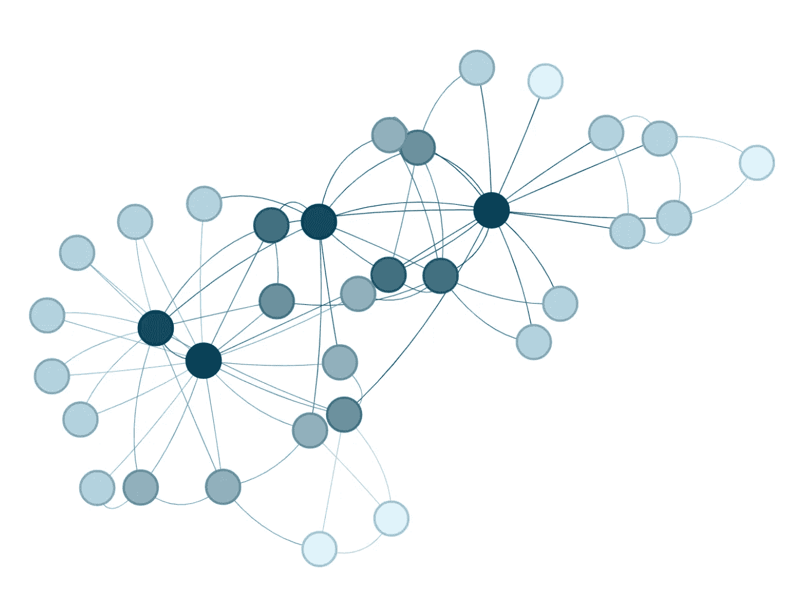*

*特征向量中心性着色的 Zachary 网络。深蓝色代表高中心性分数，浅蓝色代表低中心性分数。图片作者。*

*看起来不错！最有影响力的节点显示为深蓝色。影响较小的节点逐渐变亮。*

# *查找和着色社区*

*团体代表网络的一部分，其中该部分内的连接比该部分与网络的其它部分之间的连接多。换句话说，社区是具有相对密集连接的子图。为了找到具有 **igraph** 的社区，我们将使用 **cluster_fast_greedy()** ，它通过模块性分数的贪婪优化来搜索密集子图。函数 **cluster_fast_greedy()** 返回一个 *communities* 对象，显示发现的社区数量以及属于每个社区的节点。我们可以使用 **membership()** 函数将社区成员总结为一个节点向量。*

```
*# Find communities. 
zachComm <- cluster_fast_greedy(zach) # Return community membership for each node. 
membership(zachComm)*
```

*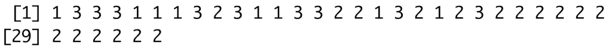*

*社区成员。图片作者。*

*虽然您肯定可以更改节点数据框中指定的颜色来显示每个社区，但我们将使用 **visGroups()** 来代替。visGroups() 使得指定对每个社区的修改变得容易。我们首先将上面的成员向量分配给节点数据框中的一个新的**组**列。由于我们已经有了一个不再感兴趣的**颜色**列(表示特征向量中心性)，我们将从**节点**数据框中移除颜色列。*

```
*# Add group column to nodes data frame representing 
# community membership for each node. 
nodes$group <- membership(zachComm) # Remove color column. 
nodes$color <- NULL*
```

*现在，让我们画出我们的网络。*

```
*visNetwork(nodes, edges)*
```

*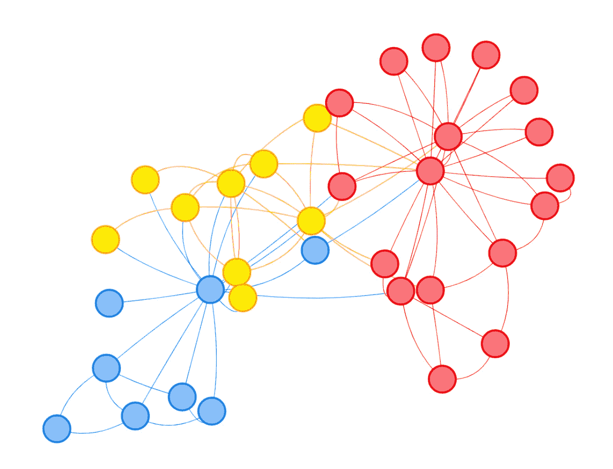*

*扎卡里网络由社区成员着色。图片作者。*

*不算太坏，是吧？然而，我们可以更进一步，不需要太多额外的工作。通过使用 **% > %我们将向 **visGroups()** 提供我们希望对其进行更改的组的名称，以及我们希望实现的更改。我们将对每个组(1、2 和 3)进行更改，并为每个社区指定唯一的颜色和形状。***

```
*visNetwork(nodes, edges) %>% 
visGroups(groupname = "1", color = "#087CA7", shape = "square") %>% 
visGroups(groupname = "2", color = "#419D78", shape = "triangle") %>% 
visGroups(groupname = "3", color = "#FFE67C", shape = "oval") %>% 
visLegend()*
```

*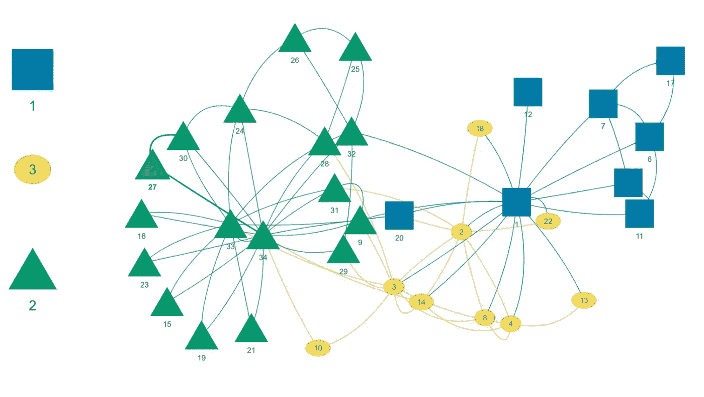*

*Zachary 网络社区会员与定制和传奇。图片作者。*

*呜-呼！🥳可以随意摆弄每个社区，指定你选择的颜色和形状。*

*我希望你喜欢这篇融合了 **igraph** 和 **visNetwork** 功能的教程。你想看看少了什么吗？下面留言评论！*

# *引文*

*Almende B.V .，Benoit Thieurmel 和 Titouan Robert (2019)。
visNetwork:使用‘vis . js’库的网络可视化。r 包【2.0.9 版本。[https://CRAN.R-project.org/package=visNetwork](https://CRAN.R-project.org/package=visNetwork)*

*Csardi G，Nepusz T:用于复杂网络研究的 igraph 软件包，国际期刊，复杂系统 1695。2006.
https://igraph.org*

*r 核心团队(2020)。r:用于统计计算的语言和环境。奥地利维也纳统计计算基金会。网址
[https://www.R-project.org/](https://www.R-project.org/)。*

*r 版本 4 . 0 . 2(2020–06–22)
平台:x86_64-apple-darwin17.0 (64 位)
运行于:macOS Catalina 10.15.7*

*扎卡里，W. W. (1977)。小团体中冲突和分裂的信息流模型。人类学研究杂志，33(4)，452–473 页。[https://doi.org/10.1086/jar.33.4.3629752](https://doi.org/10.1086/jar.33.4.3629752)*

**原载于 2021 年 8 月 6 日 https://thatdarndata.com**的* [*。*](https://thatdarndata.com/node-customization-for-stunning-networks/)*