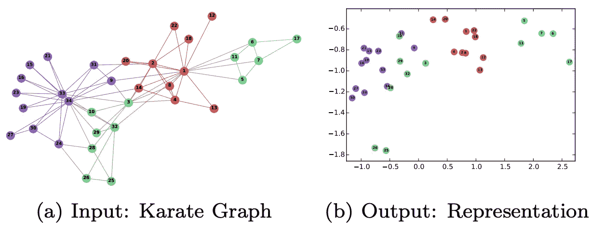
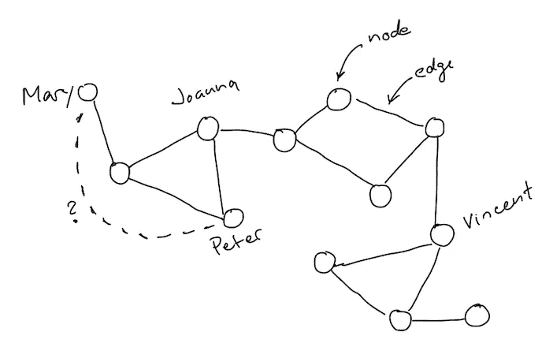
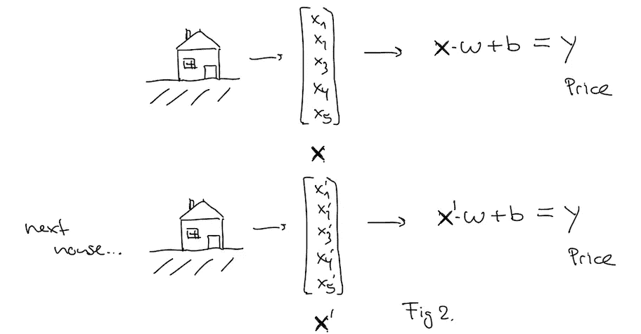
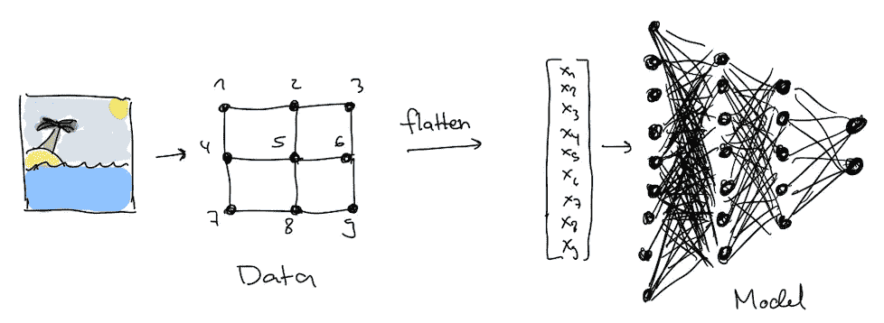
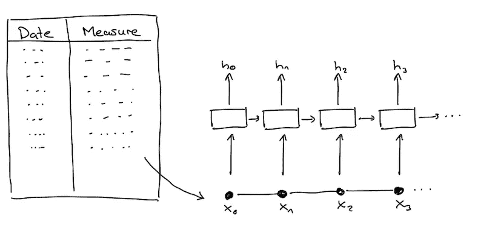
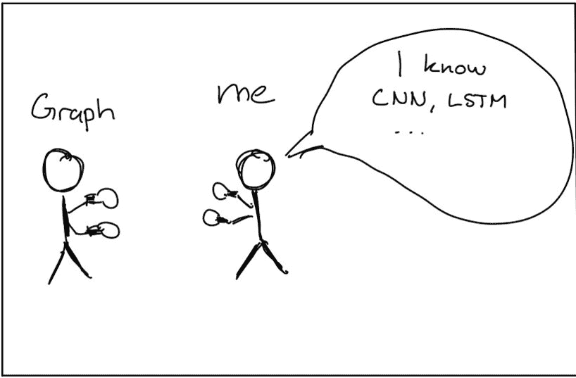
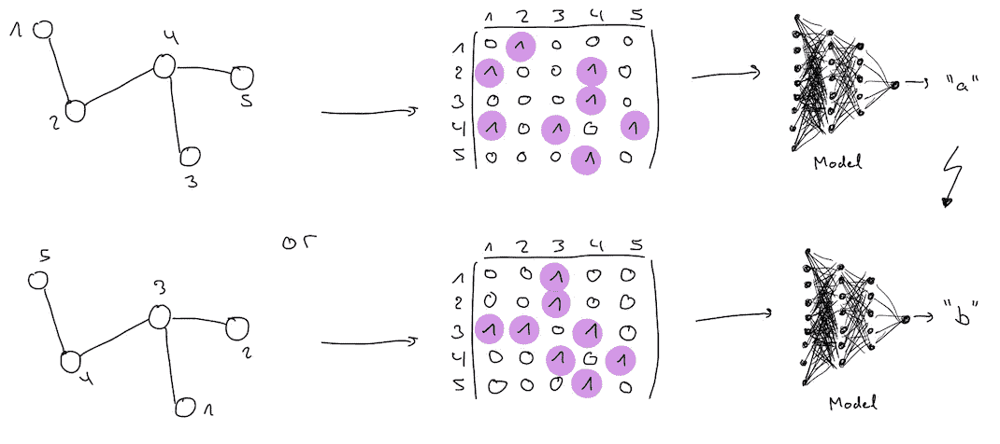
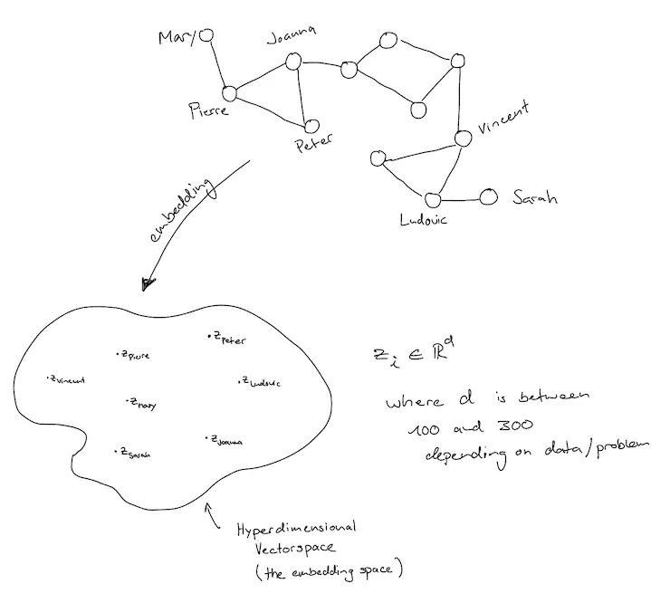
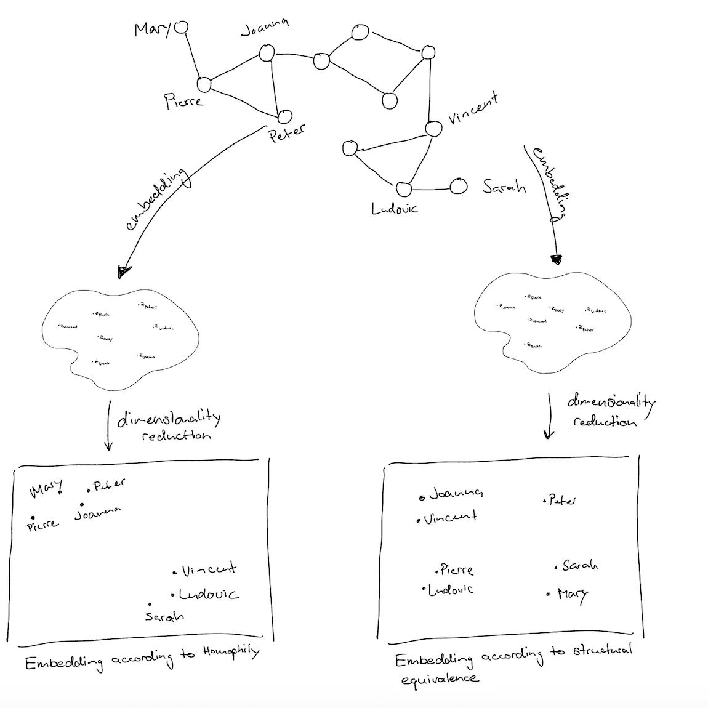
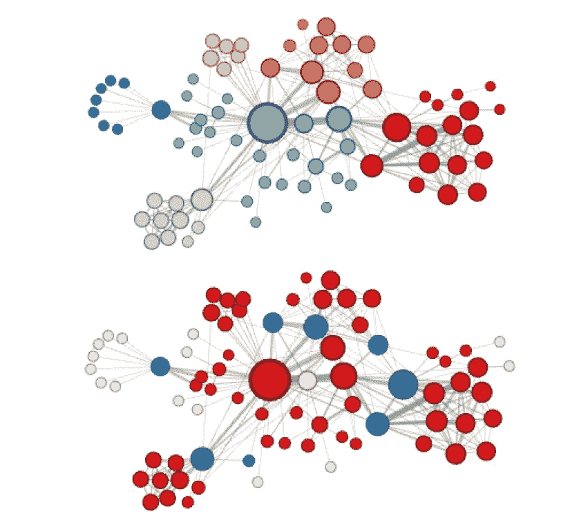

# 初学者的节点嵌入

> 原文：<https://towardsdatascience.com/node-embeddings-for-beginners-554ab1625d98?source=collection_archive---------5----------------------->

在大学里，我第一次听说网络是在一门关于生态网络的课上。这门课让我明白了很多事情。我想更多地了解他们，我梦想有一份与网络打交道的工作。但我对任何可能的图形机器学习一无所知。我决定负起责任，在网上搜索免费的在线课程和真正的宝藏。

[记者王](https://unsplash.com/@sodacheese?utm_source=medium&utm_medium=referral)在 [Unsplash](https://unsplash.com?utm_source=medium&utm_medium=referral) 上拍照

我在 youtube 上找到了斯坦福大学的这个免费课程，它是由图形机器学习的领军人物 Jure Leskovec 教授的。这门课的题目是[带图的机器学习](https://www.youtube.com/watch?v=JAB_plj2rbA&list=PLoROMvodv4rPLKxIpqhjhPgdQy7imNkDn&index=1)。这篇文章和我将要写的关于图形机器学习的其他文章是我融入这个新知识的方式，我从这个系列中有所收获。如果你还没有接触过图形机器学习，这篇文章给出了一个温和的介绍，并帮助你开始他的免费课程。

因此，我选择让这篇文章非常具有介绍性，并在这篇文章之后提供更多细节，让你了解这篇文章可能带给你的见解。所以，如果你觉得这篇文章让你越来越渴望获得更多的知识，你应该去看看。我希望你会喜欢。

# TL；速度三角形定位法(dead reckoning)

*   ML 算法需要某种形式的向量输入来执行
*   网络由节点和连接节点的边组成
*   我们可以就网络数据提出不同的问题。例如，节点属于哪个组，或者两个节点之间可能存在链路
*   网络没有自然的顺序，因此需要一种不同的 ML 方法
*   节点嵌入是将节点表示为向量的一种方式
*   网络或节点嵌入捕获网络的拓扑结构
*   嵌入依赖于相似性的概念。
*   嵌入可用于机器学习预测任务。

# 机器学习的目的——关于图形的机器学习呢？

与其他类型的数据一样，我们希望对真实世界中获得的数据所捕获的潜在信息进行推断。这就是机器学习发挥作用的地方。

机器学习算法为我们提供了模型，帮助我们理解我们以前从未见过的案例网络中的数据。当我说理解网络时，我指的是什么？

> 关于网络，我们可以问些什么问题？

我们来做一个例子网络，看看能提出什么样的问题。

作者绘制的社交网络

这是一个社交网络。每个节点指的是一个人，每个链接或边意味着由该边连接的两个人彼此认识。例如，乔安娜认识彼得和皮埃尔，但她不认识玛丽。

当检查这个网络时，我们可能会想为什么彼得会和乔安娜有联系。即。他们属于同一个群体(标签)吗？或者有没有可能彼得也认识玛丽。].或者文森特和乔安娜在他们的社交网络中有相似的角色。] ?

可能的问题摘要(非详尽)

1.  基于同质性假设的节点特征(标签/组)预测
2.  链接预测
3.  节点特征(角色)预测

# 我们将如何回答这些问题？

让我们后退一步，回忆一下我们如何用其他类型的数据回答问题。我提供了可能出现的问题和方法的简短总结，只是为了让我们熟悉解决问题的一般模式。

## 线性回归

如果我们想预测房子的价格，我们收集属性或特征并把它们放入一个向量中。这个向量乘以一个权重/斜率，再加上一个截距，就得到我们需要的价格预测。对于每个房屋，向量具有相同的特征，并且在开始时决定这些特征的排序。因此，第一个条目总是描述邮政编码，例如，第二个条目描述建筑物的年龄等等。特性总是得到相同位置的想法是很自然的，我们大多数有数据科学/ ML 经验的人都没有想过。

按作者

## 美国有线新闻网；卷积神经网络

如果我们想对图像进行分类，我们可能会选择卷积神经网络(CNN)。图像基本上是像素值的阵列/矩阵。CNN 的算法根据这些值对图片进行分类。整个阵列经过多个步骤进行转换，以保存重要信息(哪个像素具有哪个值，以及该值如何与相邻值相关)，并最终传递到完全连接的神经网络中，以加权像素之间的关系。但是在这篇文章中最重要的事情还是排序的本质。每个图像都有顶部和底部、左侧和右侧。因此，在阵列(或者更准确地说，堆叠阵列(张量))被传递到完全连接的神经网络之前，像素值被放入向量中。由于图片的自然排序，这对于每张图片都是一样的。

按作者

## RNN

在所有类型的递归神经网络(RNN)中，我们传递反映时间序列或序列的测量值/值的向量。每个输入都具有相同的形式，网络学习该形式的确切条目之间的关系，并预测未来值。

按作者

从这三个例子回到这些问题的首要原则，我们可以得出结论，有必要用某种形式的向量来唯一地描述数据源，无论是房子、图像还是序列。此外，这些例子表明，数据必须是某种排序的基础。

# 图表的问题是..

作者 gif

图表没有自然的顺序或参考点。因此，不存在顶部和底部或左侧和右侧。这与我们可以用线性回归、CNN 或 RNNs 解释的数据类型不同。一幅画由一个规则的格子组成。rnn 学习有序向量的序列。甚至像房子这样的任意实体也可以用向量来抽象描述，即使它没有完全捕捉到现实。

但是任何试图通过网络计数并制作矩阵的尝试都无法概括网络中的模式。因为给定图的邻接矩阵不是唯一的。

图没有唯一的邻接矩阵，作者

## 但是我们仍然想对图表进行推论

尽管如此，我们仍然需要一个返回向量的过程，无论是对于一个图、一个节点还是一条边。幸运的是，那些程序已经被发明出来了。在本文的其余部分，我将关注节点嵌入，但是类似的方法也适用于整个图或边。

# 节点表示学习

利用节点表示学习可以找到节点的向量。这种表示学习的结果是节点嵌入(图嵌入也是如此，边嵌入也存在)。所以我将交替使用表示和嵌入这两个术语。

图表表示，按作者

# 节点嵌入

但是为了允许推理，节点嵌入应该遵守什么规则呢？

> 嵌入应该捕获图形拓扑、节点之间的关系以及进一步的相关信息。嵌入应该如何捕获图的这种固有信息是不固定的。这取决于我们问的关于网络的问题。

嵌入应该捕获图形拓扑、节点之间的关系和进一步的信息。我们如何理解这一点，以便有一个明确的程序？

解决这个问题的一个可能的捷径是尝试形成嵌入，使得两个节点的节点嵌入在某种意义上是相似的，如果它们碰巧在真实网络中具有某种相似性的话。无论这种相似性是什么，都要由我们来决定。

> 我们可以基于相似性原理来决定形成嵌入。网络中相似的节点将具有相似的嵌入。

如果我们回到介绍性网络的例子，我们有一个社会网络，我们想把不同的人分配到不同的组(这是一个可能的问题)，我们可以尝试形成嵌入来帮助我们做到这一点。一个被认为有用的概念叫做同质性。在许多现实世界的网络中，人们发现同质化是一种组织原则，尤其是在社交网络中。也就是说，我们想把那些花时间在一起的人聚集在一起。

> 💡所以乔安娜的向量表示需要和彼得的向量表示相似，因为他们是邻居。—同性恋

在 [Unsplash](https://unsplash.com?utm_source=medium&utm_medium=referral) 上由[bùI Thanh TM](https://unsplash.com/@tamtit24?utm_source=medium&utm_medium=referral)拍摄的照片

再次注意，这只有在我们学习了遵循启发性的同质性概念的特征表示时才成立。研究人员发现的另一个可能的组织原则是结构对等的概念。集线器连接到网桥和/或树叶。

> 💡因此 Joanna 的向量表示需要类似于 Vincent 的向量表示，因为他们在他们的对等组中具有相同的角色。—结构等效

为了让你看得更清楚，我画了两个场景。在左边，你可以看到一个嵌入，这是由纯粹的同性恋组织产生的，而在右边，如果它是由结构等价单独组织的。我示意性地画了嵌入空间的 2D 投影，因为这是通常视觉上评估嵌入空间的方式。

作者在降维后嵌入图/例如 t-SNE

请注意，例如，如果相似性是基于同型性，那么乔安娜和皮埃尔的嵌入值实际上是相似的，但是如果是基于结构等价，则非常不同。Vincent 和 Joanna 有相似的嵌入，因为他们都将矩形对等组和三角形对等组连接起来。

然而，大多数算法让这种情况在无人监督的情况下展开，网络可以基于我们不知道的原则来构建。请记住，我们希望捕获网络拓扑和网络中的关系。因此，大多数情况下，表示不应该完全遵循同质性或结构等价。然而，研究表明，这些组织原则确实存在于真实的网络中，因此有理由假设嵌入包含了这些原则。

在我的另一篇更深入讨论节点嵌入的文章中，您可以看到一个名为 node2vec 的算法设法使用相似性的一般概念来实现节点嵌入，这种节点嵌入可以更多地遵循同构概念或结构等价概念或两者的混合，而 Deepwalk(node 2 vec 的“前身”)则受到更多的限制，因此在应用中功能较弱。

# 但是

> *node 2 vec 和 deepwalk 中的节点相似性都依赖于随机漫步中的节点同现。*

图 3 来自 node2vec，Grover 等人，2016 年，显示了《悲惨世界》中人物的共同出现

在 node2vec 论文的上图中，我们可以看到，在以无监督的方式对嵌入空间中的节点进行聚类和分组之后，他们标记了节点(算法不知道任何组)。基于完全同宗导致六组(上图)，基于完全结构等价导致三组(下图)。

总结一下我们到目前为止在这一章中学到的东西，我们现在知道我们想要形成嵌入，以便它们反映来自网络的信息。为了达到这个模糊的目标，我们引入了相似性的概念。我们触及了同质性和结构等价的概念，但我们了解到存在着这两者和其他组织原则的复杂混合。

# 但是我们如何获得这些嵌入呢？

首先，我们必须选择嵌入空间的大小。例如，在 node2vec 中，他们决定将网络嵌入 16 维空间。然后，因为我们没有开始的假设，嵌入空间最终会是什么样子(无人监督，我们不使用任何标签或任何东西)，我们随机初始化嵌入。因此，我们进行表示学习，这导致经过几次迭代得到反映网络拓扑的良好嵌入。

在表征学习过程中，我们遵循我们的目标，为此我们之前建立了直觉。我们以某种方式测量网络中两个节点之间的相似性，将其与嵌入空间中的相似性进行比较。如果两个节点之间的嵌入空间中的相似性没有反映网络中的相似性，我们对嵌入进行调整。

我故意省略了表征学习的细节，因为这篇文章是关于建立强大的直觉。

## 概述

1.  决定嵌入空间有多大
2.  随机初始化每个节点/图/边的嵌入
3.  通过反复递增地改进嵌入来学习嵌入，使得它反映网络中的相似性

(第三步是一个循环。)

# 那又怎样？我们可以用节点嵌入做什么？

如果我们的算法学习了嵌入，我们可以使用矢量化数据来获得关于网络的洞察力。这是通过已知的机器学习工具实现的。例如，我们可以在这个嵌入空间 k-means 聚类中形成无监督的组。

deepwalk 论文中的下图显示了基于算法的嵌入导致图形表示的证据。右边的嵌入反映了左边网络中的组。

Deepwalk，Perozzi 等人，2014 年，图 1

# 摘要

您了解了我们可以从机器学习/数据科学的角度就网络提出哪些问题。但是您看到了适用于其他常见数据类型(如图像或序列)的方法不起作用。但是，您已经了解到，节点或更一般的图嵌入可以是解决图上机器学习问题的第一步。我们已经引入了相似性的概念，这将有助于获得嵌入。如果我们有嵌入，你会看到原始的图形数据是如何转化成 ML 应用程序的。

[1]格罗弗，莱斯科维奇，node2vec，2016

[2] Perozzi 等人，deepwalk，2014 年

[3]图的机器学习—来自斯坦福在线的 youtube 课程[https://www.youtube.com/watch?v=3IS7UhNMQ3U&list = ploromvodv 4 rplkxipqhjhpgd QY 7 imn kdn&index = 4](https://www.youtube.com/watch?v=3IS7UhNMQ3U&list=PLoROMvodv4rPLKxIpqhjhPgdQy7imNkDn&index=4)

# 相关著作

 [## 网络图着色

### 图着色问题的解决方案在概念上很简单，但在应用上却很强大。本教程展示了…

towardsdatascience.com](/graph-coloring-with-networkx-88c45f09b8f4)