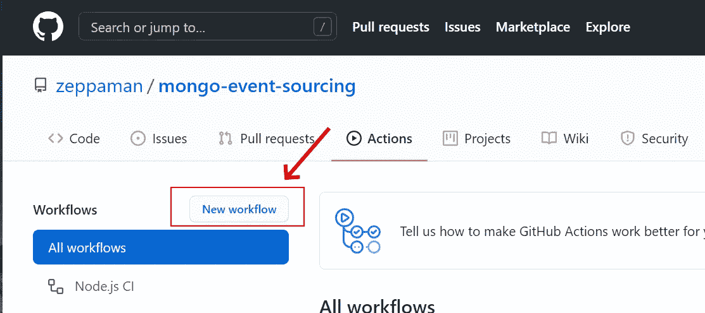
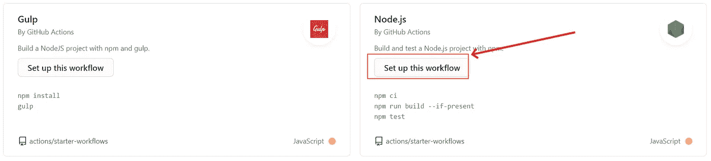
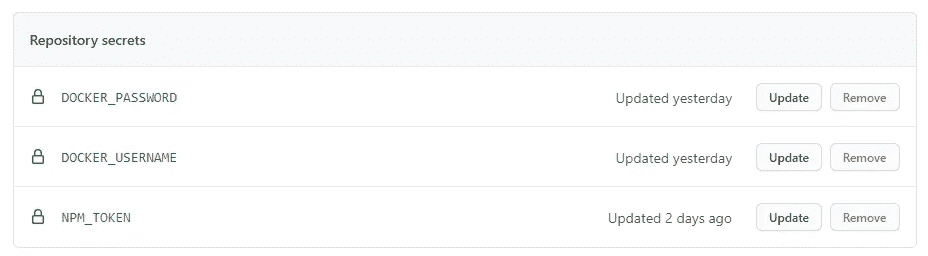

# 节点。JS DevOps:用 GitHub 操作简化您的生活

> 原文：<https://towardsdatascience.com/node-js-devops-github-actions-2a1b2be1741f?source=collection_archive---------24----------------------->

## 如何打包和部署 node.js 应用程序，并发布到 npmjs、docker hub 和其他目标

读过我的文章的人都知道我对 DevOps 和云采用的未来的愿景(仅 [DevOps 已死，NoOps 长命百岁](https://betterprogramming.pub/devops-appops-f096cdbb02ac)举一个例子)。为了解释它而不超出范围，我相信自动化和现成的解决方案(云、工具等)。)让我们只关注应用。这种方法引导开发人员采用可持续的方法

> 我们应该总是找到一种自动化的方式来进行部署，这种方式是免费的，而且只需付出有限的努力。

在本文中，我将与您分享我在部署我的第一个 [Node.js](https://medium.com/u/96cd9a1fb56?source=post_page-----2a1b2be1741f--------------------------------) 开源项目[MESS(MongoDB Event Sourcing System)](https://github.com/zeppaman/mongo-event-sourcing)时采用的配置。该配置是一个单独的 YAML 文件，可以为您的 GitHub 库释放无限的能量。

我在这里意识到的是一个简单的配置，它满足了当今企业应用程序的所有基本需求:

*   自动版本代码
*   在每个版本上运行测试
*   将人工制品发布到 NPMJS(如果你有图书馆或者你通过 NPM 传递)
*   发布您的 docker 容器，准备好进入容器存储库

所有这些特性可能看起来很难实现，但是你会发现使用 [GitHub](https://medium.com/u/8df3bf3c40ae?source=post_page-----2a1b2be1741f--------------------------------) 动作或多或少会实现。本指南将通过几个简单的步骤来解释这些技巧:

1.  创建简单的 node.js 应用程序
2.  使用 GitHub 操作添加工作流程
3.  使用 *Semver* 自动标记源代码
4.  每次提交时推送 NPM.js
5.  每次提交时推送 Docker Hub

让我们看看它有多简单！


托马斯·毕晓普在 [Unsplash](https://unsplash.com?utm_source=medium&utm_medium=referral) 上拍摄的照片

# 创建简单的 node.js 应用程序

很明显，在开始本教程最酷的部分之前，我们需要部署一些东西。为此，我们只需要一个简单的 node.js 应用程序。第一步是使用 npm CLI 创建一个新的。

```
npm init 
npm install express --save
```

上面的命令初始化节点应用程序并将 express 安装为 web 服务器。出于演示目的，我们可以创建一个带有一些虚拟端点的应用程序。用以下内容创建一个名为`main.js`的文件:

现在，您可以通过输入 run 命令的定义来改变 npm 包。在下一个示例中，我使用 supervisor 在开发环境和常规生产节点上进行热重装。

键入`npm run serve`实时查看您的应用程序。

# 使用 GitHub 操作添加工作流程

一旦我们有了要测试的虚拟应用程序，我们必须将它提交给一个公共或私有的 GitHub repo。这一步对所有开发人员来说应该很容易，所以我不会浪费时间解释它😃

一旦代码被推送，你可以打开 GitHub 页面，点击“Action”，然后点击“New Workflow”按钮，如下图所示。



创建新的工作流

这将询问使用什么样的模板，在我们的例子中，我们将选择 node.js 模板，但这并不排除对所有其他可用操作的 do 访问。



选择正确的模板

现在我们已经准备好设置工作流了！

# 使用 Semver 自动标记源代码

首先，对那些不习惯的人说几句话。SemVer 是一个语义版本编号系统，简而言之，它根据提交历史计算软件的版本。在一个示例中，它在每次提交时增加补丁号(1.0.x)或增加次要版本(1。X.0)每次合并主控形状上的特征分支时。可以想象，您可以修改约定来满足您的编号要求。

要启用自动版本控制，您只需添加以下步骤:

正如您在代码中看到的，有两个不同的步骤。第一个是启用管理 *semver* 标签的插件，第二个是简单地将它显示在控制台上。这里的技巧是为第一步添加一个 id，这将允许您使用像`${{steps.version-bump.outputs.newTag}}`这样的输出变量。此时，我们已经完成了版本控制。是的，因为这个包自动标记每个提交并改变`package.json`版本属性。

好了，现在是时候把我们的代码推到 NPM 了！

# 每次提交时推送 NPM.js

NPM 的蹬踏很容易。第一步是使用 NPM 令牌添加一个秘密值，您可以从您在 NPM 的个人资料中获取该值。秘密部分可以在 GitHub 的“设置”标签下找到。在下一张图中，你会看到`NPM_TOKEN`和其他我们将用于 docker 支持的设置。



GitHub 秘密

现在，我们可以将以下配置添加到工作流中:

这一步使用`package.json`文件中的信息在 NPM 上测试和发布代码。仅此而已！只需跳到下一节，将我们的代码也发布到 docker。

# 每次提交时推送 Docker Hub

在 docker 上启用部署的第一步是创建一个 Docker 映像进行提交。为此，只需添加一个包含以下内容的`Dockerfile`:

```
ROM node:alpine as builder 
WORKDIR /usr/src/app 
COPY ./ /usr/src/app 
RUN npm install FROM node:alpine as app 
WORKDIR /usr/src/app C
OPY --from=builder /usr/src/app /usr/src/app 
ENTRYPOINT ["/bin/sh", "-c" , "pwd & ls & npm run serve"]
```

要构建和发布 Docker 图像，您只需将另一段代码添加到工作流 YAML 中。下一个就够了:

YAML 执行以下步骤:登录、获取图像信息、构建和发布。变量`DOCKER_USERNAME,DOCKER_PASSWORD`是 GitHub 的秘密。为了安全起见，您可以使用 auth 令牌来代替密码。这可以由您的 Docker Hub 帐户档案生成。在这个例子中，我使用了一个双标签:我用“最新的”来标记每张图片，并添加了一个基于*永远*的标签。这个技巧是通过在同一个图像上添加两个标签来实现的，设置为:

```
tags: zeppaman/mongo-event-sourcing:latest, zeppaman/mongo-event-sourcing:${{ steps.version-bump.outputs.newTag }}
```

如您所见，我使用了标记步骤的输出变量。现在所有的配置都完成了，我们有了管道集。很简单，对吧？

# 带什么回家

GitHub action 是实现构建管道的一个非常简单的工具。该设置很容易与 NPM 和 Docker 集成，这使得您的应用程序很容易被所有基于容器的平台使用。我指的是 Kubernetes 和其他云平台。此外，您还可以通过 npm 进行部署，以共享库或允许定制您的应用程序。

这就是为什么我为我的开源应用程序选择这个设置，我很容易找到一个可以帮助用户顺利采用它的设置。

*喜欢这篇文章吗？成为* [*中等会员*](https://daniele-fontani.medium.com/membership) *继续无限制学习。如果你使用下面的链接，我会收到你的一部分会员费，不需要你额外付费。*

## 参考

*   [GitHub 项目](https://github.com/zeppaman/mongo-event-sourcing)
*   [NPM 套餐](https://www.npmjs.com/package/mongo-event-sourcing)
*   [码头工人图像](https://hub.docker.com/r/zeppaman/mongo-event-sourcing)