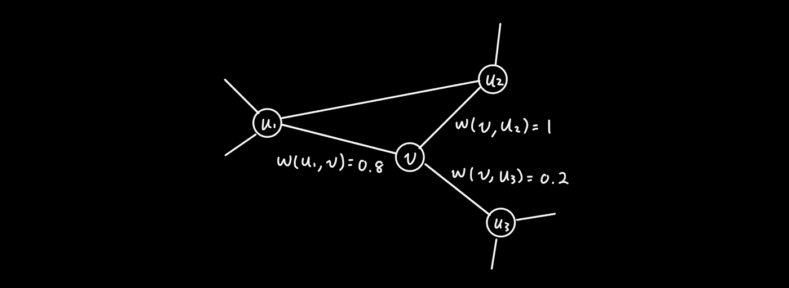
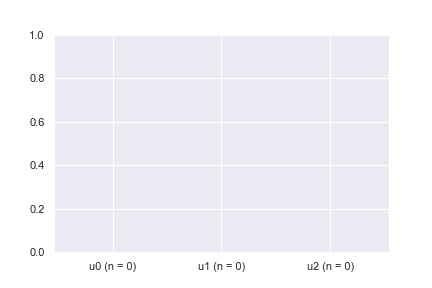
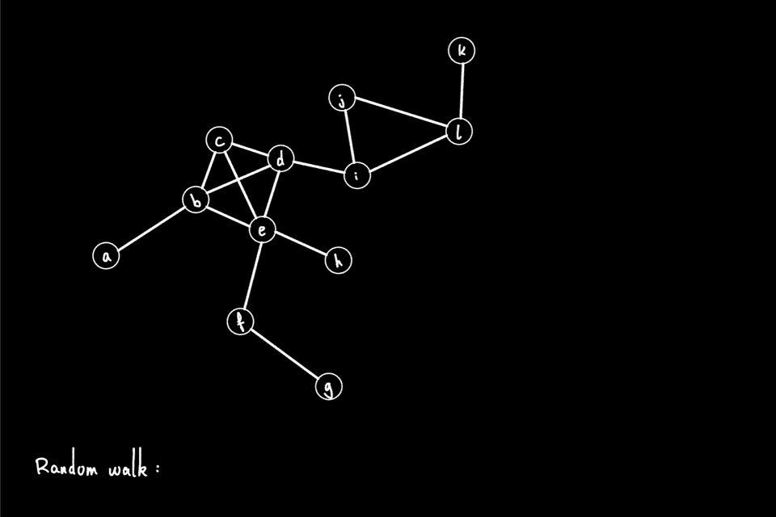
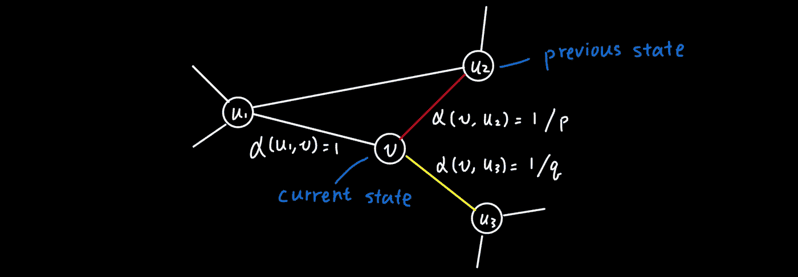
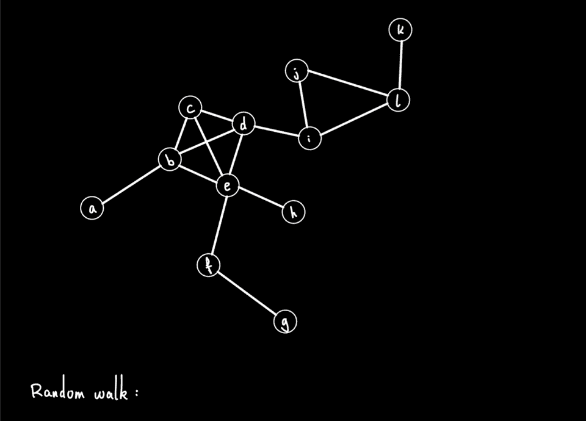
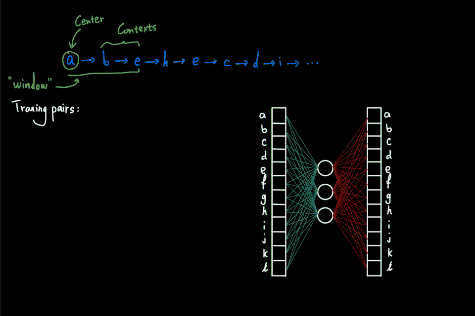
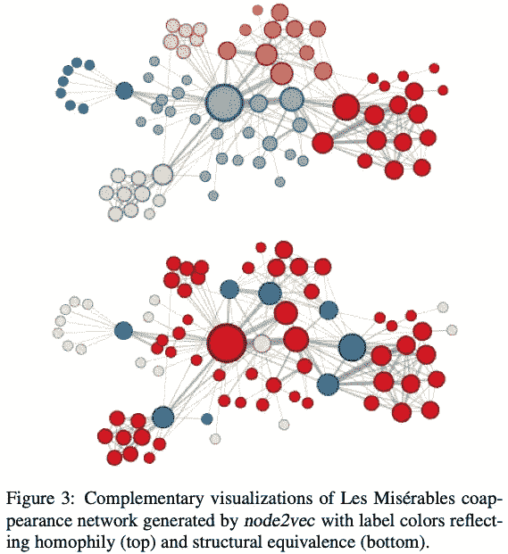

# Node2vec 用图形解释

> 原文：<https://towardsdatascience.com/node2vec-explained-graphically-749e49b7eb6b?source=collection_archive---------10----------------------->

## [入门](https://towardsdatascience.com/tagged/getting-started)

## 图形上的二阶随机游走是如何工作的，通过动画解释

来自 [Pixabay](https://pixabay.com/) 的[数码师](https://pixabay.com/users/thedigitalartist-202249/)的照片

Node2vec 是一种嵌入方法，将图形(或网络)转换成数字表示[1]。例如，给定一个社交网络，其中人(节点)通过关系(边)进行交互，node2vec 生成数字表示，即数字列表，来表示每个人。这种表示在某种意义上保留了原始网络的结构，因此关系密切的人具有相似的表示，反之亦然。在本文中，我们将通过一系列动画来直观地了解 *node2vec* 方法，特别是二阶随机游走在图上是如何工作的。

# TL；速度三角形定位法(dead reckoning)

*   *Node2vec* 通过**二阶(有偏)随机游走**生成图中节点的数字表示。
*   一阶随机游走是通过沿着图的边对图上的节点进行采样来完成的，并且每一步仅*依赖于**当前状态**。*
*   二阶随机游走是一阶随机游走的修改版本，它不仅依赖于**当前状态**，还依赖于**先前状态**。
*   使用网络中的每个节点作为起点来生成随机行走的语料库。这个语料库然后通过 *word2vec* 生成最终的节点嵌入。

# 一阶随机行走

图上的随机行走可以被认为是沿着图的边遍历图的“行走者”。在每一步，步行者需要决定下一步去哪里，然后移动到下一个州。这个过程被称为**一跳转换**。让我们看一个简单的例子。

一阶转移概率的例子。(图片由作者提供)

在这个例子中，让我们假设 walker 当前在 v 上，它有三个相邻的节点:u1、u2 和 u3。每个邻居以不同的权重连接到 v，如图所示。这些权重用于确定选择下一步的概率。具体地，通过归一化边缘权重来计算**转移概率** :

其中 N_v 是 v 的相邻节点的集合，在本例中是 u1、u2 和 u3，d(v)是节点 v 的度。

作者图片

快速计算后，我们看到从 v 到 u1、u2 和 u3 的转移概率分别为 0.4、0.5 和 0.1。根据大数定律，我们知道，如果我们使用指定的转移概率抽取足够多的样本(即，在给定当前状态 v 的情况下选择下一个状态)，平均转移应该接近期望值。条形图动画显示了一百次在给定 v 处的当前状态的情况下选取下一个状态的示例。可以看出，每个相邻节点被选取的次数百分比分别收敛到期望的概率 0.4、0.5 和 0.1。

既然我们已经了解了如何通过转移概率实现一跳转移，我们可以继续进行**随机漫步**生成。简而言之，通过执行多个 1 跳转换来生成随机游走，其中前一个 1 跳转换确定当前状态。

图中从节点“a”开始的随机游走(图片由作者提供)

上面的动画显示了一个随机漫步的例子，它在一个有 12 个节点(节点“a”到节点“l”)的图上进行，从节点“a”开始。在每次迭代中，遍历器通过一跳转换前进到下一个节点。随机行走过程继续，直到它达到预定义的“walk_length ”,或者行走者到达有向图的“死胡同”,即，节点没有外出边。在这个例子中，生成的随机游走是节点序列:[a，b，e，h，e，c，d，I，…]

到目前为止，我们所看到的被称为**一阶**随机行走，这意味着 1 跳跃迁只取决于当前状态。然而， *node2vec* 执行**二阶**随机漫步，这是一个稍微修改的版本，包含了来自上一步的信息。

# 二阶有偏行走

二阶转换不是查看当前状态的直接邻居，而是根据前一状态应用偏差因子α来重新加权边权重。特别地，alpha 是一个将当前状态和潜在的下一个状态作为输入的函数。在第一种情况下，如果两个状态(节点)没有连接，那么 alpha 设置为 1/q，其中 q 是**输入输出参数**。因此，可以通过指定小的 q 值来增加“向外”行走的概率(意味着行走不被限制在局部邻域中)，或者相反地通过设置大的 q 值来将行走限制在局部邻域中。在第二种情况下，如果两个状态相同，意味着行走“返回”到先前的状态，那么 alpha 被设置为 1/p，其中 p 是**返回**参数。最后，如果两个状态不相同并且是连接的，那么 alpha 被设置为 1。

偏差因素。([格罗弗和莱斯科维奇，2016](https://arxiv.org/abs/1607.00653) )

回到我们之前关于 1 跳转换的例子，假设 u2 是之前的状态，下图用红色突出显示了*返回*边沿，用黄色突出显示了*进出*边沿。偏置因子α被相应地分配:1/q 用于*输入输出*(黄色)，1/p 用于*返回*(红色)，否则为 1。

返回(红色)和输入输出(黄色)边沿的偏置系数示例。(图片由作者提供)

有了这些偏差因子，我们可以继续计算**二阶跃迁概率**，如下所示，这与我们在上面看到的一阶跃迁非常相似，但现在每个权重都有α偏差。

如前所述，可以使用二阶转移概率生成**二阶随机游走**。在下面的动画中，*返回*和*进出*边缘分别用红色和黄色突出显示。

二阶随机游走、返回和进出边的示例分别用红色和黄色突出显示(图片由作者提供)

# 来自随机漫步的节点嵌入

到目前为止，我们看到的随机行走都是从单个节点开始的。想象一下，使用图中的每个节点作为初始节点，这个随机漫步生成过程被重复多次。然后，作为结果，我们有一个节点序列的大“语料库”。然后，这个“语料库”可以直接输入到 *word2vec* 算法中，以生成节点嵌入。特别是 *node2vec* 使用 *skipgram* 配合*负采样*(简称 SGNS)。这里省略了 SGNS 的细节，但是我强烈建议读者查看两篇伟大的博文([【2】](http://mccormickml.com/2016/04/19/word2vec-tutorial-the-skip-gram-model/)和[【3】](http://mccormickml.com/2017/01/11/word2vec-tutorial-part-2-negative-sampling/))，这两篇博文分别由 [Chris McCormic](http://mccormickml.com/) 撰写，解释了 SG 和 NS。

下面的动画给出了使用图上生成的随机游走训练 *skipgram* 的简要思路。主要思想是最大化预测给定中心节点的正确上下文节点的概率(通过 softmax 计算)。另一方面，*负采样*用于通过仅计算来自随机抽取的“负样本”的几个激活来提高计算效率，而不是 softmax 中的全部归一化因子。

使用随机行走的 skipgram 训练动画。(图片由作者提供)

# 为什么走偏了？

现在我们知道了 node2vec 如何使用二阶随机漫步在图上生成嵌入，您可能会想，为什么不直接使用一阶随机漫步呢？主要原因是搜索策略的**灵活性。一方面，当返回参数(p)和输入输出参数(q)设置为 1 时，它精确地恢复了一阶随机游走。然而，另一方面，当 p 和 q 被设置为除 1 之外的正值时，随机行走可能被偏置为或者局限于网络模块中，或者相反，在整个网络中。**

尽管如此，你可能想知道，为什么你要关心在这种意义上的行走是否灵活？

([格罗弗和莱斯科维奇，2016](https://arxiv.org/abs/1607.00653)

*node2vec* 论文给出了以下具有不同 p 和 q 的悲惨世界网络嵌入的示例。所得到的嵌入用于执行聚类分析以将节点分组在一起。然后根据节点所属的集群对节点进行着色。顶部和底部面板对应于使用 q = 0.5 和 q = 2 生成的 *node2vec* 嵌入。可以看到，在顶部面板中，属于同一**本地网络邻居**(即**同向**)的节点颜色相同。另一方面，在底部面板中，**结构相同的**节点颜色相同。例如，蓝色节点对应于充当社区之间桥梁的角色。

# 结束语

*Node2vec* 在计算生物学中特别流行，主要用于使用蛋白质-蛋白质相互作用网络嵌入的基因分类。例如，已经表明，对于基因功能预测，PPI *node2vec* 嵌入后进行逻辑回归可以产生与最先进的网络传播方法相同或更好的性能[4]。类似地，另一种称为 GeneWalk 的方法使用 *node2vec* 来生成基因和基因本体术语的生物上下文特定嵌入[5]。

最后，尽管 *node2vec* 嵌入有很好的性能，但是由于内存问题，最初的实现不太具有可伸缩性。特别是，正如我们之前看到的， *node2vec* 设计了二阶跃迁随机游走，它依赖于当前状态和先前状态。这导致转移概率的总数与图中边的数量成二次方比例(巨大……)。例如，嵌入一个具有 17k 个节点和 3.6M 条边的相当稀疏的网络需要超过 100GB 的内存。这个内存问题被一个叫做 *PecanPy* 的新实现有效地解决了，它只使用不到 1GB 的内存来嵌入相同的网络【6】。你也可以看看我的另一篇[博文](/run-node2vec-faster-with-less-memory-using-pecanpy-1bdf31f136de)，了解更多关于 *PecanPy* 的信息。

感谢您的阅读，我希望这篇文章能让您更好地了解 *node2vec* 是如何工作的！

# 参考

[1] A. Grover，J. Leskovec， [node2vec:面向网络的可扩展特征学习](http://arxiv.org/abs/1607.00653) (2016)， *ACM SIGKDD 知识发现与数据挖掘国际会议(KDD)*

[2] C. McCormick， [Word2Vec 教程——跳格模型](http://mccormickml.com/2016/04/19/word2vec-tutorial-the-skip-gram-model/) (2016)

[3] C. McCormick， [Word2Vec 教程第 2 部分—阴性取样](http://mccormickml.com/2017/01/11/word2vec-tutorial-part-2-negative-sampling/) (2017)

[4]刘，Christopher A Mancuso，Anna Yannakopoulos，Kayla A Johnson，Arjun Krishnan，[监督学习是基于网络的基因分类的精确方法](https://doi.org/10.1093/bioinformatics/btaa150) (2020)，*生物信息学*

[5] Ietswaart，r .，Gyori，B.M .，Bachman，J.A .，*等* [GeneWalk 使用网络表示学习](https://doi.org/10.1186/s13059-021-02264-8)(2021)*Genome Biol*

[6] R. Liu，A. Krishnan，[pecan py:*node 2 vec*](https://doi.org/10.1093/bioinformatics/btab202)(2021)，*生物信息学*的快速高效并行 Python 实现