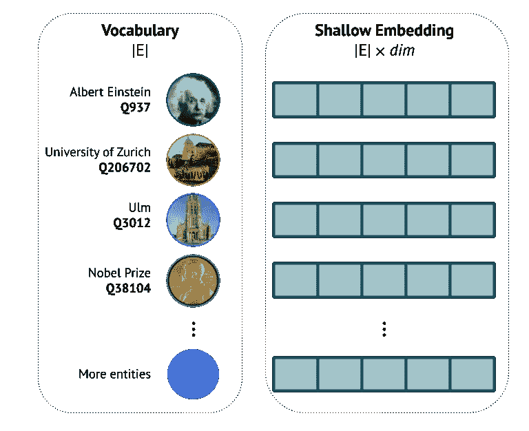

# 节点:标记知识图

> 原文：<https://towardsdatascience.com/nodepiece-tokenizing-knowledge-graphs-6dd2b91847aa?source=collection_archive---------20----------------------->

## [思想与理论](https://towardsdatascience.com/tagged/thoughts-and-theory)，构图性&图形

## 将每个节点映射到一个嵌入向量会产生非常大的嵌入矩阵。有没有一种类似于“子词单元”的固定大小的令牌词汇表的方法？

*这篇博文是与 Etienne Denis 和 Paul Wu 共同撰写的，基于我们的论文“* [*节点件:大型知识图的组合和参数高效表示*](https://arxiv.org/abs/2106.12144) *”。*

语言模型有固定大小的词汇表和表达性编码器。浅 KG 嵌入大多只使用所有节点的词汇表。我们能不能有一个固定大小的词汇表，带有一个嵌入 KGs 的编码器？作者图片

Kknowledge graphs(KG)不断变得越来越大: [Wikidata](https://www.wikidata.org/wiki/Wikidata:Main_Page) 拥有大约 1 亿个节点(实体)， [YAGO 4](https://yago-knowledge.org/getting-started) 拥有大约 5000 万个节点，而像 [Google KG](https://developers.google.com/knowledge-graph) 或 [Diffbot](https://www.diffbot.com/) 这样的定制图要大几个数量级📈。

对它们执行任何机器学习(ML)或图形表示学习(GRL)任务通常意味着**通过将每个实体和关系映射到一个**唯一向量**(或有时许多向量，或整个唯一矩阵)来将**实体和关系嵌入潜在空间。我们通常把那些称为 ***浅嵌入*** 。

# **浅埋:局限性**

> 几乎所有现有的 KG 嵌入算法(如 TransE，RotatE，DistMult 等)都很肤浅。

E 具有可学习的实体嵌入矩阵的基于 GNN 的模型，例如 [CompGCN](https://openreview.net/pdf?id=BylA_C4tPr) ，在消息传递之前具有浅查找层。

浅嵌入:所有节点被映射到各自唯一的向量。作者图片

本质上，shallow 意味着嵌入查找:对于包含 *|E|* 个实体的词汇表，在嵌入矩阵中必须有 *|E|* *d* 维的行(🖼👈).也就是说，100 个实体= 100 行，10K 实体= 10K 行，100M 实体= 100M 行，依此类推。现在，将行数乘以嵌入维数，以获得可学习参数的大致数量(关系数 *|R|* 比 *|E|* 小得多，因此我们主要关注实体)。并且整个嵌入矩阵驻留在珍贵的 GPU 存储器中💾。

顺便说一下，像 [node2vec](https://arxiv.org/pdf/1607.00653.pdf) 这样的经典图嵌入算法也是浅层的，因为它们也将每个节点映射到一个唯一的向量。

从[开放图形基准(OGB)](https://ogb.stanford.edu/) 扩展到一个只有 250 万个实体的 [WikiKG 2](https://ogb.stanford.edu/docs/linkprop/#ogbl-wikikg2) 图会发生什么？嗯，…🤔

当前 OGB 维基 2 排行榜。来源: [**开图基准**](https://ogb.stanford.edu/docs/leader_linkprop/)

因此，模型大小在 500M-1.25B 参数之间变化(并且您需要具有 45 GB VRAM 的🛩-expensive GPU 或减少嵌入维度)👀

🛑等等，革命性的 NLP 的 [BERT 或者被认为](https://www.aclweb.org/anthology/N19-1423.pdf)[“太危险而不能公开发布”](https://openai.com/blog/better-language-models/)的 GPT-2 有多大？340M 和 1.5B 参数。所以你可能会有一个自然出现的问题:

> 我们是否有效地使用了我们的参数预算？为什么 1.25B WikiKG 嵌入没有那么*危险*？

(嗯，除了训练上的能耗)

我相信你比我更清楚:

*   LMs 有一个小的固定大小的词汇表，并在这个词汇表之上有一个强大的编码器(当然是 Transformer 的变体)；
*   固定大小的小词汇量允许处理任何单词，甚至是那些在训练中看不到的单词；
*   这个固定大小的小词汇表仍然足够宽(768–1024d)。

另一方面，我们在浅嵌入模型中有什么？(这里我们来到了**标题图片** 🖼👆)

*   只有实体和关系的词汇表，没有通用的编码器；
*   庞大的词汇表吞噬了所有的参数预算。要么是词汇表变得太大，要么是你必须减少维数以保持总的大小合理。
*   纯转导设置—没有能力构建看不见的节点的表示，它们是 OOV(不在词汇表中)。

那些浅薄的属性让你想起什么了吗？🤨欢迎回到 2014 年！

这里需要一些时间旅行。来源: [Giphy](http://gph.is/14n1OSJ)

# 迂回:从 word2vec 到字节对编码

在*史前*前变形金刚时代，NLP 的人做了什么？

来源:[杰·阿拉玛的插图文字 2 vec](https://jalammar.github.io/illustrated-word2vec/)

Word2 vec 和 [GloVe](https://github.com/stanfordnlp/GloVe) 提供了 **400K - 3M** 预训练单词嵌入(有时还有短语)的矩阵。任何超过 40 万到 300 万的单词都属于 OOV(不在词汇表中🤷‍♀️)类别。类似地，如果在推理时你收到一个看不见的单词——你必须用< UNK >令牌替换它。

字节对编码词汇。来源:[森里奇等人](https://www.aclweb.org/anthology/P16-1162.pdf)和 [CS224N](http://web.stanford.edu/class/cs224n/readings/cs224n-2019-notes06-NMT_seq2seq_attention.pdf)

机器翻译中的“单词块”。[资料来源:森里奇等人](https://www.aclweb.org/anthology/P16-1162.pdf)

最终，无论我们如何扩展**单词**词汇，由于语言的复合性，我们永远无法完全掌握所有的单词🏗。很快，社区意识到我们需要一个更具组合性的机制来代表任何单词，无论是看得见的还是看不见的，使用同一套原子🧱。2015 年有很多这样的方法:

*   [基于字符的模型](https://arxiv.org/pdf/1508.06615.pdf)其中原子本质上是字母表🔡用一些辅助符号；
*   在 [**Sennrich 等人**](https://www.aclweb.org/anthology/P16-1162.pdf) 的开创性工作中引入了“词块”🧩或“子词单位”模型，其中原子是最常见的 n 元语法。将这些子字单元实现为[子字-nmt](https://github.com/rsennrich/subword-nmt) 或[字段/句子段](https://github.com/google/sentencepiece)中的[字节对编码(BPE)](https://github.com/rsennrich/subword-nmt) 的算法成为所有现代神经语言模型中事实上的标准预处理步骤。

现在，使用**有限**的原子词汇表，🧱就有可能构建几乎无限**数量的组合词，任何看不见的词都可以被标记成一系列字符或词块，而且不存在 OOV 问题！**

此外，您不需要存储 3M 大的词汇矩阵作为输入嵌入。使用单词块，典型的词汇表要小得多。🤏

*   伯特: **30K** 文字块令牌
*   GPT-2 和 GPT-3: **50K** BPE 代币

那么我们为什么不把这个用于图的 ML 域呢？🤔

> 如果节点是“词”，是否可以为图设计一个固定大小的“子词”(子节点)单位的词汇？

# 用节点标记 kg

在自然语言处理和图 ML 方法中定位节点。图片作者。

🎯我们在最近的工作中解决了这个研究问题，我们提出了 **NodePiece** 作为一种组合的“节点标记化”方法来减少大型 kg 中的词汇大小。与其存储庞大的实体嵌入矩阵，我们建议学习一个由原子组成的**固定大小的词汇表**和一个简单的编码器，它将能够从原子序列中引导任何节点的表示，就像从子词单元序列中构造词一样。

🧱在 NodePiece 中，词汇原子(或者“节点片”，或者“令牌”，如果你喜欢的话)是**锚节点**和**关系类型**。锚节点是图中现有节点的子集，可以随机选择，也可以根据某些中心性度量(如 PageRank 或节点度)来选择。您不需要很多锚节点(因为您不需要令牌词汇表中所有可能的 n 元语法)，我们发现，通常 1–10%就足够了。有时你甚至不需要锚节点在所有🧙‍♂️！

所有的关系类型都包含在词汇表中，因为与节点(实体)的总数相比，它们通常并不多。

节点标记化策略。红色节点用 3 个最近锚点和 3 个传出关系类型来标记。作者图片

那么我们如何标记图中的任意节点呢？让我们按照插图🖼👆凭着一种基本的直觉。

假设我们想要标记红色节点🔴给定锚点和几种关系类型。

1.  我们使用 BFS 找到 *k* **个最近的锚**，并按照它们距离**到**的升序排列它们🔴( *k* =20 如果足够经常的话)。
2.  锚**距离**是类似于*位置编码*的标量，有助于定位(或“三角测量”)🔴节点，并将其归属于锚节点。类似于位置编码，我们将 *k* 锚距离嵌入添加到 *k* 各自最近的锚节点。
3.  在大型 kg 中，一些“哈希冲突”仍然是可能的，因此第三个成分🧂是节点**关系上下文**的 *m* 唯一传出关系🔴(注意，向图中添加反向边的标准预处理步骤非常有帮助，因为我们保持每个节点的完全可达性)。根据公斤的大小和密度，我们将 m 从 3 到 15 不等。
4.  现在，我们有了一个 *k+m* 令牌序列，**唯一地标识**任何节点。任何内射池(像 MLP 或 Transformer 这样的序列编码器)都可以用来将 *k+m* 序列编码成唯一的嵌入向量，这就是我们一直在寻找的节点嵌入。

🔧让我们用维基百科的术语来标记[阿尔伯特·爱因斯坦](https://www.wikidata.org/wiki/Q937)，看看这个序列会是什么样子。假设我们已经预先选择了一些锚，我们可以使用三个最接近的:`Ulm`、`Nobel Prize`、`Theoretical Physics`。所有这些都是在爱因斯坦的 1 跳邻域中找到的，所以它们的锚距离是 1。作为关系上下文，我们随机抽取 4 种独特的传出关系类型，例如，`place of birth`、`award received`、`occupation`、`academic degree`。因此，我们的*爱因斯坦实体*是用 7 个原子🧱.表征的自然地，KG 越大，你想要使用的锚就越多，以确保序列更独特，尽管我们发现即使在百万节点图中，每个节点也有一个大约 20 个锚的饱和点。

阿尔伯特·爱因斯坦可能的“记号化”将乌尔姆、诺贝尔奖和理论物理作为 KG 中的锚节点和外向关系的子集。谓词有 Wikidata QIDs。为简洁起见，省略了锚定距离。作者图片

将编码器函数 *f* 应用于符号化的序列，并且我们重建爱因斯坦的唯一节点嵌入。

📩这种节点嵌入可以在任何下游任务中发送到您最喜欢的模型，例如，节点分类、链接预测或关系预测，或者在直推或归纳设置中的其他东西。

## NodePiece 的直接好处是什么？

*   戏剧词汇和嵌入大小缩减📉:仅 *|A|* 锚节点，而非所有 *|E|* 节点。根据不同的任务，我们以 10 倍、100 倍、1000 倍的缩减率进行实验，并且仍然观察到竞争结果(更多内容见下文)；
*   节省的参数预算现在可以投入到一个表达性编码器中，该编码器构建节点表示；
*   **感应**开箱即用的能力！任何附加到可见图的新的不可见输入节点都可以使用相同的词汇进行“标记化”,并通过相同的编码器进行编码。也就是说，没有必要为此发明复杂的方法或评分函数——您仍然可以使用 TransE/ComplEx/RotatE/(put your fav model)作为评分函数！

## 实验:一些数字🧪

我们进行了大量的实验，包括在 FB15k-237 和 YAGO 3–10 等标准基准上进行的直推式和感应式链路预测，但这里让我们专注于特别有趣的现象。

🤔首先，如果我们将词汇量减少 10 倍会发生什么？也就是说，我们只保留 10%的原始节点作为锚(享受 10 倍的参数缩减)，其余的通过 MLP 从它们重建。我们使用节点件词汇表和编码器以及几个最新的特定于任务的解码器模型(例如，分别是**关系预测**上的 [RotatE](https://openreview.net/forum?id=HkgEQnRqYQ) 和**节点分类**上的 [CompGCN](https://arxiv.org/abs/1911.03082)

节点件扩充模型的关系预测比较。作者图片

在👆关系预测， *10x* 节点词汇缩减实际上在所有数据集上都很有竞争力，在 Hits@10 方面达到或优于基线。

👀消融研究揭示了一个有趣的现象——拥有 **0 个锚**不会影响像 FB15k-237 和 YAGO 3–10 这样的关系丰富的图上的性能，所以*根本不需要*节点/锚嵌入🚮！对于一个非常好的性能来说，与编码器的关系上下文中的一些关系就足够了。

这是关系预测任务的独特之处吗？🤨

一个节点片增强模型的节点分类比较。作者图片

事实证明，并不是！在节点分类中👆(这里是一个大约有 500 个标签的多类多标签问题)，我们将词汇量减少了大约**1000 倍**(46K 节点图中有 50 个锚点)，并观察到了实际的改进📈以及所有可能暗示基线已经被过度参数化的度量。

同样，如果我们完全放弃具有 **0 锚**的节点嵌入词汇表，数字会稍微好一点。也就是说，对于节点分类来说，仅仅一个关系上下文似乎就足够了！

这一发现很好地符合最近开始的研究趋势:

> 在 KG 表征学习中，关系的连续性仍然被低估。

kg 是多关系图，这一点尚未得到充分利用。我们认为在不久的将来会出现更多的关系感知编码方法(它们是 1 跳上下文、关系路径或新的[神经贝尔曼-福特框架](https://arxiv.org/abs/2106.06935))。

# 外卖和资源

*   类似于“标记化”的实体组合编码对 kg 有效！
*   组合编码在设计上是归纳性的——我们可以从**有限的**词汇表中构建出**无限的**数量的组合(实体)。
*   词汇减少允许将更多的参数投入到强大的编码器中。
*   节点令牌化可以增强任何现有的下游 KG 任务。
*   几乎没有性能下降:整体性能水平与大得多的浅嵌入模型相当。
*   在关系丰富的图中，对于某些任务来说，仅仅几个与 **0** 锚的关系就足够了。

**纸张**:[Arxiv 上的预打印](https://arxiv.org/abs/2106.12144)
**代码** : [Github repo](https://github.com/migalkin/NodePiece)

是时候吃一块了！资料来源:[吉菲](https://giphy.com/gifs/end-full-bAlYQOugzX9sY)