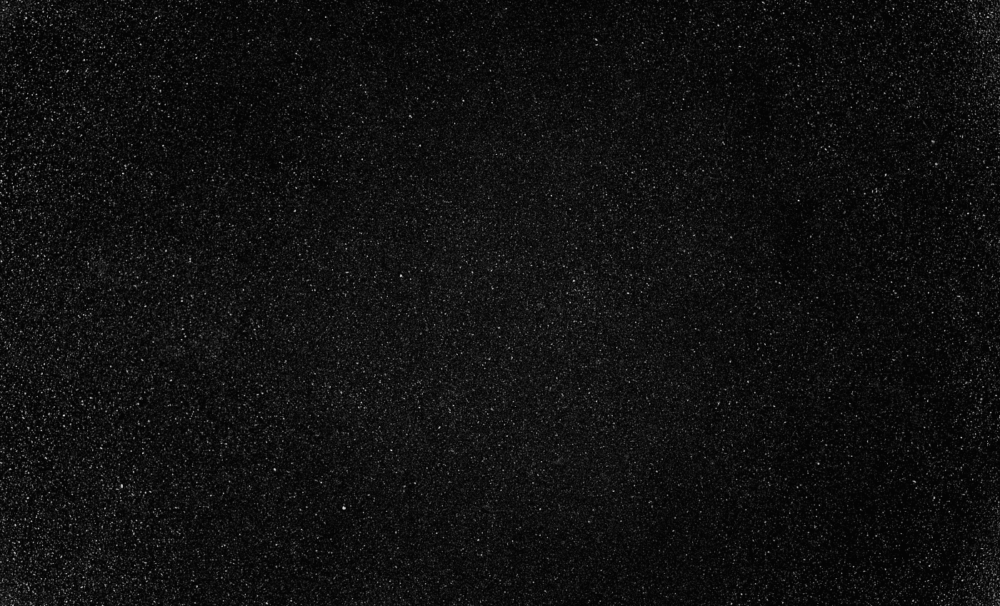
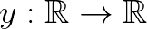
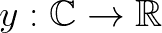
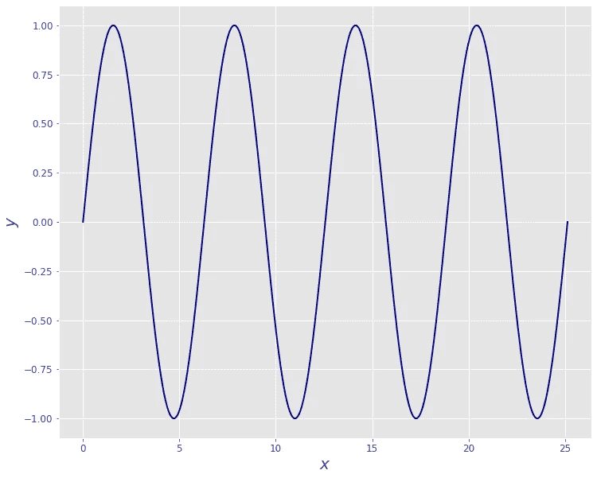
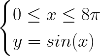
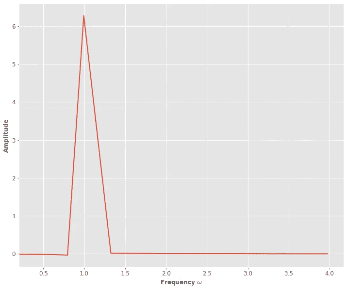
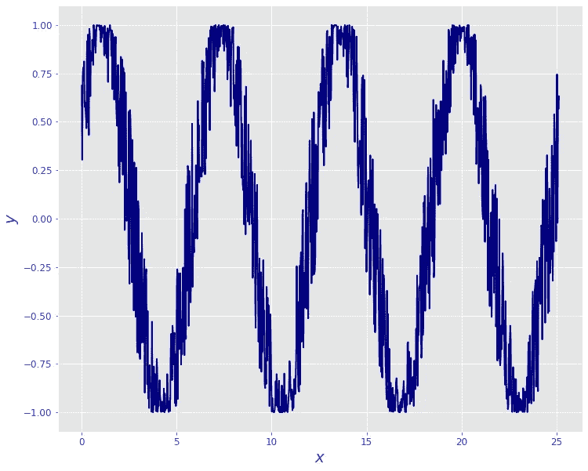
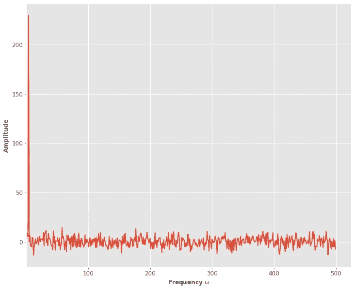

# 利用 Python 和傅立叶变换消除噪声

> 原文：<https://towardsdatascience.com/noise-cancellation-with-python-and-fourier-transform-97303314aa71?source=collection_archive---------3----------------------->

欧内斯特·卡尔希米特在 [Unsplash](https://unsplash.com/s/photos/noise?utm_source=unsplash&utm_medium=referral&utm_content=creditCopyText) 上拍摄的照片

## 下面介绍如何使用傅立叶变换这样非常简单的工具，用很少的几行代码就可以获得高效的噪声消除。

**模拟噪音是一项非常困难的任务。我甚至不想反驳这一点。**作为一名物理学家，我无时无刻不在与噪音打交道，捕捉噪音、对噪音建模或笼统地处理噪音都不容易。

由于这个原因，多年来已经开发了许多复杂、智能和有效的方法。随着计算机这些年的技术进步，**机器(深度)学习**去噪算法已经取得了很好的性能。虽然这些方法允许获得令人难以置信的结果，但有时基于极其合理和一般考虑的非常简单的方法可以用来解决**噪声消除问题**，并获得极好的结果。

这个概念的一个重要例子是**傅立叶去噪方法。**

## 1.该理论

假设你有一个信号，从数学上讲，可以认为是一个从实空间到实数的函数:

我用[这个工具](https://latex.codecogs.com/eqneditor/editor.php)生成了这张图片

[傅立叶变换](https://en.wikipedia.org/wiki/Fourier_transform)的想法是在**另一个域**中研究这个信号。更具体地说，你使用的域是频域，因此得到:

我用[这个工具](https://latex.codecogs.com/eqneditor/editor.php)生成了这张图片

那么这意味着什么呢？为什么它如此重要？这个想法是，你可以将信号分解为正弦和余弦的离散和(或连续和，即积分),考虑它们的特定幅度。让我们把它变得简单些。我们假设你有**这个信号:**

我使用 **Python** 生成的图像

那意味着你的信号是 **y** :

我用这个[工具](https://latex.codecogs.com/eqneditor/editor.php)生成了这张图片

现在，由于这个信号只是一个正弦信号，在傅立叶空间中，它看起来像这样:

我用 **Python** 生成的图片

我们有 1 作为正弦的频率是 **1 (** 把信号想成 y = sin(ωx)。
这是用一个可逆函数得到的，这个可逆函数就是<https://en.wikipedia.org/wiki/Fast_Fourier_transform>****。**使用**快速傅立叶逆变换**，您可以轻松返回到原始功能。**

**那么，我们为什么要讨论**噪声消除呢？** 一个安全(且通用)的假设是，噪声可以在所有频率下存在，而你的信号在频谱中受到**限制**(即频带受限)，并且只有**某些特定的非零频率**来表征它。**

**假设您有一个像这样的噪声正弦函数:**

****

**我使用 **Python** 生成的图像**

**频谱是这样的:**

****

**我使用 **Python** 生成的图像**

**虽然你可以看到ω= 1 时的峰值，但其他一切都只是噪声。**

**必须做的一个一般假设是，信号和噪声是**不相关的，**，即使你的信号是有噪声的，**信号的“非噪声”部分占主导地位。****

**因此，主要思想是找到**真实信号频率**，并通过仅使用信号的重要频率来获得**重构信号**。将使用**相关值**找到的“不相关频率”将被设置为 0。**

**我知道这一切听起来令人困惑，但我真的认为在一个实际的例子之后会清楚得多。所以跟我来！**

## **2.数据集**

**为了进行我们将要进行的所有分析，我们需要这些库:**

**我从[这里](https://www.kaggle.com/vijayvvenkitesh/microsoft-stock-time-series-analysis)下载了数据。这是一个时间序列，是我们所需要的完美例子:**

**我们可以决定我们想要的任何功能。我分析了**【Close】**一个没有具体原因，所以放心在另一个特性上重复同样的过程吧！**

## **3.数据预处理**

**我们看到的第一个主要问题是我们没有一个均匀采样的时间空间。例如，我们有第一个日期，即四月**第一个**日(2015-04-01)，第二个日期是四月**第二个**日(2015-04-02)，第三个日期是**第六个**日(2015-04-06)。**

****我们可以通过考虑一个连续的时间空间并添加与最近的可用日期相关的值来解决这个问题。****

**在实践中，您可以通过这些代码行来实现这一点，正如您所看到的，这两个时间序列(真实的和人为的)本质上是相同的:**

****第二个问题是傅立叶分析仅适用于平稳数据**，我们可以清楚地看到，这一时间序列在逐年增加。**

**我们正在使用一点机器学习来解决这个问题。特别是，我们将使用**多项式回归**来寻找最适合数据的多项式函数。然后我们将去掉这条线，得到平稳的时间序列:**

**我们将这样做:**

## **4.去噪算法**

**让我们得到傅立叶变换，并绘制振幅:**

**好的，我们的想法是**过滤它。我们正在切断低于某一水平的所有频率。**该水平通过使用最大振幅作为参考值来设置。例如，您可以降低所有低于最大振幅 0.7 倍的频率。**

**这是它如何工作的一个例子。**

**如果我们对每个滤波傅立叶变换进行逆变换，我们会得到以下结果:**

**这是您可以使用的基于特定阈值过滤数据的所有函数:**

**因此，为了获得**最佳阈值**，我们现在可以查看原始信号之间的相关性以及原始信号与重构信号之间的差异。如果相关性很高，这意味着我们仍然会从原始信号中遗漏一些东西。否则，由于信号不应与噪声相关，我们可以假设我们只是在删除噪声，这就是我们想要做的。**

**以下是我们可以得到的信息:**

**这里是不同阈值下的相关性(**相关值**和 **p 值)**:**

**因此，我们发现最佳阈值是最大值的 0.004 倍！**

**下面是结果！**

**他们看起来很相似，事实上，我们真的很保守！这意味着我们真的不想取消信号的重要信息，即使这意味着我们可能不会删除所有的噪声。**

**我们能做的另一件事就是放宽这个门槛。这肯定会减少更多的噪声，但也可能会从信号中去掉一些重要的东西。**

## **4.结论**

**这篇博客文章想要表明，有时好的老式方法仍然可以帮助你解决问题，而不需要使用疯狂快速的 GPU 和先进的深度学习算法。**

**当然，你可能会遇到更具体的噪音问题，这可能比这篇文章中解释的要困难得多。无论如何，在一般情况下，当你并不真正知道问题，你只是在探索它，傅立叶去噪方法可能是一个非常好的研究起点！**

**如果你喜欢这篇文章，你想知道更多关于机器学习的知识，或者你只是想问我一些你可以问的问题:**

**A.在 [**Linkedin**](https://www.linkedin.com/in/pieropaialunga/) 上关注我，在那里我发布我所有的故事
B .订阅我的 [**简讯**](https://piero-paialunga.medium.com/subscribe) 。这会让你了解新的故事，并给你机会发短信给我，让我收到你所有的更正或疑问。
C .成为 [**推荐会员**](https://piero-paialunga.medium.com/membership) ，这样你就不会有任何“本月最大数量的故事”，你可以阅读我(以及成千上万其他机器学习和数据科学顶级作家)写的任何关于最新可用技术的文章。**

**非常感谢，很快再见！**