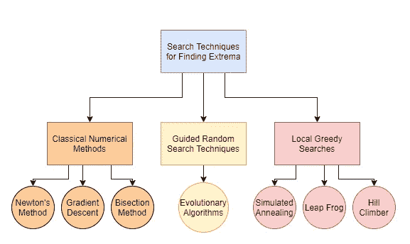
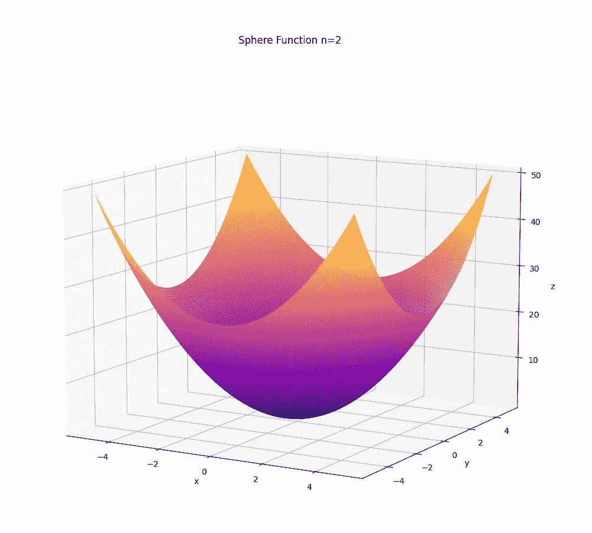
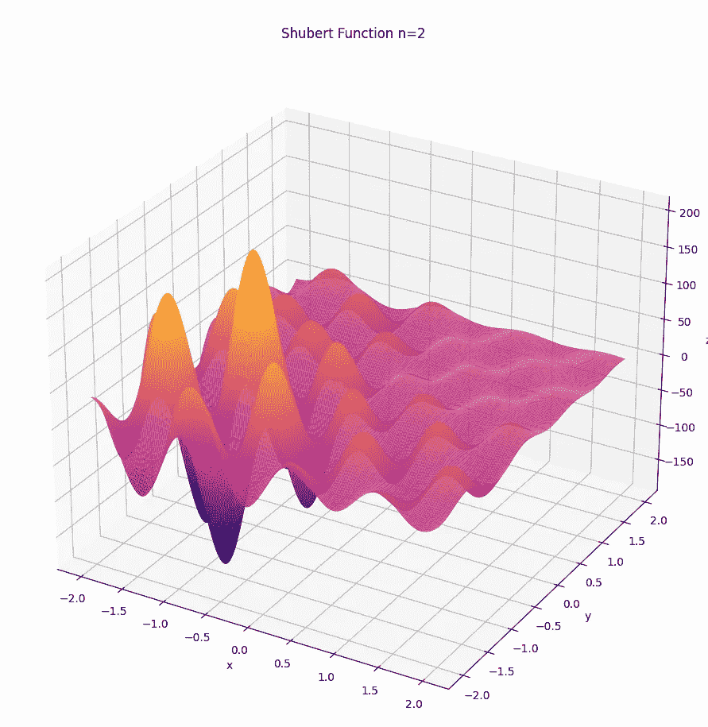
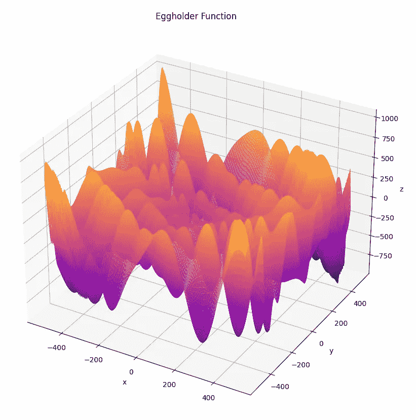

# 非经典优化算法(全部课程)概述

> 原文：<https://towardsdatascience.com/non-classical-optimization-algorithms-full-course-overview-8ef7091905b0?source=collection_archive---------35----------------------->

## 非经典最优化课程

## 简要概述一个新的完整课程，涵盖三个主要的非经典优化算法:爬山法，模拟退火，波束搜索，蛙跳和贝叶斯优化

大家好！我决定就五种流行的非经典算法开始一个全新系列的帖子:**爬山法**、**模拟退火法**、**波束搜索法**、**蛙跳法、**和**贝叶斯优化法。**最受欢迎的非经典优化算法是一个被称为**进化计算**的领域，我已经就此创建了一个完整的系列，所以这就是为什么它不包括在这个系列中！您可以在此查看概述:

 [## 进化计算(完整课程)概述

### 关于我将在这个全新的系列中涉及的材料、概念和应用的介绍性帖子！

towardsdatascience.com](/evolutionary-computation-full-course-overview-f4e421e945d9) 

优化问题在机器学习和人工智能中大量存在。这些领域中的大多数模型都是建立在找到一组正确的参数的基础上的，这些参数可以最小化某种类型的误差函数，例如回归的平均和误差或分类的交叉熵。因此，研究这些类型的算法以理解机器学习和人工智能中使用的统计模型背后的直觉是至关重要的。

作者图片

优化算法通常可以分为三类:基于微分信息的经典方法；引导随机搜索技术；和局部贪婪搜索。如同进化算法一样，非经典优化算法对于多维问题不需要梯度或 Hessian 矩阵的知识；因此，当优化问题是不可微的或者当经典方法不能找到最优解时，这些类型的算法是有利的。

# 目录

*   要覆盖的材料
*   基准测试函数
*   预赛
*   结论

# 要覆盖的材料

本课程将会很简短，比之前的进化计算课程要短得多。本课程将分为三个单元，每一个非经典算法一个单元。

*   单元 1)爬山者
*   单元 2)模拟退火
*   单元 3)波束搜索
*   第四单元)蛙跳
*   单元 5)贝叶斯优化

**Hill Climber** 是一种利用局部搜索技术的算法，它采用单点并进入比当前状态更好的搜索空间方向。**模拟退火**是一种算法，旨在通过试图找到全局最小值(最小能量状态)来模拟退火的物理过程，即液体冷却到最小能量状态的过程。**波束搜索**是爬山法或模拟退火法的一种变体，其中算法通过使用初始点群体而不是奇点来工作。**蛙跳**是一种基于种群的算法，最差的个体向最好的个体跳跃。**贝叶斯优化**是一种常见的优化技术，通过使用贝叶斯定理在给定数量的步骤中找到最小值。该算法通过从后验采样并从结果更新先验来工作。

# 基准测试函数

为了评估我们的非经典算法，我们将在三个众所周知的无约束基准测试函数上测试它们，看它们是否能找到全局最小值。这些测试函数是**球体、舒伯特、**和**蛋架**函数；除 Eggholder 之外的都是 n 维问题，其中 n 的取值范围可以是[1，无穷大)，我们将在 n=1000 上进行测试。另一方面，Eggholder 只是一个二维问题。下面是上述函数的 3D 图:

作者图片

我们不仅要测试该算法是否能找到全局最小值，还要测试它需要多长时间和多少函数来计算。

# 预赛

下面是一些预备知识，我希望你应该知道，以便最好地应用材料和理解概念:

*   基本统计—概率分布
*   线性代数(基本概念:矩阵乘法，欧几里德距离等…)
*   数值方法(基本概念:为什么使用它们，为什么需要它们)
*   最优化理论(你可以在下面查看我以前的帖子)

 [## 单元 1)最优化理论

### 最优化理论和四种主要最优化问题的概述

towardsdatascience.com](/unit-1-optimization-theory-e416dcf30ba8) 

*   如何用 Python 编程—使用数据结构和算法
*   了解 Python 科学库— Numpy

# 结论

当优化问题是非微分的，因此需要梯度或 Hessian 矩阵的知识的经典方法不能使用时，或者当经典方法不能找到好的解决方案时，通常使用非经典优化算法。

好了，这应该完成了课程的基本概述！如果到目前为止所讨论的话题中有你感兴趣的，那么请不要离开，因为我们将会涵盖所有这些以及更多！在下一篇文章中，我们将从单元 1)爬山者开始:

[https://towards data science . com/unit-1-hill-climber-optimization-985 D5 b 79 BD 5](/unit-1-hill-climber-optimization-985d5b79bd5)