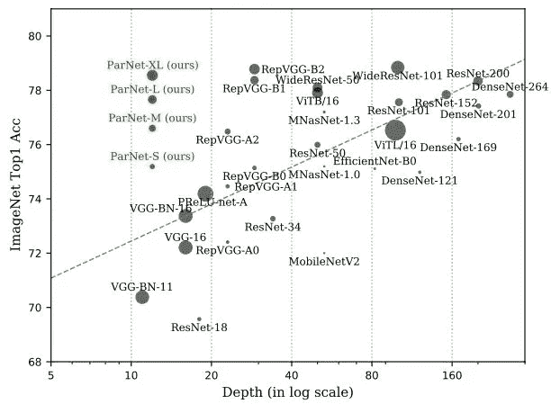
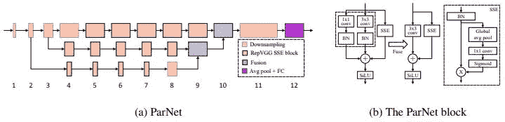
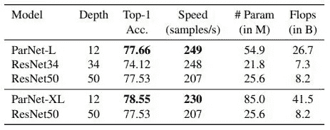
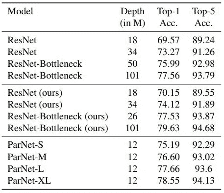

# 非深度网络

> 原文：<https://towardsdatascience.com/non-deep-networks-b0b80c65c7c6?source=collection_archive---------23----------------------->

## 越少越新吗？

艾莉娜·格鲁布尼亚克在 [Unsplash](https://unsplash.com/s/photos/sparse-connections-network?utm_source=unsplash&utm_medium=referral&utm_content=creditCopyText) 上的照片

# 介绍

一个是更深层次的网络用概念、网络、DenseNets 等来统治 ML 空间的时代。现在甚至被巨大的变形金刚模型所取代。这个行业总是朝着越多越好或越深越好的方向发展，它确实发挥了作用，并产生了突破性的结果，但代价是——巨大的计算成本，更大的内存需求，以及最重要的"*碳足迹*"通过将巨大的模型训练几天来一起。**非深度网络**(也称为 **ParNet** ) [1]以 80%的顶级准确性、96 %的 CIFAR-10 和 81%的仅 12 层 CIFAR-100 的惊人性能获得了良好的测量结果！这是一个相当大的壮举，促使我写这篇论文综述。

描述 ImageNet 性能指标评测的精度与深度性能的图表和绿点令人印象深刻。图片鸣谢——非深度网络[论文](https://arxiv.org/pdf/2110.07641.pdf)

# 背景

曾经有几十层被认为是深的日子，现在已经增长到 100 倍，达到 1000 层深的网络。当然，准确性和性能伴随着延迟和并行化方面的缺点。我注意到的另一个方面是，现代模型很少是可复制的，因为这些模型的建造成本和规模。我们已经看到，随着 SOTA 模型的平均深度不断增加，这些架构在 ImageNet 基准测试中占据了主导地位。事情肯定开始改变了。

> ParNet 的性能与著名的 12 层视觉变压器相当！

我们还看到了 1989 年的一个经典作品，其中网络只是一个单层，具有非常接近函数的 sigmoid 激活。这里，当缩放时，宽度增加，导致参数增加。另一种方法是网络的深度，它总是更好地逼近函数，而没有参数的巨大增加，并且总是超过“不太”深的网络(即使参数数量也相似)。缩放神经网络通常涉及增加深度、分辨率和宽度。相反，ParNets 的作者选择了并行子体系结构作为他们反对传统方法的方法。

# 理念与建筑

直觉是保持 12 层不变，并在一定程度上使用并行化，他们称该架构为“令人尴尬的并行”。如果我们看一下下面描述的架构，我们会看到一些*流*(分支)，其块或多或少类似于 VGG 模型[2]。这些块被称为 ParNet 块，其中内部正在发生一些(简单的)事情。他们选择 VGG 风格是因为它的能力——结构重新参数化。多个 3×3 卷积分支可以合并成单个 3×3 卷积，这可以有效地减少推断时间。

ParNet 架构和 ParNet 块。图片鸣谢——非深度网络[论文](https://arxiv.org/pdf/2110.07641.pdf)

每个 ParNet 块由 3 个主要成分组成，然后在下一个块之前合并/融合这些成分，

1.  1x1 卷积
2.  3×3 卷积和
3.  SSE ( **跳跃挤压激发**)层也称为 RepVGG-SSE 区块

上图的最右边部分描绘了跳跃-挤压-激发块。它实际上是在不增加深度的情况下增加了感受野，这与传统的挤压激励[3]实施方式相反。为了在浅层网络中引入比 ReLU 激活更多的非线性，作者选择使用更近的路斯[4]。

接下来是下采样和融合模块，它们分别降低分辨率并组合来自多个流的信息。下采样导致宽度增加，这有利于多尺度处理。这个模块非常简单，有一个挤压激励(SE)层和一个连接到 1x1 卷积分支的平均池。除了额外的级联层之外，融合与下采样没有什么不同。

为了扩展网络，根据数据集(CIFAR-10、CIFAR-100 和 ImageNet)对流的宽度、分辨率和数量进行了实验。

# 结果和基准

该模型使用 SGD 优化器在 ImageNet 上训练了 120 个时期，该优化器具有几个学习率调度器和批量大小为 2048(相当大)的衰减值。如果批量大小不适合内存，学习速率会与批量大小成比例降低。

ParNet vs ResNet，只强调最高的准确性和速度。图片鸣谢——非深度网络[论文](https://arxiv.org/pdf/2110.07641.pdf)

ParNet 的结果与 ResNets 的结果相当或更好(尽管由于 ParNet 的更大和超大比例版本，参数的数量更多)。

ParNet 与 ResNet，重点是深度与精度指标。图片鸣谢——非深度网络[论文](https://arxiv.org/pdf/2110.07641.pdf)

这表明，仅用 12 层，基础 ParNet 就可以在 top-1 和 top-5 精度方面胜过在 ParNet 中使用相同程序和增强的重新训练的 ResNet-34。此外，ParNet-XL 的性能优于原始的 ResNet-瓶颈 101。

本文中有一个单独的部分专门讨论并行性及其优势，请阅读该部分以了解更多详细信息。我将把消融研究部分留给您来探索和理解性能是如何提升的。此外，还有关于针对 CIFAR-10 和 CIFAR-100 数据集的 ResNets、ParNets、DenseNets 等的各种结果的详细信息。

作者很想测试 ParNet 作为对象检测网络的主干，它会提高现有的性能吗？当 ParNet 在 YOLOv4 [7]中取代 Darknet53 [6]时，在准确性和延迟方面看起来确实如此。

# 我的想法

ParNet 可以在不需要大规模基础设施的情况下实现(并且结果是可重复的),这是一个受欢迎的变化。它为研究人员开辟了探索这种浅深度并行架构空间的途径，并带来了可能适用于边缘部署场景而不会对性能造成重大影响的强大网络。

由于它在图像分类和物体检测方面都显示出了前景，我非常渴望看到它在转移到医疗保健等敏感领域时的表现。它能保持相当的性能吗？只有时间能证明一切。

# 结论

帕内特向我们展示了逆势而行是有回报的。由于深度很浅，当爬上 ImageNet 分类基准测试的排行榜时，它毫不费力[8]。这是第一次一个网络能够出色地在三个著名的数据集上运行——只有 12 层的 CIFAR-10、CIFAR-100 [9]和 ImageNet。ParNet 的性能随着流、分辨率和宽度的增加而增加，而深度保持不变。作者还观察到，目前的性能尚未饱和，可以进一步扩展。

# 参考

[1]非深度网络:[https://arxiv.org/pdf/2110.07641.pdf](https://arxiv.org/pdf/2110.07641.pdf)

[2]https://arxiv.org/pdf/1409.1556.pdf[VGG 网络](https://arxiv.org/pdf/1409.1556.pdf)

[3]压缩-激发网络:【https://arxiv.org/pdf/1709.01507.pdf 

[4]https://arxiv.org/pdf/1702.03118.pdf 激活:[路斯](https://arxiv.org/pdf/1702.03118.pdf)

[5]丹塞尼特:[https://arxiv.org/pdf/1608.06993v5.pdf](https://arxiv.org/pdf/1608.06993v5.pdf)

[6]约洛夫 3 中的暗网 53:[https://arxiv.org/pdf/1804.02767v1.pdf](https://arxiv.org/pdf/1804.02767v1.pdf)

【7】约洛夫 4:【https://arxiv.org/pdf/2004.10934v1.pdf】T2

[8] ImageNet 基准:[https://papers with code . com/sota/image-class ification-on-ImageNet](https://paperswithcode.com/sota/image-classification-on-imagenet)

[9] CIFAR-10 和 CIFAR-100 数据集:[https://www.cs.toronto.edu/~kriz/cifar.html](https://www.cs.toronto.edu/~kriz/cifar.html)