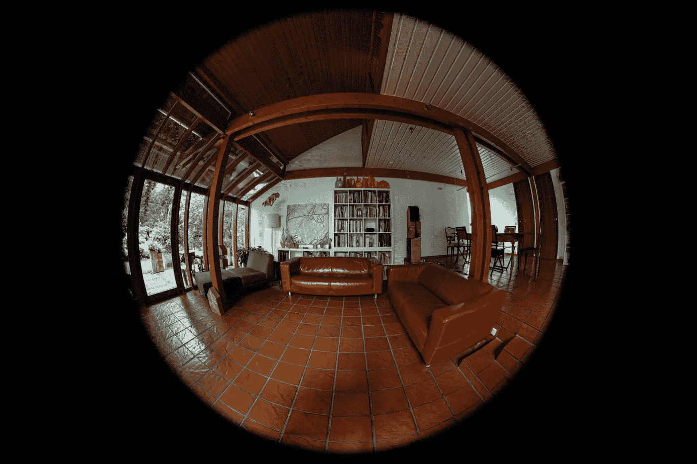
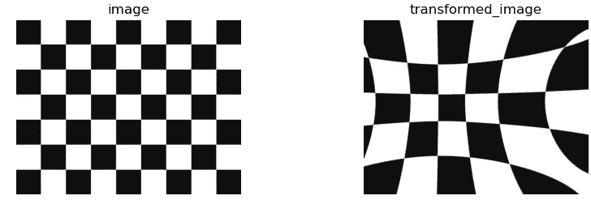
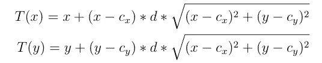
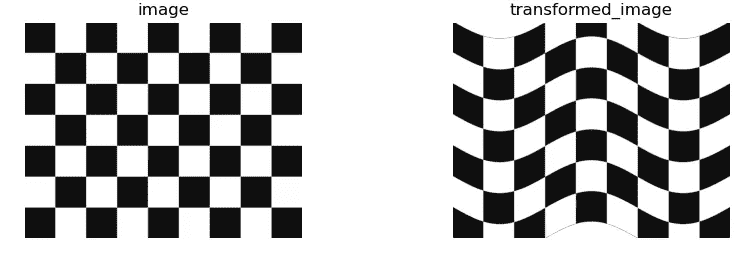
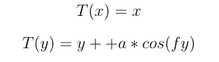

# 深度学习的非线性增强

> 原文：<https://towardsdatascience.com/non-linear-augmentations-for-deep-leaning-4ba99baaaaca?source=collection_archive---------20----------------------->

## 使用 pytorch 中的鱼眼视图增加您的数据



鱼眼效应。图片来自 unsplash 上的 [wilhelmgunkel](https://unsplash.com/@wilhelmgunkel)

近年来，深度学习在开发可以从仔细标记的数据中学习的系统方面取得了巨大进展。但是，深度学习模型非常需要数据，需要大量的标签进行训练，根据标签的性质，获得大量标签是一项挑战。手动标记更多数据的替代方法是对现有数据集使用数据扩充，以自动为模型生成新的标记数据，并扩展现有的训练数据集。图像数据的一些流行的数据增强是翻转、裁剪、旋转、缩放、剪切、颜色通道失真、模糊等。在这篇文章中，我将介绍图像数据的两种扩展，它们在深度学习中不是很受欢迎，但可能对扩展您的数据集有用。

诸如旋转、剪切、缩放之类的增强都是仿射变换，它们线性地变换图像。与线性转换相反，我在本文中讨论的以下两种转换是非线性的。

*   鱼眼变换
*   水平波变换

# 鱼眼变换

鱼眼是一种非线性变换，对于给定的中心像素，它基于距给定中心像素的距离来扭曲图像中的像素。本质上，与远离中心的像素相比，靠近中心的像素接收的失真要小得多。鱼眼变换需要两个参数，中心和失真因子。中心定义了变换的中心，失真因子控制了用于变换的失真量。



**鱼眼变换:**鱼眼变换(右)应用于棋盘图像(左)时的结果。鱼眼变换会扭曲图像像素，这些像素通过与给定变换中心的欧几里德距离进行加权。(图片由作者提供)

上图显示了棋盘格图像上鱼眼变换的效果，其中心聚焦在图像的中点周围。

数学上，给定像素(x，y)的鱼眼变换函数由以下公式给出。



其中<c_x>代表变换的中心,“d”代表失真系数。<t>是像素<x>的变换值。</x></t></c_x>

请注意，对于所有的输入图像像素，位置被归一化到网格中，使得左上角的像素代表位置，右下角的像素代表位置<1,1>。<0,0>代表图像的精确中心像素。所以 x 轴和 y 轴的取值范围是-1 到 1。对于上面的图像，失真因子(d)设置为 0.25，中心从区间[-0.5，0.5]随机采样。

# 水平波变换

水平波变换是另一种非线性变换，它以给定振幅和频率的水平余弦波的形状扭曲像素。它需要两个参数，振幅和频率。



**水平波变换:**水平波变换应用于棋盘图像(左)的结果(右)。水平波变换将给定的图像变换成给定振幅和频率的余弦波的形状。(图片由作者提供)

上图显示了棋盘图像上水平波变换的效果。

数学上，给定像素(x，y)的水平波变换函数由以下公式给出。



其中“a”是余弦波的给定振幅,“f”是预先指定的频率。<t t="">是像素<x y="">的变换值。注意，水平波不会对像素的 x 坐标造成任何失真。与鱼眼变换示例类似，x 和 y 的范围是从-1 到 1。在上面的例子中,“a”的值是 0.2,“f”的值是 20。</x></t>

# 履行

在这一节中，我将介绍 PyTorch 中两种转换的矢量化实现。我更喜欢矢量化，因为它比昂贵的循环的*计算转换要快得多。先从鱼眼变换说起。*

```
def get_of_fisheye(H, W, center, magnitude):  
  xx, yy = torch.linspace(-1, 1, W), torch.linspace(-1, 1, H)  
  gridy, gridx  = torch.meshgrid(yy, xx). //create identity grid
  grid = torch.stack([gridx, gridy], dim=-1)  
  d = center - grid      //calculate the distance(cx - x, cy - y)
  d_sum = torch.sqrt((d**2).sum(axis=-1)) //sqrt((cx-x)^2+(cy-y)^2)
  grid += d * d_sum.unsqueeze(-1) * magnitude 
  return grid.unsqueeze(0)fisheye_grid = get_of_fisheye(H, W, torch.tensor([0,0]), 0.4)
fisheye_output = F.grid_sample(imgs, fisheye_grid)
```

上面的代码执行以下 4 个步骤来转换图像。

1.  创建一个形状为(H，W，2)的标识网格，x 和 y 的范围从-1 到 1(第 2–4 行)。
2.  计算网格中每个像素到给定中心像素(第 5 行)的距离。
3.  计算每个像素与中心像素的欧几里德距离(d)(第 6 行)。
4.  计算 dist * d * magnitude 并添加到原始网格(第 7 行)。
5.  使用 PyTorch 的 grid_sample 函数转换图像(第 9–10 行)。

同样，下面的代码使用水平波变换来变换图像。

```
def get_of_horizontalwave(H, W, center, magnitude):  
  xx, yy = torch.linspace(-1, 1, W), torch.linspace(-1, 1, H)  
  gridy, gridx  = torch.meshgrid(yy, xx). //create identity grid
  grid = torch.stack([gridx, gridy], dim=-1)  
  dy = amplitude * torch.cos(freq * grid[:,:,0]) //calculate dy
  grid[:,:,1] += dy
  return grid.unsqueeze(0)hwave_grid = get_of_horizontalwave(H, W, 10, 0.1)
hwave_output = F.grid_sample(imgs, hwave_grid)
```

为了方便起见，我在下面的要点中编译了整个代码，其中涵盖了增强功能，并将其应用于棋盘图像。

# 摘要

*   这篇文章介绍了两种非线性增强，即鱼眼和水平波变换，用于增强图像数据。
*   鱼眼是一种非线性变换，它基于距固定中心像素的欧几里德距离来变换像素。
*   水平波变换是另一种非线性变换，它以水平余弦波的形状扭曲像素。
*   这两个增强的矢量化实现包含在帖子中。链接:[https://gist . github . com/nilesh 0109/f 98 eed 779844 c6b 570740 D5 ef 78868 a3](https://gist.github.com/nilesh0109/f98eed779844c6b570740d5ef78868a3)

这是深度学习中较新增强的一个小的介绍性帖子。感谢您的阅读。