# 非最大抑制

> 原文：<https://towardsdatascience.com/non-maxima-suppression-139f7e00f0b5?source=collection_archive---------1----------------------->

## 去除物体检测中多余的包围盒

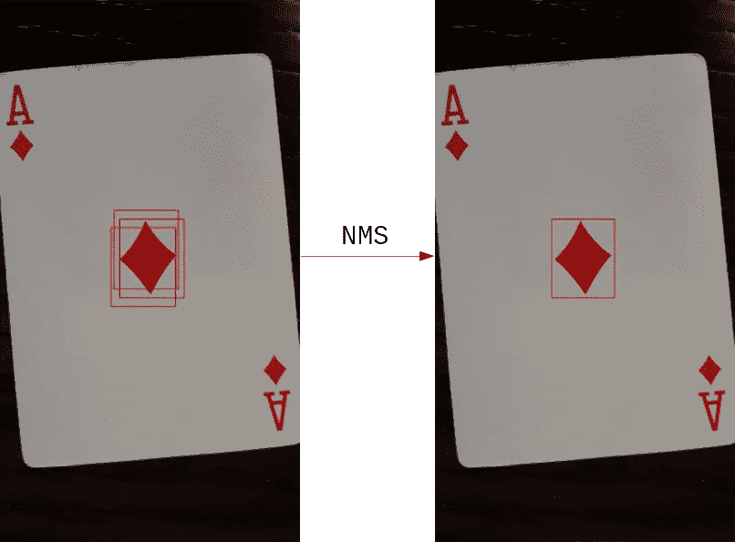

作者图片

# 介绍

你用过物体检测算法吗？如果是，那么您很可能已经使用了非最大抑制算法。也许这是你使用的深度学习模型的一部分，你甚至没有注意到。因为即使非常复杂的算法也面临着多次识别同一物体的问题。

今天，我想向您展示非最大值抑制算法是如何工作的，并提供一个 python 实现。

我将从展示给你们看开始，在一幅图像中，**边界框**是围绕着**检测到的物体**的矩形。然后我将介绍**非最大抑制**的代码。该算法逐个去除**冗余包围盒**。这是通过移除重叠大于阈值**的盒子来实现的，阈值**由我们手动设置。

# 边界框

我们使用边界框来标记图像中感兴趣的对象被识别的部分。

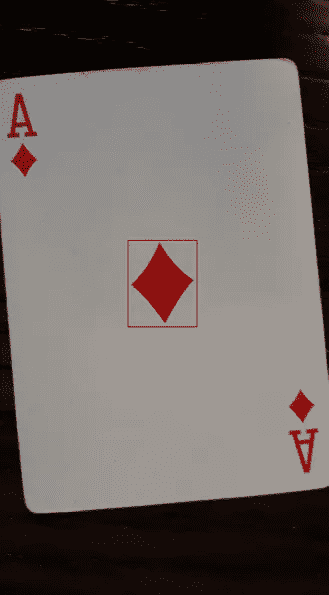

(图片由作者提供)

在这个例子中，要识别的对象是方块 a 中的大方块。

边界框总是直立的矩形。因此，我们只需要存储所有边界框的左上**和右下**角。****

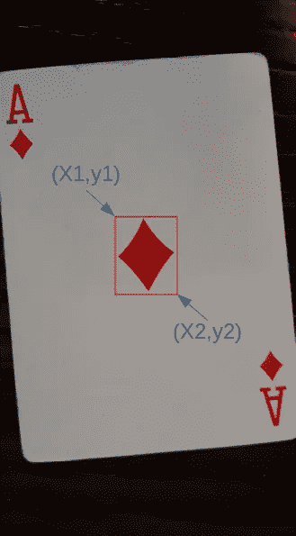

(图片由作者提供)

当使用对象检测方法时，经常会发生相同的对象在稍微不同的区域被检测多次的情况。

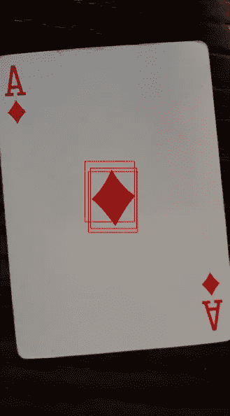

(图片由作者提供)

大多数时候，我们只想检测一个对象一次。为了实现这一点，我们通过应用非最大值抑制来移除冗余的边界框。

# 非最大抑制

我现在向您展示执行非最大值抑制的完整功能代码，以便您有一个概述。但是不要担心，我会带你看代码。

(作者代码)

非最大抑制(NMS)功能接受一个框和**重叠阈值**的**数组，默认值为 0.4。**

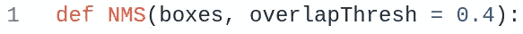

必须组织框的**阵列，以便每一行包含不同的边界框。**

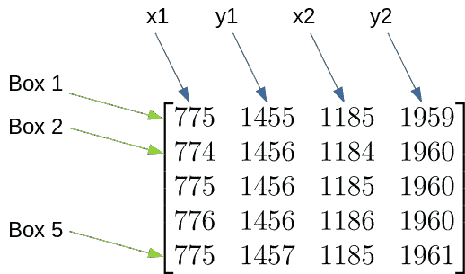

(图片由作者提供)

重叠阈值决定了两个边界框允许的重叠区域。如果它们重叠更多，那么两者中的一个将被丢弃。重叠阈值为 0.4 意味着允许两个盒子共享 40%的区域。

矩形的面积是用它的宽度乘以它的高度计算出来的。我们给𝑥2−𝑥1 和𝑦2−𝑦1 加了一个，因为边界框在起点和终点坐标上都有一个像素。

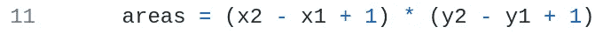

然后我们为所有的盒子创建索引。稍后，我们将一个接一个地删除索引，直到我们只拥有对应于非重叠框的索引。

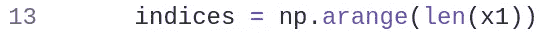

在循环中，我们迭代所有的盒子。对于每个框，我们检查它与任何其他框的重叠是否大于阈值。如果是这样，我们从索引列表中删除那个盒子的索引。

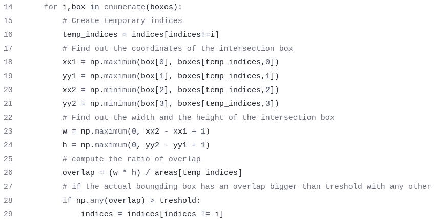

我们必须创建索引，包含盒子的索引，但是没有盒子[i]的索引。

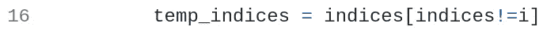

为了计算重叠，我们首先计算相交框的坐标。这个代码被矢量化以使它更快，因此我们计算盒子[i]与其他每个盒子的交集。

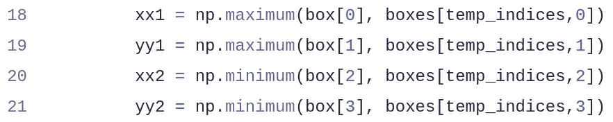

这可能有点令人困惑，但是零点在左上角。因此，我们通过选择两个盒子中𝑥1 和𝑦1 的最小值和同一盒子中𝑥2 和𝑦2 的最大值来获得相交盒子的坐标。

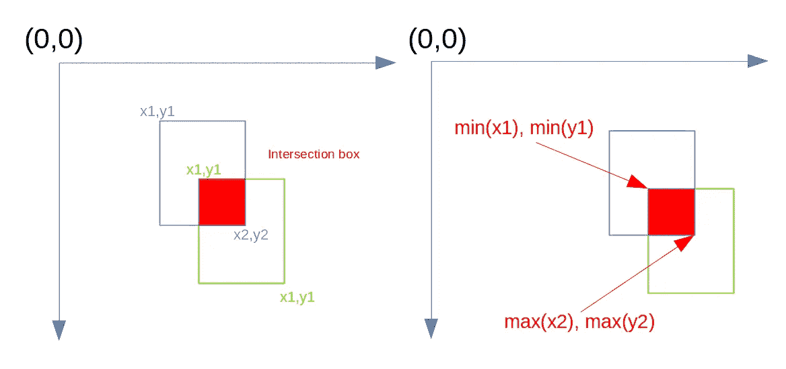

(图片由作者提供)

然后我们计算相交框的宽度和高度。我们取最大值 0 和我们计算的宽度和高度，因为负的宽度和高度会打乱重叠的计算。

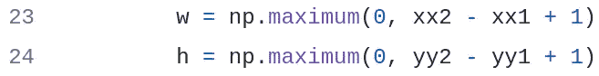

那么重叠就是相交框的面积除以边界框的面积。在我们的例子中，所有的边界框都有相同的大小，但是这个算法也适用于不同大小的情况。

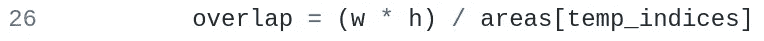

然后，如果框[i]与任何其他框的重叠大于阈值，则从剩余的索引中排除索引 I。

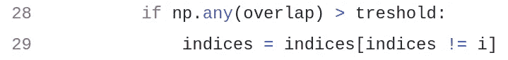

然后，我们返回包含未被删除的索引的盒子。像素坐标必须是整数，所以为了安全起见，我们对它们进行了转换。

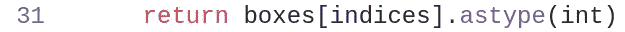

# 使用模板匹配的目标检测

你可能会问自己，我最初是如何得到这些边界框的。我使用了一个简单的技术叫做模板匹配。你只需要 **1 图像**在你想要探测的物体和 **1 模板**，这就是你想要搜索的物体。

我们的**形象**将是方块 a。

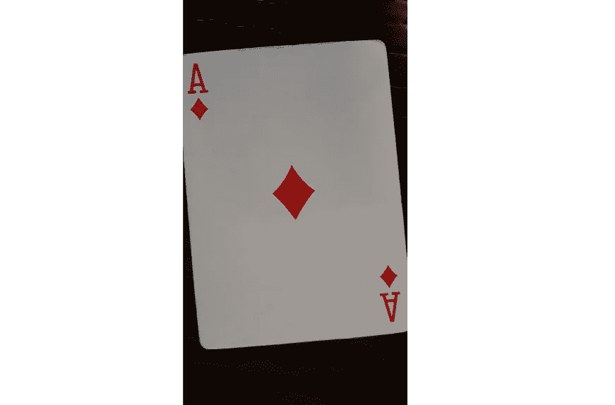

(图片由作者提供)

我们的**模板**将是图像中间的菱形。

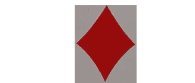

(图片由作者提供)

请注意，模板必须与我们要在图像中检测的对象具有大致相同的方向和大小(以像素为单位)。

如果你想使用我的图片，你可以在来源部分下载。

我们需要 opencv。如果还没有，可以在终端里安装。

```
pip install opencv-python
```

我们用 cv2 这个名字导入它。

```
import cv2
```

为了执行**模板匹配**和**从中生成边界框**，我们可以使用下面的函数。

(作者代码)

cv2.matchTemplate 函数返回图像不同部分与模板的相关性。

然后，我们选择图像中相关性高于阈值的部分。

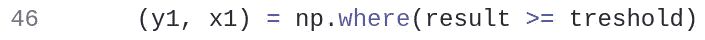

我们还需要一个函数来绘制图像上的边界框。

(作者代码)

## 完整代码

(作者代码)

# 结论

我们可以使用非最大抑制来移除多余的边界框。它们是多余的，因为它们多次标记同一个对象。NMS 算法通过利用相交三角形的面积来计算三角形之间的重叠。如果一个边界框与任何其他边界框的重叠超过阈值，它将被移除。

## 想要连接吗？

领英
[https://www.linkedin.com/in/vincent-m%C3%BCller-6b3542214/](https://www.linkedin.com/in/vincent-m%C3%BCller-6b3542214/)
脸书
[https://www.facebook.com/profile.php?id=100072095823739](https://www.facebook.com/profile.php?id=100072095823739)
推特
[https://twitter.com/Vincent02770108](https://twitter.com/Vincent02770108)
中等
[https://medium.com/@Vincent.Mueller](https://medium.com/@Vincent.Mueller)
成为中等会员并支持我
[https://medium.com/@Vincent.Mueller/membership](https://medium.com/@Vincent.Mueller/membership)

# 作者相关文章

[](/transfer-learning-3e9bb53549f6) [## 深度迁移学习

### 重用他人训练的模型的艺术

towardsdatascience.com](/transfer-learning-3e9bb53549f6) [](/backpropagation-in-neural-networks-6561e1268da8) [## 神经网络中的反向传播

### 从零开始的神经网络，包括数学和 python 代码

towardsdatascience.com](/backpropagation-in-neural-networks-6561e1268da8) 

# 作者撰写的其他文章

[](/eigenvalues-and-eigenvectors-378e851bf372) [## 特征值和特征向量

### 关于我们的数据，他们告诉了我们什么？

towardsdatascience.com](/eigenvalues-and-eigenvectors-378e851bf372) [](/how-you-can-use-gpt-j-9c4299dd8526) [## 如何使用 GPT J

### GPT J 解释了 3 种简单的方法，你可以如何访问它

towardsdatascience.com](/how-you-can-use-gpt-j-9c4299dd8526) [](/matrix-calculus-for-data-scientists-6f0990b9c222) [## 数据科学家的矩阵演算

### 吃红色药丸，学习矩阵微积分！

towardsdatascience.com](/matrix-calculus-for-data-scientists-6f0990b9c222) [](/deep-q-learning-is-no-rocket-science-e34912f1864) [## 深度 Q 学习不是火箭科学

### 用 pytorch 解释和编码的深度 Q 和双 Q 学习

towardsdatascience.com](/deep-q-learning-is-no-rocket-science-e34912f1864) 

# 来源

[pyimagesearch "(Python 中更快的非最大抑制)](http://Faster) Non-Maximum Suppression in Python)

非最大抑制:PyTorch 中的理论与实现

## 形象

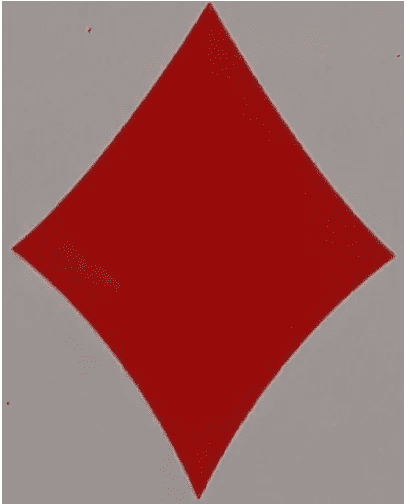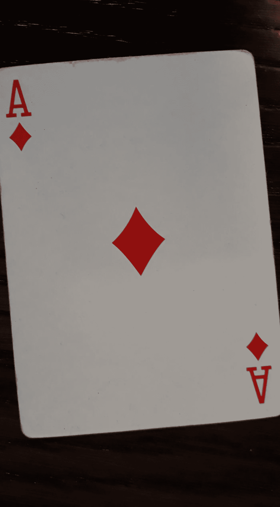

所有图片均由作者提供。你可以自由地将它们用于任何目的，甚至是商业目的。

[https://creativecommons.org/licenses/by/4.0/](https://creativecommons.org/licenses/by/4.0/)