# 用于图像压缩和聚类的非负矩阵分解

> 原文：<https://towardsdatascience.com/non-negative-matrix-factorization-for-image-compression-and-clustering-89bb0f9fa8ee?source=collection_archive---------7----------------------->

## 从零开始用 Python 实现一个通用算法

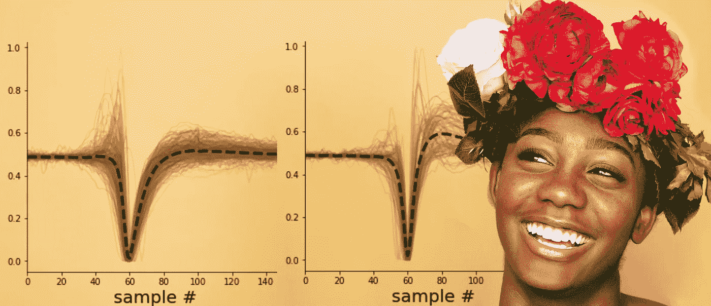

图片修改自:[https://unsplash.com/@auttgood](https://unsplash.com/@auttgood)

你可能会问自己:图像压缩和聚类有什么关系？老实说，乍一看，减小图像的文件大小和将数据点聚集成不同的组似乎没有太多的共同点。然而，如果你想一会儿，你可能会意识到这两个任务确实有一些共同的特点。所以要开始，让我们先来看看图像压缩。图像压缩本质上处理这样的问题:我们如何在不损害(太多)图像质量的情况下减小图像文件的大小？现在，一幅数字图像基本上就是一堆矩阵中的数字。矩阵的尺寸决定了图像的分辨率。因此，我们不要把一幅图像看作是包含所有内容和意义的视觉感知，而是把它看作一个数字矩阵。

如您所知，在第一个矩阵的列数与第二个矩阵的行数匹配的情况下，将两个不同维数的矩阵相乘将产生一个新的第三个矩阵。得到的矩阵乘积将具有第一个矩阵的行数和第二个矩阵的列数。

这允许我们将任何图像表示为两个低维矩阵的矩阵乘积。由此可见，将原始图像表示为两个低维矩阵的乘积可能会损失图像质量，但也会减小文件大小。正如我们将在后面看到的，压缩图像的质量是可以调整的。然而，不太明显的是如何找到两个矩阵，在相乘后重新创建我们的原始图像。有什么想法吗？这就是非负矩阵分解(NNMF)发挥作用的地方。

*如果你对代码比对解释更感兴趣，你也可以直接查看 Github* *上这篇文章的 Jupyter 笔记本。*

 [## GitHub-akcarsten/非负矩阵分解

### 这是 Python Jupyter 笔记本中的一篇关于从零开始实现非负…

github.com](https://github.com/akcarsten/Non_Negative_Matrix_Factorization) 

# 正式确定我们的目标

以更正式的方式，我们可以在下面的等式中表示我们上面描述的内容:

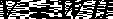

其中 *V* 是矩阵，或者在我们的例子中是一个图像，我们希望将其表示为两个矩阵 *W* 和 *H* 的乘积。更具体地说，这意味着 *V* 被表示为 *W* 中的列向量和 *H* 中的系数的线性组合。这意味着 *V* 中的每一列可以通过将 *W* 乘以 *H* 中的第 I 列向量来计算:

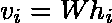

为了更好地理解上面等式中的内容，我们还可以将矩阵 *W* 中的列视为 *V* 的特征，这意味着 *H* 中的系数是每个特征的权重。然后，图像变成特征及其权重的线性组合。这已经给了我们一个关于非负矩阵分解如何包含一个聚类属性的想法。但是我们稍后会回到这个话题。现在，我们继续制定我们真正想要做的事情。因为我们的目标是压缩图像，并且作为折衷接受图像质量的一定损失，我们也可以写:

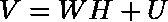

其中 *U* 表示完全重建 *V* 所需的信息，或者换句话说:残差。然而，这里我们更感兴趣的是 *V* 的近似值，而不是 *V* 的 1:1 表示，因此我们将编写以下代码:

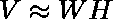

## 损失函数和更新规则

好的，看起来差不多了。现在我们需要找到一种方法来衡量我们的近似值的质量，这种方法叫做 l OSS 函数。如上所述，理想情况下， *V* 和 *WH* 之间没有差别。但是我们已经知道会有剩余的 *U* ，我们只是希望它尽可能的小。因此，为了获得客观的测量，我们引入以下二次损失函数来量化 *V* 和 *WH* 之间的*距离*。

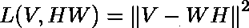

上面的等式使用了 *V* 和我们的近似值之间的欧几里德距离。但是，这里需要说明的是，这不是唯一可以用于非负矩阵分解的损失函数。例如，另一个损失函数基于 Kullback-Leibler 散度。如果你想更深入地了解这些损失函数，我推荐[这本由 *Lee 和*Seung](https://papers.nips.cc/paper/2000/file/f9d1152547c0bde01830b7e8bd60024c-Paper.pdf)出版的书。在这里，您还可以找到基于上述损失函数的以下更新规则的证明，我们将使用该更新规则来优化 *W* 和 *H* 。

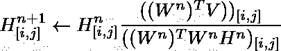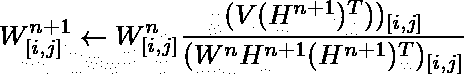

上面的更新规则告诉我们的是:1)我们迭代地优化 *H* 和 *W* ，2)在我们使用更新的 *H* 更新 *W* 之前，我们总是首先更新 *H* 。

现在我们几乎准备好进入编码部分，除了我们必须回答的最后一个问题:我们从哪个 *W* 和 *H* 开始？

## 初始化和排名

正如上面的更新规则告诉我们的，我们采取了迭代方法，这意味着每次我们更新 *H* 和 *W* 时，我们到 *V* 的距离应该变得更小，直到它收敛到最小值。应当注意，该最小值不一定是全局最小值，而是代表局部最小值。因此，多次运行 NNMF 算法将避免陷入具有较大误差的不幸的局部最小值。但是，我们现在从什么开始呢？

这里有两件事。让我们从更简单的开始:价值观。有一些播种方法可以提高算法的整体性能，但对于这个实现，我们保持简单，用随机正数初始化矩阵 *H* 和 *W* 。

我们要做的第二个选择是两个矩阵的大小。如上所述，为了使矩阵乘法有效，W 中的列数必须与 H*中的行数相匹配。所以两个矩阵之间存在依赖关系。此外，我们希望矩阵乘积具有与输入图像 *V* 相同的尺寸。这意味着 *W* 的行数必须与 *V* 中的行数相同，并且 *H* 中的列数必须与 *V* 中的列数匹配。综上所述:除了一个决定 *W* 中的列数和 *H* 中的行数的数字之外，一切都是固定的。这个数字被称为*秩*，将决定压缩后图像的质量。*

选择低等级将给出高压缩但是质量差。高等级会给我们好的质量，但压缩性差。稍后我们将会看到这一点。

## NNMF 的一个简单 Python 实现

所以在所有这些解释之后，让我们开始编码。这里我们将使用 Python 实现 NNMF 的一个基本实现，它非常短(大约 20 行代码)。下面的两个函数是之前更新规则的实现。和上面的解释一样，这里它们也被分成一个更新 *H* 的函数和另一个更新 *W* 的函数。

好吧，真快。您可能已经注意到，在分母的两个函数中都添加了术语`+1e-10`。这样做是为了避免被零除，否则会导致算法中断。

因此，最后缺少的是初始化 *W* 和 *H* ，并把所有的东西都打包到一个函数中，如下所示。

就是这样。一个简单的，用 Python 从头开始实现 NNMF 的基本方法。在第 4 到 7 行中，您还可以看到 rank 是如何实现的，以及它是如何连接 *W* 和 *H* 的。此外， *V* 的维度也反映在那里。

最后，我们想看的不是矩阵 *W* 和 *H* ，而是重构的输入矩阵 *V* 。这是一项简单的任务，因为我们只需将 *W* 和 *H* 相乘，如下所示。

现在我们已经万事俱备，让我们开始行动吧。

# 图像压缩

首先，我们测试图像压缩的代码。正如你所记得的，低等级会给我们一个好的压缩，但图像质量很差。这可以在下面的灰度[测试图像](https://unsplash.com/@auttgood)中看到。等级 5 返回质量差的图像，而等级 50 几乎保持原始图像的质量。等级为 100 时，图像质量不再有明显损失。但是， *W* 和 *H* 的维度现在比原始图像要高。这在实践中没有意义，因为原始图像的表示现在比原始图像大，而图像质量没有任何提高。

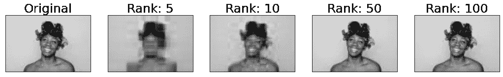

但是我们不需要达到 100 级就可以通过“压缩”来扩大图像的大小。正如我们从下图中看到的，等级 50 导致比原始矩阵需要更多的数据点来表示图像。

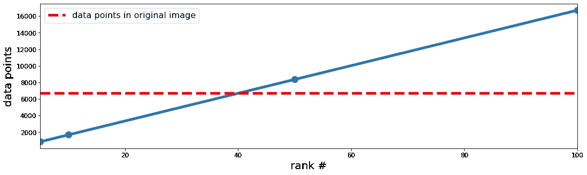

鉴于这些观点，20 的排名看起来是合理的。我们应该有一个像样的图像质量，但只有一半的数据点存储。此外，为了更直观地理解这一过程，让我们绘制出秩为 20 的矩阵 *W* 和 *H* 以及生成的图像。正如我们所见， *W* 具有与结果图像相同的行数(67)，而 *H* 具有相同的列数(100)。虽然两个矩阵 *W* 和 *H* 看起来一点也不像原始图像，但是它们的矩阵乘积与原始图像非常相似。

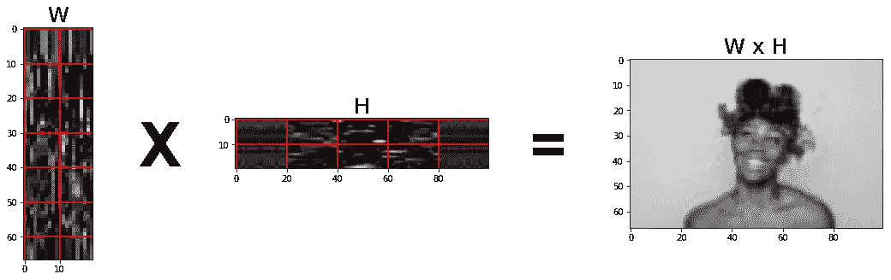

因此，我们在上面看到的是，我们可以在不到 30 行 Python 代码中从头实现非负矩阵分解，并使用它将测试图像的大小减少 50%，而不会对图像质量造成太大影响。

有一件事我们在这里没有讨论，但是在 J [upyter 笔记本](https://github.com/akcarsten/Non_Negative_Matrix_Factorization/blob/master/Non_Negative_Matrix_Factorization.ipynb)中有说明，那就是在我们接受结果之前算法应该运行的迭代次数。下图说明了这一点，我们可以看到，经过 200 到 250 次迭代后，损耗不再发生变化。这意味着我们找到了一个最小值，运行更多的迭代不会改善结果。

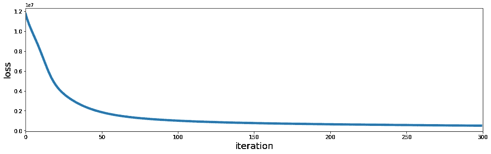

# 使聚集

接下来，让我们看看聚类属性。正如我们之前所说，我们的矩阵 *W* 中的列包含了原始矩阵 *V* 的特征。因此，这意味着矩阵 *H* 包含允许我们通过与 *W* 中的特征的线性组合来重构 *V* 的权重。因此，我们可以在 *H* 中搜索每行具有最大权重的列，这就是 *V* 中相应列的集群 ID。这听起来可能有点抽象，但在下文中会变得更加清晰。

但首先让我们切换到不同类型的数据集，因为对单个图像的特征进行聚类没有多大意义。相反，我们将使用脑电记录。这些信号是通过将微小电极直接插入大脑获得的。这些微电极拾取的电信号包含单个神经细胞(所谓的神经元)的活动模式。然而，由于大脑中密集分布着数十亿个神经元，每个电极都会获得其附近多个细胞的信号。因此，在记录的信号中可靠地分离不同的神经元是神经科学中的一个关键挑战。简而言之，每当神经元活跃时，它就会产生一个短暂的电脉冲，在记录的信号中表现为一个尖峰。每个细胞在活跃时都会产生不同种类的尖峰，这使得我们可以通过它们的尖峰波形来区分神经元。如果你想要更多的背景信息，你可以看看这篇关于从原始数据中提取神经事件的文章和这篇关于锋电位分类的文章。

我们在这里用来测试 NNMF 聚类特性的数据来自于[何塞·古斯曼](https://www.kaggle.com/joseguzman)在 Kaggle 上托管的[公共数据集。我还推荐看看他的](https://www.kaggle.com/joseguzman/waveforms)[笔记本](https://www.kaggle.com/joseguzman/spike-classification-based-on-waveforms)，它提供了关于如何聚集神经元尖峰的额外见解。你也可以用他的结果作为基准比较。

正如您将看到的，数据集由来自不同神经元的各种波形组成。为了理解如何准备数据，你应该看看这篇文章的 [Jupyter 笔记本。在这里，您还可以找到一个步骤，确保输入数据中的所有值都大于零。对于图像压缩，没有必要担心这个问题，因为默认情况下，图像中的所有值都大于零。但是，神经数据包含负值，这违反了 NNMF 工作的关键要求。现在，在接下来的内容中，我们将关注 NNMF 的集群，它非常简单，而且基本上是免费的。正如你在下面的代码中看到的，我们像以前一样运行我们的 NNMF 函数，只是这次我们根据我们期望在数据集中看到的聚类数来选择等级。换句话说，我们告诉 NNMF 函数，我们认为我们记录了来自三个神经元的信号。您可以使用等级编号，看看您能找到什么样的集群。](https://github.com/akcarsten/Non_Negative_Matrix_Factorization/blob/master/Non_Negative_Matrix_Factorization.ipynb)

下图说明了由此产生的三个集群。背景中的彩色线表示单个尖峰波形，而黑色虚线表示各个簇中所有波形的平均值。如您所见，一个簇中的大多数波形共享一个共同的形状。为了进行比较，左边的图以非聚类方式显示了数据集中的所有波形。

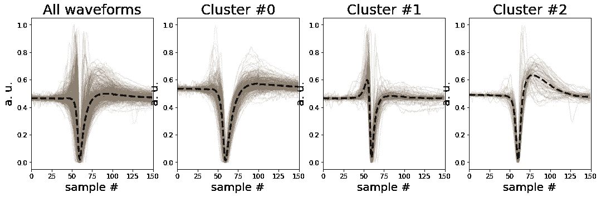

# 结论

我们在上面已经看到，非负矩阵分解可以用于 1)图像压缩和 2)时间序列数据的聚类。此外，我们还了解到，这两项任务通过将输入表示为特征和权重的线性组合而联系在一起。我们还看到，只用几行 Python 代码就可以实现 NNMF 算法的基本实现。然而，还有很多事情可以用 NNMF 来做，或者要做来提高 NNMF 实现的性能，例如正则化或初始矩阵的播种。因此，如果你对更多方面和细节感兴趣，我推荐你看看 1999 年李承晚和 T2 的论文以及他们的算法论文。此外，有一本非常好的关于 Kaggle 的[笔记本，作者是](https://www.kaggle.com/elenageminiani/nmf-and-image-compression) [Elena Geminiani](https://www.kaggle.com/elenageminiani) ，它讲述了 NNMF 在图像压缩方面的理论背景，并附有大量的文献列表。

如果你想要这个项目的完整代码，你可以在这里找到它。当然，你也可以在 [**Twitter**](https://twitter.com/ak_carsten) 上关注我，或者通过 [**LinkedIn**](https://www.linkedin.com/in/carsten-klein/) 联系我。