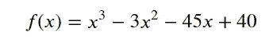
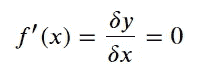
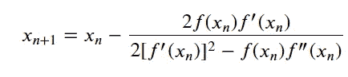
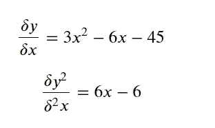
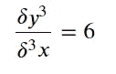
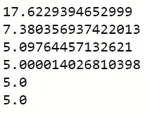
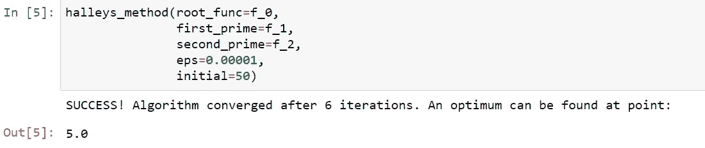

# 利用哈雷方法的非线性优化

> 原文：<https://towardsdatascience.com/nonlinear-optimization-using-halleys-method-2f2e7da4024?source=collection_archive---------25----------------------->

## 优化。数据科学。分析。Python。

## 用 Python 从头开始构建 Halley 的方法优化器


由[沃尔坎·奥尔梅斯](https://unsplash.com/@volkanolmez?utm_source=medium&utm_medium=referral)在 [Unsplash](https://unsplash.com?utm_source=medium&utm_medium=referral) 拍摄的照片

# 介绍

一些人认为哈雷方法是牛顿方法的延伸。关于它的发现的故事实际上相当精彩，但是我们把它留给另外一个阅读。

与其他优化算法相比，这种算法的优势在于它被认为收敛更快。然而，隐藏的成本是，它需要计算二阶导数函数。

对于二阶导数很容易计算的方程来说，这个方程是非常有效和惊人的！

要了解使用牛顿法解决这个问题的更多信息，请参考[使用牛顿法的非线性优化](https://medium.com/mlearning-ai/nonlinear-optimization-using-newtons-method-1e8ca91432d8)。

# **求根与优化算法**

现在，我们将要做的是优化专家的常识，但是被大多数盲目应用这种方法的人遗忘了。

求根算法寻求找到一个函数的所谓临界点；使函数等于零(0)的函数。

牛顿和哈雷的方法都被认为是求根算法。微积分告诉我们，要找到一个函数的最佳点，我们需要计算它的一阶导数，并将其设置为 0。

**因此**:

1.  如果你将这些算法应用于一个基函数，输出将是它的根。
2.  如果您将这些算法应用于函数的一阶导数，输出将是它的最佳点。

# 通用优化算法

假设我们的原始函数是:



为了找到最佳点，我们需要求解:



由于我们在做优化，我们将把哈雷方法应用于一阶导数。

一般优化过程的特征在于迭代初始值以接近临界点。可以总结如下:

1.  为我们要寻找的根的函数选择一个初始值。
2.  我们使用一个公式来更新这个初始值，这个公式根据我们应用的方法而不同。
3.  使用更新后的值，计算我们的函数值。
4.  重复步骤 2-3，直到我们的函数(步骤 3 的输出)等于零(0)或一个非常接近所选阈值的值(被资源称为ε(`eps`))

# **哈雷方法**

我们需要确定一个公式来更新前面章节中哈雷方法的初始值。这个公式有不同的版本，但是我发现这个更容易编码:



正如我们所看到的，更新函数不仅需要估计函数的一阶导数，还需要估计它的二阶导数。也就是说，估计原函数一阶导数的一阶和二阶导数。它们相当于原函数的二阶和三阶导数。

所以我们有:



最后:



因此，应用我们的一般过程和更新哈雷方法的公式，我们有:

```
# Function for Root Finding - This is the first derivative of the original function
def f_0(x):
    return 3*x**2 - 6*x -45#First Derivative for Root Function
def f_1(x):
    return 6*x - 6#Second Derivative for Root Function
def f_2(x):
    return 6
```

初始化我们的变量和值:

```
initial_value = 50#Initialize to count total iterations
iterations = 0#Initialize a container for target variable
x_curr = initial_value#Setting epsilon - threshold (0.00001)
epsilon = 0.00001f = f_0(x_curr)
```

现在，我们已经准备好了，我们可以开始我们的 while 循环，这是我们算法的核心:

```
while (abs(f) > epsilon):

    #Calculate function values
    f = f_0(x_curr)
    f_prime = f_1(x_curr)
    f_double_prime = f_2(x_curr)

    #Update the value of the variable as long as the threshold has not been met
    x_curr = x_curr - (2*f*f_prime)/(2*f_prime**2 - f*f_double_prime )

    #Update Iterations Count
    iterations += 1
    print(x_curr)
```



我们可以看到，从初始值 50 开始，算法下降了一大半到 17.62，经过 6 次迭代后最终收敛。高效！

# 使用哈雷方法的求根函数

最后，让我们为 Halley 的方法创建一个通用函数，它可以为我们合并其他好的特性。

```
def halleys_method(root_func, first_prime, second_prime, eps, initial):
    ''' Finds a root of a function using Halley's method.

    Parameters:
        root_func (function)    : The function which roots are being solved
        first_prime (function)  : The first derivative of the root_func parameter
        second_prime (function) : The second derivative of the root_func parameter
        eps (float)             : Error threshold value close enough to zero (0)
        initial (float)         : Initial value of the variable

    Returns:
        The final value of the variable for which a local optimal value is found.
    '''
    #Initialize to count total iterations
    iterations = 0##Initialize a container for target variable
    x_curr = initial

    #Initialize First Function Value
    f = root_func(x_curr)

    #Update the variable
    while (abs(f) > eps):

        #Calculate function values
        f = root_func(x_curr)
        f_prime = first_prime(x_curr)
        f_double_prime = second_prime(x_curr)#Update the value of the variable as long as the threshold has not been met
        x_curr = x_curr - (2*f*f_prime)/(2*f_prime**2 - f*f_double_prime )#Update Iterations Count
        iterations += 1

    print(f"SUCCESS! Algorithm converged after {iterations} iterations. An optimum can be found at point: ")

    return x_curr
```



测试我们的功能。令人惊奇不是吗？

# 在 SCIPY 中使用内置函数

然而，对于那些想更方便地使用哈雷方法的人来说，我们可以使用 Scipy 中的方法。使用我们上面定义的函数:

```
from scipy.optimize import newtonnewton(func=f_0,x0=50,fprime=f_1,fprime2=f_2, tol=0.0001)
```


相同输出:)

# 结束语

我们上面开发的函数对于大多数非线性优化问题来说是非常好的。与大多数非线性优化算法一样，哈雷方法收敛于我们所说的“局部最优”。这不同于“全局最优”，全局最优是整个方程的绝对最优点。


局部最优与全局最优

根据您对初始值的选择，算法会收敛到局部或全局最优值，通常是更接近初始值的值。因此，用一个极端负的初始值和一个极端正的值来尝试上面的算法。

最后，众所周知，Halley 的方法收敛速度快，这也是它优于其他优化方法的明显优势之一。尝试一个极值，你可以看到该算法很快地在一个局部最优值附近徘徊。

完整代码可以在我的 [Github 页面](https://github.com/francisadrianviernes/Financial-Analytics/blob/master/Nonlinear%20Optimization/Nonlinear%20Optimization%20Using%20Halley's%C2%A0Method.ipynb)找到。让我知道你的想法！