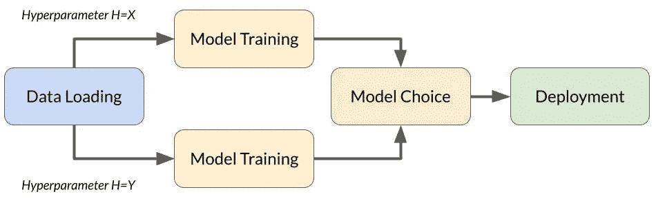
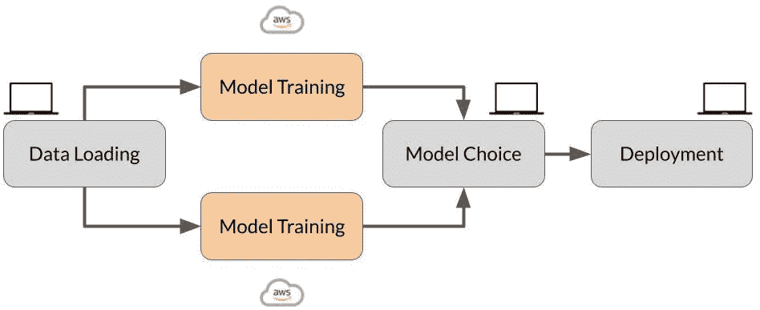
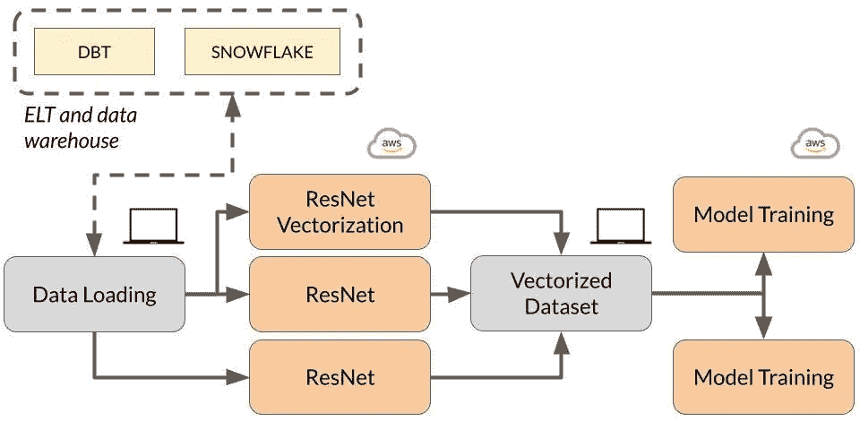
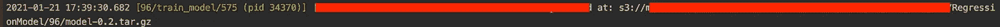
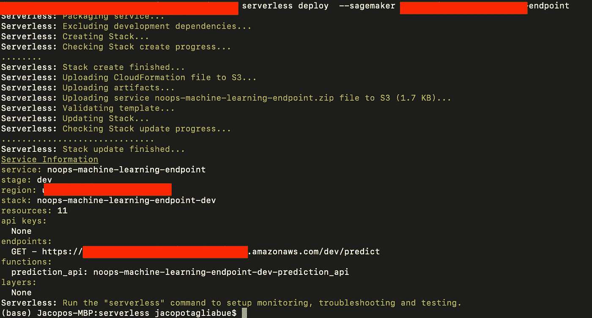
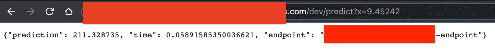
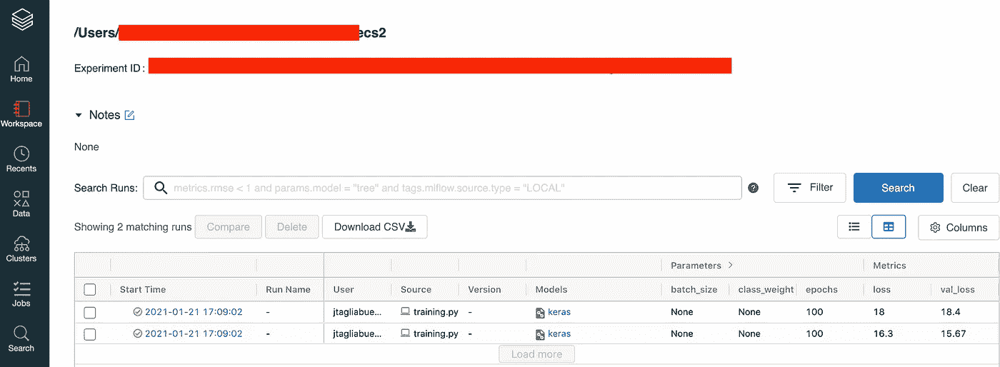
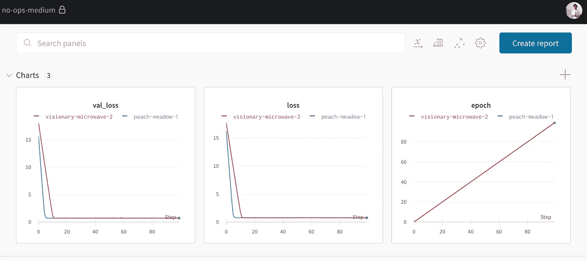

# NoOps 机器学习

> 原文：<https://towardsdatascience.com/noops-machine-learning-3893a42e32a4?source=collection_archive---------22----------------------->

## [实践教程](https://towardsdatascience.com/tagged/hands-on-tutorials)

## 具有元流、无服务器和 SageMaker 的 PaaS 端到端 ML 设置。

## 机器学习第一世界中的 Luigi

> “你要找的公主在另一座城堡里。”

T 他对机器学习的快速采用，从大型科技公司到几乎所有人，导致了 ML 工具和酷孩子现在所说的“MLOps”的蓬勃发展(如果你需要赶上的话，参见深思熟虑的[概述](https://huyenchip.com/2020/12/30/mlops-v2.html)。虽然我的 LinkedIn feed 反复强调“80%的机器学习项目无法投入生产”，但*我*觉得实际上有几十种策略可以部署你的模型，但在你解决了这个问题后*你有点蒙在鼓里:我不是在说监控，而是你如何以有效的方式开发、实验、培训、迭代的一般经验(即，如果你仍然需要解决生产问题，*这个*帖子不会真正有帮助)。*

让我们面对现实吧，大多数 ML 脚本(嗯，当然是我的)相当混乱，尤其是在*原型和小规模测试阶段*，因为它们涉及到将几个小任务缝合在一起:检索数据、训练神经网络、运行功能和[行为测试](https://arxiv.org/pdf/2005.04118.pdf)等。换句话说，ML 项目是 [DAG-like](https://en.wikipedia.org/wiki/Directed_acyclic_graph) ，它们需要可重放、版本化、可调度等等:虽然我们之前已经成功地使用 [Luigi](https://github.com/spotify/luigi) 来编排任务，但是随着团队的增长和大型(ish)神经模型，我们遇到了一些限制。

在 ML 驱动的产品开发中有一个重要的阶段，我们应该能够信任我们的代码，*但是*保留我们进行修改的可能性，而不用担心整个生产环境:

> 在全面工程化之前，ML 需要一个足够好的工程化阶段，在这个阶段，开发人员以某种方式被授权将他们的工作交付给客户、内部用户等。

*这篇*文章是我们的< 10 分钟介绍更好的开发者生活:一个端到端的 ML 项目(从原始数据到工作 API)围绕一个简单的理念构建——有效的迭代意味着从开发者那里抽象出所有的基础设施。虽然定制解决方案可能适用于特殊情况，但我们展示了现成的工具——[Metaflow](https://metaflow.org/)、 [SageMaker](https://aws.amazon.com/it/sagemaker/) 、[无服务器](https://www.serverless.com/)——如何结合在一起，实现出色的 PaaS 体验，因为所有计算都是自动为我们管理的:

> 换句话说，从 MLOps 到 NoOps。

所有代码都在 Github 上共享:克隆 repo 并跟随标签！

*免责声明:这不是* ..填补空白应该很简单，但是浏览一下 [*网飞教程*](https://docs.metaflow.org/getting-started/tutorials) *总是个好主意。*

## 先决条件

我们假设在您的开发机器上进行以下设置(**参见 Medium story replies** ，获得一些额外的提示):已经有大量关于这些步骤的资料，我们希望将重点放在系统*作为一个整体*所提供的价值上(这就是在第一阶段完成设置的理由！).

*   一个 **AWS 账号**:这是显而易见的，但是请注意自由层不会为了元流而削减它！确保准备好合适的 [IAM 角色](https://docs.aws.amazon.com/sagemaker/latest/dg/sagemaker-roles.html)，因为您的开发机器将需要启动 SageMaker 端点的权限。
*   **Metaflow** 启动并运行:通过基于 [AWS 的设置](https://docs.metaflow.org/metaflow-on-aws/metaflow-on-aws)，该设置由 [CloudFormation 模板](https://admin-docs.metaflow.org/metaflow-on-aws/deployment-guide/aws-cloudformation-deployment)简化！请注意，如果注释掉了 *@batch* decorator，本地设置也可以进行一些修改:如果您只是好奇，您可以启动本地设置，并在了解这种方法后转到完全支持 AWS 的配置。
*   **无服务器**启动并运行:[确保](https://www.serverless.com/framework/docs/providers/aws/guide/installation/)您可以从您的终端向 [AWS lambda](https://aws.amazon.com/lambda/) 部署代码。
*   如果您希望添加**实验跟踪**，我们在最后添加了一些提示:开始时，只需为 [MLFlow](https://databricks.com/try-databricks) 打开一个社区帐户，或为[Weights&bias](https://wandb.ai/site)打开一个个人帐户。

## ML 发展的迫切需要

虽然不是一个确定的列表，但当涉及到我们作为 ML 工程师的日常生活时，我们团队中经常会出现一些棘手问题:

*   我们希望将组成一个项目的小任务组织成一个*模块化*和*可回放* DAG 式的结构:我们希望 Python 和数据对象可以跨任务重用，并且版本清晰；
*   我们希望毫不费力地为每个任务分配计算资源*(即无需显式供应/维护)，因为我们不想在昂贵的 GPU 上运行简单的业务逻辑，但我们也不想为训练运行等待数天。由于雪花允许我们直接在数据仓库中进行计算(说来话长，另贴！)，我们的*工作方式*明显是非分布式的，并且被设计成这样:数据集可以舒适地放在笔记本电脑中，本地开发比在 Spark 上迭代更有效。我们的瓶颈主要是训练，因为我们有时在 GPU 上训练大的(有点)模型:然而，天真地在本地和云机器之间切换上下文是非常低效和耗时的；*
*   我们希望与*一起很好地工作*，也就是说，对我们所有的 Dag、实验和工件都有可见性，但也要确保我们不会错误地覆盖彼此的运行；
*   我们想要一个清晰的“产生影响的途径”:即使在原型阶段，我们也想要对部署和调度的支持——目标是能够在没有其他团队参与的情况下推出非常健壮的微服务。

Metaflow (+ SageMaker)允许我们在一个统一的框架中满足所有这些*需求*(外加额外的好处，比如超级性能 [s3 客户端](https://docs.metaflow.org/metaflow/data)！).

## 该项目的鸟瞰图

该项目是一个单文件 DAG，以 Keras 的*回归*模型为中心。代码在许多方面都是“玩具”，但它显示了如何通过可重复、模块化和可扩展的过程从数据集到 API:代码不是特别简洁，但我们的目标是解释力超过经济。

下图描述了 DAG，它可以分为四个主要部分:

1.  **数据加载**:这一步是通过一个静态文件实现的——由于元流版本控制，输入到训练中的确切数据集会自动进行版本控制。
2.  **模型训练**:通过探索超参数空间和测量模型在保留数据上的性能来训练选择的模型。
3.  **模型选择**:收集模型运行的所有结果，并根据某种逻辑选择部署的模型。
4.  **部署**:将模型部署到 SageMaker 端点。因为 SageMaker 端点在 AWS 内部，所以我们使用 AWS lambda 通过公共 API(见下文)进行预测。



我们 DAG 的可视化表示。注意训练步骤是如何在多个计算节点上并行发生的，用不同的超参数模拟训练*【图片由作者提供】。*

[整个脚本](https://github.com/jacopotagliabue/no-ops-machine-learning/blob/main/flow/training.py)大约有 200 行代码，应该是不言自明的(如果不是，请联系！).该项目展示了 Metaflow 的许多特性——如文件和对象版本控制、参数、自动重试等。——但我们在这里重点关注两个方面:并行化和远程计算。

*并行化:*关键行如下，其中我们首先定义了一系列参数(这里使用不同的学习率用于教学目的)，然后我们使用 *foreach* 关键字:

```
self.learning_rates = [0.1, 0.2]
self.next(self.train_model, foreach='learning_rates')
```

所发生的是 *train_model* 步骤将被并行执行，Metaflow 产生新的进程，每个进程以特定的学习速率训练一个模型。

*远程计算:*关键的一行如下(实际上，您可以在第一次注释掉它，以体会无论有没有云计算，您的开发体验都是一样的):

```
@batch(gpu=1, memory=80000)
```

使用这个装饰器，您告诉 Metaflow 接下来的任务有一些计算需求(这里表示为 GPU 和内存容量，但“CPU 数量”是一个流行的选项):Metaflow *自动*在 AWS 批处理中创建一个作业，然后在支持 GPU 的机器上运行*步骤*。这展示了如何将本地数据集准备与远程训练集成在一起，而无需更改代码或显式资源供应:DAG 保持不变，并且由元流工作来分发计算。



根据计算需求，所有任务都可以在本地或远程执行:DAG 本身不会改变，它提供了一个统一的代码库来开发我们的 ML 项目*【图片由作者提供】。*

Metaflow 让我们在数据争论中获得本地调试的舒适和速度，然后在需要马力时获得一个无界计算资源池。

如果你很想看到更真实的流程，你可以在下面欣赏并行化和远程计算的力量:你从仓库中检索[产品图像](https://blog.coveo.com/mind-reading-as-you-type-how-to-provide-personalized-query-suggestions-to-new-shoppers/)，加速矢量化，回到你的笔记本电脑进行最后的处理(例如过滤)，然后最终训练你的[深度神经网络](https://dl.acm.org/doi/10.1145/3366424.3386198)。



*更复杂的流程，从仓库解决方案中读取数据，并利用云流程进行数据集准备和模型训练【图片由作者提供】。*

## 运行我们的 DAG

> “空谈是廉价的，给我看代码”——l·托沃兹

要运行该项目，cd 进入 *flow* 目录，并在您的 Python 解释器下键入以下命令(确保安装了 *requirements.txt* 中的包！):

```
python training.py run
```

在一些快速检查之后，DAG 将加载数据，然后开始并行化训练步骤(如果您使用*批处理*装饰器运行，AWS 批处理控制台将为您跟踪这两个过程):


在每个训练过程结束时，终端将打印模型的云路径，由内置的 s3 客户端进行版本控制:



训练已经完成，所以带有 Keras 模型的 tar 文件在 s3 中被存储和版本化*【图片由作者提供】。*

在 DAG 结束时，将部署一个新的 SageMaker 端点:记下它的名称，因为这是我们开始通过公共 API 提供预测所需的唯一信息。

## 部署端点

运行结束后，我们必须确保我们的新模型可以通过专门的微服务访问。我们部署一个 PaaS 端点，利用 [serverless.yml](https://github.com/jacopotagliabue/no-ops-machine-learning/blob/main/serverless/serverless.yml) 中的基础设施即代码设置:只需将 cd 放入 *serverless* 文件夹，并运行以下命令:

```
serverless deploy --sagemaker my-endpoint
```

其中*我的端点*是由 DAG 创建的端点的名称。大约一分钟后，您应该会收到一条成功消息:



无服务器 CLI 部署，带有自定义参数“sagemaker”。最后，终端打印出模型的公共端点地址*【图片由作者提供】。*

记下端点 URL，将其粘贴到浏览器中，并尝试提供一个 *x* 值:

```
[https://my-url.amazonaws.com/dev/predict?x=9.45242](https://7f7urw5zma.execute-api.us-west-2.amazonaws.com/dev/predict?x=9.45242)
```

瞧——浏览器应该返回我们的 JSON 响应，并且执行时间相当长:



来自 lambda 支持的端点的 JSON 响应*【图片由作者提供】。*

## 加分:增加了更好的实验跟踪

至于系统地跟踪我们的实验，我们可以利用 Metaflow 内置的版本控制和它的[便捷的客户端 API](https://docs.metaflow.org/metaflow/client) 来检索我们存储在:

```
self.hist = history.history
```

并在笔记本上快速绘制损失/时期——但本着真正的 PaaS 精神，除非真的需要，否则不要编写代码，我们为什么不重用 MLflow 或 [W & B](https://wandb.ai/) 的整洁 UI 呢？幸运的是，我们可以用几行代码将跟踪添加到 DAG 中。

在 *train_model* 步骤的最开始，我们注入一些小代码来确保 *i* 运行代码的机器(本地或远程)已经安装了 MLflow/W & B 并且 *ii* 凭证作为环境变量可用。

```
os.system('pip install mlflow==1.13.1')
os.environ["DATABRICKS_HOST"] = 'https://community.cloud.databricks.com' # don't change this
os.environ["DATABRICKS_USERNAME"] = 'my_user_name'
os.environ["DATABRICKS_PASSWORD"] = 'my_password'
```

(同样的基本思想也适用于 W&B，但是您需要设置的 env 变量是 [API 键](https://docs.wandb.ai/library/environment-variables))。现在库已经安装好了，我们可以利用[自动记录](https://www.mlflow.org/docs/latest/python_api/mlflow.keras.html)来开始跟踪:

```
import mlflow
# don't change this for Community edition
mlflow.set_tracking_uri("databricks")
# your experiment name mlflow.set_experiment("/Users/my_user_name/exp_name") 
mlflow.tensorflow.autolog()
```

下次执行 DAG 时，Databricks 仪表板将记录并显示我们所有运行的关键指标:



通过添加自动日志，我们的指标现在被保存，并准备好通过 MLflow *【图片由作者提供】的便利 UI 可视化。*

这是相同的输出，但使用了 W&B:



度量标准可以通过 [W & B UI](https://wandb.ai/) 轻松存储和可视化，个人使用*【图片由作者提供】。*

## NoOps，在极限

正如所承诺的，我们从数据加载到基于模型的 API 用了不到*10 分钟，并且没有任何基础设施工作*:如果你有和我们一样的痛点，我们的脚本给你一个以 Metaflow 为中心的开发(加上一些精心选择的 PaaS 服务)如何从根本上简化现实生活中的机器学习项目的例子。

虽然 NoOps 的口号确实有点好得令人难以置信，但我们*确实*相信，良好的抽象将使 DevOps 操作在 ML 管道中越来越不可见，使我们能够越来越多地关注数据和模型。

> *唉*，如果不是一系列强大的抽象，软件工程的历史是什么？

## 再见，太空牛仔

不要忘记查看附加注释(在故事回复中),以获得更多技术细节、设置提示和未来迭代的注释。如有疑问或反馈，请[连线](https://www.linkedin.com/in/jacopotagliabue/)，分享你的 MLOps 故事(所有中媒观点均为本人观点)。

## 感谢

感谢 [Christine](https://www.linkedin.com/in/bingqing-christine-yu/) 、 [Ethan](https://www.linkedin.com/in/ethanrosenthal/) 、 [Luca](https://www.linkedin.com/in/bigluck/) 和 [Patrick](https://www.linkedin.com/in/patrick-john-chia-b0a34019b/) 对本*帖子+回购*早期版本的宝贵意见。