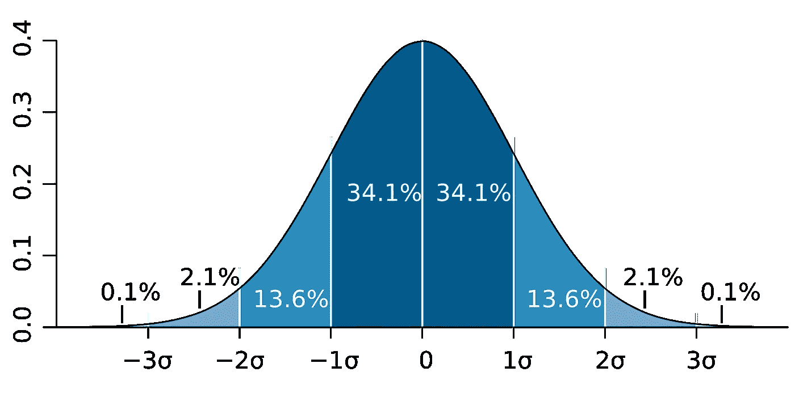

# 正态分布综合指南

> 原文：<https://towardsdatascience.com/normal-distribution-160a93939248?source=collection_archive---------56----------------------->

## 顺便了解一些关于这一基本统计学概念如何提高您的数据科学的技巧。

来自 [Pexels](https://www.pexels.com/photo/action-adult-balance-dusk-1152854/?utm_content=attributionCopyText&utm_medium=referral&utm_source=pexels) 的 [Cameron Casey](https://www.pexels.com/@camcasey?utm_content=attributionCopyText&utm_medium=referral&utm_source=pexels) 摄影

数据的分布是指数据展开的方式。在本文中，我们将讨论与正态分布相关的基本概念:

*   测量正态性的方法
*   转换数据集以符合正态分布的方法
*   使用正态分布来表示自然发生的现象并提供统计见解

# 概观

数据分布在统计学中非常重要，因为我们几乎总是从总体抽样，而总体分布是未知的。样本的分布可能会限制我们可用的统计技术。

正态分布，其中 f(x) =概率密度函数，σ =标准差，μ =均值

正态分布是一种常见的连续概率分布。当数据集符合正态分布时，可以利用许多方便的技术来研究数据:

*   了解每个标准差内的数据百分比
*   线性最小二乘回归
*   基于样本均值的推断(如 t 检验)

在某些情况下，转换倾斜的数据集使其符合正态分布是有益的，从而释放了这组统计技术的用途。当您的数据几乎呈正态分布(除了一些失真)时，这更有可能是相关的。稍后会有更多的介绍。

正态分布具有以下特征:

*   对称钟形
*   平均值和中间值相等(在分布的中心)
*   ≈68%的数据落在平均值的 1 个标准偏差内
*   ≈95%的数据落在平均值的 2 个标准偏差内
*   ≈99.7%的数据落在平均值的 3 个标准偏差内

[M.W. Toews](https://commons.wikimedia.org/wiki/User:Mwtoews) via [维基百科](https://en.wikipedia.org/wiki/Normal_distribution#/media/File:Standard_deviation_diagram.svg)

以下是一些您应该熟悉的与正态分布概述相关的术语:

*   **正态分布**:一种对称的概率分布，常用来表示实值随机变量；有时称为钟形曲线或高斯分布
*   **标准差**:一组数值的变化量或离差量的度量；计算为方差的平方根
*   **方差**:每个数据点距离均值的距离

## 如何使用正态分布

如果数据集不符合正态分布，以下是一些建议:

*   **收集更多数据**:小样本或缺乏数据质量可能会扭曲你原本正常分布的数据集。正如数据科学中经常出现的情况，解决方案可能是收集更多的数据。
*   **减少方差来源** : [减少异常值](/data-science-new-normal-ca34bcbad8f0#c61a)可以产生正态分布的数据。
*   **应用幂变换**:对于有偏差的数据，您可以选择应用 [Box-Cox 方法](https://scikit-learn.org/stable/modules/generated/sklearn.preprocessing.power_transform.html)，这指的是取观察值的平方根和对数。

在接下来的章节中，我们将探索一些常态的度量，以及如何在数据科学项目中使用它们。

# 歪斜

偏斜度是相对于平均值的不对称度。这是一张**左偏态分布**的图表。

[鲁道夫·赫尔曼斯](https://en.wikipedia.org/wiki/User:Rodolfo_Hermans)经由[维基百科](https://en.wikipedia.org/wiki/Skewness#/media/File:Negative_and_positive_skew_diagrams_(English).svg)

💡我一直觉得这有点违反直觉，所以这里值得密切关注。这个图有**负偏度**。这意味着左侧分布的**尾部**更长。违反直觉的一点(至少对我来说)是，大多数数据点都聚集在右边。不要试图与右偏度或正偏度相混淆，右偏度或正偏度将由该图的镜像表示。

## 如何使用偏斜度

理解偏斜度很重要，因为它是模型性能的一个关键因素。要测量偏斜度，使用 `[scipy.stats](https://docs.scipy.org/doc/scipy/reference/generated/scipy.stats.skew.html)` [模块](https://docs.scipy.org/doc/scipy/reference/generated/scipy.stats.skew.html)中的`[skew](https://docs.scipy.org/doc/scipy/reference/generated/scipy.stats.skew.html)` [。](https://docs.scipy.org/doc/scipy/reference/generated/scipy.stats.skew.html)

via [SciPy](https://docs.scipy.org/doc/scipy/reference/generated/scipy.stats.skew.html)

偏斜度测量可以提示我们跨特征值的模型性能的潜在偏差。一个正向倾斜的特性，如上面的第二个数组，将在较低的值上实现更好的性能，因为我们在该范围内提供了更多的数据(与较高值的异常值相反)。

# 峭度

从希腊语 *kurtos* 来看，意思是弯曲的，峰度是对分布的尾部的度量。峰度通常相对于 0 进行测量，使用 [Fisher 的定义](https://docs.scipy.org/doc/scipy/reference/generated/scipy.stats.kurtosis.html)测量正态分布的峰度值。正峰度值表示“较粗”的尾部(即，具有更多异常值的较细钟形曲线)。

拉普拉斯分布的峰度> 0。通过约翰·d·库克咨询公司。

## 如何使用峰度

理解峰度为数据集中异常值的存在提供了一个视角。要测量峰度，使用 `[scipy.stats](https://docs.scipy.org/doc/scipy/reference/generated/scipy.stats.kurtosis.html)` [模块](https://docs.scipy.org/doc/scipy/reference/generated/scipy.stats.kurtosis.html)中的`[kurtosis](https://docs.scipy.org/doc/scipy/reference/generated/scipy.stats.kurtosis.html)` [。](https://docs.scipy.org/doc/scipy/reference/generated/scipy.stats.kurtosis.html)

via [SciPy](https://docs.scipy.org/doc/scipy/reference/generated/scipy.stats.kurtosis.html)

负峰度值表示数据更紧密地围绕平均值分组，离群值更少。

# 关于正态分布的警告

你可能听说过许多自然产生的数据集符合正态分布。从智商到人类身高，一切事物都有这种说法。

虽然正态分布确实来自于对自然的观察，并且确实经常发生，但是我们过于宽松地应用这一假设可能会过于简单化。

> 正常模型在极端情况下往往不太合适。它经常低估罕见事件的概率。纳西姆·尼古拉斯·塔勒布的《黑天鹅》 给出了无数罕见事件的例子，这些事件并不像正态分布预测的*那样*罕见。

<https://www.johndcook.com/blog/2008/07/20/why-heights-are-not-normally-distributed/>  

# 摘要

在这篇关于正态分布的简短文章中，我们讨论了一些基本概念，如何测量它，以及如何使用它。注意不要过度应用正态分布，否则你可能会忽略异常值的可能性。我希望这篇文章能对这个普遍观察到的非常有用的统计概念提供一些见解。

# 更多你可能喜欢的文章

</neighborhood-explorer-a7f374e8527d>  </data-science-new-normal-ca34bcbad8f0>  </10-python-skills-419e5e4c4d66> 