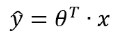
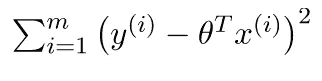
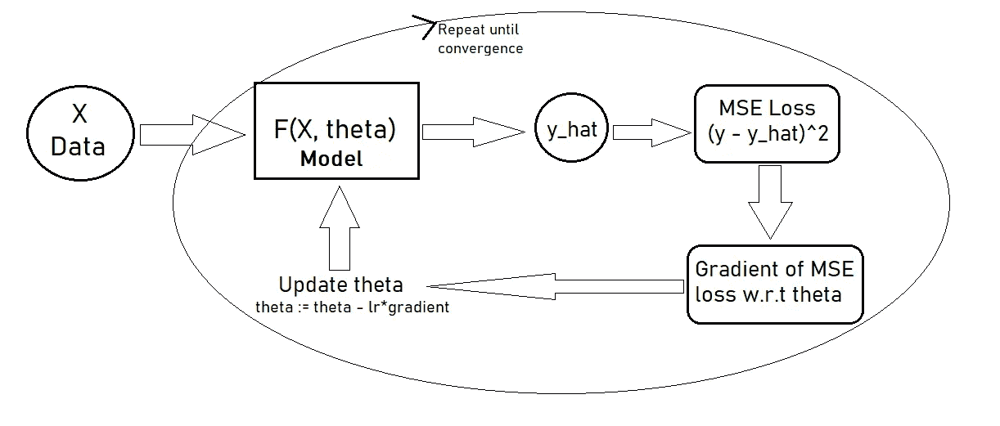
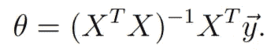
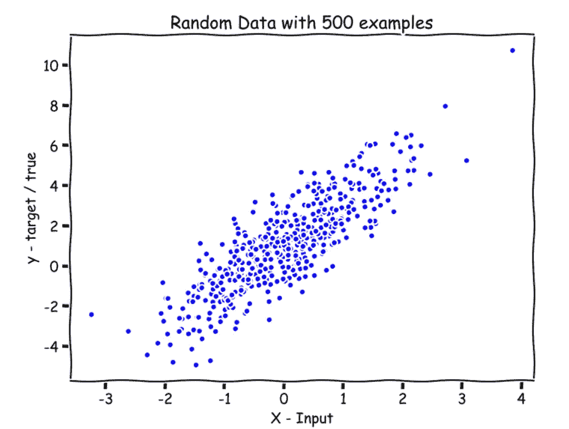
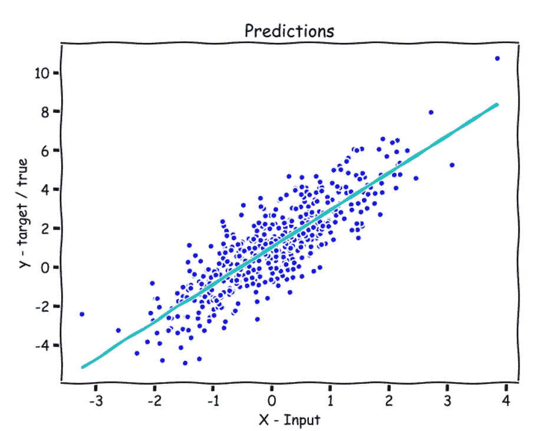

# Python 中的正规方程:线性回归的封闭解

> 原文：<https://towardsdatascience.com/normal-equation-in-python-the-closed-form-solution-for-linear-regression-13df33f9ad71?source=collection_archive---------4----------------------->

## 从零开始的机器学习:第 3 部分


来源:[维基百科](https://www.google.com/url?sa=i&url=https%3A%2F%2Fen.wikipedia.org%2Fwiki%2FLinear_least_squares&psig=AOvVaw0PXUKbkpH3N-ZWQL5AFMd_&ust=1616438242163000&source=images&cd=vfe&ved=0CAYQjRxqFwoTCOiz9ai1xO8CFQAAAAAdAAAAABAI)

在本文中，我们将实现**正规方程**，它是线性回归算法的封闭形式的解决方案，我们可以在一个步骤中找到`theta`的最优值，而无需使用梯度下降算法。

我们将首先从**用梯度下降算法重述**，然后讨论**使用一个叫做正规方程**的公式计算 `**theta**` **，最后，看看**正规方程在起作用**和**图**对我们随机生成的数据的预测。**

从零开始的机器学习系列—

*   第 1 部分:[Python 中从头开始的线性回归](https://medium.com/analytics-vidhya/linear-regression-from-scratch-in-python-b6501f91c82d?source=your_stories_page-------------------------------------)
*   第 2 部分:[Python 中的局部加权线性回归](/locally-weighted-linear-regression-in-python-3d324108efbf?source=your_stories_page-------------------------------------)
*   第 3 部分:[使用 Python 的正规方程:线性回归的封闭解](/normal-equation-in-python-the-closed-form-solution-for-linear-regression-13df33f9ad71?source=your_stories_page-------------------------------------)
*   第 4 部分:[Python 中从头开始的多项式回归](/polynomial-regression-in-python-b69ab7df6105)

[](https://medium.com/analytics-vidhya/linear-regression-from-scratch-in-python-b6501f91c82d) [## Python 中从头开始的线性回归

### 从零开始的机器学习:第 1 部分

medium.com](https://medium.com/analytics-vidhya/linear-regression-from-scratch-in-python-b6501f91c82d) [](/locally-weighted-linear-regression-in-python-3d324108efbf) [## Python 中的局部加权线性回归

### 从零开始的机器学习:第 2 部分

towardsdatascience.com](/locally-weighted-linear-regression-in-python-3d324108efbf) 

# 梯度下降概述

我们有，

*   `**X**`→输入数据(训练数据)
*   `**y**`→目标变量
*   `**theta**`→参数
*   `**y_hat**`→预测/假设(`theta`和`X`的点积)。



等式 1:矢量化预测/假设；来源:geeksforgeeks

*   **损失函数**→均方误差损失或均方误差损失(`y_hat` - `y`)



等式 MSE 损失函数；来源:geeksforgeeks

*   `**m**`→训练例子的数量。
*   `**n**`→功能数量

# **梯度下降算法** —



梯度下降流程图；作者图片

首先，我们随机或全零初始化参数`theta`。然后，

1.  使用上面的等式 1 计算预测/假设`y_hat`。
2.  然后使用预测/假设`y_hat`来计算 MSE 损失，就像这样— ( `y_hat` - `y`)。
3.  然后取 MSE 损失相对于参数`theta`的偏导数(梯度)。
4.  最后用这个偏导数(梯度)来更新参数`theta`像这样——`theta`:=`theta`——`lr`*`gradient`，其中`lr`是学习率。
5.  重复步骤 1 至 4，直到参数`theta`达到最佳值。

# 正态方程

梯度下降是一种迭代算法，这意味着您需要采取多个步骤来达到全局最优(以找到最优参数)，但事实证明，对于线性回归的特殊情况，有一种方法可以求解参数`theta`的最优值，只需一步跳到全局最优，而不需要使用迭代算法，这种算法称为正规方程。它只适用于线性回归，不适用于任何其他算法。

正规方程是线性回归算法的封闭形式的解，这意味着我们可以仅通过使用包括一些矩阵乘法和求逆的公式来获得最佳参数。

为了计算`theta`，我们采用 MSE 损失函数(等式 2)相对于`theta`的偏导数，并将其设置为零。然后，做一点线性代数，得到`theta`的值。

这是正常的方程式—



正规方程；资料来源:吴恩达

如果你知道矩阵导数以及矩阵的一些性质，你应该能够自己推导出正规方程。

供参考— [线性回归正态方程的推导](https://eli.thegreenplace.net/2014/derivation-of-the-normal-equation-for-linear-regression/)

你可能会想，如果`X`是一个不可逆矩阵，这通常会发生在你有冗余特征的情况下，即你的特征是线性相关的，可能是因为你有相同的特征重复两次。你可以做的一件事是找出哪些特性是重复的并修复它们，或者你可以使用 NumPy 中的`np.pinv`函数，它也会给你正确的答案。

# 该算法

1.  **利用法线方程计算** `**theta**` **。**
2.  **使用** `**theta**` **进行预测。**

检查`X`和`y`的形状，使方程式匹配。

# 正常方程在起作用

让我们以下面随机生成的数据作为一个激励性的例子来理解法线方程。

```
**import numpy as np****np.random.seed(42)
X = np.random.randn(500,1)
y = 2*X + 1 + 1.2*np.random.randn(500,1)****X.shape, y.shape**
**>>**((500, 1), (500,))
```

这里，`n` =1 意味着矩阵`X`只有 1 列，而`m` =500 意味着`X`有 500 行。`X`是一个(500×1)矩阵，而`y`是一个长度为 500 的向量。



作者图片

# 寻找 Theta 函数

让我们用正规方程写代码来计算θ。

请参见注释(#)。

```
**def find_theta(X, y):**

    **m = X.shape[0]** # Number of training examples.     # Appending a cloumn of ones in X to add the bias term.
    **X = np.append(X, np.ones((m,1)), axis=1)   **     # reshaping y to (m,1)
 **y = y.reshape(m,1)**    
    # The Normal Equation
 **theta = np.dot(np.linalg.inv(np.dot(X.T, X)), np.dot(X.T, y))**    
 **return theta**
```

# 预测功能

请参见注释(#)。

```
**def predict(X):**

    # Appending a cloumn of ones in X to add the bias term.
 **X = np.append(X, np.ones((X.shape[0],1)), axis=1)**    
    # preds is y_hat which is the dot product of X and theta.
 **preds = np.dot(X, theta)**    
 **return preds**
```

# 绘制预测

请参见注释(#)。

```
# Getting the Value of theta using the find_theta function.
**theta = find_theta(X, y)****theta
>>**array([[1.90949642],
        [1.0388102 ]]# Getting the predictions on X using the predict function.
**preds = predict(X)**# Plotting the predictions.
**fig = plt.figure(figsize=(8,6))
plt.plot(X, y, 'b.')
plt.plot(X, preds, 'c-')
plt.xlabel('X - Input')
plt.ylabel('y - target / true')**
```



直线(线性)拟合数据；作者图片

青色线显示所有`X`值的预测。

我们只用一步就找到了`theta`的最优值，我们找到的`theta`是给定数据的 MSE 损失函数的全局最小值。

# **什么时候用正规方程？**

如果你想用的算法是线性回归，而且是完全线性回归，

*   如果`n`(特征数量)较小。
*   如果`m`(训练样本数)很小，即大约 20，000。

法方程是一个很好的算法，可以考虑用来建立你的机器学习模型。

如有任何问题、评论或疑虑，请在回复部分与我联系。更多关于 ML 从零开始的文章即将到来。

从零开始的机器学习系列—

*   第 1 部分:[Python 中从头开始的线性回归](https://medium.com/analytics-vidhya/linear-regression-from-scratch-in-python-b6501f91c82d?source=your_stories_page-------------------------------------)
*   第二部分:[Python 中的局部加权线性回归](/locally-weighted-linear-regression-in-python-3d324108efbf?source=your_stories_page-------------------------------------)
*   第 3 部分:[使用 Python 的正规方程:线性回归的封闭解](/normal-equation-in-python-the-closed-form-solution-for-linear-regression-13df33f9ad71?source=your_stories_page-------------------------------------)
*   第 4 部分:[Python 中从头开始的多项式回归](/polynomial-regression-in-python-b69ab7df6105)