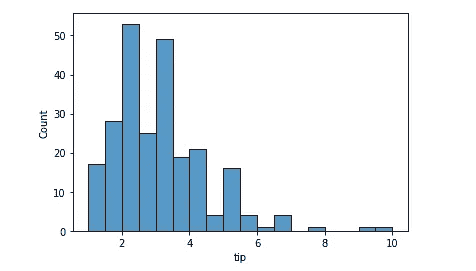
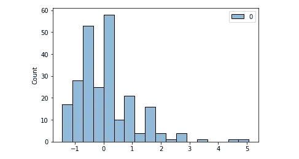
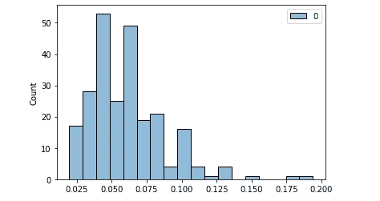
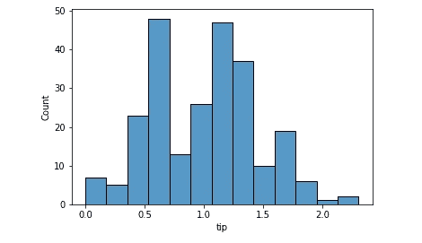
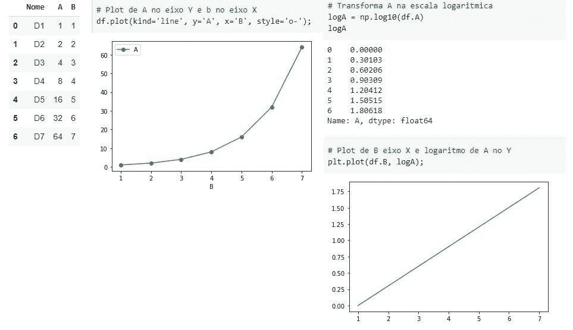

# 规范化、标准化和正态分布

> 原文：<https://towardsdatascience.com/normalization-standardization-and-normal-distribution-bfbe14e12df0?source=collection_archive---------3----------------------->

## 了解区别、何时使用以及如何用 Python 编码


照片由 [kabita Darlami](https://unsplash.com/@itskabita?utm_source=unsplash&utm_medium=referral&utm_content=creditCopyText) 在 [Unsplash](https://unsplash.com/s/photos/bell?utm_source=unsplash&utm_medium=referral&utm_content=creditCopyText) 上拍摄

我将以一句话开始这篇文章:*规范化*和*标准化*不会改变你的数据的分布。换句话说，如果你的变量不是正态分布的，它不会用`normalize`方法变成一个。

来自`sklearn`的`normalize()`或`StandardScaler()`不会改变数据的形状。

## 标准化

使用`sklearn.preprocessing.StandardScaler`模块可以实现标准化。它对变量的作用是将数据集中到平均值 0 和标准差 1。

这样做对于将数据放入相同的比例中非常重要。有时你会处理许多不同尺度的变量。例如，假设你正在做一个线性回归项目，这个项目有像*年学习*和*薪水这样的变量。*

你同意我说的学习年限会在 1 到 30 年之间浮动吗？而且你也同意薪资变量会在几万范围内吗？

这是变量之间的巨大差异。也就是说，一旦线性回归算法将计算系数，自然会给出一个更高的工资数字，而不是多年的研究。但是我们知道我们不希望模型做出这种区分，所以我们可以标准化数据，将它们放在相同的范围内。

```
import pandas as pd
import seaborn as sns
from sklearn.preprocessing import StandardScaler, normalize
import scipy.stats as scs# Pull a dataset
df = sns.load_dataset('tips')# Histogram of tip variable
sns.histoplot(data=df, x='tip');
```



“tip”变量的直方图。图片由作者提供。

好的。应用标准化。

```
# standardizing
scaler = StandardScaler()
scaled = scaler.fit_transform(df[['tip']])# Mean and Std of standardized data
print(f'Mean: {scaled.mean().round()} | Std: {scaled.std().round()}')**[OUT]:** Mean: 0.0 | Std: 1.0# Histplot
sns.histplot(scaled);
```



标准化的“小费”。图片由作者提供。

形状是一样的。以前不正常。现在不正常了。我们可以对前后的正态分布进行夏皮罗检验来确认。p 值是括号*(统计检验数，p 值)*中的第二个数字，如果小于 0.05，则表示不是正态分布。

```
# Normal test original data
scs.shapiro(df.tip)**[OUT]:** (0.897811233997345, 8.20057563521992e-12)# Normal test scaled data
scs.shapiro(scaled)**[OUT]:** (0.8978115916252136, 8.201060490431455e-12)
```

## 正常化

可以用 Python 中的`sklearn`中的`normalize()`来执行规范化，它也不会改变数据的形状。它也将数据带到相同的范围，但这里的主要区别是它将呈现 0 和 1 之间的数字(但它不会将数据集中在平均值 0 和 std =1 上)。

最常见的归一化方法之一是[最小最大归一化](https://scikit-learn.org/stable/modules/generated/sklearn.preprocessing.MinMaxScaler.html)，它基本上使最大值等于 1，最小值等于 0。介于两者之间的值将是该值的百分比，或介于 0 和 1 之间的数字。然而，在这个例子中，我们使用 sklearn 的[规格化](https://scikit-learn.org/stable/modules/generated/sklearn.preprocessing.normalize.html)函数。

```
# normalize
normalized = normalize(df[['tip']], axis=0)# Normalized, but NOT Normal distribution. p-Value < 0.05
scs.shapiro(normalized)**[OUT]:** (0.897811233997345, 8.20057563521992e-12)
```



尖端变量标准化:相同的形状。图片由作者提供。

同样，我们的形状保持不变。数据仍然不是正态分布的。

## 那为什么要执行那些操作呢？

标准化和规范化对于将所有要素放在同一比例中非常重要。

像线性回归这样的算法被称为确定性的，它们所做的是找到解决数学方程的最佳数字，更好的说法是，如果我们谈论的是线性回归，那就是线性方程。

因此，模型将测试许多值作为每个变量的系数。这些数字将与变量的大小成正比。也就是说，我们可以理解成千上万的变量会比单位范围内的变量有更高的系数。对每一个的重视将随之而来。

> 在回归中包含非常大的*和非常小的*数字会导致计算问题。当你规范化或标准化时，你就减轻了问题。

## 改变数据的形状

有一种变换可以改变数据的形状，使其近似于正态分布。这就是对数变换。

```
# Log transform and Normality 
scs.shapiro(df.tip.apply(np.log))**[OUT]:** (0.9888471961021423, 0.05621703341603279)
p-Value > 0.05 : Data is normal# Histogram after Log transformation
sns.histplot(df.tip.apply(np.log) );
```



可变“尖端”测井转换。现在是正态分布。图片由作者提供。

对数变换将消除数据集的偏斜，因为它将所有东西都放在一个角度上。方差将是成比例的，而不是绝对的，因此形状发生变化，类似于正态分布。

关于这一点，我看到的一个很好的描述是，对数变换就像是在看一张带有比例图例的地图，其中 1 厘米= 1 公里。我们把整个映射的空间放在厘米的角度上。我们把数据标准化了。

## 何时使用每一种

就我的研究而言，使用规范化还是标准化更好还没有达成共识。我想每个数据集对转换的反应会不同。鉴于目前的计算能力，这是一个测试和比较的问题。

关于对数转换，如果您的数据最初不是正态分布的，那么对数转换就不会使它成为正态分布。你可以变换它，但是你必须在以后反转它以得到实数作为预测结果，例如。

普通最小二乘(OLS)回归方法——*计算最符合数据的线性方程，考虑误差的平方和最小*——是一个数学表达式，基于常数(截距值)加上系数乘以 X 加上*误差分量* ( *y = a + bx + e)预测 *y* 。*当这些误差呈正态分布时，OLS 方法运行得更好，分析残差(预测值-实际值)是最好的*代理*。

当残差不遵循正态分布时，建议我们使用对数变换(或另一个 Box-Cox 幂变换)将自变量(目标)变换为正态分布。如果这还不够，那么您还可以尝试转换因变量，以更好地拟合模型。

因此，如果您正在使用线性模型并需要改善两个变量之间的线性关系，建议使用对数变换。有时变量之间的关系可以是指数关系，而对数是指数幂的逆运算，因此曲线在变换后就变成了直线。



对数变换后变成直线的指数关系。图片由作者提供。

## 在你走之前

我不是统计学家或数学家。我总是清楚地表明这一点，我也鼓励统计学家帮助我向更广泛的公众解释这一内容，尽可能简单的方式。

如此密集的内容，用简单的文字来解释，并不容易。

我将以这些参考文献结束我的发言。

[为什么要进行日志转换。](https://stats.stackexchange.com/questions/18844/when-and-why-should-you-take-the-log-of-a-distribution-of-numbers)

[归一化和数据整形。](https://stats.stackexchange.com/questions/360323/does-applying-standard-normalisation-lead-to-normal-distribution)

[正常化与否。](https://stats.stackexchange.com/questions/217953/data-normalization-or-not)

[何时规范化或标准化。](https://towardsai.net/p/data-science/how-when-and-why-should-you-normalize-standardize-rescale-your-data-3f083def38ff)

如果这些内容有用，请关注我的博客。

如果您想通过订阅 medium 来支持我的内容，请使用此推荐链接:

<https://medium.com/gustavorsantos> 