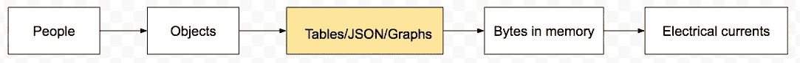
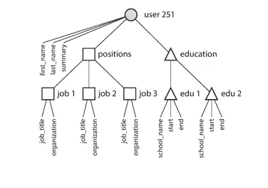
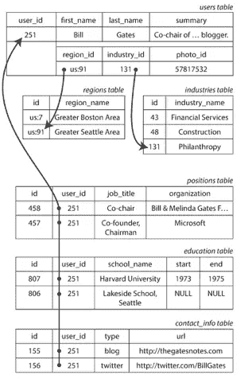

# NoSQL 和关系数据模型历史和基本概念

> 原文：<https://towardsdatascience.com/nosql-and-relational-data-models-history-and-basic-concepts-f886824668cf?source=collection_archive---------30----------------------->

## 关系、文档和图形数据模型概述

简·安东宁·科拉尔在 [Unsplash](https://unsplash.com?utm_source=medium&utm_medium=referral) 上拍摄的照片

设计如何表示和存储数据[是开发软件](https://www.oreilly.com/library/view/designing-data-intensive-applications/9781491903063/)的关键要素。从用户在屏幕上输入的电流一直到计算机电流。每一层的数据模型表示都是基于下一层构建的。

图一。数据模型层。由作者创建。

在本文中，我主要关注图 1 中突出显示的项目。更具体地说，我讨论了基于关系、文档和图形的数据模型的历史和基本概念。从关系数据模型开始。

# 关系模型

E.F. Codd 在 1970 年将关系数据模型理论化，但是系统只是在 70 年代中后期才有效地使用它。它是针对当时最流行的数据库 IBM 的信息管理系统(IMS)的局限性而提出的解决方案之一。

## 80 年代的竞争者

IMS 使用了一个*层次*模型，该模型组织了嵌套在记录中的记录，形成了一个树状结构。它类似于 NoSQL /文档数据库中使用的 JSON 结构。你猜怎么着？它有着和今天相似的权衡。

层次模型不支持连接，也不支持多对多关系。开发人员必须复制记录(反规范化)或手动解析引用。它只适用于一对多的关系。

*图二。JSON /分层*模型。图片来自[设计数据密集型应用](https://www.oreilly.com/library/view/designing-data-intensive-applications/9781491903063/)。

当时提出的另一个解决方案是*网络*模型。也称为 CODASYL 模型。CODASYL 代表数据系统语言会议。正是这个委员会使网络模型标准化了。

CODASYL 允许一个记录有许多父记录，以解决分层设计中多对多的限制。它类似于信息图表，但与我们今天所知的图表模型不同——coda syl 更有限。

CODASYL 或层次结构的主要问题之一是你不能直接访问特定的信息。你必须遍历记录链。

从根到数据树或网络中特定位置的路径称为*访问路径。“遍历”这些路径使得查询和更新变得非常复杂和不灵活。*

## 关系模型设计赢得了比赛

关系模型巧妙地解决了所有问题。它不是将数据完全表示为一个文档的一部分，而是隔离每个数据域，并通过*外键*引用另一个数据域。

通过将每条信息分成表和行，直接查询和更新数据变得更加容易——不需要*访问路径*,不需要遍历数据树或网络。

图 3。比尔·盖茨简介的关系表示。图片来自[设计数据密集型应用](https://www.oreilly.com/library/view/designing-data-intensive-applications/9781491903063/)。

关系模型适用于多对一和多对多，没有竞争对手复杂的查询和更新。允许多对一和多对多可以更容易地规范化/删除数据的重复。

# NoSQL

术语 NoSQL 实际上诞生于 1998 年，指的是一种不使用 SQL 语言的关系数据库。在非关系数据库的范围内，这个名字在 2009 年被创造出来，并在 2010 年变得更加流行。

非关系数据库范围内的 NoSQL 是一个时髦词。这并不新鲜，因为以前就有这样的数据库。我认为 NoSQL 数据库是对 70 年代使用的层次数据库或网络数据库的改进，以覆盖关系模型可能不理想的情况。

NoSQL 领域中有两种常见的数据库类型—文档和图表。

文档数据库类似于 IMS 中使用的层次结构。数据以类似 JSON 的结构表示。一棵信息树。树中的每一项都有一个父项，它非常适合一对多关系。

图形数据库采用了不同的方法。一个条目可以有多少个父条目没有限制。一切都可以和一切联系起来。例如，它非常适合表示用户和他们的联系(关注者/朋友)或道路网络、页面排名——任何可以高度互联的东西。多对多是最常见的关系。

众所周知，脸书使用单一图表来模拟所有数据。包含人员、活动、位置、签到、评论等的单一图表。它们是顶点/节点，图的边代表它们的连接。

总的来说，NoSQL 有很大的好处。与关系数据模型相比，文档和图形数据模型都具有以下优点。

*   模式灵活性
*   位置

## 模式灵活性

模式灵活性意味着更改字段的格式更容易。假设您决定将电话号码作为国家代码和号码的组合存储在两个独立的字段中，而不是一个字段中。

新的 documents/JSON 只需要包含这两个字段，并对代码做一点小小的修改，就可以处理这两种情况——改变格式之前和之后。不需要更新现有用户的配置文件。

在关系数据模型的情况下，您通常需要进行数据迁移。您可以从电话号码字段中提取国家代码，并将其移动到自己的列中。肯定有一些黑客解决方案来避免这样做，但这并不理想。进行这样的迁移也并不复杂。所以，不需要做变通。

## 位置

局部性意味着所有的信息都是独立的；在一个地方—所有用户的概要信息都是一个文档/JSON 的一部分。没有必要从不同的位置(连接)提取数据最终形成一个。与关系数据模型相比，这样的设计可以获得更好的性能。

# 何时使用文档数据库

*   数据可以用树状结构表示，这意味着关系是一对多的。如果在您的应用程序领域中存在需要多对一或多对多的情况，您可以决定复制数据。但是在代码中的某些地方，您需要进行重复数据删除。
*   数据通常一次加载。例如，LinkedIn 个人资料。
*   信息嵌套不太深。如果是的话，只有当你需要直接访问一些信息，而不需要加载整个文档的时候才会有问题。

# 结论

正如软件工程中的许多设计选择一样，没有放之四海而皆准的解决方案。这取决于系统管理和存储的数据类型。人们越来越多地使用混合解决方案。

许多关系数据库长期支持管理文档。自 2000 年代中期以来，大多数都支持 XML。考虑到 JSON 的流行，PostgreSQL、MySQL 和 IBM DB2 也支持 JSON。在 NoSQL 方面，RethinkDB 和 MongoDB 支持类似关系的连接或自动解析文档引用。

将两者结合使用才是正确的方法。应用程序需求和数据可以采取多种形式，并且很难保证，例如，文档数据库将总是很好地覆盖所有场景，除非范围受到限制。