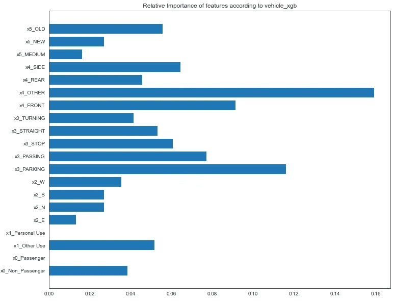

# 不是完全的车祸(希望如此)

> 原文：<https://towardsdatascience.com/not-a-complete-car-crash-85d4d8bb3de8?source=collection_archive---------43----------------------->

## 芝加哥市 2013-2021 年交通事故数据分析

信不信由你——这种情况会对预测伤害产生影响。(图片来自 Unsplash)

对于我的 Flatiron 数据科学课程的第三个模块项目，我想象芝加哥市最初接触我们，分析他们在 2013 年至 2021 年期间积累的交通事故数据。我们被要求首先确定道路安全方面的问题(如果有的话),如果有的话，了解应该针对哪种改进，以及(在地理上)哪里可能需要这些改进。

作为一个附带问题，这座城市承认，可能会有更多的人希望骑自行车前进，并希望鼓励这种做法；因此，展望未来，他们希望简要了解更多与车门相关的碰撞(和伤害)。

首先，让我们用原始数据来分析伤害的时间序列；根据资料，**道路安全**有问题吗？

## 初始趋势分析

将数据转化为按数据中记录的每次车祸日期进行索引的时间序列，我们能够观察到 2013 年至 2021 年期间受伤的年度趋势:

可以看出，各种伤害，尤其是致命伤害呈上升趋势。除非对 2016 年至 2018 年期间记录的相同数据的变化有其他外部解释，否则**芝加哥的道路安全在那些年明显下降，因此我们可以得出结论，道路安全存在问题**。

通过研究时间序列，我们可以发现关于伤害的其他有趣的模式，比如根据车祸发生时一天中的不同时间所遭受的伤害类型的差异:

这些支线图绘制了每天一小时内的时间段与该小时内记录的特定类型伤害的数量之间的关系。这里，致命伤害(似乎更可能发生在晚上 10 点到凌晨 4 点)和其他类型的伤害(似乎更可能发生在下午 4 点左右)之间有一个有趣的区别。

这符合我们直觉上对致命伤害的看法——它们往往发生在高速行驶的事故中，而且在最初几个小时更容易发生。下午 4 点左右(大约是高峰时间)的交通流量峰值表明，旅行次数越多，受伤的可能性就越大(致命伤害除外，因为交通可能会为此移动得太慢)。

## 快速看一下门

你可能会问，什么是门？

 [## 敲门-维基百科

### 撞门是一种交通碰撞或撞车事故，其中骑自行车的人(或其他道路使用者)撞上了机动车的车门，或…

en.wikipedia.org](https://en.wikipedia.org/wiki/Dooring) 

**哎哟！**

在整个数据集中有**1053**个记录的门。作为第一步，我们认为再次利用时间序列并查看在一天中特定时间发生的由敲门引起的伤害的分布会很有趣:

高峰时间是最糟糕的(作者形象化)

就门伤造成的任何伤害而言(在数据集中，70%的门伤至少造成一次伤害)，绝大多数伤害是非致残性的；它们可能不严重，但不会减少痛苦。

每天关门的危险时间必须是 18 小时；在高峰时间，车辆使用率和骑自行车的人流量都很高，通常会导致更多的门。此时记录了数据集中由于关门导致的一例死亡。

如果该市希望设置自行车道，以鼓励骑自行车作为一种通勤方式，它可能希望分析这张地图，它显示了 2019 年(交通“正常”的最后一整年)城市街道上发生的关门事件。热点可以通过这张地图来确定，并通过进一步的实地研究，帮助确定自行车道的理想路线。

2019 年的敲门事件(作者可视化)

## 项目方法

既然我们已经确定每年的伤害有增加的趋势，分析继续尝试确定导致伤害的车祸背后的因素，同样重要的是，交通伤害的热点(地理上)将在芝加哥的哪里。

我们找出哪些因素可能会影响撞车事故的方法是将问题构造成一个二元分类问题，这样，如果数据中记录的每个撞车事故造成了伤害(无论多么严重),则该事故的值为 1，如果没有造成伤害，则该事故的值为 0。**然后我们将拟合各种不同的模型，看看哪一个*最能预测*导致受伤的车祸**。然后，我们可以进一步研究该模型，看看哪些特性在该模型中最有影响力；正是这项调查将揭示改善道路安全的实际方向。以这种方式识别的特征将告诉城市，如果它想要打破交通伤害增加的趋势，它需要考虑什么。

在此之前，哪种模型可以说是*最能预测导致伤害的*碰撞？我们怎么知道一个模型到底好不好？

## 最佳模型:精确度与召回率

我们如何知道一个模型是好的，这个问题的核心是精确度和召回率的权衡。您可以在此了解有关这两个指标的更多信息:

 [## 向每个人解释精确与回忆

### 定义精确度、召回率、准确度和 F1 分数之间的差异

towardsdatascience.com](/explaining-precision-vs-recall-to-everyone-295d4848edaf) 

退一步说，我们需要研究的模型将不得不**尽可能减少预测的假阴性比例**。在这种情况下，假阴性是预测碰撞不会造成任何伤害，而实际上，这种碰撞确实造成了伤害。模型错过的每一次这样的碰撞本身就是**错过了了解什么因素导致了**这样的碰撞的机会，同样，**也错过了避免受伤**(以及拯救生命)的机会。

因此，我们真正需要关注的指标是**召回**。这是因为回忆分数越高，在预测造成伤害的撞车事故时获得的假阴性就越少。

相比之下，不太重要的指标是**精度**。这是因为精确度分数越低，在预测造成伤害的碰撞时获得的假阳性数量就越高。

从高层次来说，错误地预测实际上没有造成任何伤害的碰撞(假阳性，但可以说没有造成伤害)要比错过实际上造成伤害但没有预测到伤害的碰撞(假阴性)好得多。**因此，最好的模型将是回忆最大化的模型**。

## **最佳模型:针对虚拟分类器的基准测试**

但是我们怎么知道这个模型到底好不好呢？处理这个问题的一个方法是从不同的角度处理它；我们的模型在预测伤害方面是否比简单地**猜测**车祸是否会导致伤害的策略做得更好？简而言之，任何“有利于”进一步分析的模型都至少具有与猜测策略一样高的精确度，而且还具有远远超过猜测策略的回忆分数。

## 建模和评估:高层次总结

现在，我们已经设定了基准，我们将根据这些基准挑选出某个(些)模型进行进一步调查，我们从这里下载了碰撞和车辆数据集，以进行处理:

 [## 交通事故-事故|芝加哥市|数据门户

### 编辑描述

data.cityofchicago.org](https://data.cityofchicago.org/Transportation/Traffic-Crashes-Crashes/85ca-t3if) 

我们首先清除每个数据集的空值，并简化(大部分)分类特征。这一过程中至关重要的一步是认识到我们正在解决的二元分类问题也是一个**类别不平衡**问题(幸运的是，造成伤害的事故在所有事故中属于少数类别)。下一步，我们在每个数据集上训练了一些来自 Sci-Kit Learn 监督学习算法的模型，使用这些训练好的模型进行预测，并评估这些预测的正确程度。作为最后的评估步骤，在交叉验证的基础上对每个模型的精确度和召回率进行评分。重要的是在交叉验证的基础上查看这些分数，以确保所获得的召回指标是稳健的。

让我们看看刚才描述的过程的结果:

结果在…..(数据由作者提供)

关于结果，首先要注意上表中虚拟模型的性能。这些模型的名称以*最频繁*、*在先*、*分层*和*统一*结尾，因此**碰撞 _ 最频繁**指的是在碰撞数据集上训练的虚拟模型，但选择简单的猜测策略**总是预测**没有碰撞会导致伤害。

在这种背景下，可以看出，对于任何“好”的模型，它必须以大约 0.5 的交叉验证召回分数击败 **vehicle_uniform** 和 **crash_uniform** (它还必须具有比 0.17 更好的精确度分数)。从这个角度来说，最好的车型是 **vehicle_xgb** 和 **crash_logreg** 。这些是我们在引擎盖下窥视的模型，看看哪些特征使它们滴答作响；这些是我们在向城市推荐的任何道路安全计划中需要解决的特征。

## 特征重要性:基于崩溃数据训练的逻辑回归

从根据碰撞数据训练的逻辑回归模型中提取的前 10 个系数的比较告诉我们，在预测碰撞是否导致伤害方面，**速度**在该模型中是有影响的。“x15_40”、“x15_60”和“x15_80”都是表示碰撞现场的速度限制是低于 40 英里/小时、低于 60 英里/小时还是低于 80 英里/小时的特征。因此，事故发生区域允许的速度越高，事故造成伤害的可能性就越大(尤其是严重伤害，根据我们对致命伤害的了解、事故发生的时间以及我们对事故发生速度的推测)。

速度对伤害有很大影响(作者可视化)

## 功能重要性:XGBoost 根据车辆数据进行训练

在根据车辆数据训练的 XGBoost 模型下提起发动机罩，车辆的第一个接触点(如特征名称“x4_Other”所暗示的)对决定碰撞是否导致伤害有影响。在清理车辆数据库的过程中，导致车辆完全毁坏(和车顶损坏)的碰撞已被归类到此特征下。我们对这个模型的解释是，如果车辆受到大面积损坏，或者如果车辆被击中除了前面、侧面或后面以外的任何地方，碰撞将导致受伤。

当第一个接触点是“其他”时，你就有大麻烦了…(作者可视化)

## **事故热点在哪里？**

根据我们对顶级车型的调查，我们对城市的建议应该是纳入降低整体速度的措施，并着眼于旨在减少重型车辆损坏的道路重新设计(这两个因素对预测导致伤害的碰撞都有影响)。有了这些知识，我们需要知道在哪里应用它们。伤害和死亡的热点在下面的交互式地图中给出了答案；这个城市的各个部分都是由警察的巡逻号码组织起来的。看起来 331，815，834 都是值得进一步调查的热点。

2013 年至 2021 年芝加哥的总伤害和死亡热点(作者可视化)

## **结论**

我们可以用更多的数据做更多的事情。实际上，在芝加哥城市门户网站上有更多的数据要处理，包括与司机相关的整个数据集。我们希望对数据集中的肇事逃逸进行与我们对门处理相同的分析。本博客中所有探索性数据分析、建模和可视化的代码可以在下面的 github repo 中找到:

 [## hsinhinlim/熨斗-模块-3-最终-项目

### 在 GitHub 上创建一个帐户，为 hsinhinlim/flat iron-Module-3-Final-Project 的开发做出贡献。

github.com](https://github.com/hsinhinlim/Flatiron-Module-3-Final-Project)