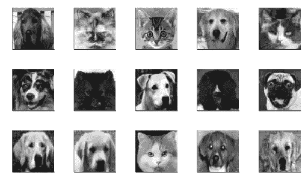
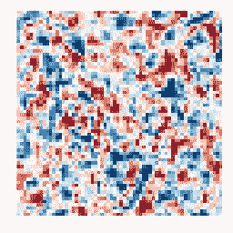
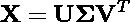
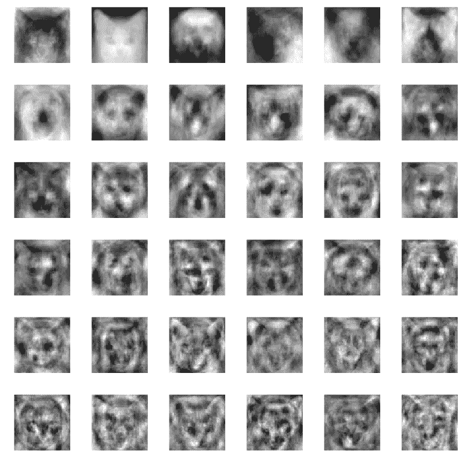
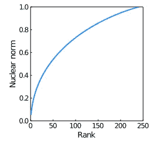
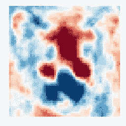
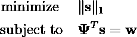
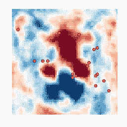
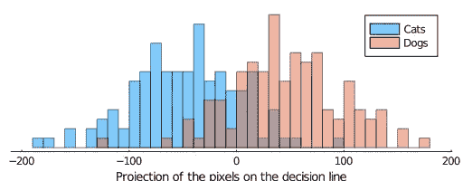

# 并非所有的像素对分类都很重要

> 原文：<https://towardsdatascience.com/not-all-pixels-matter-for-classification-b8d8f0f198d3?source=collection_archive---------30----------------------->

## [实践教程](https://towardsdatascience.com/tagged/hands-on-tutorials)

## 利用低秩结构和稀疏性对图像进行分类

我女儿两岁了。像她这个年龄的大多数孩子一样，她已经很擅长区分各种各样的动物了。当我画猫和狗的时候，她甚至能把它们区别开来，天哪，我画得太糟糕了！仔细想想，这是相当了不起的。即使信息很少(我告诉过你我真的不擅长画画吗？)，她能正确推断出我给她看的图片上是什么。计算机是一个完全不同的故事。我们使用现成的监督学习算法来训练它们。这些算法通常涉及过度参数化的深度神经网络，其参数使用数千(如果不是数百万)图像的数据集来拟合。但是我们能更有效率吗？我们能否训练计算机仅用少量像素就能检测出呈现给它的是一只猫还是一只狗的图像？有时确实如此，这就是我们今天要探讨的。

# 猫还是狗？

[在之前的一篇文章](/pixels-are-not-created-equal-b3ae4b36ffbc)中，我讨论了工程和工业中流行的标准化数据集是如何被底层的低等级结构所表征的。然后，我们利用这种结构设计了一种有效的算法，从有限的像素测量值重建图像。类似的想法可以用于分类目的。

今天，我们将使用由猫狗的灰度图像组成的简单数据集。每张图片是 64 乘 64 像素，我们有 242 个。虽然这是一个相对较小的数据集，但足以说明我的观点。下图显示了这些猫和狗的随机子集。

我们数据集中的随机宠物。图片由作者提供。

我将展示的大部分灵感来自[布伦顿*等人*。不要犹豫，看看他们的文章，了解更多细节。关键是，与我们为](https://epubs.siam.org/doi/pdf/10.1137/15M1036713)[图像重建](/pixels-are-not-created-equal-b3ae4b36ffbc)所做的相比，分类图像实际上需要更少的像素。

## 基线模型

让我们从建立一个基线模型开始。为此，我们将使用基于线性判别分析的简单线性分类器。数学细节对我们的讨论不重要，因此被省略了。如果你想了解更多，这里有很多关于 LDA 的帖子。

此后，90%的图像将被随机分配给训练集，剩下的 10%分配给测试集。这一过程重复 100 次，以获得统计上相关的结果。然后，向量 **w** 和偏差 *b* 被定义为这 100 次实验的模型参数的平均值。

基线模型的决策线(平均超过 100 次实验)。图片由作者提供。

左边的图片显示了最终的矢量 **w** (一旦被重塑成图像)。看不到特定的模式，然而，相应的模型在测试集上达到了 80%的平均准确率。这定义了我们以后的基线。

# 用于分类的稀疏传感器放置

我们的基线模型在做出决定之前必须观察图像的所有 4096 个像素。现在的问题是:我们能否在只观察少量像素的情况下实现类似的性能？这个问题的答案是一个三阶段的程序。首先，我们的数据被线性投影到一个更低维的子空间。然后，基于嵌入的数据训练线性分类器。最后，从投影基和低维决策向量中推断出最重要的像素。

## 降维

如前所述，低维嵌入从数据矩阵 **X** 的奇异值分解中获得

下图显示了被重新整形为图像的 **U** 的前 36 列。与特征脸平行，这些图像可以被称为特征脸。

引渴——六个 eigenpets(从左到右，从上到下)。图片由作者提供。

作为秩的函数的近似的核范数。图片由作者提供。

左边显示了近似的核范数作为其秩的函数的演变。由于我们的数据集很小，没有清晰的低秩结构出现。尽管如此，我们仍然可以利用这种低维嵌入来识别用于分类的最相关的像素。尽管缺乏底层的低秩结构，我们将在秩小至 r = 20 时截断数据矩阵。

## 低维分类

现在让我们在这个低维子空间中训练我们的分类器。使用相同的学习程序。

当数据被限制在一个 20 维的空间时。图片由作者提供。

左图是高维空间中的决策线**ψw**。一些猫的模式开始出现。因此，向量**ψw**定义了一个比我们的基线模型更容易解释的超平面。这也导致在测试集上类似的 80%的准确度。但是请注意，要在实践中使用该模型，仍然需要考虑图像的所有 4096 个像素，以将其投影到决策线上。

## 识别最相关的像素

有趣的部分来了。决策向量 **w** 是 20 维的。因此，实际上只需要 20 像素的测量值就可以将给定的图像投影到相应的低维决策线上。但是如何选择它们呢？借鉴[压缩传感](/how-to-reconstruct-an-image-if-you-see-only-a-few-pixels-e3899d038bf9)、[布伦顿*等人*](https://epubs.siam.org/doi/pdf/10.1137/15M1036713) 的思想。建议通过解决以下优化问题来识别最具信息量的像素

向量∊ ℝⁿ被认为是稀疏的。它的大多数条目是零，并且它最多有 r = 20 个非零条目。等式约束**ψ**ᵀ**s = w**强制所选像素确实将图像投影到适当的决策线上。因此， **s** 可以理解为选择最有信息的像素用于分类目的的掩码。

用于分类目的的最重要的像素。图片由作者提供。

给定我们的训练数据集，左图显示了叠加在图像上的这些最具信息量的像素的位置，对应于我们当前模型的决策线。有趣的是，如果我们重复整个过程(包括随机分配到训练集和测试集)，这个简单的过程识别出鼻子、眼睛、耳朵和前额是最能提供信息的区域，以确定出现的是猫还是狗。这为我们的模型提供了一些可解释性。

## 少像素模型与高维基线

既然我们已经确定了信息最丰富的像素，让我们仅使用这些有限的像素测量值来训练线性分类器。再次使用相同的学习程序。下图显示了有限像素测量值在相应决策线上的投影。

图片由作者提供。

即使使用非常有限的测量，我们的分类器也可以以与我们之前的两个模型(80%)相当的准确度(78%)区分猫和狗。鉴于我们现在只使用了 0.5%的像素，这是相当令人印象深刻的！一个明智的问题是，我们能做得更好吗？有没有可能用更少的像素达到类似的性能？答案有些反差。低于这个阈值，我们的简单模型的准确性会迅速下降，但更好的维度减少或更鲁棒的分类器可能会做得更好。然而，这个简单的例子说明了如何使用标准线性代数技术来显著减少分类所需的数据量。

# 结论

在大数据时代，试图用尽可能少的数据建立一个模型可能会适得其反。数据效率在工程和工业应用中仍然至关重要。在这种情况下，数据收集或存储可能是复杂和庞大的，数据处理也是如此。我充分意识到我提出的问题是对这种情况的过度简化。我希望它仍能启发那些需要数据高效或可解释模型的人。我介绍的方法可以在许多方面进行改进。诸如支持向量机或逻辑回归的其他分类器可以用来代替简单的线性判别分析。类似地，与 PCA 相比，非负矩阵分解可以提供更直观的图像嵌入。使用图像的小波变换也可能更有效。可能性是无限的。让我知道这是否对你的特殊问题有帮助！

PS:如果你想了解更多，我在这篇文章的末尾添加了一个学术参考文献列表。我也强烈建议你看看 Brunton & Kutz 的新书， [*数据驱动的科学与工程——机器学习、动力系统与控制*](http://www.databookuw.com/) ，你可以从他们的网站上免费下载(【http://databookuw.com/】[)。你也可以查看他们各自的 YouTube 频道(](http://databookuw.com/)[这里](https://www.youtube.com/c/Eigensteve/videos)和[这里](https://www.youtube.com/channel/UCoUOaSVYkTV6W4uLvxvgiFA/videos))。

> *想要阅读更多此类内容？*查看我其他关于[低秩结构和数据驱动建模](https://loiseau-jc.medium.com/list/lowrank-structure-and-datadriven-modeling-8f39635a90ea) *的文章或者干脆我的* [*机器学习基础知识*](https://loiseau-jc.medium.com/list/machine-learning-basics-0baf10d8f8b5) ！

 [## 如果只看到几个像素，如何重建一幅图像？

### 压缩传感快速介绍

towardsdatascience.com](/how-to-reconstruct-an-image-if-you-see-only-a-few-pixels-e3899d038bf9)