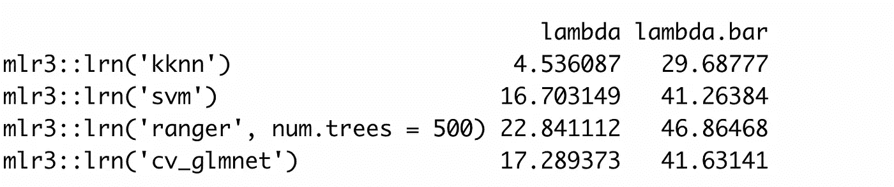
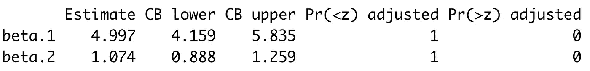
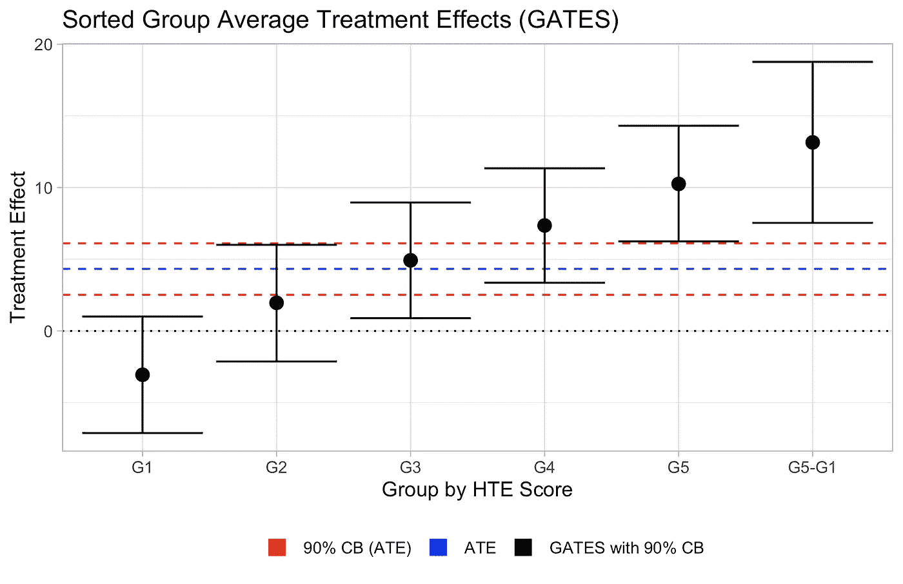

# 不仅仅是平均值:使用机器学习来估计异质治疗效果(凯特，BLP，盖茨，克兰)

> 原文：<https://towardsdatascience.com/not-merely-averages-using-machine-learning-to-estimate-heterogeneous-treatment-effects-573bf7376a73?source=collection_archive---------2----------------------->

## [行业笔记](https://towardsdatascience.com/tagged/notes-from-industry)

## *一项政策或计划的因果影响如何因人而异？*

*这篇博客文章提供了一个关于如何在实验中使用通用机器学习推理异质治疗效果的实用介绍，由* [*Chernozhukov，Demirer，Duflo 和 Fernández-Val (2020)提出。我为有统计学头脑的从业者写了这篇博客，他们对在工作中应用这种方法感兴趣。如果你想了解该方法背后的理论，请查阅原始论文。Welz、Alfons、Demirer 和 Chernozhukov 开发的 GenericML 包的 beta 版可以在*](https://www.nber.org/system/files/working_papers/w24678/w24678.pdf) [*这里*](https://github.com/mwelz/GenericML/) *找到，这篇博文使用的代码是* [*这里*](https://github.com/lucas-kitzmueller/GenericML_blog_post) *。*

# 何必呢？并非所有的治疗效果都是相同的(如果已经确信，跳过)

克劳迪奥·施瓦茨在 [Unsplash](https://unsplash.com?utm_source=medium&utm_medium=referral) 上拍摄的照片

假设你做了一个随机实验。例如，你向你的客户的一个随机子集推出了你的产品的一个新特性，并且测量了客户保持率。或者举一个公共政策的例子，在一个城市随机选择一些人，如果他们接种了新冠肺炎疫苗，就会得到一根免费的(纯素食)香肠。

在忍受了数据收集和清理的血汗和泪水之后，您最终通过比较治疗组和对照组的平均结果来计算平均治疗效果(ate)。治疗组的个体接种疫苗的可能性增加了 10%——万岁！

然而，不久之后，一种失望感可能会征服你。所有这些艰苦的工作就为了一个单一的数据点就证明了该计划的有效性吗？当然，你一定能从你的实验中得到更多。特别是，**治疗效果如何因个体及其特征而异？**谁最有可能在治疗后接种疫苗，他们的特征是什么？这种治疗是否阻碍了一些人接种疫苗？简而言之，你要研究的是社会科学家所说的治疗效果异质性。

**理解治疗效果的异质性不仅在智力上有趣，而且具有巨大的现实意义。**

(1)它**帮助** **处理分配问题**:如果我们发现一个项目让一些人变得更糟，我们是否要扩大这个项目？这种治疗对已经富裕起来的个人是否有更大的影响，从而加剧了不平等？

(2) It **有助于计划目标和资源分配**:如果一个计划对某些个人没有效果，而对其他人非常有效，那么首先将目标对准对治疗反应高度灵敏的群体可能更有效。

(3)它**有助于** **对一项计划在不同环境下的有效性做出预测**:例如，如果该计划对年轻人最有效，但对老一代人无效，那么该计划在人口较年轻的地区可能会更有效。

# **传统的样本分割无法做到这一点(如果已经确信，则跳过)**

估计治疗效果异质性的传统方法是分割样本(例如，男性对女性)，分别估计两组的治疗效果，并测试治疗效果的差异是否具有统计学意义。然而，这种方法有两个问题:

(1) **过度拟合(或 p-hacking)。**对于丰富的基线调查，有很多很多潜在的方法来分割样本。因此，当观察许多不同的分裂并在治疗效果中发现一些统计上显著的差异时，这种差异很可能只是随机噪声。此外，其他研究人员可能会认为你只是尝试了不同的样本分割，直到你发现有趣的(即，可发表的)结果——当然，你永远不会这样做，但关键是你可以这样做。注册预分析计划部分解决了这个问题，但并不完全令人满意。在数据收集过程中，您经常会了解到有关治疗如何变化的新信息，并且您希望能够在分析中使用这些见解，而不是局限于预先注册的亚组。

****②治疗效果异质性复杂。**即使您预先登记了您的分析，传统的样本分割还有另一个缺点:它们不能捕捉治疗和基线特征之间复杂的、更高级别的相互作用。换句话说，受影响最大和最小的个体可能不在一个特征的两端(例如，年轻人对老年人)，但受影响最大的群体可能是由许多不同特征以非线性方式定义的人群的一部分。**

# ****(通用)机器学习来救援了！****

****

**照片由[弗兰基·查马基](https://unsplash.com/@franki?utm_source=medium&utm_medium=referral)在 [Unsplash](https://unsplash.com?utm_source=medium&utm_medium=referral) 上拍摄**

****在过去的几年里，研究人员开发了新的工具，这些工具依赖于机器学习方法，以一种规范的方式来估计异质治疗效果。**一种早期且仍然流行的方法是[Wager 的诚实因果森林& Athey (2017)](https://arxiv.org/pdf/1510.04342.pdf) 。**我们在这篇博文中看到的方法是由** [**Chernozhukov 等人(2020)提出的通用机器学习(Generic ML)方法。**](https://www.nber.org/system/files/working_papers/w24678/w24678.pdf) 虽然有很多关于诚实因果森林的好文章(例如[这里](https://www.markhw.com/blog/causalforestintro)，但是我还没有看到很多关于 Chernozhukov 等人(2020)的方法的文章。我希望这篇文章能填补这个空白，为你节省一些时间——或者至少在深入研究这篇论文之前给你一个方法的直觉。**

**与诚实的因果森林相比，泛型 ML 有三个优点。第一，它是通用的(惊喜！).这意味着它可以与任何机器学习技术一起工作，并且您不局限于随机森林。第二，它确实说明了样本分割带来的不确定性(我们将在后面讨论这意味着什么)。第三，根据 Chernozhukov 等人(2020 年)的说法，Wagner & Athey (2017 年)的方法在协变量的数量远大于观察值数量的对数的高维设置中没有提供可靠的估计。**

# **通用 ML 是如何工作的？(如果您只是为了代码，请跳到下一节)**

**原始论文做了一篇计量经济学论文必须做的事情——它展示了如何得到理论上正确的推断。在这里，我们将不回顾他们的证明，而是集中在如何应用该方法。**

**主要想法如下:我们首先创建对个体治疗效果的预测，然后使用这些预测对我们感兴趣的属性进行推断——例如 20%最受影响的个体中的治疗效果。**

**我听到你在这一点上说:一切都很好，但你忘记了因果推理的根本问题吗？我们总是只观察个体的*一个*潜在结果——例如，我们可能观察一个人在治疗中或在控制中的疫苗接种状态，但我们从来不观察两者。那么，我们应该如何获得个体治疗效果的任何代理呢？**

****我们是这样做的:我们用 50/50 的比例将样本分成一个主样本集和一个辅助样本集。我们从实验的控制组中的辅助集中选取个体，并使用 ML 方法(随机森林、弹性网等)拟合结果和基线特征之间关系的模型。).接下来，我们从辅助组中选取治疗组中的其他个体，并在结果和基线特征之间拟合第二个模型。然后，我们使用这两个模型来预测主组中每个个体的结果，如果该个体在对照组中，如果该个体在治疗组中。取其差值，我们就可以得到估计的个体治疗效果。**(这里的一般直觉是，使用 ML 方法，我们可以一方面模拟基线特征和治疗状态之间的“真实”潜在关系，另一方面模拟结果，因此可以预测如果在另一组中，个人的结果会是什么。)**

**使用这些预测的个体治疗效果，我们然后分析以下三个属性来了解治疗效果的异质性。*尽管它们可能不是最直观的，我们还是使用了 Chernozhukov 等人(2020)引入的术语和首字母缩略词，以及 Brian、Karlan 和 Osman (2021)* *提出的* [*回归规范，因为这样会更容易理解该方法的可用 R 代码。如果回归方程对你来说没有意义，不要担心！当你看这个例子时，它们可能会变得更清楚。*](https://www.nber.org/papers/w29311)**

## *****1。*** ***【最佳线性预测因子(BLP) —或“有异质性的证据吗”？*****

**为了分析是否存在基于基线特征的异质性治疗证据，我们首先进行以下回归分析:**

**其中 Xᵢ是一组协变量，包括预测的对照 effects,Tᵢ(治疗组的一个指标(减去被分配到治疗组的概率))，S(Zᵢ是预测的个体治疗效果(Zᵢ表示用于预测参与者效果的个体 I 的一组基线特征)。β₁是对平均治疗效果(ate)的估计。**

**Chernozukhov (2020)表明，如果不存在异质性，或者如果对 S(Zᵢ的预测未能捕捉到异质性，则β₂ = 0。因此，检验β₂是否在统计学上显著不同于零是我们治疗效果异质性的第一个检验(以及我们检测它的 ML 方法)。**

## ****2*。*** ***排序后的群体平均治疗效果(GATES) —或“对 20%受影响最大和 20%受影响最小的个体的治疗效果如何？”*****

**如果存在治疗效果的异质性，我们想知道它在个体之间是如何变化的。**因此，我们首先根据预测治疗效果的大小对样本进行分类，将其分成五等分，然后运行以下回归:****

**由嵌入式乐趣驱动**

**其中 G **ᵢ** 是第 j *个*五分位数的参与者集合。**这里感兴趣的主要参数是γⱼ，它是每个箱中个体的治疗效果。****

## *****3。分类分析(CLAN)——或“什么特征与治疗效果异质性相关？”*****

**为了回答哪些协变量与这种异质性相关，我们使用双样本 t 检验比较了受影响最大和最小参与者的平均特征。**

**现在，你几乎已经完成了这个理论部分，还有最后一点:我们没有遵循这个过程一次，但我们实际上随机地将样本分成主样本和辅助样本 100(或更多)次。我们可以比较不同的 ML 方法在 100 次运行中预测治疗效果的表现，并专注于表现最好的方法。参数估计(β₁、γⱼ等。)、置信界限和 p 值是 100 次分割的中间值。p 值将考虑估计不确定性和数据分割引起的不确定性(后者不同于其他方法，如诚实因果森林)。**

# ****请给我一个例子(如果你只是为了代码而来，请阅读此处)****

**如果您不想自己编写所有代码，目前有两种选择:**

**(1)有一个 Chernozuhokov 等人(2010)的旧版本的[复制文件](https://github.com/demirermert/MLInference/blob/master/Heterogeneity/EL1.R)，应用于摩洛哥的小额信贷。你可以根据你的设置调整文件。**

**(2) **你更好的选择很可能是由** [**马克斯·韦尔兹**](https://github.com/mwelz) **，** [**安德烈亚斯·阿尔方斯**](https://personal.eur.nl/alfons/) **，** [**梅尔特·德米雷尔**](https://www.mertdemirer.com/) **，以及** [**维克多·切尔诺朱科夫**](https://www.mit.edu/~vchern/) **组成的全新而优秀的 R 包 GenericML。R 包的测试版在这里******是可用的，但是请注意，它仍然在进行中**，作者写道它“还没有经过彻底的测试”，所以他们“还不能保证正确性。”然而，当你读到这篇博文的时候，测试有可能已经取得了进展，这个包可以从 CRAN 获得。****

****你可以在这里找到这篇博文[的具体例子的代码，但是让我澄清一下:我们正在密切关注由 GenericML 包作者发布的例子代码，在 R 中实现 generic ML 方法的所有功劳都归于他们！](https://github.com/lucas-kitzmueller/GenericML_blog_post)****

## ******设置上下文和数据******

********

****[Robo 神童](https://unsplash.com/@robowunderkind?utm_source=medium&utm_medium=referral)在 [Unsplash](https://unsplash.com?utm_source=medium&utm_medium=referral) 上的照片****

******首先，我们生成一些人工数据，我们将对这些数据应用泛型 ML 方法。**假设您进行了一项实验，在疫情期间，随机选择 50%的学生获得一台平板电脑用于远程学习，我们在 6 个月后的标准化测试中测量了所有学生的表现(这种个人水平的处理任务可能会有一些溢出问题，但现在忽略这一点)。****

****我们假设有一个访问学习资源的表格会使考试成绩平均提高 10 分(ATE ),但我们也根据基线特征 Z1-Z8 对治疗的一些异质性进行了建模。在控制组，学生的平均测试分数为 50，标准差为 10。****

## ******应用泛型 ML 函数******

****GenericML()函数有许多参数——这里我们只关注最重要的参数，其他参数都使用默认设置。特别地，我们指定了用于预测代理治疗效果的 ML 方法。****

******GenericML 包使用** [**ml3r 包**](https://mlr3.mlr-org.com/) **e 进行机器学习。所以我们可以使用 mlr3 语法来指定' learners' *。*** 你可以在这里找到 ml3r 开发团队[推荐的方法列表。我们使用弹性网、随机森林、支持向量机(SVM)和 k 近邻(MLR3 包尚不支持深度神经网络)。GenericML()目前不允许我们为参数调整指定参数，但是您可以在源代码(mlr3。r)并使用](https://mlr3learners.mlr-org.com/)[MLR 3 调谐](https://github.com/mlr-org/mlr3tuning)和[MLR 3 调谐空间](https://github.com/mlr-org/mlr3tuningspaces)不要太用力。****

## ******选择最佳学习者******

****GenericML 函数返回许多有用的信息。首先，让我们看看哪些 ML 方法表现最好。**在我们的案例中，随机森林在条件平均处理效果(λ)和门数(λbar)方面表现最佳。因此，我们关注随机森林前进** (GenericML 方便地将其存储为最佳学习者)。****

********

****R 输出截图(图片由作者提供)****

## *******(BLP)最佳线性预测值——或者“有异质性的证据”吗？*******

****当分析来自 BLP 回归的参数时，我们看到平均治疗效果的估计值(β1)为 4.3，这与我们在产生数据时设定的 ate 非常接近。更重要的是，**我们看到β2 接近于 1，在统计上显著不同于零(p 值< 0.001)。这意味着我们发现了治疗效果异质性的证据，我们的 ML 预测成功地检测到了它。******

********

****R 输出截图(图片由作者提供)****

## *******排序后的组平均治疗效果(门)—或“20%受影响最大和 20%受影响最小的个体的治疗效果如何？”*******

****接下来，我们想知道不同个体的治疗效果有多大差异。GenericML()为大多数结果提供了一个方便的绘图函数，所以这里我们看的是图形而不是表格。我们看到**受影响最大的 20%的学生(即该计划对其最有效的学生)由于这种治疗，考试成绩平均提高了 10 分(平均成绩提高了一倍！)**。**另一方面，在我们的例子中，提供平板电脑似乎让一些学生在标准化测试中表现更差**(即使这种影响在统计上与零没有显著差异)。****

********

****r 输出(图片由作者提供)****

## *******(宗族)分类分析——或“什么特征与治疗效果异质性相关？”*******

****自然，我们想知道这种疗法对哪些学生最有效，对哪些学生有害。为此，我们可以比较盖茨发现的不同群体中学生的基线特征。**例如，假设变量 z7 是上一个疫情前一年的年级变量。图表显示，在这种情况下，表现较好的学生从免费平板电脑中受益最多(可能是因为他们知道如何利用平板电脑)，而表现较差的学生则被远远甩在后面(可能是因为他们无法跟上课程，所以平板电脑分散了他们的注意力)**。我们还看到，当我们在数据中创建治疗效果异质性时，我们没有使用的变量没有差异(以变量 z10 为例)。****

********

****r 输出(图片由作者提供)****

# ******太好了！那么，我应该总是使用通用机器学习来估计治疗效果的异质性吗？******

****可悲的是，没有免费的午餐。**方法**存在明显的功率损耗，尤其是在考虑到样品分割引起的不确定性时。这将取决于具体的设置，但在本文附录中的一个例子中，Chernozhukov 等人(2020)发现，与简单的参数模型相比，功率损失相当于样本大小减半。****

****因此，如果您从一开始就清楚哪些特征与治疗效果异质性最相关(例如，基于理论或现有研究)，预先指定这些群体并使用传统方法仍然是您的最佳选择。如果你不能或不愿意在实验进行之前表明立场，并且分析治疗效果的异质性对你很重要，你应该计划更大的样本量。****

****此外，重要的是要记住，**方法在拥有丰富基线调查**的环境中效果最佳，在这些环境中，您拥有许多基线特征的数据。如果您只有几个基线协变量，您可能会发现很难对个体治疗效果做出良好的预测。此外，如果你只有很少的基线变量，过度拟合和 p-hacking 就不那么令人担心了，因为你可以合理地形成子群的方法是有限的。****

****从好的方面来说，请注意，虽然我专注于实验，**你也可以使用观察数据的方法** ( [这里有一个](https://www.aeaweb.org/articles?id=10.1257/aer.20180279)的例子)。您还可以在具有固定效果的设置中方便地使用 GenericML。如果你有一个二元结果，你会想把 mlr3 学习者从解回归任务改为分类任务。为此，您目前必须修改 GenericML 的源代码，但这在将来可能会改变。****

****希望这篇博文有所帮助，随时欢迎评论和建议。你可以通过[coding @ lucaskitzmueller . eu](mailto:coding@lucaskitzmueller.eu)联系我，在 Twitter [这里](https://twitter.com/ktzmllr)关注我。****