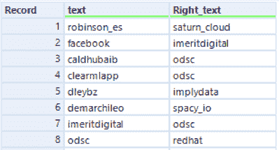
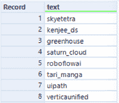
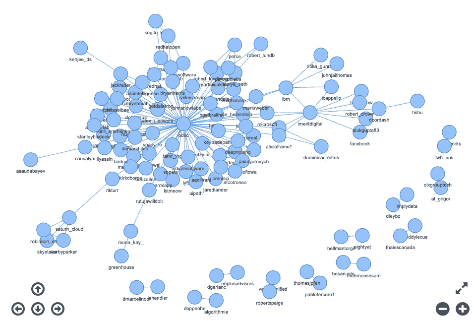
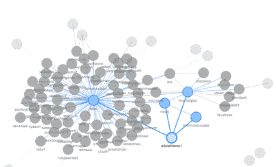

# 显著节点:通过网络分析识别影响者

> 原文：<https://towardsdatascience.com/notable-nodes-identifying-influencers-with-network-analysis-2f51f1d8fec4?source=collection_archive---------19----------------------->

## 识别社交媒体影响者既是一门艺术，也是一门科学。让我们使用网络分析来帮助在 Twitter 上找到他们。

**上* [*下*](https://unsplash.com/s/photos/network?utm_source=unsplash&utm_medium=referral&utm_content=creditCopyText)*

*我的狗喜欢在它超级毛茸茸的狗床上打盹。我必须承认:我喜欢认为我是一个理性的消费者，但我给他买床是因为可爱的照片和一个社交媒体影响者分享的折扣代码。*

*识别能够帮助你推广业务的社交媒体影响者既是一门艺术，也是一门科学。有很多商业服务说他们可以告诉你那些人是谁。但是，当你可以使用一个唾手可得的工具来发现和分析潜在的影响者和他们的帖子时，为什么要为这项服务付费呢？Alteryx 具有网络分析功能，可以帮助您识别这些人，并确定他们是否适合您的需求。*

*让我们仔细看看[网络分析工具](https://help.alteryx.com/current/designer/network-analysis-tool)，并构建我们自己的工作流程来识别潜在的 Twitter 影响者。*

**

**图像通过* [*GIPHY*](https://media.giphy.com/media/gf5Q6uzTN0RkEAQaxA/giphy-downsized.gif)*

# *检索和准备推文*

*不久前，我[演示了](https://community.alteryx.com/t5/Data-Science/How-Your-City-Feels-According-to-Social-Media/ba-p/649518?utm_content=748634&utm_source=tds)如何使用 Twitter API、用户创建的 [Twitter API 授权头宏](https://gallery.alteryx.com/#!app/Twitter-API-Authorization-Header/5bb29ea4826fd30c4cd5533e)以及来自[alter yx Intelligence Suite](https://www.alteryx.com/products/alteryx-platform/intelligence-suite?utm_content=community)的情感分析工具来检索和分析推文。*

*您可以使用该帖子中提供的方法和工作流程来开始使用我们的影响者标识符。你可以选择一个关键词、一个地点，或者——就像我在这里做的那样——一个与你的兴趣相关的标签作为你的起点。*

*我将查看标签为# ODSCEast 的推文，这些推文来自最近的[东部开放数据科学大会](https://odsc.com/boston/)。这些推文的一个用途可能是识别可能有助于推广我们的[数据科学混合播客](https://community.alteryx.com/t5/Data-Science-Mixer/bg-p/mixer?utm_content=748634&utm_source=tds)和/或可能是未来客人的影响者。*

*在会议的三天里，我每天两次使用这个标签检索推文，结果收集了 600 条推文。不幸的是，Twitter 的[标准搜索](https://developer.twitter.com/en/docs/twitter-api/v1/tweets/search/overview) [限制了](https://developer.twitter.com/en/docs/twitter-api/v1/rate-limits)对推文的访问，但这个例子是一个很好的起点。*

**

**图像通过* [*GIPHY*](https://media.giphy.com/media/3o7TKBdA6WLOR8anxm/giphy-downsized.gif)*

*某人的粉丝数量只是衡量其在 Twitter 上影响力的一个可能指标。另一种思考影响力的方式可能是检查谁经常在实际的推文中与其他人联系在一起——谁经常因为共同的兴趣和广泛的认可而与其他人联系在一起。在这次会议中，人们可能会在与即将到来的会议或会谈相关的推文中一起被提到，揭示否则不会明显的联系。在收集的推文中经常与其他用户同时出现的用户可能是关键的联系，有助于达到广泛的受众。这是我们在这里尝试的方法。*

*解析完 Twitter 数据后，我只想要 tweets 中提到的每个人的用户名，所以我使用了 [RegEx 工具](https://help.alteryx.com/current/designer/regex-tool)和表达式 *@(\w+)* 将用户名标记成行。在 Neil Ryan 和 Ben Moss 的帮助和想法下，在进行网络分析之前，所有的东西最终都变成了我想要的形式:一个 155 行的两个字段的表格，上面有在 tweet 中出现过的用户名对，还有一个 115 行的表格，上面有在任何 tweet 中出现过的每个人的唯一用户名。每个表格的前几行如下。*

****

*作者提供的图片*

# *构建网络*

*像往常一样，生成这两个表的过程比实际分析数据花费的时间要长得多！我使用[网络分析工具](https://help.alteryx.com/current/designer/network-analysis-tool)来查看我所识别的 Twitter 用户在我收集的推文中是如何相互联系的。*

*让我们从由此产生的网络图开始，并向后探索它是如何形成的。下面是一个静态图像，但是您也可以查看一下[交互式仪表盘](https://s3-us-west-1.amazonaws.com/ayx.community.assets/odsc_network.html)，它可以从网络分析工具的 I 输出中的 Designer 中获得。(也可以使用渲染工具将其导出为各种格式，如 HTML。)*

**

*试试[互动版](https://s3-us-west-1.amazonaws.com/ayx.community.assets/odsc_network.html)。图片作者。*

*在这个图中，圆圈是“节点”这里标识的每个 Twitter 用户都被视为这个网络中的一个节点。节点之间的线称为“边”正如你在网络图中看到的，大多数边都指向会议组织者的 Twitter 账户 [@odsc](https://twitter.com/odsc) ，这很有意义，他们最终会成为他们自己事件讨论的中心。*

*然而，当我将鼠标悬停在单个节点上并单击时，看起来除了@odsc 之外的节点也很好地互连在一起。例如， [@aliciaframe1](https://twitter.com/aliciaframe1) 提到了其他用户，或者被他们经常提到，如下面的蓝色节点和边所示:*

**

*图片作者。*

*除了探索交互式图表，我还可以使用网络分析工具的数字输出来更仔细地检查潜在的影响者。输出包括五个网络中心性度量，每个度量反映了评估节点对网络的“中心”程度的不同方式。你可以阅读[所有的中心性度量](https://en.wikipedia.org/wiki/Centrality)，但这里是每个的简化定义:*

*   ***介数**:一个节点在其他节点间最短路径上充当桥梁的次数。通常作为桥梁的节点可以控制信息的传播，允许或限制其流动。*
*   ***度**:距离任意一个节点一个链接的节点数。正如[的一个消息来源](https://www2.unb.ca/~ddu/6634/Lecture_notes/Lecture_4_centrality_measure.pdf)所说，“虽然简单，但程度通常是一个节点影响力或重要性的高效衡量标准:在许多社会环境中，拥有更多联系的人往往更有权力，也更容易被看到。”*
*   ***接近度**:网络中从一个特定节点到所有其他节点的最短路径的平均长度。一个节点越中心，所有其他节点越接近。这种方法有时用来反映信息在网络节点间传播的速度。*
*   ***特征值中心性**(设计器中的“evcent”字段):网络中某个节点相对于所有其他节点的影响力的度量。分数是基于来自“高分”节点的连接比来自“低分”节点的连接更有价值的想法。*
*   ***PageRank** :对，[那个](https://en.wikipedia.org/wiki/PageRank) PageRank 你可能听说过。它有点类似于特征值中心性，但它也包括节点之间链接的方向和这些链接的权重或重要性，这可以帮助识别被其他人视为权威的人。*

*正如您从上面的图表中所料，@odsc 帐户在所有的中心性指标中得分最高。然而，进一步研究数据可以发现，哪些个人和公司是会议期间值得注意的节点。*

**

**图像通过* [*GIPHY*](https://media.giphy.com/media/xT9IgN8YKRhByRBzMI/giphy-downsized.gif)*

*以识别影响者为目标遵循此过程，您可能对程度或 PageRank 指标最感兴趣。将您的网络分析输出与从 Twitter 中检索到的原始[用户信息结合起来，以便将他们的中心性度量、个人资料、链接和关注者数据都放在一起，这也是很有帮助的。这些信息将丰富你对这些用户如何在收集的推文中与其他人共现的新见解。然后，您可以按关注者排序，找到特定位置的用户，并评估他们在相关网络中的中心地位。](https://developer.twitter.com/en/docs/twitter-api/v1/accounts-and-users/follow-search-get-users/api-reference/get-users-lookup)*

*此外，为了获得额外的元，您甚至可以检索第一轮潜在影响者的追随者列表，并将它们添加到您的网络分析中。这样做将扩大网络，并可能引入与你的主要搜索主题联系不那么紧密的人。但是，如果您最初收集的客户名称只产生了少量的潜在影响者，这一额外的收集可能有助于您确定更多的考虑对象。*

# *调查影响者*

*最后，您可以使用相同的过程来检索潜在影响者最近的推文样本，然后自动“阅读”他们过去的帖子。使用 [Alteryx Intelligence Suite](https://www.alteryx.com/products/alteryx-platform/intelligence-suite?utm_content=community) 工具进行[文字云](https://help.alteryx.com/current/designer/word-cloud)和[情绪分析](https://help.alteryx.com/current/designer/sentiment-analysis)，您可以快速了解影响者候选人社交讨论的内容和语气。*

*无论你是向溺爱宠物的父母出售狗床，建立播客观众，还是传播公共健康信息，社交媒体影响者都可以成为分享信息的强大资源。使用这些工具可以快速掌握他们的对话。*

# *推荐阅读*

*   *[社交网络分析:中心性测量](https://www2.unb.ca/~ddu/6634/Lecture_notes/Lecture_4_centrality_measure.pdf)*
*   *[使用图表识别社交媒体影响者](https://www.analyticsvidhya.com/blog/2020/03/using-graphs-to-identify-social-media-influencers/)*
*   *[微观影响者以及在哪里找到他们](https://business.twitter.com/en/blog/micro-influencers-and-where-to-find-them.html)*

**最初发布在* [*Alteryx 数据科学门户*](https://community.alteryx.com/datascience) *上，包括演示这个过程的免费工作流程。**