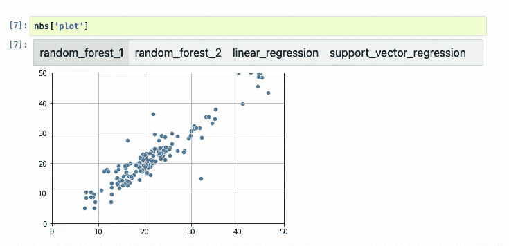

# 笔记本荟萃分析:Jupyter 作为实验跟踪器的零基础设施替代方案

> 原文：<https://towardsdatascience.com/notebook-meta-analysis-jupyter-as-a-zero-infrastructure-alternative-to-experiment-trackers-69e7343d1343?source=collection_archive---------22----------------------->

## 有了 Jupyter 笔记本，谁还需要实验跟踪器？

现有的实验跟踪器具有很高的安装成本。要让它工作，你通常必须启动一个数据库并运行一个 web 应用程序。在尝试了多种选择后，我认为使用 Jupyter 笔记本电脑可能是存储实验结果并检索它们进行比较的绝佳选择。这篇文章解释了我如何使用`.ipynb`文件来跟踪实验，而不需要任何额外的基础设施。

# 什么是实验跟踪器？

机器学习是一个高度迭代的过程:你事先不知道什么样的模型、特征和超参数组合会最好，所以你需要进行轻微的调整并评估性能。实验跟踪器帮助你记录和管理你所有的实验。

然而，它们中的大多数都有相当大的维护成本:它们通常需要额外的基础设施，如数据库和 web 应用程序来检索和比较实验。

虽然支付这笔费用会给你带来很多好处，但我发现我很少使用实验跟踪器最先进的功能。此外，我只要求比较我最近的几个实验，很少关心我几天前运行的一个实验，所以我开始使用`.ipynb`文件来记录和比较实验，大大简化了我的工作流程。

# 笔记本文件的剖析

Jupyter 笔记本(`.ipynb`)是 JSON 文件。一个空的笔记本看起来像这样:

这种预定义的结构允许 Jupyter 在一个文件中存储代码、输出和元数据。对于我们的用例，让我们关注一下`"cells"`部分:

`"cells"`包含一个字典列表(每个单元格一个)，其中每个元素都有一个类型(笔记本支持不同类型的单元格，如 code 或 markdown)和其他取决于其类型的字段。例如，代码单元格包含源代码(`"source"`)和相关的输出(如果单元格已经执行了:

为了简洁起见，我省略了格式细节。然而，如果你很好奇，可以查看一下 [nbformat](https://github.com/jupyter/nbformat) 包，它定义了 Jupyter notebook 的 JSON 模式。

# 正在加载`.ipynb` 文件

由于 Jupyter 笔记本有预定义的结构，我们可以解析它们来提取数据。例如，假设您已经训练了一个随机森林和一个神经网络(`random_forest.ipynb`和`nn.ipynb`)来预测一个连续值，并且您正在打印其中一个单元格中的均方差:

您可以将这两个文件加载到新笔记本中，并提取值进行比较:

通过索引号访问单元格并不好；最好用一些有意义的名称来索引它们。幸运的是，Jupyter 笔记本电池支持标签。例如，在 JupyterLab 3.0+中向单元格添加标签(有关在早期版本的 JupyterLab 或 Jupyter Notebook 应用程序上标记单元格的详细信息，[单击此处](https://papermill.readthedocs.io/en/latest/usage-parameterize.html)。):

向 Jupyter 笔记本的单元格添加标签。图片作者。

这转换成类似于下面的`.ipynb`文件:

我们可以通过引用`mse`标签，用更多的解析逻辑来访问我们的准确性度量，但是正如我们将在下一节中看到的，有一个库已经实现了这一点。

# 解析表格和图表

提取输出为纯文本的单元格很简单，但它有局限性，因为我们可能希望比较输出为数据框或图表的单元格。`.ipynb`文件将表格存储为 HTML 字符串，将图像存储为 [base64](https://en.wikipedia.org/wiki/Base64) 字符串。sklearn-evaluation 包实现了一个笔记本解析器来提取和比较多种类型的输出，我们需要做的就是标记我们的单元格:

我们还可以同时加载多台笔记本电脑:

sklearn-evaluation 根据单元格的输出自动生成比较视图。例如，如果是一本字典:

sk learn-评估字典比较视图。图片作者。

一张桌子:

sk learn-评估表对比视图。图片作者。

还有一张图表:

sk learn-评估图表对比视图。图片作者。

使用细胞标签来识别输出使得实验跟踪变得简单:不需要编写任何额外的代码。相反，只打印要检索的结果，并标记单元格。如需完整示例，[点击此处](https://sklearn-evaluation.readthedocs.io/en/stable/user_guide/NotebookCollection.html)。

评估不是唯一的选择。[剪贴簿](https://github.com/nteract/scrapbook)开创了分析`.ipynb`文件的想法，它们之间的主要区别在于 sklearn-evaluation 使用单元格标签，而剪贴簿使用代码来存储数据:

为了检索数据:

# 用`papermill`参数化笔记本

我们演示了如何解析笔记本来检索它们的输出。现在我们来讨论一下如何生成这样的笔记本。因为我们想要比较多个实验，所以重用相同的代码并且只改变它的输入参数是有意义的。 [papermill](https://github.com/nteract/papermill) 允许我们这样做:我们可以创建一个*笔记本模板*，并使用不同的设置执行它。

例如，假设您有一个如下所示的`train.ipynb`笔记本:

默认情况下，前面的代码片段训练一个随机森林。然而，我们可以改变`model_name`和`model_params`以切换到不同的模式。我们甚至可以定义其他参数(例如，选择特征子集、行子集等。)进一步定制我们的培训笔记本。当使用`papermill`时，我们可以很容易地添加一个新的单元格来覆盖默认值:

笔记本参数化允许我们使用具有不同值的模板，并使用相同的代码生成多个笔记本文件。下面的代码片段显示了如何运行我们的实验:

执行完成后，我们将拥有:

1.  `random_forest.ipynb`
2.  `neural_network.ipynb`

我们可以使用 [sklearn-evaluation](https://github.com/edublancas/sklearn-evaluation) 或[剪贴簿](https://github.com/nteract/scrapbook)继续分析结果。

# 用 Ploomber 参数化笔记本

或者，我们可以使用 [Ploomber](https://github.com/ploomber/ploomber) ，它允许我们通过编写一个`pipeline.yaml`文件来创建管道。在 Ploomber 中，papermill 的示例如下所示:

为了运行所有的实验，我们在终端中执行以下命令:

使用 Ploomber 有很多好处:它并行运行笔记本；它允许我们使用脚本作为输入格式(即`source: train.py`)，为我们执行到`.ipynb`的转换和执行；甚至在云端运行[笔记本](https://soopervisor.readthedocs.io)！

# 生成模型比较报告

我正在做一个项目，在这个项目中，我们经常对生产中的模型进行改进。尽管我们的测试套件自动检查候选模型的性能，但我们仍然手动审查指标，因为我们可能会检测到测试套件中尚未实现的错误。每当我们有了一个候选模型，我们就将它与生产中模型的度量标准进行比较。由于每个模型实验都生成一个格式相同的`.ipynb`文件，我们加载这两个文件(比如说`candidate.ipynb`和`production.ipynb`)并使用另一个笔记本模板生成评估报告。代码如下所示:

模型比较报告允许我们快速对比参数、表格和图表；我们可以很容易地发现自动化测试难以发现的性能差异。例如，这个报告曾经使我们免于部署一个根据损坏的数据训练的模型。

# 结束语

实验追踪器有很高的安装成本:安装一个单独的包，运行一个数据库，运行一个 web 应用程序。虽然它们提供了很多特性，但我发现我只需要为每个实验生成`.ipynb`文件，然后比较它们的输出。

这种方法不需要任何额外的基础设施；此外，它允许我快速分享我的发现，并且不需要额外的代码来记录实验，这使它成为比较机器学习实验的一种简单而强大的方法。

如果你喜欢我的作品，请考虑在 GitHub 上用[星来表达你的支持。此外，如果您有任何问题，欢迎](https://github.com/ploomber/ploomber)[加入我们的社区](http://community.ploomber.io/)并与我们分享。

*最初发布于* [ploomber.io](https://ploomber.io/posts/meta-analysis)