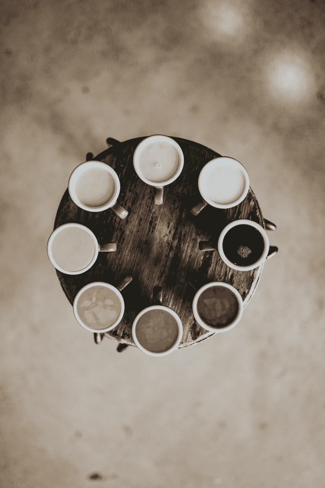
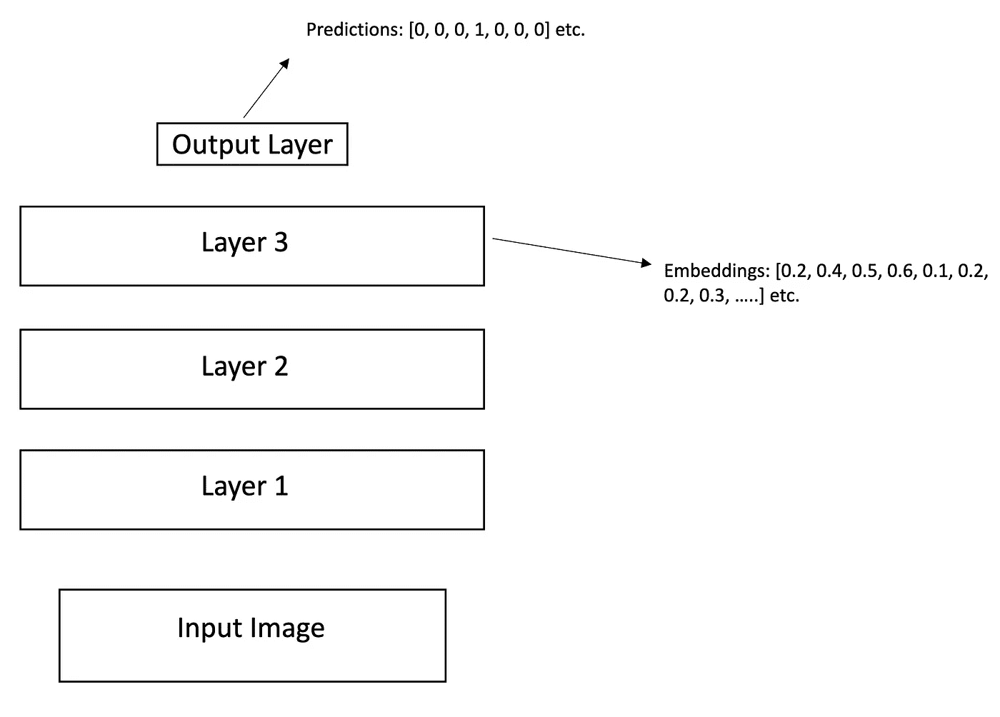
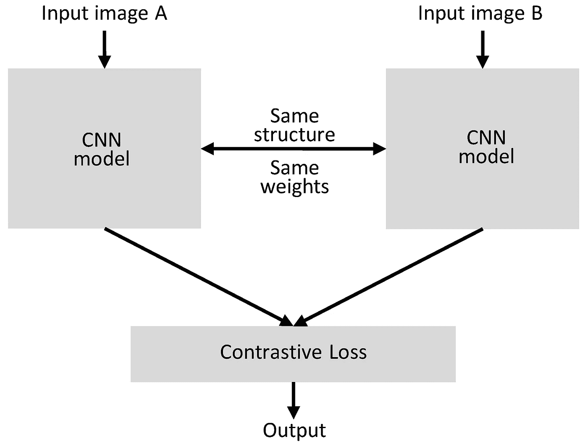
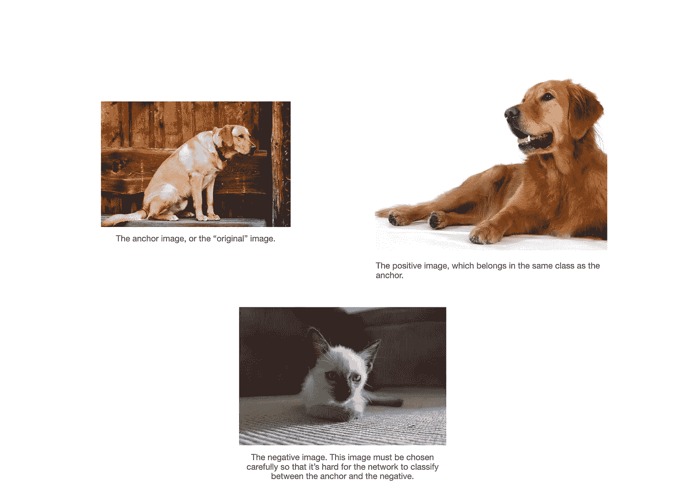

# 相似性学习的新方法

> 原文：<https://towardsdatascience.com/novel-approaches-to-similarity-learning-e680c61d53cd?source=collection_archive---------25----------------------->

内森·杜姆劳在 [Unsplash](https://unsplash.com/s/photos/similar?utm_source=unsplash&utm_medium=referral&utm_content=creditCopyText) 上的照片

## 从连体网络和三重损耗到弧面损耗

# 什么是相似性学习？

可以训练神经网络来分类图像或预测某些产品的价格，即分类和回归。这两种方法不仅通常用于深度学习，而且通常用于机器学习。**相似性学习**不是将图像或物体分为两类，而是判断两个物体是否在同一类别或相似，因此得名“相似性学习”。

诸如面部验证/识别和推荐系统的许多领域利用相似性学习来实现它们的目标。相似性学习主要应用于图像。

# 直觉的理解

当我们想要比较两幅图像并决定它们是否相似时，最好比较它们由训练有素的 CNN 产生的**嵌入**。简单来说，嵌入只是从网络中提取的包含网络学习到的重要模式和信息的向量。

例如，如果我们想比较一只狗和一只猫的照片是否相似，我们会用相同的权重将这些图像放入同一个神经网络。然后，我们将激活输出层之前的最后一层。产生的矢量是图像的嵌入。

嵌入。*作者图片*

为了比较图像之间的差异，我们可以找到两个向量之间的距离。数学上，我们可以计算两个向量的距离函数，作为向量之间的差的 L2 范数，写为

创建于 [https://math.embed.fun](https://math.embed.fun/)

其中 x1 和 x2 分别是猫和狗的嵌入。如果两个图像是相似的，在这种情况下，他们不是，结果应该是最小的。然而，在这种情况下，两个图像非常不同，结果应该更大。

比较由同一神经网络创建的嵌入的两个图像的概念被称为**暹罗网络。**我们可以使用****三重损失来训练网络。****

****

**[来源](https://www.mdpi.com/symmetry/symmetry-10-00385/article_deploy/html/images/symmetry-10-00385-g001.png)**

# **三重损失**

**仍然使用猫和狗的例子，让我们称狗的图像为**锚**图像或我们将与之比较的原始图像。我们有另一只狗的第二张图片，与第一张相似，但在细节上略有不同，让我们称这张图片为**正面**。我们希望网络将这两幅图像归为同一类别。最后，我们有猫的**负面**形象，它和狗不是一个类别。**

****

**来源:[左上图](http://absfreepic.com/free-photos/download/brown-dog-in-wood-house-4288x2848_68272.html)。[右上狗狗形象](http://absfreepic.com/free-photos/download/brown-dog-lying-front-of-white-background-2835x2126_82078.html)。[底猫形象。](http://absfreepic.com/free-photos/download/small-baby-cat-4272x2848_82519.html)**

**为了使网络正确地分类图像是否属于同一类别，我们希望正面和锚点之间的差异小于锚点和负面之间的差异。使用上面的距离函数，我们可以把它写成**

****

**其中 A、P 和 N 表示锚的嵌入向量，正的和负的。将这些项移到一边，等式变成**

****

**然而，通过将两个嵌入向量设置为零，网络可以找到“绕过”该函数的方法，而无需任何实际学习。为了解决这个问题，我们可以在等式中增加一个“余量”，称之为 alpha。**

****

**这样，网络无法找到一个“琐碎的”解决方案，必须学习。将此正式化为损失函数，我们将取(A，P)，(A，N)(上面的等式)和 0 之间的计算差的最大值。**

****

**那么损失就变成了，**

****

**当网络发现锚和负之间的差异时，损失将为零。另一方面，如果网络不能发现负锚和锚之间的差异，损失将产生一个误差的度量。**

**三重态损耗有几个应该考虑的缺点。**

**首先，它需要仔细选择锚定图像、正面图像和负面图像。负面图像和锚图像之间的差异不能太大，如果是这样，网络将很容易满足损失函数，而无需学习任何东西。锚和负面图像必须相似，但不应该属于同一类。**

**其次，它的计算成本很高，最后，三重态损耗需要超参数α，或裕量。如果选择不当，会导致更糟糕的结果。**

# **替代方案:弧面损失和角度裕度损失**

**三重损耗有许多替代方案，其中之一是**弧面损耗**。这是一种基于交叉熵损失的损失，旨在最大化类别之间的决策边界，从而将相似的数据点更紧密地分组在一起。**

****

**[来源](https://arxiv.org/pdf/1801.07698.pdf)**

**ArcFace 背后的想法是，在超球面上，它最大化类间的角度，最小化类内的角度。然后，我们添加角裕度惩罚，该惩罚被插入到真实 logit 的权重和嵌入之间。这给 logit 和嵌入之间的原始角度增加了一个角度损失。**

**角度裕度惩罚有助于惩罚走远的嵌入向量，并有助于使某一类的嵌入特征更接近。**

**与 ArcFace 相比，还有许多其他的 losses 也是基于类似的想法运行的，例如 SphereFace 和 CosFace。**

**将三元组丢失与暹罗网络一起使用是相似性学习的早期方法，因此具有许多问题和缺点。另一方面，ArcFace 在不浪费计算资源的情况下，巧妙地达到了最大化类间决策边界的目的。**