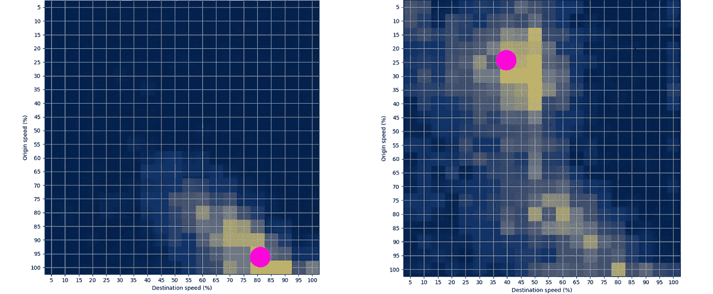
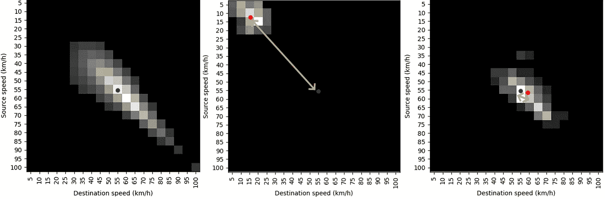
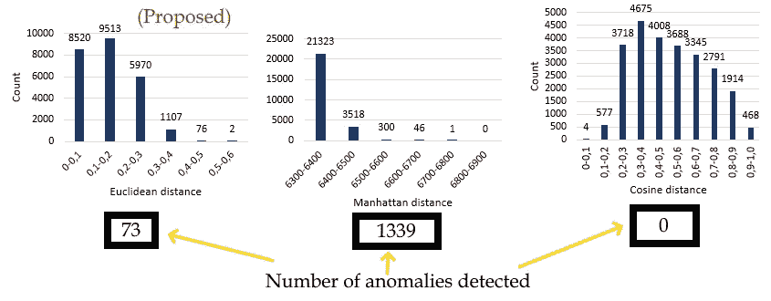

# 基于速度转移矩阵的道路交通异常度量新方法

> 原文：<https://towardsdatascience.com/novel-road-traffic-anomaly-metric-based-on-speed-transition-matrices-f2faf7d3b38b?source=collection_archive---------32----------------------->

## 利用 GPS 交通数据测量道路网络异常水平的新方法

康纳·塞缪尔在 [Unsplash](https://unsplash.com?utm_source=medium&utm_medium=referral) 拍摄的照片

[速度转移矩阵(STM)](https://medium.com/analytics-vidhya/speed-transition-matrix-novel-road-traffic-data-modeling-technique-d37bd82398d1)[【1】](https://www.researchgate.net/publication/344138884_Traffic_State_Estimation_and_Classification_on_Citywide_Scale_Using_Speed_Transition_Matrices)是一种用于交通相关分析的新型交通数据技术。本文将展示一种使用 STM 估计道路网络异常水平的新方法。全文可以在这里找到[【2】](https://www.researchgate.net/publication/344471121_Measure_for_Traffic_Anomaly_Detection_on_the_Urban_Roads_Using_Speed_Transition_Matrices)。

# 1.介绍

道路交通异常检测是智能交通系统中的一个重要研究课题。城市道路异常检测系统是智能交通系统中关于出行规划、道路安全和拥挤评估应用的重要组成部分。本文提出了利用 STM 进行流量异常检测的方法。提出了一种新的距离度量，因为当使用 STM 时，标准距离度量不适用于异常检测和道路交通分析解释。

有关使用 GPS 数据集计算 STM 的更多信息，请访问以下链接:

<https://medium.com/analytics-vidhya/speed-transition-matrix-novel-road-traffic-data-modeling-technique-d37bd82398d1>  

# 2.方法学

在本节中，将介绍使用 STMs 进行异常检测的方法。

## 2.1.质心估计

该方法是基于对每个观察到的 STM 的质心(COM)的计算。COM 参数对于交通状态估计至关重要，因为用 STM 表示的交通模式的位置表示交通状态。这可以从以下图像中看出:

STMs 的 COM 估计:正常交通状态(左)，拥堵(右)(图片来源:作者)

左侧的图像显示了正常的交通行为，因为车辆具有较高的起点和终点速度。相比之下，我们可以在右图中看到相反的例子，车辆速度非常低。COM 估算的细节及其对交通状态估算的重要性可在本文的[中找到。](/traffic-state-classification-using-the-speed-transition-matrices-36f7a03ca776)

## 2.2.异常检测

异常检测中常见的第一步是定义正常观测值，然后比较正常观测值和所有其他观测值。我们将所有观测路段的中值 STM 定义为正常观测值，因为它代表最常见的交通状态。为了估计异常水平，我们提出了一个简单的基于欧几里德距离的距离度量来测量正常 STM 和所有其他 STM 之间的距离。我们测量了观测 STM 的 COM 和正常 STM 的 COM 之间的距离。总之，如果距离很大，异常就会很大。下图显示了正常的 STM(左)，一个被归类为异常的观察到的 STM(中)，以及一个被归类为正常的观察到的 STM(右)。

例子:中间 STM(左)，异常 STM(中)，正常 STM(右)(图片作者:作者)

# 与其他距离度量的比较

在本节中，我们将建议的距离度量与其他最常用的度量进行比较。值得一提的是，这是我们想要测量两个 STM 之间距离的具体情况。这就是为什么常用的距离度量没有给出好的结果，并且需要提出新的度量。下图显示了每个可用 STM 和正常 STM 之间的测量距离分布。

提议的指标与其他常用指标的比较(图片来源:作者)

可以观察到，其他距离度量不适于该任务，因为它们或者发现了太多异常(曼哈顿距离)，或者根本没有发现异常(余弦距离)。

# 结论

本文提出了基于扫描隧道显微镜的异常检测方法。提出了基于观测 STM 的 COMs 和代表正常交通状况的中值 STM 之间的距离的度量。结果表明，该度量更适合于基于 STMs 的异常检测问题，因为它可以使用有价值的流量信息，这取决于分组数据的位置。

有一些额外的论文显示了 STMs 的潜在用途；如果你有兴趣，你可以在[【1】](https://www.researchgate.net/publication/344138884_Traffic_State_Estimation_and_Classification_on_Citywide_Scale_Using_Speed_Transition_Matrices)和[【3】](https://www.researchgate.net/publication/344667216_Spatiotemporal_Traffic_Anomaly_Detection_on_Urban_Road_Network_Using_Tensor_Decomposition_Method)找到它们。

如有任何问题或建议，欢迎评论或联系我！【https://www.linkedin.com/in/leo-tisljaric-28a56b123/ 

# 确认

[原始论文](https://www.researchgate.net/publication/344471121_Measure_for_Traffic_Anomaly_Detection_on_the_Urban_Roads_Using_Speed_Transition_Matrices)的作者有:[Leo tiljari](https://www.linkedin.com/in/leo-tisljaric-28a56b123/)、[eljko majstorovi](https://www.linkedin.com/in/zeljko-majstorovic-635b17122/)、[tomi slav erde Li](https://www.linkedin.com/in/tomislav-erdeli%C4%87-182a8544/)和[tonci CARI](https://www.linkedin.com/in/toncicaric/)。

# 参考

[1]l . tiljari，T. Cari，B. Abramovi 和 T. Fratrovi，[使用速度转换矩阵对全市范围内的交通状态进行评估和分类(2020)](https://www.researchgate.net/publication/344138884_Traffic_State_Estimation_and_Classification_on_Citywide_Scale_Using_Speed_Transition_Matrices) ，*可持续性*，12，18:7278–7294

[2]l . tiljari，Majstorovi，T. Erdeli 和 T. Cari，[“使用速度转换矩阵的城市道路交通异常检测方法，](https://www.researchgate.net/publication/344471121_Measure_for_Traffic_Anomaly_Detection_on_the_Urban_Roads_Using_Speed_Transition_Matrices)”*2020 年第 43 届国际信息、通信和电子技术会议(T23)，克罗地亚，奥帕蒂亚，2020 年，第 252-259 页，doi:10.2391923915*

[3]tiljaril，Fernandes S，CARI t，Gama J. (2020) [利用张量分解方法对城市道路网进行时空交通异常检测](https://www.researchgate.net/publication/344667216_Spatiotemporal_Traffic_Anomaly_Detection_on_Urban_Road_Network_Using_Tensor_Decomposition_Method)。载于:Appice A .，Tsoumakas G .，Manolopoulos Y .，Matwin S .(编辑)《发现科学》。DS 2020。计算机科学讲义，第 12323 卷。斯普林格，查姆。https://doi.org/10.1007/978-3-030-61527-7_44