# 从新手到高级正则表达式只需 9 分钟或更短时间

> 原文：<https://towardsdatascience.com/novice-to-advanced-regex-in-nine-minutes-or-less-6af45a1df8c8?source=collection_archive---------6----------------------->

## 你只需要知道


**除另有说明外，所有使用的图片均为作者所有*

正则表达式是解析文本的事实标准。每一种著名的编程语言都支持它们，几乎每个开发人员都需要在某个时候使用它们——它们很重要。

本文的重点是介绍正则表达式，并一直深入到正则表达式中一些最有趣的(也是更高级的)特性——比如前视/后视断言和条件。

如果这些对你来说没有任何意义，不要担心，我们将从头开始。

```
**In this Article**> Common Metacharacters **\d, \s, ***> Quantifiers **+, ?, {3,5}**> Capture Groups **(...)**> Character Sets **[...]**> Boundaries **^, $, \b**...And the cool stuff> Look-Ahead/Behind Assertions **(?= ) (?<= )**> Modifiers **(? )**> Conditionals **(condition)?(?(n)<if>|<else>)**
```

如果你更喜欢视频，我在这里已经涵盖了一切(+一些 Python):

# 通用元字符

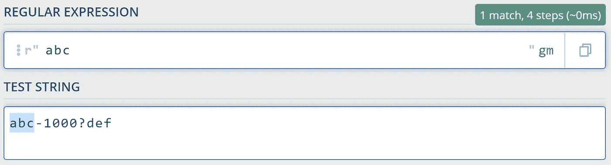

正则表达式最简单的组成部分是字符本身。我们可以通过简单地输入我们想要匹配的内容来匹配特定的字符。

然而，我们经常需要在选择字符时更灵活一点——在这些情况下，我们使用*元字符*。

## 数字字符

```
**\d**
```

我们可以使用`\d`元字符来匹配数字，或者使用`\D`来匹配除了 数字之外的任何数字:

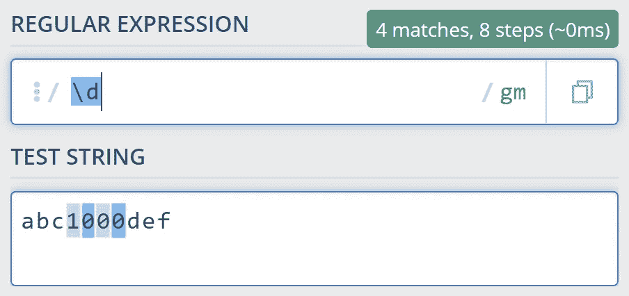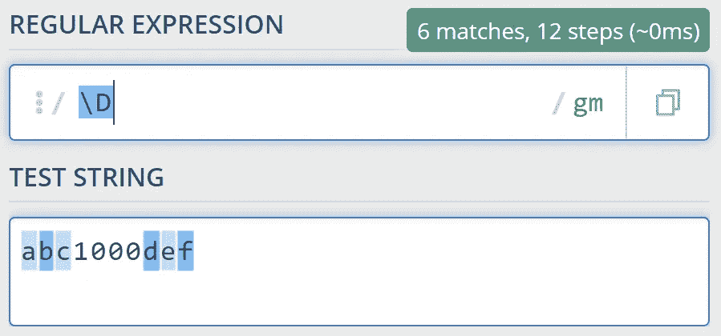

**\d** 匹配任何数字字符 0-9，而 **\D** 则相反

## 单词字符

```
**\w**
```

我们可以将`\w`用于单词字符(这包括 a-z *和*0–9)，我们通过大写`\W`再次反转:

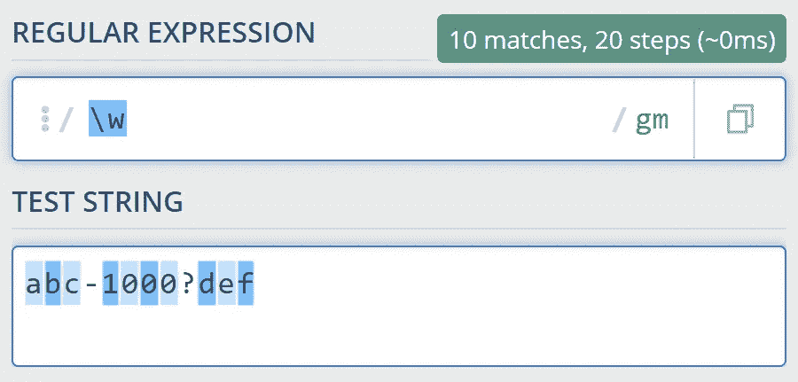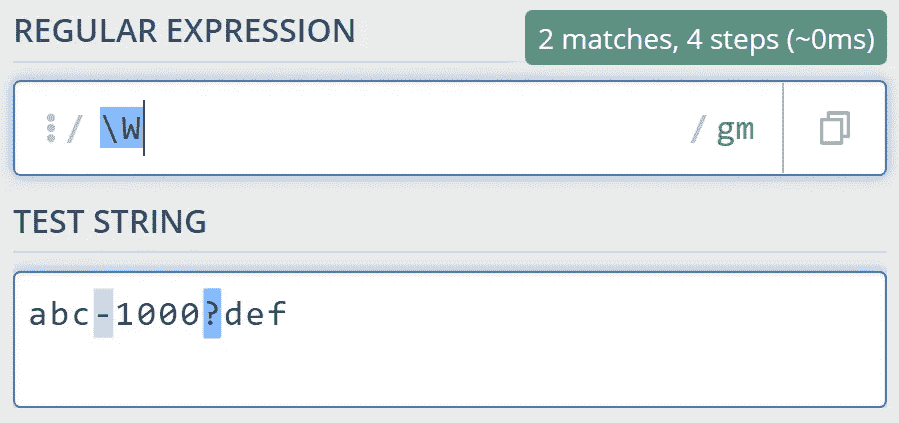

**\w** 匹配任何单词字符，而 **\W** 则相反

## 空白和任何东西

```
**\s .**
```

需要记住的两个非常重要的字符匹配是空格`\s`和*任何东西* `.`:

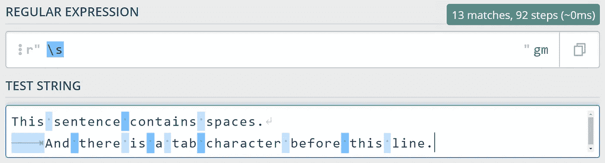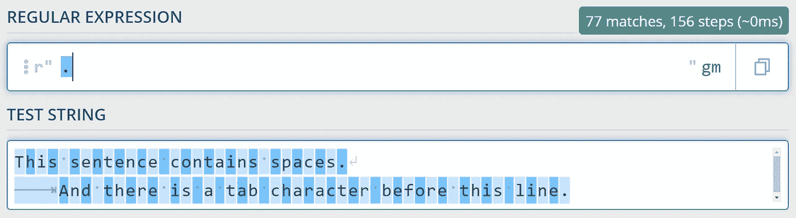

## 转义元字符

```
**\**
```

最后一个注意事项——如果我们想要匹配 RegEx 中作为元字符使用的字符，如`.`——那么我们在字符前添加一个反斜杠，如下所示:

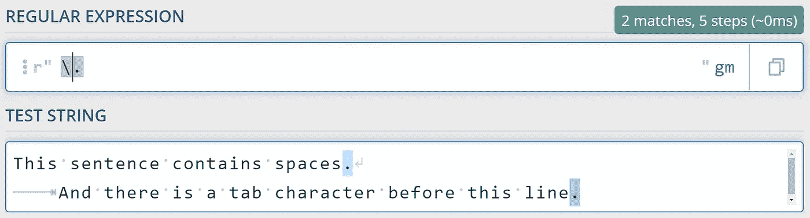

我们在元字符前添加 **\** 来匹配字符本身

# 量词

到目前为止，我们只匹配单个字符，但如果我们想匹配特定数量的字符呢？或者有更低/更高的字符限制？这里我们会使用量词。

## 一个或多个

```
**+**
```

如果我们想要匹配一个或多个字符，我们使用`+`:

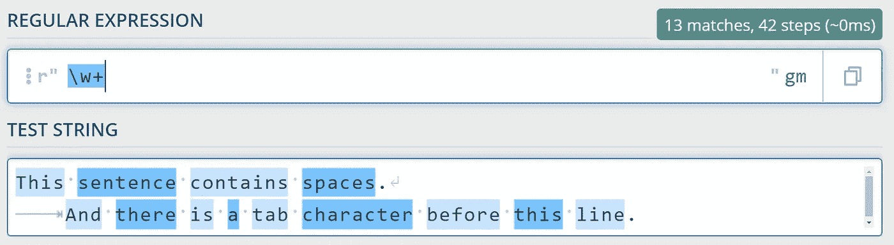

## 零或更多

```
*****
```

另一个与一个或多个量词`+`相似的量词是零个或多个量词`*`。我们可以在下面的对比中看到两者的区别。在我们可能期望单词包含连字符的地方(有时)，`*`应该用于*而不是排除*未连字符的单词:

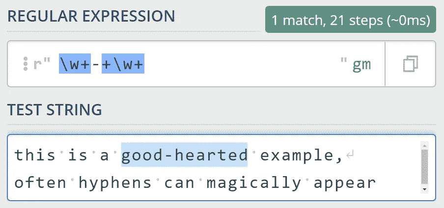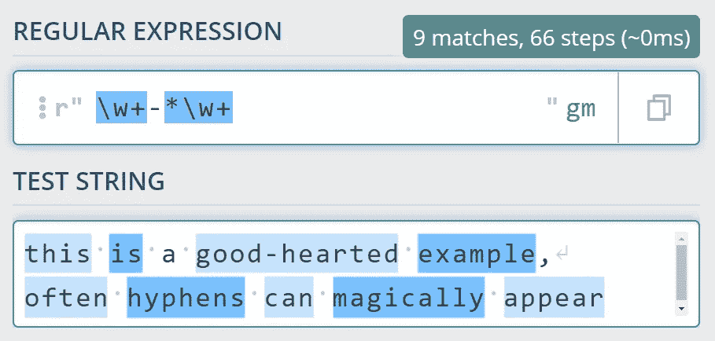

## 一次或没有

```
**?**
```

需要记住的一个非常重要的量词——这为我们编写*带或不带连字符的*查询提供了一个更好的方法:

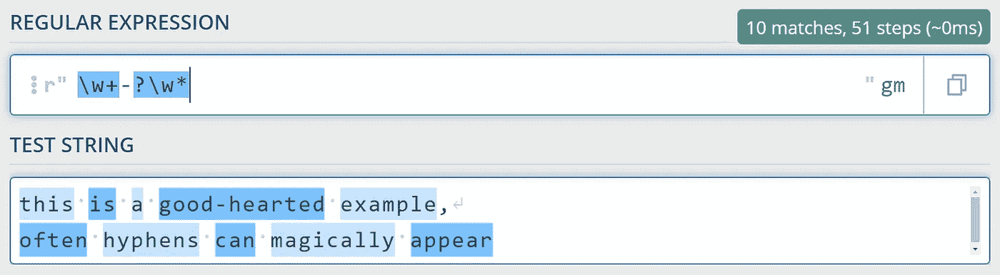

## 特定数量

```
**{n}**
```

或者我们可能只需要三个一组的单词字符:

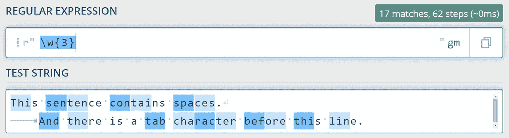

请注意，我们匹配的是三个一组的单词字符，我们是**而不是**指定我们想要只包含三个字符的*单词*——为此，我们需要向我们的正则表达式添加单词边界(稍后将详细介绍)。

## 数量范围

```
**{low,high}**
```

或者，我们使用`{low,high}`指定数量**范围**:

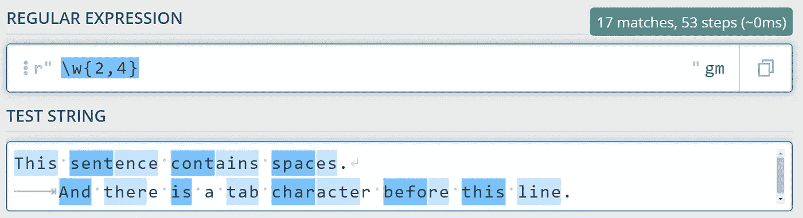

## 小于或大于

```
**{,n} {n,}**
```

也许我们希望任何字符集的长度少于(或等于)三个字符，或者多于三个字符？

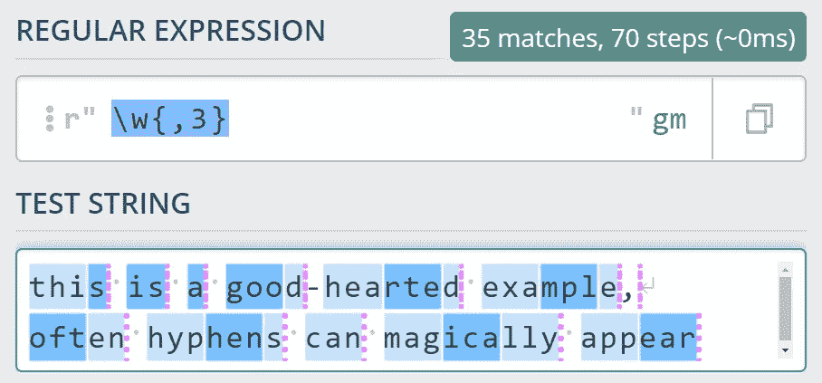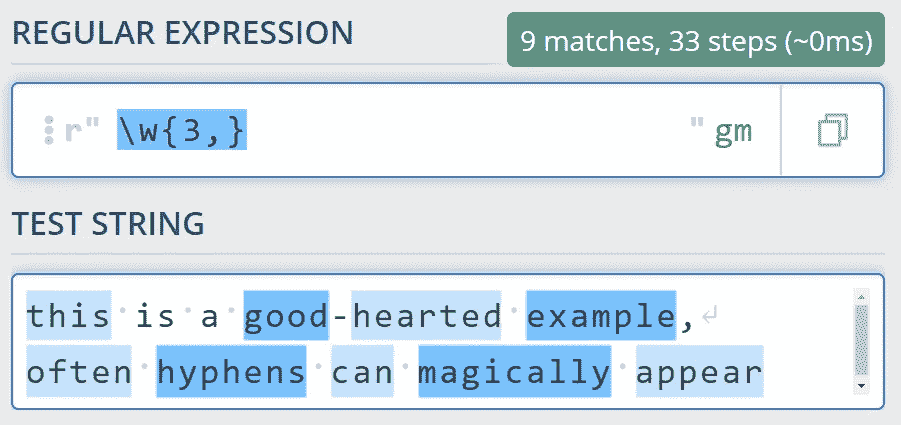

## 让量词变懒

```
**?**
```

默认情况下，所有这些量词都是**贪婪的**——这意味着它们将匹配尽可能多的给定模式。

有时候，最好让它们**懒惰**——意思是尽可能少地匹配*出现的模式:*

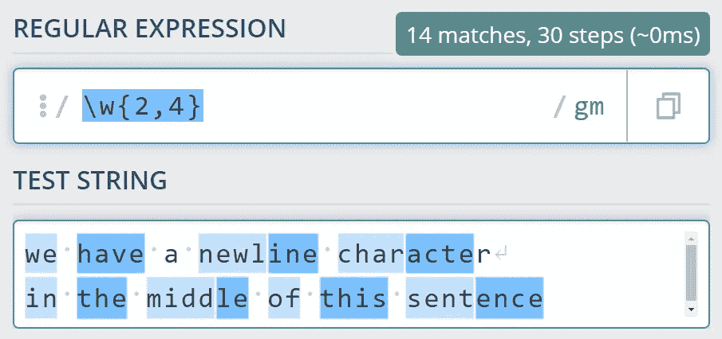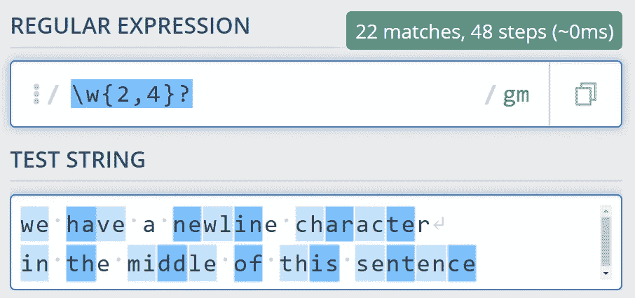

范围量词通常会最大化匹配中的字符数(左)，但惰性范围量词会最小化匹配中的字符数(右)

# 捕获组

```
**(...)**
```

现在我们开始讨论更有趣的东西。包含在圆括号中的任何内容都将创建一个*捕获组*。

Capture group 只是“将这些括号中的所有内容作为一个单元处理”的一种花哨说法。

因此，一个常见的用例可能是我们想要匹配一个带有或不带有否定前缀“un”的单词。例如，我们希望同时匹配`expected`和`unexpected`。

为此，我们可以将我们的 **one or none** 量词`**?**`与包含`un`的捕获组结合使用，如下所示:

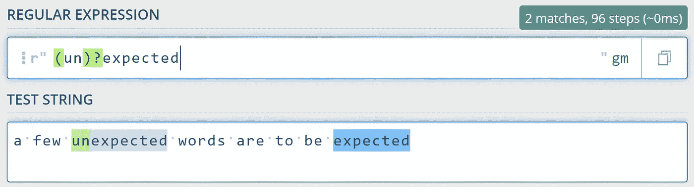

## 或操作数

```
**(...|...)**
```

OR 操作数允许我们指定不同的允许捕获组。因此，也许我们希望匹配`not expected`或`unexpected`:

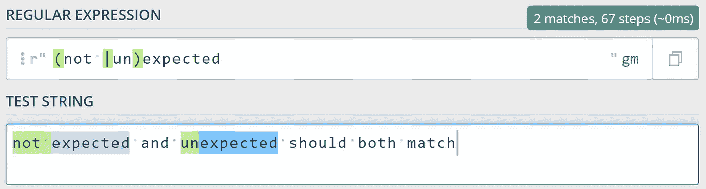

# 字符集

字符集与我们的捕获组共享相似的语法，但是我们使用方括号`[…]`而不是圆括号`(…)`。

与以前不同，这些类用于创建允许的字符列表。因此，`(un)`匹配作为一个单位的`un`，而`[un]`匹配作为单个字符的`u`或`n`。

我们可以用它来匹配数字(就像我们用`\d`做的那样)，在括号内列出每个数字，如下所示:

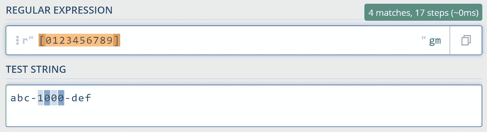

当我们写出像`a`到`z`这样的逻辑范围的字符时(或者在我们上面的例子中— `0`到`9`)。我们可以改为写`a-z`或`0-9`:

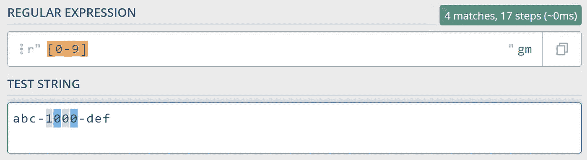

我们可以将**【0123456789】**缩短为**【0–9】**

我们可以在我们的字符集中添加任意数量的字符—让我们尝试捕获`a-z`、`0-9`和`-`(记住我们需要用`\`来转义`-`):

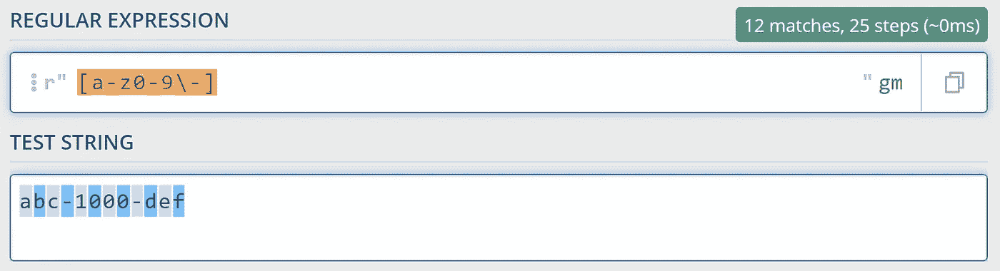

# 边界

## 字符串开头

```
**^**
```

我们可以在正则表达式的开头添加`^`符号，以限制我们的模式从字符串的第一个字符开始:

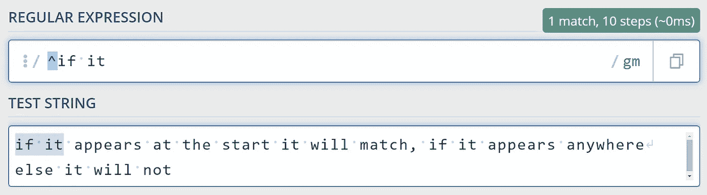

字符串开头的“if it”匹配，而后面的“if it”不匹配

## 正文结束

```
**$**
```

字符串开始字符的等号和反义词。`$`允许我们检查字符串末尾的模式:

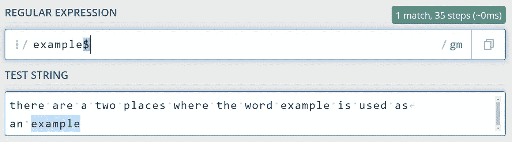

字符串末尾的“示例”匹配，而前面的“示例”不匹配

## 单词边界

```
**\b**
```

如果您还记得以前，我们指定了三个或更多(或更少)字符，但没有明确说明这些字符集合应该是单词。

我们本可以在正则表达式中添加`\s`来指定我们希望单词周围有空白——但是一旦我们看到语法(比如逗号或句号)就会中断。

定义单词边界的最好方法是使用`\b`——让我们看看它看起来像什么:

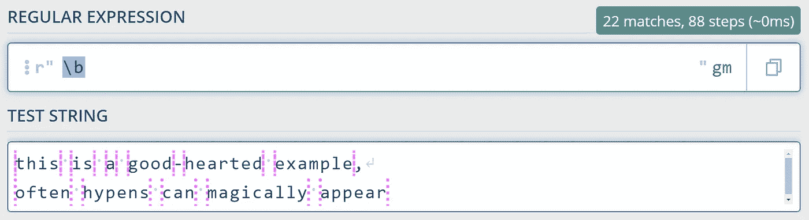

**\b** 匹配任何单词边界，我们可以看到用粉色线条突出显示

我们可以直接看到它标识了每个单词的边界——不管它周围是否有空格或标点符号。让我们也添加一些字符匹配，以便我们匹配单词本身:

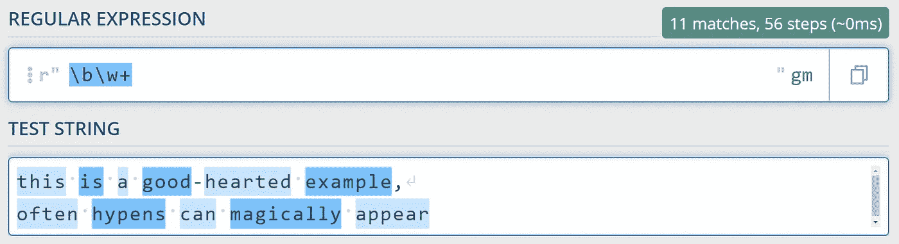

***快注*** —我把下面三种方法涵盖的相当快，应该够了。但是，如果您想更深入地了解这些，我在这里会更深入地介绍它们:

[](/step-up-your-regex-game-in-python-1ec20c5d65f) [## 用 Python 升级你的正则表达式游戏

### Python 中使用正则表达式的高级文本操作

towardsdatascience.com](/step-up-your-regex-game-in-python-1ec20c5d65f) 

# 前瞻/后见断言

这些是我用过的最有用的正则表达式方法。他们所做的是以他们的名义:

*   向前看/向后看——我们是向前看还是向后看
*   断言——我们断言另一个模式的存在，但是我们不匹配它(例如，它不会包含在匹配的输出中)

## 向前看

```
**(?= )**
```

当我们想要断言我们的匹配后面是另一个模式时，我们使用前瞻断言。在下面的例子中，我们可以用它来匹配后面紧跟逗号的`hello world`:

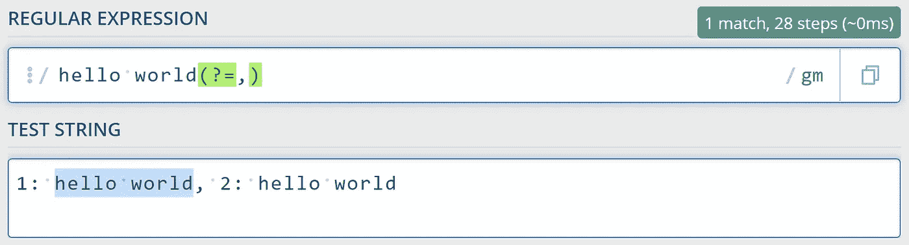

## 向后看

```
**(?<= )**
```

后视断言遵循相同的逻辑，但是——你猜对了——我们断言它前面有一个给定的模式。

我们可以通过断言第二个`hello world`前面有`2:` 来使用它来匹配第二个`hello world`:

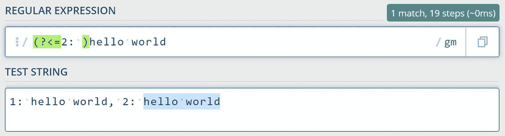

## 否定断言

```
**(?<! ) (?! )**
```

通常情况下，我们实际上需要*断言*我们的模式是**而不是**在另一个模式之前/之后。我们用否定断言来做这件事:

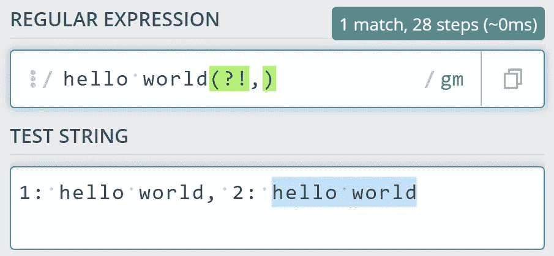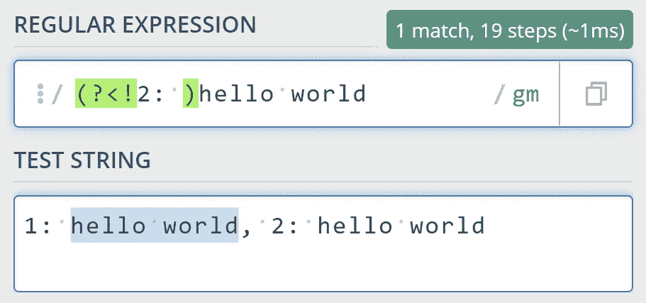

消极的向前看(左)和消极的向后看(右)。

# 修饰语

```
**(? )**
```

我们可以使用修饰符来改变正则表达式的行为。

如果我们使用单行修饰符`s`——并将其添加到我们的正则表达式中——特殊字符`.`的行为将从**不**匹配新行字符**变为匹配它们**:

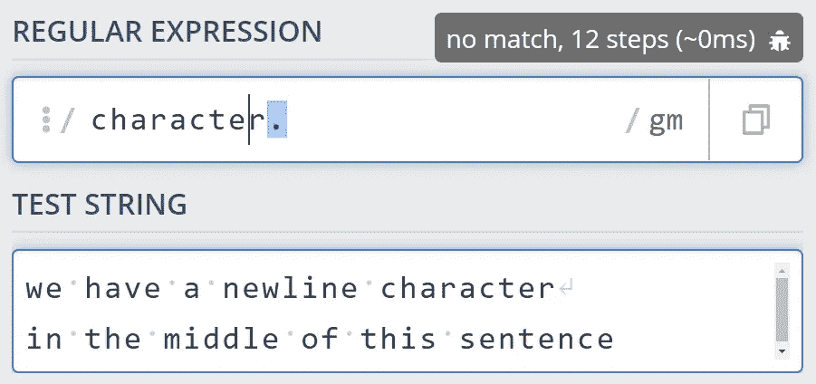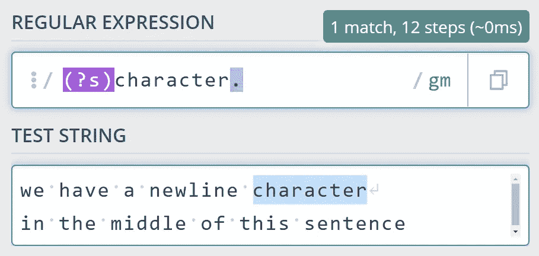

我们改变**的行为。**元字符，方法是将单行的 **s** 修饰符添加到正则表达式中

我们使用`(?s)`添加了修饰符——我们可以简单地通过添加相应的字符(如`(?smi)`)来应用任意数量的修饰符。

# 条件式

```
**(condition)?(?(index)<if>|<else>)**
```

条件语句真的很酷——但是有点令人困惑。

它们就像典型的`if else`语句一样工作——但是在我们的正则表达式中。我们正在使用捕获组`(...)`检查`condition`是否为真。

**如果**中的`condition`为**真**，我们检查`<if>`条件是否为真，如果是，我们有一个匹配！

**否则**如果`condition`为**假**，我们检查`<else>`条件是否为真——如果是，我们有一个匹配！

如果这两种情况都不存在，那么我们的正则表达式不会返回一个匹配。

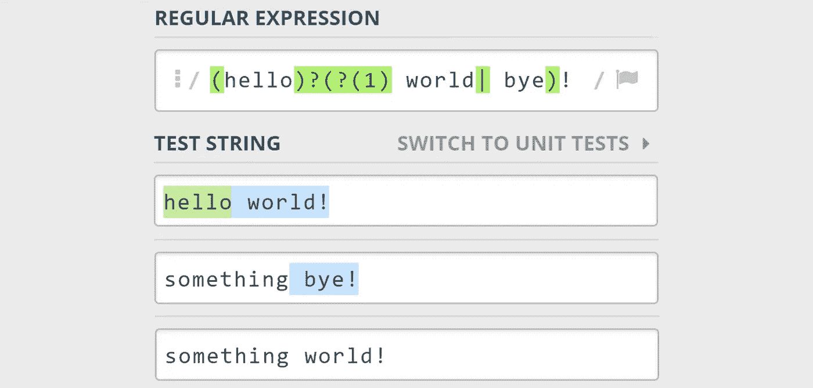

我们检查**“hello”**是否匹配，如果匹配，我们尝试匹配完整的**“hello world”**——否则我们只匹配**“bye”**

*   `(hello)` —这是我们的捕获组，它检查单词`hello`
*   `?` —跟随我们的捕获组，使其成为可选匹配(零或无)，这不会影响`(hello)`是否返回真/假
*   `(? ... | ... )` —我们的 if-else 条件
*   `(1)` —这告诉条件，我们正在检查第一个*捕获组的真值——对于有多个捕获组的较长正则表达式很有用*
*   *`world| bye` —如果`(hello)`为真，我们的 if-else 逻辑寻找`world`—否则寻找`bye`*

*好了，这篇文章就到这里。我试图尽可能保持简洁(对于这么多的正则表达式规则，这是一项艰巨的任务)。*

*尽管如此，我们实际上已经涵盖了您通常会在 RegEx 中遇到的所有内容——甚至包括一些更高级的方法，如断言和条件。*

*所以如果你做到了这一步，干得好！我很欣赏这种弹性，希望你喜欢这篇文章！*

*如果您有任何建议或问题，请随时通过 [Twitter](https://twitter.com/jamescalam) 或在下面的评论中联系我们！如果你有兴趣看到更多这样的内容，我也会在 YouTube 上发布。*

*感谢阅读！*

*[🤖《变形金刚》课程 NLP 的 70%折扣](https://bit.ly/nlp-transformers)*