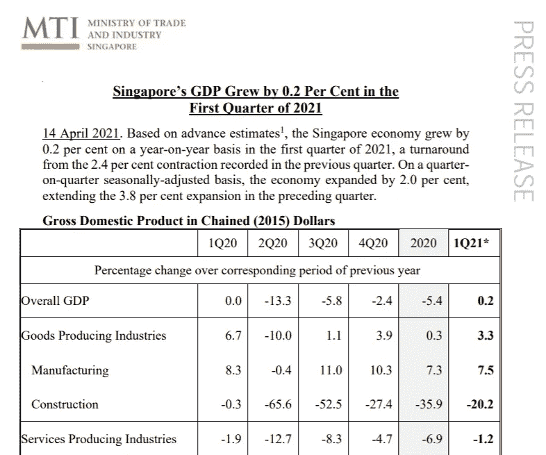
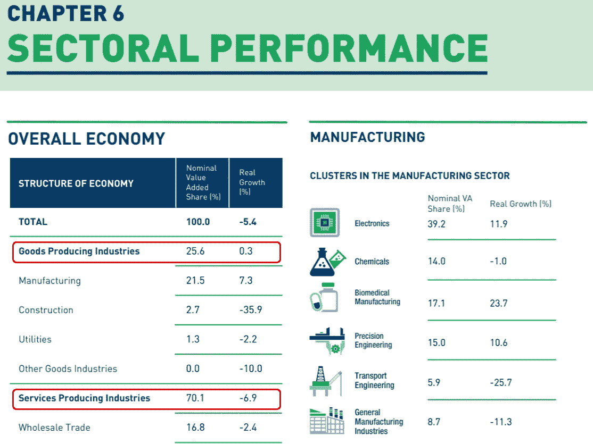
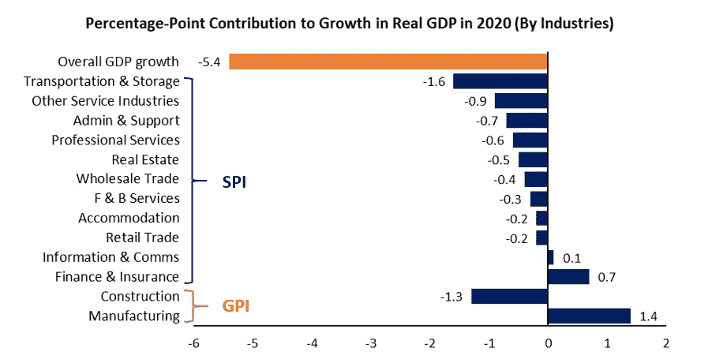
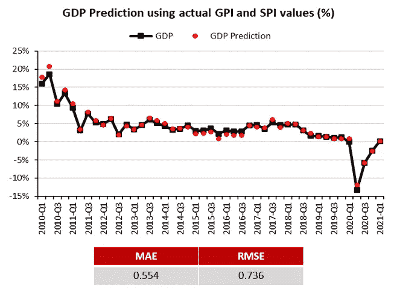
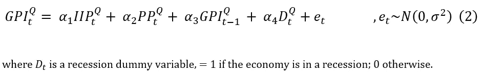
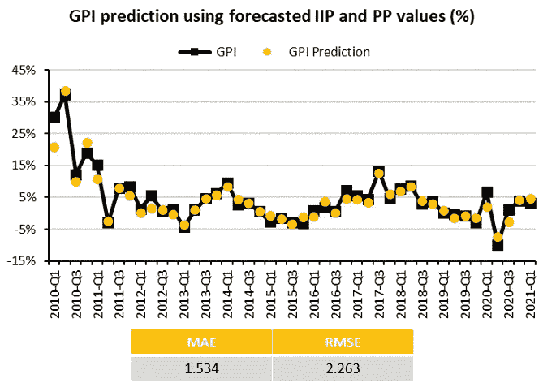
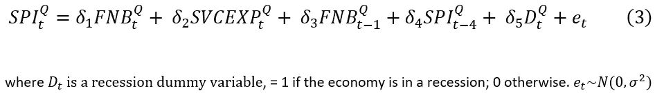
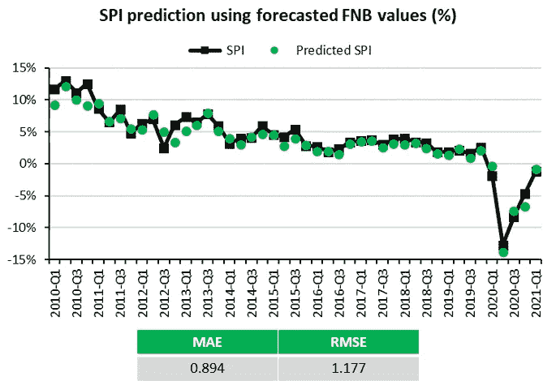
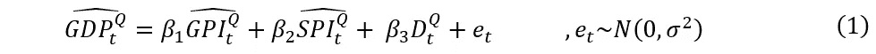
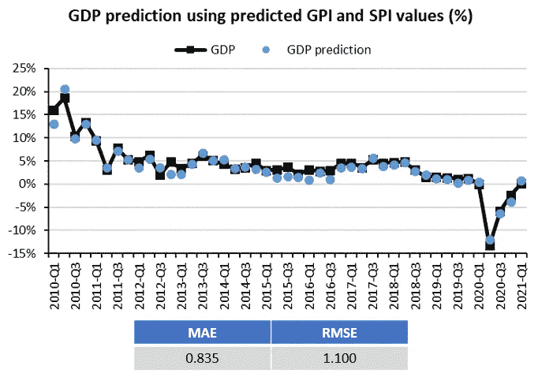

# 用线性桥模型预测新加坡的 GDP

> 原文：<https://towardsdatascience.com/nowcasting-singapores-gdp-with-linear-bridge-models-in-r-56dec1608d48?source=collection_archive---------35----------------------->

图片来源:来自 Unsplash 的 Khendi Lee

当我还是一名经济学本科生时，我总是很好奇贸易和工业部(MTI)的经济学家如何提供新加坡季度 GDP 的即时预测。

他们用什么样的指标？他们用的是什么型号？简单的线性回归足够了吗，或者我们需要复杂的模型吗？我不为 MTI 工作，所以我不知道他们用什么模型或变量来预测 GDP。

然而，正如我在这篇文章中发现的，在三个简单的线性回归模型中使用少量的经济指标似乎足以获得新加坡 GDP 的准确预测。

# **什么是‘临近预报’？**

临近预报实际上是“现在”和“预测”两个词的缩写。它旨在提供近期或现在的预测。通常，新加坡的官方 GDP 数据会在一个季度结束后的两个月(T5)左右(T4 时间)发布。

有了临近预报模型，MTI 的经济学家们就能够弥合这一差距，并在季度末后两周左右**提供对 GDP 的预估。他们的预估示例如下:**

图片来源:贸易和工业部(MTI) 2021 年 Q1 [预先估计](https://www.mti.gov.sg/-/media/MTI/Newsroom/Press-Releases/2021/04/AdvEst_1Q21.pdf)

为了开发一个好的临近预报模型，首先了解新加坡的经济结构可能是有用的。

# **新加坡的经济结构**

看看 MTI 的《2020 年新加坡年度经济调查》,我们可以看到，新加坡 GDP 的大约 70%是由服务生产行业( **SPI** )贡献的，而商品生产行业( **GPI** )占了剩余的 20-30%。

图片来源:2020 年新加坡经济调查[第 6 章](https://www.mti.gov.sg/-/media/MTI/Resources/Economic-Survey-of-Singapore/2020/Economic-Survey-of-Singapore-2020/Ch6_AES2020.pdf)

图片由作者提供，数据来自 2020 年新加坡 MTI 经济调查[第 1 章](https://www.mti.gov.sg/-/media/MTI/Resources/Economic-Survey-of-Singapore/2020/Economic-Survey-of-Singapore-2020/Ch1_AES2020.pdf)

值得注意的是，制造业和建筑业对性别平等指数的贡献很大，而在工业生产指数中，各部门对国内生产总值的贡献似乎更加多样化。

根据这些观察，我想知道使用 GPI 和 SPI 是否有助于用线性模型解释 GDP 增长。这就引出了我们的第一个等式:

# 等式 1

利用新加坡统计局(DOS)提供的官方 GDP、GPI 和 SPI 数据，我使用了截至 2009 年第四季度的数据来训练模型，并通过扩展窗口递归预测一个季度，直到 2021 年 Q1。

一个简单的线性模型，仅包含两个回归变量——GPI 和 SPI——就能够提供准确的新加坡 GDP 季度预测！

但是，有一个问题。实际上，在每个季度 *t* ，我们没有观察到季度 *t* 的 GDP，也没有观察到季度 *t* 的 GPI 和 SPI 的实际值*。*

自然，这就提出了一个问题——我们如何预测本季度的 GPI 和 SPI？一种解决方案是使用桥模型。

# **什么是“桥梁模型”？**

桥方程背后的思想是使用在较高频率下观察到的变量来预测较低频率的变量。我们的目标是预测 GPI 和 SPI，这是季度频率，通过使用显示与目标变量强共动的月度指标。

所选择的月度指标只需具有较高的预测能力，不一定需要与目标变量有任何因果或行为关系。

由于 GPI 对 GDP 的贡献主要来自制造业和建筑业，我发现这两个**月度**指标:(I)工业生产指数(IIP)和(ii)建筑工程进度付款(PP)分别是上述两个行业的良好代表。

这就引出了我们的第二个等式:

# 等式 2 (GPI)

如果我们遵循 MTI 的方法，在给定季度(比如 2021 年 Q1)结束后两周制作一份临近预报，我们将只观察两个月(1 月和 2 月)的 IIP 和 PP 数据。第三个月(Mar)的数据尚未发布，必须使用 Arima 模型进行预测。

例如，为了获得第二个等式中的季度 IIP 数字，我对实际 IIP 的前两个月和预测的第三个月之间的值进行了平均。然后，汇总的季度 IIP 数据被用来预测性别均等指数。季度 PP 值也以同样的方式获得。

使用截至 2009 年第四季度的数据来训练模型，并使用扩展窗口递归预测一个季度，我们可以获得 2010 年 Q1 到 2021 年 Q1 的季度 GPI 预测。

我们预测的 GPI 似乎很好地跟踪了实际 GPI 的总体趋势。

现在让我们看看服务生产行业(SPI)。

在测试了不同的指标后，我发现(1)每月食品和饮料指数(FNB)和(2)服务业季度商业预期调查(SVCEXP)是 SPI 方程的良好代理。

# 等式 3 (SPI)

类似于 GPI 方程，我们不观察每个季度第三个月的 FNB 指数，在汇总到季度频率之前，必须使用 Arima 进行估计。

SVCEXP 是一项季度调查，汇编了企业的前瞻性预期，并在给定季度结束前两个月**发布。换句话说，我们不需要预测它。**

再次使用截至 2009 年第四季度的数据来训练模型，并使用扩展窗口递归预测一个季度，直到 2021 年，Q1 为我们提供了预测的 SPI:

# **用我们预测的 GPI 和 SPI 来预测 GDP**

既然我们已经有了预测的 GPI 和 SPI 数据，我们可以将它们代入第一个方程来预测 GDP。

正如预期的那样，我们使用预测的 GPI 和 SPI 的 GDP nowcasts 不如使用实际值的精确。回想一下，我们使用实际的 GPI 和 SPI 值获得了 0.554 的 MAE 和 0.736 的 RMSE。

尽管如此，我认为整体 nowcasts 仍然看起来相当不错。

# **结论**

在这篇文章中，我们尝试用三个简单的线性回归模型来预测新加坡的 GDP，并获得了相当不错的结果。

虽然我真正喜欢的桥梁模型是它的简单性，特别是因为它只需要少量的回归变量，可以给我们合理的估计。

非常感谢您的阅读，如果您有任何意见，请告诉我！

# **参考/数据/代码**

所有数据系列均来自新加坡统计局。
(i)实际国内生产总值的关键数据，GPI&SPI(Ref ID:17113)
(ii)工业生产指数(IIP) (Ref ID: 16863)
(iii)建筑工程经认证的进度付款(PP) (Ref ID: 15304)
(iv)食品&饮料收入(FNB) (Ref ID: 17038)
(v)服务业的商业预期(svce XP)(Ref ID:11

重现这一分析的完整 R 代码可以在我的 [*github*](https://github.com/cheongweisi/Nowcasting-SG-GDP-Medium-) 页面上找到。